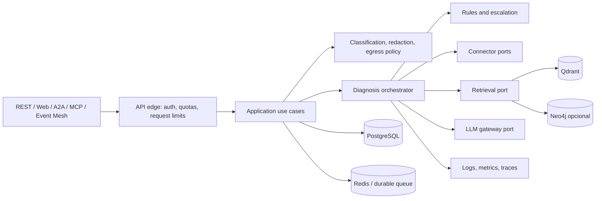

# Revisão arquitetural — Integration Incident Copilot

**Data da revisão:** 2026-10-03
**Checkout:** `/home/marcos-lima/MyProjects/GitHub/integration-incident-copilot`
**Branch:** `fix/local-stack-and-eval-2026-09-26`
**HEAD:** `e535dcb2500ce5daca15389bca16a5772e311eb7` — `docs: ruff format .md files`
**Estado Git antes desta revisão:** branch alinhada com `origin/fix/local-stack-and-eval-2026-09-26`; sem alterações staged/unstaged e sem arquivos não rastreados. O relatório será o único arquivo novo desta atividade.

> Revisão estática baseada no checkout acima. Não executei testes, CI, build, migrações, ingestão, chamadas a provedores ou serviços externos. Os achados são classificados como riscos sustentados pelo código/configuração, não como incidentes observados em produção. Prioridades P0 (bloqueante), P1 (corrigir antes de produção), P2 (corrigir no próximo ciclo), P3 (melhoria).

## 1. Resumo executivo

O repositório tem um fluxo funcional e bem articulado de diagnóstico: FastAPI, LangGraph, conectores, recuperação híbrida no Qdrant, reranker, regras determinísticas, gateway de LLM, superfícies MCP/A2A/Event Mesh e persistência/observabilidade optativas. Há bom esforço de tornar decisões auditáveis: modelos Pydantic, testes com doubles, testes de integração dedicados para Qdrant/Neo4j/PostgreSQL, avaliação RAG e gates de documentação/dataset.

A maturidade é de **protótipo avançado/homologação**, ainda não de serviço multi-tenant pronto para produção irrestrita. Os riscos mais imediatos são: credenciais efêmeras gravadas em logs; senhas sentinela aceitas em perfis Compose com portas publicadas; timeout global que não cancela trabalho e pode esgotar permanentemente o pool; e confiabilidade limitada por estado/breakers/rate limits distribuídos de maneira desigual. A documentação também contém auditorias históricas com afirmações já contraditas pela implementação atual.

### Achados prioritários

| ID | Prioridade | Achado |
|---|---|---|
| SEC-01 | P1 | Segredos de API/admin/sessão são registrados em claro nos logs de startup. |
| SEC-02 | P1 | Perfis Compose usam `REQUIRED_SET_IN_ENV` como senha efetiva, apesar de comentários dizerem que a execução falhará sem segredo; portas de Postgres, Grafana e Neo4j são publicadas no host. |
| REL-01 | P1 | O timeout do diagnóstico não cancela a execução; quatro timeouts podem ocupar o pool fixo e deixar todas as chamadas novas na fila. |
| REL-02 | P1 | O deploy Kyma escala a API para 2–6 réplicas, mas o fallback em memória de tarefas A2A, deduplicação e rate limiting pode divergir por pod. |
| GOV-01 | P1 | A classificação de dados e a redação regex ajudam, mas não constituem DLP; campos de sensibilidade declarados na API não entram no estado/policy do gateway. |
| OPS-01 | P2 | Readiness prova Qdrant/Ollama/Redis, mas não prova dependências ativas como provider cloud, PostgreSQL/migrações, Neo4j ou worker RQ. |
| RAG-01 | P2 | A identidade de embedding registrada não distingue backend/modelo efetivo (FastEmbed BGE versus Ollama configurável). |
| DOC-01 | P2 | Auditorias e guias em `docs/` contêm estado defasado, inclusive DA-17 declarada pendente apesar do fallback existir. |
| CI-01 | P2 | O job de `pip-audit` é `continue-on-error`; vulnerabilidades não bloqueiam o pipeline. O gate de LLM pode ficar sem execução quando falta secret. |
| ARC-01 | P2 | Os limites de camadas são pragmáticos, porém módulos centrais grandes e dependência de estado/configuração globais dificultam evolução e isolamento. |
| PERF-01 | P2 | O pipeline de retrieval carrega cross-encoder local e roda sincronamente; limites de memória/CPU do manifesto Kyma são baixos e não há dimensionamento demonstrado. |
| DATA-01 | P2 | A ingestão incremental não remove chunks antigos quando um documento encolhe; limpeza requer recriar collection e reindexar. |
| TEST-01 | P2 | Os gates cobrem bons cenários, mas provas externas/reais por conector e cenários de carga/concorrência permanecem incompletos. |

## 2. Estado Git e escopo

O checkout está limpo no commit `e535dcb` e na branch informada no cabeçalho. A verificação de status ocorreu antes de criar este relatório. O relatório aparecerá como arquivo não rastreado até ser versionado pelo usuário.

### Inventário de conteúdo

O Git rastreia 352 arquivos: 94 sob `app/`, 78 sob `tests/`, 56 sob `docs/`, 30 sob `frontend/`, 21 sob `data/`, 16 sob `deploy/`, 11 sob `alembic/`, além de workflows, scripts, configurações e documentação na raiz. O inventário incluiu:

- API, modelos, autenticação, administração, agentes/LangGraph, prompts, regras, gateway e factories de LLM;
- RAG, ingestão, embeddings, avaliação, GraphRAG, conectores SAP e SaaS, contratos e eventos;
- testes unitários e de integração, cassettes e datasets de avaliação;
- migrations Alembic, Dockerfile, Compose, manifests Kyma, dashboards/provisioning Grafana;
- frontend React/Vite, scripts operacionais, workflows CI/CD, metadados, changelog, README e guias de arquitetura/deploy/qualidade.

O workspace tem dados locais não rastreados que importam para operação do RAG: `data/reference_library/` contém 2.174 arquivos (~22,67 GB); o estado local registra 2.108 documentos de referência e 15 documentos de incidentes. A biblioteca inclui principalmente PDFs (2.026), EPUBs (84), HTML/HTM, DOCX e texto. Esses valores refletem este checkout local, não uma distribuição reproduzível pelo Git.

### Exclusões registradas

Não li o conteúdo bruto do corpus PDF/EPUB de 22,67 GB: inspecionei contagem, formatos, estado de ingestão e a implementação que o processa. O corpus é material de entrada e precisa de amostragem semântica própria antes de qualquer alegação de cobertura/qualidade documental; não seria útil enumerar ou carregar milhares de binários nesta auditoria. Também não abri `.env`, `.env.bak-apikey`, `docker-compose.yml.bak-apikey`, arquivos locais de credenciais ou `.aws`; esses arquivos podem conter segredos e não são necessários para avaliar o contrato versionado. Excluí caches (`.venv`, `node_modules`, `.mypy_cache`, `.pytest_cache`, `.ruff_cache`, caches de pre-commit/Python), cobertura, `static/dist`, `reports/`, logs e backups locais como artefatos gerados ou locais. A configuração relevante versionada foi inspecionada; o `Modelfile` local é ignorado pelo Git e foi registrado como configuração local, sem tratá-lo como configuração de produção.

## 3. Arquitetura observada

### Fluxo principal

`POST /diagnose` e consumidores A2A/MCP/eventos chamam o pipeline comum em `app/agent/graph.py::run_diagnosis`. O grafo executa supervisor determinístico, conector, retrieval, roteamento para especialista SAP/SaaS/genérico, diagnóstico com regras/LLM, e relatório; GraphRAG é opcional. O gateway centraliza policy por sensibilidade/origem, fallback, breaker, estimativa de custo e metering. Qdrant serve busca híbrida (densa + BM25/RRF) e reranking cross-encoder; Neo4j guarda relações/histórico opcional. PostgreSQL, Redis, Langfuse e Prometheus são configuráveis/optativos em parte dos caminhos.

### Pontos fortes sustentados pelo código

- Contratos de entrada/saída Pydantic e limites de tamanho para descrição, logs e payload em `app/models.py`.
- Separação de conectores por fornecedor, interface comum e validação restritiva do identificador antes de query/path remoto (`app/connectors/base.py`).
- O gateway e o catálogo de rotas explicitam destino/origem e regras de soberania; a decisão não está deixada apenas ao prompt (`app/llm/gateway.py`, `app/llm/routes.py`).
- O `rule engine` oferece caminho determinístico sem LLM; o pipeline mantém evidências tipadas e proveniência de modelo/prompt.
- A2A, fila RQ e persistência de incidentes são camadas explícitas, com comportamento optativo documentado.
- CI tem jobs separados para suite determinística, Postgres/migrations, Qdrant, Neo4j smoke, frontend e build Docker. Há gates de integridade de dataset e prompt.
- Vários docs distinguem mock, código exercitado via transporte simulado e validação contra instância real; essa distinção precisa ser preservada e atualizada.

## 4. Achados detalhados

### SEC-01 — Segredos de startup aparecem em logs

**Prioridade:** P1
**Evidência:** `app/main.py::_ensure_api_keys_configured` registra o valor gerado de `API_KEY`, `A2A_API_KEY` e `EVENT_MESH_API_KEY` no warning de startup (linhas 157–177); `app/admin/security.py::ensure_admin_key_configured` registra `ADMIN_API_KEY` (linhas 44–51); `app/auth.py::ensure_session_secret_configured` registra `SESSION_SECRET` (linhas 155–168).

**Impacto:** agentes com acesso a logs, agregadores, tickets de suporte ou snapshots de container conseguem recuperar credenciais que autenticam endpoints. O padrão de desenvolvimento “gerar chave” evita endpoint aberto, mas publicar o segredo inteiro no log transforma observabilidade em armazenamento de credenciais. Em clusters com várias réplicas, cada pod pode gerar valores distintos e operadores podem depender de uma chave que muda em restart.

**Recomendação:** nunca emitir o valor secreto; emitir apenas nome, geração automática e fingerprint curto não reversível. Em ambientes de produção, fazer startup falhar se faltar credencial estável (`REQUIRE_AUTH=true` deve incluir as superfícies admin/sessão) e usar Secret Manager/secret store. Criar teste que verifica ausência de segredos em logs.

### SEC-02 — Senhas sentinela são aceitas como credenciais em Compose

**Prioridade:** P1
**Evidência:** comentários em `docker-compose.yml` dizem que perfis falham se senhas estiverem ausentes, mas variáveis usam defaults literais: Postgres `${POSTGRES_PASSWORD:-REQUIRED_SET_IN_ENV}` (linha 147), Grafana `${GRAFANA_PASSWORD:-REQUIRED_SET_IN_ENV}` (linha 162), Neo4j `${NEO4J_PASSWORD:-REQUIRED_SET_IN_ENV}` (linha 232). A interpolação `:-` fornece um valor padrão; não impõe requisito. Postgres/Grafana/Neo4j publicam portas no host (`docker-compose.yml`, linhas 142–163 e 220–222). `REDIS_PASSWORD` é opcional e o Redis exposto pelo Compose inicia sem autenticação quando vazia (linhas 252–266), embora o bind padrão seja loopback.

**Impacto:** perfis `observability`/`graphrag` podem iniciar com senha conhecida e acessíveis pela rede do host; Redis em configuração inadequada pode aceitar conexões sem senha. Isso contradiz as garantias escritas nos comentários e facilita exposição acidental em máquina compartilhada.

**Recomendação:** trocar sentinelas por interpolação obrigatória `${VAR:?mensagem}` para segredos não opcionais; exigir senhas fortes em script/secret store; restringir publicação de portas a `127.0.0.1` por padrão ou remover portas quando não forem necessárias. Adicionar smoke/config gate que prove falha de renderização sem segredo e confirme binds esperados.

### REL-01 — Timeout global não cancela execução e pode saturar pool

**Prioridade:** P1
**Evidência:** `app/agent/graph.py` cria `ThreadPoolExecutor(max_workers=4)` (linha 144), submete `get_graph().invoke` e espera `future.result(timeout=...)` (linhas 161–169). A própria docstring declara que, em timeout, a thread continua executando e não existe cancelamento cooperativo (linhas 152–160). Configuração padrão do teto global é 180 s (`app/config.py`).

**Impacto:** quatro chamadas presas por provider/retriever ocupam as quatro threads; chamadas seguintes acumulam na fila do executor e podem estourar o próprio timeout antes de começarem. A chamada HTTP retorna erro, mas CPU, conexões e chamadas cobradas continuam. A fila do `ThreadPoolExecutor` não tem limite nem mecanismo de rejeição, portanto sob sobrecarga pode haver latência/memória crescentes.

**Recomendação:** aplicar deadline/cancelamento por etapa onde SDKs suportam; evitar prometer cancelamento com watchdog; usar semáforo/admission control com rejeição 429/503 e fila limitada. Considerar worker isolado para execução realmente cancelável e persistir estado. Testar cenário de quatro execuções excedendo o prazo e confirmar recuperação do serviço.

### REL-02 — Escala horizontal e estado distribuído têm garantias distintas

**Prioridade:** P1
**Evidência:** `deploy/kyma/deployment.yaml` define 2 réplicas e HPA até 6 (`deploy/kyma/hpa.yaml`). `REDIS_URL` é definido no ConfigMap (`deploy/kyma/configmap.yaml`), mas a autenticação Redis não é configurada ali nem em `secret.example.yaml`; o próprio comentário alerta que sem Redis A2A e idempotência ficam locais. `app/a2a/task_store.py` retorna `InMemoryTaskStore` quando URL não existe e `RedisTaskStore` descarta persistência em falha Redis. `app/events/idempotency.py` faz fail-open em erro Redis. O limitador em `app/rate_limit.py` é o `Limiter` do slowapi sem storage Redis configurado, logo seus contadores ficam por processo.

**Impacto:** GET de task A2A pode falhar dependendo do pod; evento repetido pode ser processado em réplicas diferentes; e rate-limit de 10/min pode multiplicar por réplica. O Redis configurado no exemplo é sem TLS/credencial e os manifests não incluem Redis, apenas pressupõem serviço externo.

**Recomendação:** separar armazenamento de tarefa, idempotência, fila, circuit-breaker e rate limit em dependências distribuídas e declarar suas garantias em config/deploy. No perfil de produção, falhar fechado se Redis não estiver acessível/configurado e garantir TLS/auth/ACL. Adicionar sticky routing apenas como mitigação transitória, não como semântica de persistência.

### GOV-01 — Classificação/redação não equivalem a DLP e campos declarados não governam policy

**Prioridade:** P1
**Evidência:** `IncidentRequest` aceita `sensitivity_level`, `pii_detected` e `redaction_applied` (`app/models.py`, linhas 48–60), mas `run_diagnosis` monta o estado inicial sem esses campos (`app/agent/graph.py`, linhas 185–207). `classify_sensitivity` considera dado real do conector confidencial e, nos demais casos, usa `settings.sensitivity_default` (`app/llm/gateway.py`, linhas 121–136); não consulta os valores declarados pelo chamador. A redação em `app/redaction.py` cobre regexs limitadas (e-mail, CPF/CNPJ, IDoc, bearer e nomes comuns de chave/segredo); os docs do gateway reconhecem ausência de NER/classificador de PII e multi-tenancy.

**Impacto:** consumidores podem acreditar que sinalizar `confidential`/`secret` muda o roteamento, mas hoje não muda. A política default `confidential` é prudente; ainda assim, configurações `SENSITIVITY_DEFAULT=public` e conteúdo não reconhecido pelo regex podem permitir envio de dado empresarial a cloud. `redaction_applied` vindo do cliente também não é evidência de que a redação ocorreu.

**Recomendação:** incluir classificação autoritativa no estado e fazer validação conservadora (nível informado só pode elevar sensibilidade, nunca reduzi-la sem policy explícita). Separar redaction de PII da autorização de egress; default deny para cloud se classificação não for verificável. Criar testes de matriz por provider/origin, dados de conector e amostras PII multilíngues; rotular a redação atual como minimização parcial, nunca DLP.

### OPS-01 — Readiness não representa todas as dependências obrigatórias

**Prioridade:** P2
**Evidência:** `_probe_infra_services()` em `app/main.py` (linhas 338–380) verifica Qdrant, Ollama e Redis; `_required_services()` (linhas 383–390) marca Qdrant e Ollama quando provider primário é Ollama. PostgreSQL, provider OpenAI/Azure, Neo4j mesmo com GraphRAG ligado e presença do worker RQ não entram na decisão de `/ready`. O deploy Kyma usa `/ready` como readiness probe (`deploy/kyma/deployment.yaml`, linhas 48–58).

**Impacto:** pod pode receber tráfego mesmo sem uma dependência necessária para a configuração ativa, responder 500/erro de policy em todo diagnóstico ou aceitar job sem worker. Por outro lado, transformar cada dependência opcional em bloqueante também seria incorreto.

**Recomendação:** readiness baseada em capacidades configuradas: provider ativo, Qdrant, Neo4j se GraphRAG obrigatório, DB se modo registry ou requisito de negócio, e worker/Redis para rotas assíncronas. Separar health por capability e explicar degradação. A probe deve testar conexões curtas sem expor credenciais.

### RAG-01 — Fingerprint do embedding descreve config, não o vetor usado

**Prioridade:** P2
**Evidência:** `app/rag/retriever.py` seleciona `EMBEDDING_BACKEND=fastembed` e instancia `_FastEmbedWrapper` com modelo fixo `BAAI/bge-small-en-v1.5` (linhas 72–102). Ingestão e validação continuam passando `EMBEDDING_MODEL` para `ensure_collection` e `stamp_collection` (`app/rag/ingest.py`, linhas 526–544; validação existente usa a mesma identidade em `stamp_existing_collection`, linhas 379–389); retrieval também chama `verify_once(..., EMBEDDING_MODEL)`. O rótulo pode ser `nomic-embed-text` mesmo quando os vetores são BGE.

**Impacto:** a proteção DA-45 detecta incompatibilidade dimensional em muitos casos, mas a identidade persistida pode ser falsa; backend/modelo com a mesma dimensão pode misturar espaços vetoriais incompatíveis sem falhar e gerar respostas plausíveis incorretas. A troca para FastEmbed na CI não é representada no fingerprint.

**Recomendação:** usar identidade canônica composta por backend, nome, revisão/checksum e dimensão real. Persistir a mesma identidade no ingest e validar no query. Falhar ao misturar configurações; exigir reindex explícito quando muda o fingerprint.

### DOC-01 — Documentação de auditoria/uso contém afirmações obsoletas

**Prioridade:** P2
**Evidência:** `docs/AUDITORIA_RESUMO_EXECUTIVO.md` (linhas 92–100) declara que o fallback para reference library DA-17 não está implementado, mas `app/rag/retriever.py::_retrieve_unified` já busca a collection de referência como fallback mediante threshold (documentado em `docs/ARCHITECTURE.md`, seção RAG). O mesmo resumo diz “nenhuma deficiência crítica” e estima latências sem identificar medição. `docs/AUDITORIA_PONTA_A_PONTA.md` repete DA-17 aberta. `docs/CONNECTORS.md` contém declarações de validação, credenciais/contratos e limites que devem ser conciliados com o estado atual. A documentação de arquitetura reporta a medição de corpus de 552 docs/100.805 chunks datada de 2026-10-01; o corpus local atual tem 2.174 arquivos/2.108 entradas no estado.

**Impacto:** guias podem induzir retrabalho, configuração incorreta, decisão baseada em latência estimada ou entendimento incorreto sobre conectores, RAG e disponibilidade. O grande histórico de decisões no README é valioso, mas torna drift difícil de detectar.

**Recomendação:** marcar documentos de auditoria com commit/escopo e data de validade; atualizar/remover recomendações concluídas; identificar claramente números medidos, estimados e não executados; automatizar links de código e inventário em gate. Revisar valores de corpus e conectores com comando reproduzível e snapshot versionado sem dados privados.

### CI-01 — Auditoria de dependências não bloqueia CVEs

**Prioridade:** P2
**Evidência:** `.github/workflows/tests.yml` define `continue-on-error: true` no passo `pip-audit` (linhas 100–105). O job `llm_eval` de `quality.yml` é agendado/manual; sem `OPENAI_API_KEY`, escreve que a avaliação não ocorreu, sem reprovar o workflow. Dependências de workflow incluem `npx --yes promptfoo@latest` (`quality.yml`), que não fixa versão.

**Impacto:** a suite pode ficar verde enquanto há CVEs ou regressão de qualidade de prompt; dependência `@latest` torna execução não reproduzível e aumenta risco de cadeia de suprimentos. A limitação do eval é explicitada no summary, o que é melhor que um falso verde, mas não substitui um gate obrigatório para release.

**Recomendação:** separar CVE sem correção disponível de falha da ferramenta; exigir relatório gerado e política de severidade que falhe para CVEs corrigíveis acima do limite. Fixar versão do Promptfoo e demais actions críticas por SHA/versão revisada. Fazer release exigir artefato de avaliação LLM recente ou registrar formalmente “não executado”.

### ARC-01 — Núcleo concentrado e acoplado a singletons

**Prioridade:** P2
**Evidência:** `app/main.py` tem ~694 linhas e reúne lifespan, autenticação, probes e múltiplos endpoints; `app/config.py` ~630 linhas; `app/agent/nodes.py` ~1.255 linhas concentra preparação de contexto, web search, guardrails, agentes e relatórios. `settings`, clientes e grafos são singletons/caches de módulo em `app/agent/graph.py`, `app/rag/retriever.py`, `app/a2a/task_store.py` e outros.

**Impacto:** testes dependem de monkeypatch/reset de estado global; configuração é lida de uma instância global; adicionar tenant, ambientes distintos ou worker independente aumenta risco de vazamento de configuração entre chamadas e dificulta substituir infraestrutura sem importar módulos concretos.

**Recomendação:** evolução incremental: extrair routers por superfície, casos de uso de diagnóstico/evento/verificação e portas para LLM, retrieval, connector, persistence e clock. Passar `Settings`/dependências por composição da aplicação e injetar clientes no ciclo de vida. Não criar camadas vazias: mover uma responsabilidade quando houver contrato e benefício mensurável.

### PERF-01 — Dimensionamento de runtime não demonstra custo do reranker

**Prioridade:** P2
**Evidência:** `app/rag/retriever.py` carrega `sentence_transformers.CrossEncoder` e reranqueia pool de candidatos em CPU/local (`_get_reranker`, `rerank`); imagem instala `sentence-transformers` (`pyproject.toml`). Kyma limita API/worker a 512 MiB e solicita 256 MiB (`deploy/kyma/deployment.yaml`, `worker.yaml`).

**Impacto:** o modelo e bibliotecas numéricas podem exceder memória/CPU disponíveis, especialmente com concorrência, levando a OOM, latência de cauda ou indisponibilidade. Benchmark de qualidade/velocidade documentado não comprova consumo no limite do pod.

**Recomendação:** medir RSS/CPU e latência p50/p95/p99 no container final com carga paralela e corpus representativo. Definir orçamento de concorrência, tamanho do pool e limites por worker; considerar serviço de reranking separado, modelo menor/quantizado ou opção de desabilitar com qualidade medida. Ajustar requests/limits com dados observados.

### DATA-01 — Reprocessamento incremental deixa pontos órfãos

**Prioridade:** P2
**Evidência:** a docstring de `deterministic_document_id` em `app/rag/ingest.py` (aprox. linhas 392–418) registra que quando arquivo encolhe os índices de chunks removidos não são apagados; apenas `--reset-collection` remove os pontos antigos. O estado de ingestão local é ignorado pelo Git e associado ao ambiente, não ao corpus versionado.

**Impacto:** chunks obsoletos podem continuar no retrieval, afetando groundedness e contradições; reset total para limpeza pode ser custoso e interromper disponibilidade. Um state file perdido também torna difícil provar qual snapshot foi indexado.

**Recomendação:** manter manifesto `document_id → chunk_count/hash` no Qdrant ou store transacional e excluir por `document_id` após ingestão bem-sucedida substitutiva. Usar versionamento/alias de collection para reindex sem downtime e registrar versão do corpus/fingerprint/commit de ingestão.

### TEST-01 — A evidência de integração e produção é parcial

**Prioridade:** P2
**Evidência:** workflows cobrem Qdrant e Neo4j com containers reais e migrations/dashboard em Postgres, mas conectores usam muitos `httpx.MockTransport`/cassettes; a documentação reconhece endpoints especulativos ou ausência de tenant real para alguns fornecedores. O job normal exclui `integration`; prompt eval não roda a cada PR e depende de segredo/provider.

**Impacto:** mocks provam parsing/contratos sob fixtures, mas não autenticação, quotas, paginação, mudanças de schema, TLS, timeouts nem diferenças reais de fornecedores. Carga concorrente, failover e consumo de memória também não estão demonstrados.

**Recomendação:** manter smoke de contrato com sandbox por fornecedor onde houver credencial; versionar cassettes anonimizados e data de captura; exigir validação manual documentada para sistemas sem sandbox. Adicionar teste de carga/fault injection para deadlines, fila, Redis e failover antes de produção.

## 5. Segurança, privacidade e operação: avaliação complementar

- **Autenticação:** há chaves separadas para API, A2A, webhook e admin, comparação constante e opção de exigir configuração explícita; login web usa cookie assinado e PBKDF2. Isso é uma base útil. A gestão/rotação e distribuição dessas credenciais ainda depende do operador.
- **Prompt injection:** entradas, retrieval e web search passam por neutralização heurística e a busca web tem gate de fonte/sensibilidade. Regex não é sandbox nem garantia de isolamento de instruções; conteúdo recuperado deve continuar tratado como não confiável e ferramentas devem permanecer com capability mínima.
- **Egress:** a origem real dos providers e allowlist de dados confidenciais reduzem risco de roteamento acidental. A classificação default é prudente, mas a redação parcial e dados declarados pelo cliente não são suficientes para atestar DLP.
- **Admin/model registry:** credenciais em repouso usam Fernet e a rota mascara plaintext, mas a segurança depende integralmente da proteção/backup/rotação de `LLM_CREDENTIALS_MASTER_KEY`; perda da chave impede descriptografia. O banco é simultaneamente configuração operacional e armazenamento de incidentes.
- **Observabilidade:** Langfuse é opcional e com mask de dados; logs ainda precisam da correção SEC-01. `/metrics` é opt-in e deve ser protegido por rede/reverse proxy; dashboards e métricas não devem receber labels com valores de usuário/tenant.
- **Fila/eventos:** RQ e idempotência melhoram resiliência se Redis estiver corretamente operado; sem Redis, `BackgroundTasks` é best effort. A entrega 202 sem Redis não equivale a durabilidade.
- **Deploy:** Kyma templates têm usuário não-root, seccomp, probes e limites, mas não incluem policies de rede, TLS interno, secret operator nem o Qdrant/Redis gerenciado. A operação exige infraestrutura externa e substituição dos placeholders. O ConfigMap usa OpenAI como padrão e inclui origin Azure com placeholder; sem substituir e validar `CONFIDENTIAL_ALLOWED_ORIGINS`, chamadas confidenciais podem ser negadas. Isso deve ser tratado como template de deploy, não configuração pronta.
- **Contratos:** parser OData usa XML endurecido e modelo de drift é explícito. A publicação do evento/incidente em sistemas externos e ciclo de baseline ainda dependem da infraestrutura de evento/banco configurada.

## 6. Arquitetura-alvo recomendada

Não é necessário reescrever para Clean Architecture nominal. Recomendo explicitar as fronteiras que já existem e reduzir dependências globais:

### Princípios de desenho

1. **API adapters finos:** REST, A2A, MCP e eventos traduzem contratos e autenticação para casos de uso comuns; nenhum adapta formato nem executa lógica duplicada.
2. **Caso de uso com deadline/cancellation e estado explícito:** `DiagnoseIncident`, `VerifyIncident`, `AcceptIncidentEvent`. Dependências externas com interface, timeout, retry e política de idempotência explícitos.
3. **Policy antes do egress:** classificação autoritativa de dado, redaction, allowed origin/provider e autorização de web search são aplicadas no mesmo ponto de composição do prompt, com explicação auditável por decisão.
4. **RAG versionado e validado:** identity fingerprint completo de embeddings/reranker, corpus manifesto, alias/version de índice, limiares calibrados por dataset e fallback testado contra perguntas in-scope/out-of-scope.
5. **Persistência/durabilidade como capability declarada:** API síncrona pode operar em modo local; perfis de produção exigem Redis/banco/provider de acordo com as rotas habilitadas e falham no startup/readiness se ausentes.
6. **Single-tenant declarado ou tenant isolation real:** até implementar escopo/ACL por organização em dados, Qdrant, Neo4j, tarefas, API keys, métricas e logs, não alegar isolamento multi-tenant.
7. **Composição por processo:** API e worker compartilham casos de uso/configuração, mas têm limites próprios de concorrência, memória, shutdown e observabilidade.

## 7. Roadmap priorizado

### Fase 0 — Bloqueadores de exposição (imediato)

- Corrigir logs de segredos efêmeros (SEC-01) e exigir segredos de produção sem fallback sentinela (SEC-02).
- Confirmar binds de portas locais e políticas de acesso para Postgres/Grafana/Neo4j/Redis.
- Atualizar manifestos Kyma com credenciais via Secret Manager e validar origin/provider efetivos; documentar que templates não são deployment pronto.
- Criar gate de segurança que falha com credenciais placeholder/ausentes nos perfis de produção.

### Fase 1 — Confiabilidade de tráfego (curto prazo)

- Resolver saturação/cancelamento do diagnóstico (REL-01), com limites de admissão e timeouts por dependência.
- Configurar Redis com autenticação/TLS e storage distribuído para rate limit, A2A, idempotência e breaker; tornar pré-requisito explícito no perfil Kyma (REL-02).
- Redefinir readiness por capabilities e worker ativo (OPS-01); retornar estado degradado específico em vez de sinal genérico.
- Testar duplicidade, retry, crash entre claim e conclusão, e recuperação Redis/Qdrant/provider.

### Fase 2 — Governança de dados e RAG (médio prazo)

- Incorporar sensibilidade declarada ao estado sem permitir downgrade inseguro; aprimorar detecção/redaction e policy de egress (GOV-01).
- Corrigir fingerprint do embedding e reprovar mistura de modelos (RAG-01).
- Implementar remoção incremental de chunks obsoletos e versionamento do corpus (DATA-01).
- Estabelecer avaliação contínua de groundedness, precisão de fonte, falsos positivos de fallback e segurança contra injection.

### Fase 3 — Operabilidade e arquitetura (médio prazo)

- Medir memória/CPU/latência do container e dimensionar API, worker e reranker (PERF-01).
- Extrair routers/casos de uso/ports progressivamente e reduzir singletons injetando configuração/clientes (ARC-01).
- Atualizar auditorias/guias e publicar matriz atual de conectores com evidência, data e limites de validação (DOC-01).
- Tornar `pip-audit` policy gate efetivo e fixar ferramentas/actions (CI-01).

### Fase 4 — Evidência de produção (antes de GA)

- Executar teste ponta a ponta em ambiente representativo, incluindo cada provider e conector suportado que será anunciado.
- Exercitar falhas, carga e recuperação em múltiplas réplicas; validar SLOs observados, custo real e orçamento de tokens.
- Definir retenção/expurgo de incidentes, evidências, traces e tarefas; formalizar backup/restore de PostgreSQL, Redis, Qdrant e master key.
- Fazer revisão de threat model, isolamento de tenant (se necessário), IAM/RBAC de usuários, network policies, TLS e rotação de segredos.

## 8. Critérios de aceite

1. Nenhum segredo completo aparece em stdout/stderr, logs de aplicação, traces, métricas ou relatórios; testes de captura provam o comportamento.
2. Compose e manifests falham com erro explícito quando um segredo obrigatório está ausente/placeholder; portas de administração/banco ficam privadas por default.
3. Deadline expirado interrompe/reclama recursos, novas requisições não acumulam sem limite e saturação retorna erro controlado; teste prova recuperação após quatro chamadas bloqueadas.
4. Em 2+ réplicas, tarefa A2A pode ser consultada em qualquer pod, evento duplicado não executa duas vezes e rate limit tem bucket coerente e storage compartilhado.
5. Para cada dado/provider/origin, política resulta em allow/deny auditável; sensibilidade fornecida pelo usuário só pode elevar proteção; nenhuma decisão de DLP depende de regex como única barreira.
6. Readiness representa dependências requeridas pela configuração ativa e não marca pod pronto quando uma dependência crítica está ausente.
7. Fingerprint da collection corresponde ao backend/modelo/revisão/dimensão do vetor efetivamente gravado e usado na consulta; incompatibilidade falha antes de responder.
8. Reingestão de documento alterado remove chunks velhos sem apagar outros documentos nem deixar janela de indisponibilidade; corpus e resultado são reproduzíveis.
9. Documentação de arquitetura/auditoria identifica o commit avaliado e não contém pendências já resolvidas; números têm classificação “medido”, “estimado” ou “não executado”.
10. `pip-audit`, lint, typecheck frontend, testes determinísticos, smoke de infraestrutura e eval RAG/LLM produzem relatórios auditáveis; falhas de ferramenta não viram sucesso silencioso.
11. Teste de carga valida latência p95/p99, RSS, limite de concorrência, custo, filas e comportamento do breaker com a configuração de produção pretendida.
12. Runbook de deploy, rollback, rotação/recuperação de segredo e restore de dados é executável por outra pessoa sem acesso ao ambiente do autor.

## 9. Limites desta revisão

Esta revisão não executou testes/build/CI nem verificou disponibilidade real de endpoints/provedores; não valida contratos de fornecedor além do que código, testes, fixtures e documentação sustentam. Os PDFs/EPUBs não foram semanticamente amostrados. Arquivos locais de segredo foram deliberadamente ignorados. Os benchmarks e medições descritos nos documentos foram tratados como evidência documental histórica, não como números reproduzidos nesta sessão. Portanto, os achados identificam riscos de desenho/configuração e itens que requerem validação operacional; não constituem certificação de segurança ou readiness para produção.
