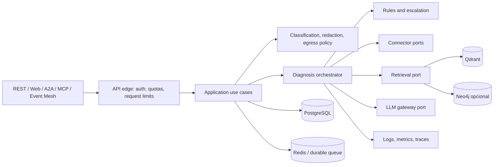

# Revisão arquitetural — Integration Incident Copilot

**Data da revisão:** 2026-10-03
**Checkout:** `/home/marcos-lima/MyProjects/GitHub/integration-incident-copilot`
**Branch:** `fix/local-stack-and-eval-2026-09-26`
**HEAD:** `ef96b7a612b1b36ea9bd7390905d3c82684d6be6` — `fix(OP-01): adiciona checks Redis/Langfuse/Neo4j e ajusta probe requiredservices (DA-35/DA-41/DA-51/B-07)`

> Revisão estática baseada no checkout acima. Não executei testes, CI, build, migrações, ingestão, chamadas a provedores ou serviços externos. Os achados são classificados como riscos sustentados pelo código/configuração, não como incidentes observados em produção. Prioridades P0 (bloqueante), P1 (corrigir antes de produção), P2 (corrigir no próximo ciclo), P3 (melhoria).

## 1. Resumo executivo

O repositório tem um fluxo funcional e bem articulado de diagnóstico: FastAPI, LangGraph, conectores, recuperação híbrida no Qdrant, reranker, regras determinísticas, gateway de LLM, superfícies MCP/A2A/Event Mesh e persistência/observabilidade optativas. Há bom esforço de tornar decisões auditáveis: modelos Pydantic, testes com doubles, testes de integração dedicados para Qdrant/Neo4j/PostgreSQL, avaliação RAG e gates de documentação/dataset.

A maturidade é de **protótipo avançado/homologação**, ainda não de serviço multi-tenant pronto para produção irrestrita. A leitura do HEAD atual confirmou correções relevantes desde a revisão anterior (segredos completos removidos dos logs e variáveis Compose obrigatórias para algumas senhas), mas também encontrou regressões nos probes de Neo4j/Langfuse, admission control que libera capacidade antes do fim do trabalho, e configurações Kyma que não conectam as credenciais Redis/Neo4j ao Secret conforme os comentários prometem. A documentação contém auditorias históricas com afirmações já contraditas pela implementação atual.

### Achados prioritários

| ID | Prioridade | Achado |
|---|---|---|
| SEC-01 | P3 | O log completo das chaves foi removido, mas fingerprints de oito caracteres ainda são registrados sem necessidade operacional. |
| SEC-02 | P2 | Compose agora exige senhas, mas perfis ainda publicam portas de administração/banco em todos os interfaces do host. |
| DEP-01 | P1 | Redis/Neo4j usam placeholders e credenciais no ConfigMap Kyma; o Secret não alimenta as URLs/campos usados pelo app. |
| SEC-03 | P2 | O template Kyma desativa `Secure` no cookie de sessão mesmo para acesso TLS. |
| REL-01 | P1 | O semáforo de admission control é liberado no timeout HTTP enquanto a thread do grafo continua executando. |
| REL-02 | P1 | Estado de tarefa/idempotência e rate limit não têm garantia distribuída coerente em múltiplas réplicas. |
| GOV-01 | P1 | A classificação declarada pela API não governa o roteamento; regex de redação não constitui DLP. |
| OPS-01 | P1 | O probe Neo4j chama `driver.cursor()`, API inexistente no driver oficial usado pelo projeto; GraphRAG deixa `/ready` permanentemente degradado. |
| OPS-02 | P1 | O probe Langfuse usa caminho/método inexistente e o marca como dependência obrigatória quando configurado. |
| OPS-03 | P2 | `INFRA_PROBE_TIMEOUT` não é consumido; readiness ainda não verifica provider cloud, banco nem worker. |
| RAG-01 | P2 | A identidade do embedding persistida não distingue backend/modelo efetivo (FastEmbed BGE versus Ollama configurável). |
| DOC-01 | P2 | Auditorias/guias contêm estado defasado, inclusive DA-17 declarada pendente apesar do fallback existir. |
| CI-01 | P2 | `pip-audit` segue como `continue-on-error`; avaliação de LLM pode não executar sem secret. |
| ARC-01 | P2 | Módulos centrais grandes e dependência de singletons dificultam isolamento e evolução. |
| PERF-01 | P2 | Cross-encoder local e execução síncrona não foram dimensionados frente aos limites do pod Kyma. |
| DATA-01 | P2 | Reingestão não remove chunks antigos quando um documento encolhe. |
| TEST-01 | P2 | Novos probes não têm testes reais por serviço; testes de `/ready` substituem o probe inteiro por mocks. |

## 2. Estado Git e escopo

O checkout está limpo no commit `ef96b7a`; a referência remota local aponta divergência de um commit em cada direção (sem `fetch` nesta revisão). O relatório já é rastreado desde esse commit. Após as edições desta revisão, o esperado é apenas `ARCHITECTURE_REVIEW.md` como modificado.

### Inventário de conteúdo

O Git rastreia 353 arquivos (incluindo este relatório): 94 sob `app/`, 78 sob `tests/`, 56 sob `docs/`, 30 sob `frontend/`, 21 sob `data/`, 16 sob `deploy/`, 11 sob `alembic/`, além de workflows, scripts, configurações e documentação na raiz. O inventário incluiu:

- API, modelos, autenticação, administração, agentes/LangGraph, prompts, regras, gateway e factories de LLM;
- RAG, ingestão, embeddings, avaliação, GraphRAG, conectores SAP e SaaS, contratos e eventos;
- testes unitários e de integração, cassettes e datasets de avaliação;
- migrations Alembic, Dockerfile, Compose, manifests Kyma, dashboards/provisioning Grafana;
- frontend React/Vite, scripts operacionais, workflows CI/CD, metadados, changelog, README e guias de arquitetura/deploy/qualidade.

O workspace tem dados locais não rastreados que importam para operação do RAG: `data/reference_library/` contém 2.174 arquivos (~22,67 GB); o estado local registra 2.108 documentos de referência e 15 documentos de incidentes. A biblioteca inclui principalmente PDFs (2.026), EPUBs (84), HTML/HTM, DOCX e texto. Esses valores refletem este checkout local, não uma distribuição reproduzível pelo Git.

### Exclusões registradas

Não li o conteúdo bruto do corpus PDF/EPUB de 22,67 GB: inspecionei contagem, formatos, estado de ingestão e a implementação que o processa. O corpus é material de entrada e precisa de amostragem semântica própria antes de qualquer alegação de cobertura/qualidade documental; não seria útil enumerar ou carregar milhares de binários nesta auditoria. Também não abri `.env`, `.env.bak-apikey`, `docker-compose.yml.bak-apikey`, arquivos locais de credenciais ou `.aws`; esses arquivos podem conter segredos e não são necessários para avaliar o contrato versionado. Excluí caches (`.venv`, `node_modules`, `.mypy_cache`, `.pytest_cache`, `.ruff_cache`, caches de pre-commit/Python), cobertura, `static/dist`, `reports/`, logs e backups locais como artefatos gerados ou locais. A configuração relevante versionada foi inspecionada; o `Modelfile` local é ignorado pelo Git e foi registrado como configuração local, sem tratá-lo como configuração de produção.

## 3. Arquitetura observada

### Fluxo principal

`POST /diagnose` e consumidores A2A/MCP/eventos chamam o pipeline comum em `app/agent/graph.py::run_diagnosis`. O grafo executa supervisor determinístico, conector, retrieval, roteamento para especialista SAP/SaaS/genérico, diagnóstico com regras/LLM, e relatório; GraphRAG é opcional. O gateway centraliza policy por sensibilidade/origem, fallback, breaker, estimativa de custo e metering. Qdrant serve busca híbrida (densa + BM25/RRF) e reranking cross-encoder; Neo4j guarda relações/histórico opcional. PostgreSQL, Redis, Langfuse e Prometheus são configuráveis/optativos em parte dos caminhos.

### Pontos fortes sustentados pelo código

- Contratos de entrada/saída Pydantic e limites de tamanho para descrição, logs e payload em `app/models.py`.
- Separação de conectores por fornecedor, interface comum e validação restritiva do identificador antes de query/path remoto (`app/connectors/base.py`).
- O gateway e o catálogo de rotas explicitam destino/origem e regras de soberania; a decisão não está deixada apenas ao prompt (`app/llm/gateway.py`, `app/llm/routes.py`).
- O `rule engine` oferece caminho determinístico sem LLM; o pipeline mantém evidências tipadas e proveniência de modelo/prompt.
- A2A, fila RQ e persistência de incidentes são camadas explícitas, com comportamento optativo documentado.
- CI tem jobs separados para suite determinística, Postgres/migrations, Qdrant, Neo4j smoke, frontend e build Docker. Há gates de integridade de dataset e prompt.
- Vários docs distinguem mock, código exercitado via transporte simulado e validação contra instância real; essa distinção precisa ser preservada e atualizada.

## 4. Achados detalhados

### SEC-01 — Fingerprints curtos continuam nos logs de startup

**Status no HEAD atual:** exposição integral corrigida parcialmente; risco residual P3.
**Evidência:** `app/main.py` (linhas 157–177), `app/admin/security.py` (linhas 44–51) e `app/auth.py` (linhas 155–168) agora registram os primeiros oito caracteres das chaves/segredo em vez do valor completo. As chaves são geradas com `secrets.token_urlsafe(32)`.

**Impacto:** o fingerprint não permite recuperar uma chave de 256 bits, mas ainda divulga informação estável sobre credenciais em logs e não é necessário para diagnosticar startup. O problema principal da revisão anterior foi reduzido; não há evidência aqui de exposição prática da chave completa no HEAD atual.

**Recomendação:** remover o valor/fingerprint do log e registrar apenas se o segredo foi configurado ou gerado. Em produção, manter `REQUIRE_AUTH=true` e fornecer credenciais estáveis via secret store. O guard de startup não exige `ADMIN_API_KEY` nem `SESSION_SECRET` estáveis, então rever esse contrato para superfícies de produção.

### SEC-02 — Perfis Compose ainda publicam portas no host

**Status no HEAD atual:** correção do default de senha implementada; exposição de rede permanece como P2.
**Evidência:** `docker-compose.yml` agora usa `${POSTGRES_PASSWORD:?REQUIRED_SET_IN_ENV}`, `${GRAFANA_PASSWORD:?REQUIRED_SET_IN_ENV}` e `${NEO4J_PASSWORD:?REQUIRED_SET_IN_ENV}` (linhas 147, 162, 167 e 232), portanto Compose falha quando faltam as variáveis. Porém Postgres, Grafana e Neo4j publicam portas com mapeamento sem IP explícito (linhas 142–163 e 220–222), que por padrão escuta nos interfaces do host. Redis usa bind loopback por padrão (linhas 252–266).

**Impacto:** quem ativa os perfis de observabilidade/GraphRAG pode expor banco, UI e Bolt para a rede acessível à máquina, além do loopback. Senhas fortes reduzem risco de autenticação, mas não substituem restrição de rede.

**Recomendação:** usar `127.0.0.1` nos binds locais, deixar portas internas sem publicação quando possível, e documentar a exceção para quem realmente precisa de acesso remoto. A correção de interpolação obrigatória do HEAD atende a parte de senha ausente; não é necessário repetir essa mudança.

### REL-01 — O semáforo é liberado enquanto a execução segue ativa

**Prioridade:** P1
**Evidência:** `app/agent/graph.py` cria pool com quatro threads e semáforo com quatro vagas (linhas 145–152). `_invoke_graph_with_timeout` adquire vaga, submete future e, em `finally`, libera o semáforo assim que o caller termina a espera, inclusive quando `future.result(timeout=...)` expira (linhas 170–187). A própria docstring esclarece que a thread continua após o timeout (linhas 160–168). `DiagnosisTimeoutError` é sempre mapeada para HTTP 504 (`app/main.py`, linhas 276–286), inclusive quando o semáforo recusa nova execução com a mensagem “Service unavailable”.

**Impacto:** cada timeout libera uma vaga sem terminar o trabalho. Novos pedidos voltam a ser aceitos e podem entrar na fila ilimitada do executor enquanto quatro workers ainda estão presos; o admission control adicionado pelo HEAD não limita o número real de futures ativos/pendentes. A semântica de saturação também retorna 504 em vez de 429/503.

**Recomendação:** liberar a vaga por `Future.add_done_callback` quando o trabalho realmente concluir, inclusive se o caller já expirou; proteger falha de submissão; mapear saturação para 429/503 com `Retry-After`. A correção definitiva ainda requer cancelamento cooperativo/deadline nas etapas e limites no executor/fila. Fazer teste de concorrência que mantém as quatro tarefas além do deadline e verifica que a quinta não é enfileirada.

### REL-02 — Estado distribuído e rate limit não têm a mesma garantia entre réplicas

**Prioridade:** P1
**Evidência:** Kyma define 2 réplicas e HPA até 6 (`deploy/kyma/deployment.yaml`, `deploy/kyma/hpa.yaml`). A aplicação usa Redis opcional para tarefas, fila, idempotência e circuit breaker; `app/a2a/task_store.py` tem fallback em memória e degradação para perda de persistência, `app/events/idempotency.py` usa fallback/fail-open e `app/rate_limit.py` instancia `slowapi.Limiter` sem storage distribuído.

**Impacto:** falhas de Redis ou configuração ausente tornam task lookup e deduplicação dependentes do pod; o rate-limit é independente por processo e pode multiplicar sua quota efetiva pelas réplicas. O ConfigMap Kyma aponta para Redis, mas nenhum recurso Redis está neste bundle e o segredo de acesso não está conectado corretamente (ver DEP-01).

**Recomendação:** declarar storage compartilhado como requisito do perfil de produção e exigir Redis autenticado/TLS. Configurar storage distribuído para slowapi, preservar estados idempotentes e definir explicitamente se falha do Redis bloqueia ou permite eventos. Testar requisições alternando pods, reentrega de eventos e quotas compartilhadas.

### DEP-01 — Configuração Kyma não conecta credenciais ao Secret

**Prioridade:** P1 para habilitar Redis/GraphRAG.
**Evidência:** `deploy/kyma/configmap.yaml` coloca `REDIS_URL` com senha literal `CHANGE-ME-REDIS-PASSWORD` (linha 72) e `NEO4J_PASSWORD` em ConfigMap como `CHANGE-ME-NEO4J-PASSWORD` (linha 78). `deploy/kyma/secret.example.yaml` define `REDIS_PASSWORD: "CHANGE-ME-redis-password"` (linha 35), que não corresponde à senha na URL e não é usada por código para compor `REDIS_URL`; também não define `NEO4J_PASSWORD`. A ConfigMap instrui usar Secret, mas `NEO4J_PASSWORD` permanece no ConfigMap. `kustomization.yaml` exclui `secret.example.yaml` deliberadamente; o operador precisa criar/aplicar Secret real separado.

**Impacto:** aplicar os templates como descrito não autentica no Redis se ele usa a senha do Secret; chamadas Redis falham e probes/readiness degradam. Habilitar GraphRAG com o placeholder Neo4j não chega a falhar na validação de “senha não vazia”, mas autenticação no banco falha. Além disso, senha em ConfigMap é armazenada como configuração não secreta.

**Recomendação:** remover senhas e userinfo de ConfigMap. Injetar `REDIS_URL` completo ou `REDIS_PASSWORD` do Secret com formato coerente (incluindo escaping de URL), e injetar `NEO4J_PASSWORD` do Secret. Não manter placeholders não vazios que passam pelas validações. Adicionar validação Kustomize/CI que detecte `CHANGE-ME`, confirme chaves referenciadas e cheque autenticação Redis/Neo4j.

### SEC-03 — Cookie de sessão não é Secure no template Kyma

**Prioridade:** P2
**Evidência:** `app/config.py` descreve `session_cookie_secure=True` como configuração de produção atrás de TLS (linhas 332–334), mas o ConfigMap Kyma define `SESSION_COOKIE_SECURE: "false"` (`deploy/kyma/configmap.yaml`, linha 79). `app/auth.py::session_cookie_kwargs` usa diretamente esse setting no atributo Secure do cookie (linha 209).

**Impacto:** o browser não recebe a diretiva Secure e poderá enviar cookie por HTTP se houver um caminho HTTP acessível ao host. Isso amplia o risco de roubo de sessão por exposição/transporte sem TLS, mesmo que o caminho canônico do Gateway use HTTPS.

**Recomendação:** definir `SESSION_COOKIE_SECURE: "true"` no perfil Kyma e reservar false para desenvolvimento HTTP local. Validar redirect/HTTPS externo e `SameSite` com teste de cookie no ambiente de homologação.

### GOV-01 — Classificação/redação não equivalem a DLP e campos declarados não governam policy

**Prioridade:** P1
**Evidência:** `IncidentRequest` aceita `sensitivity_level`, `pii_detected` e `redaction_applied` (`app/models.py`, linhas 48–60), mas `run_diagnosis` monta o estado inicial sem esses campos (`app/agent/graph.py`, linhas 185–207). `classify_sensitivity` considera dado real do conector confidencial e, nos demais casos, usa `settings.sensitivity_default` (`app/llm/gateway.py`, linhas 121–136); não consulta os valores declarados pelo chamador. A redação em `app/redaction.py` cobre regexs limitadas (e-mail, CPF/CNPJ, IDoc, bearer e nomes comuns de chave/segredo); os docs do gateway reconhecem ausência de NER/classificador de PII e multi-tenancy.

**Impacto:** consumidores podem acreditar que sinalizar `confidential`/`secret` muda o roteamento, mas hoje não muda. A política default `confidential` é prudente; ainda assim, configurações `SENSITIVITY_DEFAULT=public` e conteúdo não reconhecido pelo regex podem permitir envio de dado empresarial a cloud. `redaction_applied` vindo do cliente também não é evidência de que a redação ocorreu.

**Recomendação:** incluir classificação autoritativa no estado e fazer validação conservadora (nível informado só pode elevar sensibilidade, nunca reduzi-la sem policy explícita). Separar redaction de PII da autorização de egress; default deny para cloud se classificação não for verificável. Criar testes de matriz por provider/origin, dados de conector e amostras PII multilíngues; rotular a redação atual como minimização parcial, nunca DLP.

### OPS-01 — A probe Neo4j usa uma API inexistente e impede readiness com GraphRAG

**Prioridade:** P1 quando GraphRAG está habilitado.
**Evidência:** `app/main.py` instancia `GraphDatabase.driver(...)` e chama `driver.cursor()` (linhas 398–413). O driver Neo4j Python oferece `driver.session()` e execução via sessão; o pacote instalado no `.venv` declara `Driver.session` em `neo4j/_sync/driver.py`, sem método `cursor`. A exceção é engolida pelo `except Exception` e traduzida em `neo4j: degraded`. `_required_services()` marca Neo4j obrigatório quando `GRAPH_RAG_ENABLED=true` (linhas 429–430), e `/ready` retorna 503 para serviço degradado.

**Impacto:** em qualquer deployment que ligue GraphRAG, `/ready` reprova sempre, retirando os pods do balanceador ainda que Neo4j esteja saudável. O driver é criado em cada chamada e não é fechado no caminho de exceção, podendo também acumular recursos entre probes.

**Recomendação:** usar `with driver.session() as session: session.run("RETURN 1")`, fechar o driver em `finally` ou usar cliente compartilhado de lifespan e aplicar deadline real. Cobrir com smoke contra Neo4j real; a alteração atual só adiciona stubs no teste de endpoint.

### OPS-02 — Probe Langfuse chama método/path inexistente e bloqueia serviço opcional

**Prioridade:** P1 quando Langfuse está configurado.
**Evidência:** `app/main.py` chama `client.projects.get_many()` e converte qualquer erro em `langfuse: degraded` (linhas 383–393); `_required_services()` adiciona `langfuse` ao conjunto obrigatório quando configurado (linhas 431–432). No SDK presente (`langfuse 4.16.0`), a API REST fica em `client.api`; o código do pacote usa `self.api.projects.get()` (`.venv/lib/python3.12/site-packages/langfuse/_client/client.py`, linhas 448 e 2432), não `client.projects.get_many()`. O comentário da probe reconhece que sem Langfuse o app continua funcionando, mas uma falha remove o pod do tráfego.

**Impacto:** com Langfuse configurado, a probe retorna degraded por `AttributeError` e o pod fica NotReady mesmo quando o backend responde e o diagnóstico poderia continuar sem tracing. Em múltiplas réplicas isso pode causar indisponibilidade total.

**Recomendação:** usar endpoint/SDK realmente suportado e limitar duração. Decidir explicitamente se tracing é requisito de readiness; se observabilidade é best-effort, reportar degraded sem retirar o pod. Adicionar teste de integração para o caminho real do SDK.

### OPS-03 — Orçamento de readiness não é aplicado e faltam dependências ativas

**Prioridade:** P2
**Evidência:** `deploy/kyma/configmap.yaml` define `INFRA_PROBE_TIMEOUT: "5"` (linha 82), mas `rg` não encontra esse nome em `app/` nem em `tests/`; os probes HTTP/Redis usam timeouts hardcoded de 1 s e a chamada Langfuse não recebe timeout explícito (`app/main.py`, linhas 345, 349–373 e 383–389). `_required_services()` não inclui provider OpenAI/Azure, PostgreSQL, nem worker RQ.

**Impacto:** o valor anunciado de 5 s não controla a probe; serviços podem exceder o orçamento do kubelet (readiness timeout 5 s em `deploy/kyma/deployment.yaml`) ou falhar cedo por um timeout fixo. Ao mesmo tempo, pod pode ficar pronto sem provider cloud válido, DB necessário ao registry/metering ou worker para fila assíncrona.

**Recomendação:** modelar timeout no `Settings` e aplicar um deadline total compartilhado à probe. Expor status por capability e validar apenas dependências requeridas pela configuração/rotas habilitadas; não tratar toda integração opcional como requisito global.

### RAG-01 — Fingerprint do embedding descreve config, não o vetor usado

**Prioridade:** P2
**Evidência:** `app/rag/retriever.py` seleciona `EMBEDDING_BACKEND=fastembed` e instancia `_FastEmbedWrapper` com modelo fixo `BAAI/bge-small-en-v1.5` (linhas 72–102). Ingestão e validação continuam passando `EMBEDDING_MODEL` para `ensure_collection` e `stamp_collection` (`app/rag/ingest.py`, linhas 526–544; `stamp_existing_collection`, linhas 379–389); retrieval também chama `verify_once(..., EMBEDDING_MODEL)`. O rótulo pode ser `nomic-embed-text` mesmo quando os vetores são BGE.

**Impacto:** a proteção DA-45 detecta incompatibilidade dimensional em muitos casos, mas a identidade persistida pode ser falsa; backend/modelo com a mesma dimensão pode misturar espaços vetoriais incompatíveis sem falhar e gerar respostas plausíveis incorretas. A troca para FastEmbed na CI não é representada no fingerprint.

**Recomendação:** usar identidade canônica composta por backend, nome, revisão/checksum e dimensão real. Persistir a mesma identidade no ingest e validar no query. Falhar ao misturar configurações; exigir reindex explícito quando muda o fingerprint.

### DOC-01 — Documentação de auditoria/uso contém afirmações obsoletas

**Prioridade:** P2
**Evidência:** `docs/AUDITORIA_RESUMO_EXECUTIVO.md` (linhas 92–100) declara que o fallback para reference library DA-17 não está implementado, mas `app/rag/retriever.py::_retrieve_unified` já busca a collection de referência como fallback mediante threshold (documentado em `docs/ARCHITECTURE.md`, seção RAG). O mesmo resumo diz “nenhuma deficiência crítica” e estima latências sem identificar medição. `docs/AUDITORIA_PONTA_A_PONTA.md` repete DA-17 aberta. `docs/CONNECTORS.md` contém declarações de validação, credenciais/contratos e limites que devem ser conciliados com o estado atual. A documentação de arquitetura reporta a medição de corpus de 552 docs/100.805 chunks datada de 2026-10-01; o corpus local atual tem 2.174 arquivos/2.108 entradas no estado.

**Impacto:** guias podem induzir retrabalho, configuração incorreta, decisão baseada em latência estimada ou entendimento incorreto sobre conectores, RAG e disponibilidade. O grande histórico de decisões no README é valioso, mas torna drift difícil de detectar.

**Recomendação:** marcar documentos de auditoria com commit/escopo e data de validade; atualizar/remover recomendações concluídas; identificar claramente números medidos, estimados e não executados; automatizar links de código e inventário em gate. Revisar valores de corpus e conectores com comando reproduzível e snapshot versionado sem dados privados.

### CI-01 — Auditoria de dependências não bloqueia CVEs

**Prioridade:** P2
**Evidência:** `.github/workflows/tests.yml` define `continue-on-error: true` no passo `pip-audit` (linhas 100–105). O job `llm_eval` de `quality.yml` é agendado/manual; sem `OPENAI_API_KEY`, escreve que a avaliação não ocorreu, sem reprovar o workflow. Dependências de workflow incluem `npx --yes promptfoo@latest` (`quality.yml`), que não fixa versão.

**Impacto:** a suite pode ficar verde enquanto há CVEs ou regressão de qualidade de prompt; dependência `@latest` torna execução não reproduzível e aumenta risco de cadeia de suprimentos. A limitação do eval é explicitada no summary, o que é melhor que um falso verde, mas não substitui um gate obrigatório para release.

**Recomendação:** separar CVE sem correção disponível de falha da ferramenta; exigir relatório gerado e política de severidade que falhe para CVEs corrigíveis acima do limite. Fixar versão do Promptfoo e demais actions críticas por SHA/versão revisada. Fazer release exigir artefato de avaliação LLM recente ou registrar formalmente “não executado”.

### ARC-01 — Núcleo concentrado e acoplado a singletons

**Prioridade:** P2
**Evidência:** `app/main.py` tem ~694 linhas e reúne lifespan, autenticação, probes e múltiplos endpoints; `app/config.py` ~630 linhas; `app/agent/nodes.py` ~1.255 linhas concentra preparação de contexto, web search, guardrails, agentes e relatórios. `settings`, clientes e grafos são singletons/caches de módulo em `app/agent/graph.py`, `app/rag/retriever.py`, `app/a2a/task_store.py` e outros.

**Impacto:** testes dependem de monkeypatch/reset de estado global; configuração é lida de uma instância global; adicionar tenant, ambientes distintos ou worker independente aumenta risco de vazamento de configuração entre chamadas e dificulta substituir infraestrutura sem importar módulos concretos.

**Recomendação:** evolução incremental: extrair routers por superfície, casos de uso de diagnóstico/evento/verificação e portas para LLM, retrieval, connector, persistence e clock. Passar `Settings`/dependências por composição da aplicação e injetar clientes no ciclo de vida. Não criar camadas vazias: mover uma responsabilidade quando houver contrato e benefício mensurável.

### PERF-01 — Dimensionamento de runtime não demonstra custo do reranker

**Prioridade:** P2
**Evidência:** `app/rag/retriever.py` carrega `sentence_transformers.CrossEncoder` e reranqueia pool de candidatos em CPU/local (`_get_reranker`, `rerank`); imagem instala `sentence-transformers` (`pyproject.toml`). Kyma limita API/worker a 512 MiB e solicita 256 MiB (`deploy/kyma/deployment.yaml`, `worker.yaml`).

**Impacto:** o modelo e bibliotecas numéricas podem exceder memória/CPU disponíveis, especialmente com concorrência, levando a OOM, latência de cauda ou indisponibilidade. Benchmark de qualidade/velocidade documentado não comprova consumo no limite do pod.

**Recomendação:** medir RSS/CPU e latência p50/p95/p99 no container final com carga paralela e corpus representativo. Definir orçamento de concorrência, tamanho do pool e limites por worker; considerar serviço de reranking separado, modelo menor/quantizado ou opção de desabilitar com qualidade medida. Ajustar requests/limits com dados observados.

### DATA-01 — Reprocessamento incremental deixa pontos órfãos

**Prioridade:** P2
**Evidência:** a docstring de `deterministic_document_id` em `app/rag/ingest.py` (aprox. linhas 392–418) registra que quando arquivo encolhe os índices de chunks removidos não são apagados; apenas `--reset-collection` remove os pontos antigos. O estado de ingestão local é ignorado pelo Git e associado ao ambiente, não ao corpus versionado.

**Impacto:** chunks obsoletos podem continuar no retrieval, afetando groundedness e contradições; reset total para limpeza pode ser custoso e interromper disponibilidade. Um state file perdido também torna difícil provar qual snapshot foi indexado.

**Recomendação:** manter manifesto `document_id → chunk_count/hash` no Qdrant ou store transacional e excluir por `document_id` após ingestão bem-sucedida substitutiva. Usar versionamento/alias de collection para reindex sem downtime e registrar versão do corpus/fingerprint/commit de ingestão.

### TEST-01 — A evidência de integração e produção é parcial

**Prioridade:** P2
**Evidência:** workflows cobrem Qdrant e Neo4j com containers reais e migrations/dashboard em Postgres, mas conectores usam muitos `httpx.MockTransport`/cassettes; a documentação reconhece endpoints especulativos ou ausência de tenant real para alguns fornecedores. O job normal exclui `integration`; prompt eval não roda a cada PR e depende de segredo/provider. No commit atual, `tests/test_api.py` substitui `_probe_infra_services` por uma função fake nos testes de `/ready` (linhas 587–635), portanto não valida o novo uso de `client.projects.get_many()` nem do driver Neo4j.

**Impacto:** mocks provam parsing/contratos sob fixtures, mas não autenticação, quotas, paginação, mudanças de schema, TLS, timeouts nem diferenças reais de fornecedores. Carga concorrente, failover e consumo de memória também não estão demonstrados.

**Recomendação:** manter smoke de contrato com sandbox por fornecedor onde houver credencial; versionar cassettes anonimizados e data de captura; exigir validação manual documentada para sistemas sem sandbox. Adicionar teste de carga/fault injection para deadlines, fila, Redis e failover antes de produção.

## 5. Segurança, privacidade e operação: avaliação complementar

- **Autenticação:** há chaves separadas para API, A2A, webhook e admin, comparação constante e opção de exigir configuração explícita; login web usa cookie assinado e PBKDF2. O HEAD deixou de logar chaves completas, mas ainda loga fingerprints de oito caracteres. A distribuição, rotação, `ADMIN_API_KEY` estável e `SESSION_SECRET` continuam dependentes do operador.
- **Prompt injection:** entradas, retrieval e web search passam por neutralização heurística e a busca web tem gate de fonte/sensibilidade. Regex não é sandbox nem garantia de isolamento de instruções; conteúdo recuperado deve continuar tratado como não confiável e ferramentas devem permanecer com capability mínima.
- **Egress:** a origem real dos providers e allowlist de dados confidenciais reduzem risco de roteamento acidental. A classificação default é prudente, mas a redação parcial e dados declarados pelo cliente não são suficientes para atestar DLP.
- **Admin/model registry:** credenciais em repouso usam Fernet e a rota mascara plaintext, mas a segurança depende integralmente da proteção/backup/rotação de `LLM_CREDENTIALS_MASTER_KEY`; perda da chave impede descriptografia. O banco é simultaneamente configuração operacional e armazenamento de incidentes.
- **Observabilidade:** Langfuse é opcional e com mask de dados; logs ainda precisam da correção SEC-01. `/metrics` é opt-in e deve ser protegido por rede/reverse proxy; dashboards e métricas não devem receber labels com valores de usuário/tenant.
- **Fila/eventos:** RQ e idempotência melhoram resiliência se Redis estiver corretamente operado; sem Redis, `BackgroundTasks` é best effort. A entrega 202 sem Redis não equivale a durabilidade.
- **Deploy:** Kyma templates têm usuário não-root, seccomp, probes e limites, mas não incluem policies de rede, secret operator nem Qdrant/Redis gerenciado. A operação exige infraestrutura externa e substituição dos placeholders. O ConfigMap usa OpenAI como padrão, inclui origin Azure com placeholder, credenciais Redis/Neo4j inconsistentes e `SESSION_COOKIE_SECURE=false`; não é configuração pronta. A APIRule documenta que seu schema não foi validado em cluster Kyma real.
- **Contratos:** parser OData usa XML endurecido e modelo de drift é explícito. A publicação do evento/incidente em sistemas externos e ciclo de baseline ainda dependem da infraestrutura de evento/banco configurada.

## 6. Arquitetura-alvo recomendada

Não é necessário reescrever para Clean Architecture nominal. Recomendo explicitar as fronteiras que já existem e reduzir dependências globais:

### Princípios de desenho

1. **API adapters finos:** REST, A2A, MCP e eventos traduzem contratos e autenticação para casos de uso comuns; nenhum adapta formato nem executa lógica duplicada.
2. **Caso de uso com deadline/cancellation e estado explícito:** `DiagnoseIncident`, `VerifyIncident`, `AcceptIncidentEvent`. Dependências externas com interface, timeout, retry e política de idempotência explícitos.
3. **Policy antes do egress:** classificação autoritativa de dado, redaction, allowed origin/provider e autorização de web search são aplicadas no mesmo ponto de composição do prompt, com explicação auditável por decisão.
4. **RAG versionado e validado:** identity fingerprint completo de embeddings/reranker, corpus manifesto, alias/version de índice, limiares calibrados por dataset e fallback testado contra perguntas in-scope/out-of-scope.
5. **Persistência/durabilidade como capability declarada:** API síncrona pode operar em modo local; perfis de produção exigem Redis/banco/provider de acordo com as rotas habilitadas e falham no startup/readiness se ausentes.
6. **Single-tenant declarado ou tenant isolation real:** até implementar escopo/ACL por organização em dados, Qdrant, Neo4j, tarefas, API keys, métricas e logs, não alegar isolamento multi-tenant.
7. **Composição por processo:** API e worker compartilham casos de uso/configuração, mas têm limites próprios de concorrência, memória, shutdown e observabilidade.

## 7. Roadmap priorizado

### Fase 0 — Bloqueadores de exposição (imediato)

- Remover até os fingerprints dos logs (SEC-01); manter as senhas Compose obrigatórias já introduzidas no HEAD e restringir os binds expostos (SEC-02).
- Corrigir wiring de Secrets/ConfigMaps Kyma para Redis/Neo4j e não habilitar features enquanto placeholders estiverem presentes (DEP-01); ativar cookie Secure no perfil TLS (SEC-03).
- Confirmar binds de portas locais e políticas de acesso para Postgres/Grafana/Neo4j/Redis.
- Atualizar manifestos Kyma com credenciais via Secret Manager e validar origin/provider efetivos; documentar que templates não são deployment pronto.
- Criar gate de segurança que falha com credenciais placeholder/ausentes nos perfis de produção.

### Fase 1 — Confiabilidade de tráfego (curto prazo)

- Corrigir a liberação prematura do semáforo e o status HTTP de saturação; depois resolver cancelamento/deadline do diagnóstico (REL-01).
- Configurar Redis com autenticação/TLS e storage distribuído para rate limit, A2A, idempotência e breaker; tornar pré-requisito explícito no perfil Kyma (REL-02).
- Corrigir probes do Neo4j e Langfuse, definir se observabilidade opcional afeta readiness, aplicar timeout total e incluir as dependências necessárias por capability/worker (OPS-01/02/03).
- Testar duplicidade, retry, crash entre claim e conclusão, e recuperação Redis/Qdrant/provider.

### Fase 2 — Governança de dados e RAG (médio prazo)

- Incorporar sensibilidade declarada ao estado sem permitir downgrade inseguro; aprimorar detecção/redaction e policy de egress (GOV-01).
- Corrigir fingerprint do embedding e reprovar mistura de modelos (RAG-01).
- Implementar remoção incremental de chunks obsoletos e versionamento do corpus (DATA-01).
- Estabelecer avaliação contínua de groundedness, precisão de fonte, falsos positivos de fallback e segurança contra injection.

### Fase 3 — Operabilidade e arquitetura (médio prazo)

- Medir memória/CPU/latência do container e dimensionar API, worker e reranker (PERF-01).
- Extrair routers/casos de uso/ports progressivamente e reduzir singletons injetando configuração/clientes (ARC-01).
- Atualizar auditorias/guias e publicar matriz atual de conectores com evidência, data e limites de validação (DOC-01).
- Tornar `pip-audit` policy gate efetivo e fixar ferramentas/actions (CI-01).

### Fase 4 — Evidência de produção (antes de GA)

- Executar teste ponta a ponta em ambiente representativo, incluindo cada provider e conector suportado que será anunciado.
- Exercitar falhas, carga e recuperação em múltiplas réplicas; validar SLOs observados, custo real e orçamento de tokens.
- Definir retenção/expurgo de incidentes, evidências, traces e tarefas; formalizar backup/restore de PostgreSQL, Redis, Qdrant e master key.
- Fazer revisão de threat model, isolamento de tenant (se necessário), IAM/RBAC de usuários, network policies, TLS e rotação de segredos.

## 8. Critérios de aceite

1. Nenhum segredo completo aparece em stdout/stderr, logs de aplicação, traces, métricas ou relatórios; testes de captura provam o comportamento.
2. Compose e manifests falham com erro explícito quando um segredo obrigatório está ausente/placeholder; portas de administração/banco ficam privadas por default.
3. Admission control só libera a vaga quando o future termina; novas requisições não acumulam sem limite, saturação retorna 429/503 e teste comprova comportamento após quatro chamadas bloqueadas.
4. Em 2+ réplicas, tarefa A2A pode ser consultada em qualquer pod, evento duplicado não executa duas vezes e rate limit tem bucket coerente e storage compartilhado.
5. Para cada dado/provider/origin, política resulta em allow/deny auditável; sensibilidade fornecida pelo usuário só pode elevar proteção; nenhuma decisão de DLP depende de regex como única barreira.
6. Probes de Neo4j e Langfuse usam APIs válidas, fecham recursos e têm teste contra as dependências reais; readiness aplica timeout total e representa apenas dependências requeridas pela configuração ativa.
7. Fingerprint da collection corresponde ao backend/modelo/revisão/dimensão do vetor efetivamente gravado e usado na consulta; incompatibilidade falha antes de responder.
8. Reingestão de documento alterado remove chunks velhos sem apagar outros documentos nem deixar janela de indisponibilidade; corpus e resultado são reproduzíveis.
9. Documentação de arquitetura/auditoria identifica o commit avaliado e não contém pendências já resolvidas; manifestos Kyma não mantêm placeholders/segredos em ConfigMap e os valores têm classificação “medido”, “estimado” ou “não executado”.
10. `pip-audit`, lint, typecheck frontend, testes determinísticos, smoke de infraestrutura e eval RAG/LLM produzem relatórios auditáveis; falhas de ferramenta não viram sucesso silencioso.
11. Teste de carga valida latência p95/p99, RSS, limite de concorrência, custo, filas e comportamento do breaker com a configuração de produção pretendida.
12. Runbook de deploy, rollback, rotação/recuperação de segredo e restore de dados é executável por outra pessoa sem acesso ao ambiente do autor.

## 9. Limites desta revisão

Esta revisão não executou testes/build/CI nem verificou disponibilidade real de endpoints/provedores. Inspecionei estaticamente o código instalado dos SDKs Neo4j e Langfuse no `.venv` para confirmar a incompatibilidade das chamadas nas probes; não executei os probes contra serviços. Esta revisão não valida contratos de fornecedor além do que código, testes, fixtures e documentação sustentam. Os PDFs/EPUBs não foram semanticamente amostrados. Arquivos locais de segredo foram deliberadamente ignorados. Os benchmarks e medições descritos nos documentos foram tratados como evidência documental histórica, não como números reproduzidos nesta sessão. Portanto, os achados identificam riscos de desenho/configuração e itens que requerem validação operacional; não constituem certificação de segurança ou readiness para produção.
