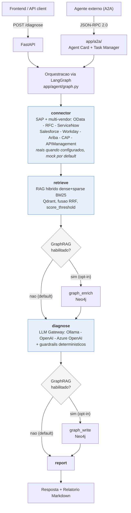

# Integration Incident Copilot

[](https://github.com/marcos-slima/integration-incident-copilot/actions/workflows/tests.yml)

> 📋 Veja o [processo de desenvolvimento](docs/PROCESSO_DESENVOLVIMENTO.md) seguido neste projeto, fase por fase.

Assistente de IA para diagnóstico de incidentes de integrações.
Recebe a descrição de um incidente, lê logs/payloads, consulta um
catálogo de APIs/documentos via RAG, identifica o provável ponto de
falha, sugere causa raiz e próximos passos, e gera um relatório em
Markdown.

**Por que este projeto existe:** o SAP AI Core exige HANA Cloud como
camada obrigatória (dezenas de milhares de euros/ano, independente do
consumo de IA), o que exclui estruturalmente quem ainda está em ECC
on-premise ou não tem orçamento/infra para BTP — cerca de 40-45% da
base de clientes SAP ECC no mundo, segundo Gartner/IDC. Este projeto é
a prova técnica de que dá para levar IA de diagnóstico real (RAG +
agente + conectores) para esse público, rodando local ou sobre um
provedor que o cliente já tenha — ver
[TCO_SAP_AI_CORE_VS_SELF_HOSTED.md](docs/TCO_SAP_AI_CORE_VS_SELF_HOSTED.md).
E não fica restrito a SAP: o mesmo contrato de conector (`app/connectors/`)
já cobre cinco sistemas de referência não-SAP/multi-vendor de verdade
(ServiceNow, Salesforce, Workday, SAP Ariba), não só mock — ver seção
"Conectores" em [docs/ARCHITECTURE.md](docs/ARCHITECTURE.md).

## Arquitetura



Ver [docs/ARCHITECTURE.md](docs/ARCHITECTURE.md) para o detalhamento
por camada (API / A2A / orquestração / LLM Gateway / RAG+GraphRAG /
conectores).

## Stack

- **API**: FastAPI + Pydantic
- **A2A**: Agent Card + servidor JSON-RPC 2.0 (`app/a2a/`), em paralelo
  ao REST, mesma orquestração por trás — ver
  [proposta original](docs/proposals/a2a-interoperability-layer.md)
- **Orquestração**: LangGraph
- **LLM Gateway**: plugável — Ollama (default, local-first), OpenAI ou
  Azure OpenAI (`app/llm/factory.py`), sem trocar código do grafo
- **RAG**: LangChain + Qdrant (vector store) + GraphRAG opt-in via Neo4j
  (`app/rag/graph_store.py`, desligado por default)
- **Observabilidade**: Langfuse (opcional; tracing de todo o fluxo do
  agente quando configurado)
- **Conectores**: OData / RFC / ServiceNow / Salesforce / Workday / SAP
  Ariba / SAP CAP / SAP API Management (schema especulativo, ver
  ARCHITECTURE.md) — reais (chamada HTTP/OAuth2 de verdade) quando
  configurados, caem em mock só sem credencial/endpoint informado

## Desenvolvimento local

Opção 1 — self-contained, sem depender de infraestrutura pessoal
(recomendado para rodar/demonstrar este repositório isoladamente):

```bash
docker compose up -d      # sobe Ollama + Qdrant + a API
docker compose exec ollama ollama pull qwen2.5-coder:32b
docker compose exec ollama ollama pull nomic-embed-text
```

Opção 2 — ambiente de desenvolvimento local (fora de container):

```bash
uv sync
uv run uvicorn app.main:app --reload
```

Pré-requisitos da Opção 2: Qdrant e Ollama acessíveis (localmente ou
via `~/ai-stack`, que também traz Neo4j reservado para uso futuro e o
stack completo do Langfuse — ver nota em
[docs/ARCHITECTURE.md](docs/ARCHITECTURE.md)).

## Status

Projeto em desenvolvimento — portfólio da trilha SAP Architect → AI
Architect.

## Decisões de Arquitetura

Registro dos problemas reais encontrados durante o desenvolvimento e
como foram resolvidos — processo de engenharia, não só o resultado
final.

### 1. Alucinação por mistura de contexto

**Problema:** ao passar os 3 documentos mais relevantes (RAG top-3)
inteiros no prompt, o LLM ocasionalmente combinava causa raiz de
documentos diferentes (ex: misturava conceitos de IDoc e OData numa
única resposta), mesmo com instrução explícita para não fazer isso.

**Solução:** restringir o contexto passado ao LLM a apenas o
**documento mais relevante** (texto completo), citando os demais só
pelo nome, sem conteúdo. Eliminou a possibilidade de mistura na raiz,
por design, em vez de depender de instrução de prompt.

### 2. Não-determinismo com temperature=0

**Problema:** o mesmo prompt, rodado duas vezes com `temperature=0.0`
no Ollama, produzia respostas diferentes — incluindo uma alucinação
completa numa das execuções. `temperature=0` não garante determinismo
total sem um `seed` explícito.

**Solução:** fixar `seed=42` na chamada ao `ChatOllama`. Validado com
5 execuções idênticas seguidas do mesmo cenário antes considerado
instável.

### 3. Guardrail determinístico para dados de fallback

**Problema:** quando um conector SAP não reconhece um identificador
(cenário simulado/mock não mapeado), o LLM às vezes ainda tentava
vincular a um documento específico da base de conhecimento com
confiança moderada-alta, mesmo orientado por prompt a não fazer isso.

**Solução:** não depender só da autoavaliação do LLM para essa
propriedade de segurança. O código verifica deterministicamente se o
conector retornou um dado de fallback (`ConnectorResult.is_fallback`)
e, nesse caso, **impõe um teto de confiança (0.4)** independente do
que o modelo reportar.

### 4. Comparação formal de modelos (qwen3:30b-a3b vs qwen2.5-coder:32b)

**Contexto:** os problemas 1 e 3 acima ocorreram especificamente com
o `qwen3:30b-a3b` (MoE, ~3B parâmetros ativos). Antes de assumir que
o modelo era a causa raiz, foi feita uma comparação formal usando
[promptfoo](https://www.promptfoo.dev/), rodando o **pipeline
completo real** (conector + RAG + guardrails) contra os dois modelos,
não o LLM isolado.

**Resultado:** nos casos com correspondência clara, os dois modelos
tiveram desempenho equivalente. No caso crítico — identificador de
sistema desconhecido, sem correspondência real na base de
conhecimento — o `qwen2.5-coder:32b` reconheceu sozinho a ausência de
correspondência (`matched_source: null`), enquanto o `qwen3:30b-a3b`
tentou vincular um documento específico mesmo assim (só não virou
problema visível por causa do guardrail do item 3).

**Decisão:** `qwen2.5-coder:32b` (denso, 32B parâmetros) adotado como
modelo de produção do grafo. Validado com a suíte completa de testes
(16/16 `pytest`) após a troca. Trade-off aceito: tempo de inferência
maior (~2min49s vs ~1min20s nos 16 testes) em troca de comportamento
mais confiável sob incerteza.

### 5. Observabilidade real com Langfuse

**Contexto:** o Langfuse estava configurado desde o início do
projeto, mas sem nenhum código realmente enviando dados para lá —
configuração presente, tracing ausente.

**Implementado:** cada node do grafo (`connector`, `retrieve`,
`diagnose`, `report`) é instrumentado com `@observe`, e a chamada ao
LLM usa o `CallbackHandler` do LangChain — capturando tempo de
execução, tokens e o payload completo de entrada/saída de cada etapa,
visível em `http://localhost:3000`.

**Bug encontrado e corrigido no processo:** em execuções via `pytest`
(diferente do CLI), o SDK não fazia `flush()` automático antes do
processo terminar — de 16 execuções de teste, só 8 traces chegavam ao
Langfuse. Corrigido com uma fixture `autouse` no `conftest.py` que
força o flush ao final da sessão de testes.

### 6. Configuração centralizada (eliminando hardcoded)

**Problema encontrado:** apesar de existir um `.env` desde o início
do projeto, o código nunca o lia — URLs do Qdrant, modelo do LLM e
outras configurações estavam fixas como constantes Python, espalhadas
em múltiplos arquivos. Trocar de modelo exigia editar código-fonte
(`sed` direto no arquivo), não mudar uma variável de ambiente.

**Solução:** `app/config.py`, uma classe `Settings` (via
`pydantic-settings`) como única fonte de verdade, lida do `.env`. Um
comando (`uv run python -m app.config`) imprime a configuração
efetiva a qualquer momento, com segredos mascarados — permite
verificar o que está realmente configurado sem depender de leitura de
código-fonte.

### 7. Segurança e CI antes da publicação

Antes de tornar o repositório público:

- **`gitleaks`**: varredura de **todo o histórico do git** (não só o
  estado atual) em busca de segredos vazados — confirmado limpo antes
  do primeiro push
- **`pre-commit`**: hooks automáticos (lint/format via `ruff`,
  detecção de segredo, bloqueio de arquivo grande >5MB) rodando em
  todo commit local, dali em diante
- **GitHub Actions**: workflow de CI rodando lint + testes unitários
  a cada push/PR — o badge de status no topo deste README reflete o
  resultado real da última execução, não uma alegação

### 8. Segunda comparação de modelo: qwen3.6:35b-a3b avaliado e rejeitado

**Contexto:** meses após a decisão pelo `qwen2.5-coder:32b` (seção 4),
a Alibaba lançou o `qwen3.6:35b-a3b` (MoE, 36B total/3B ativos,
sucessor da série que havia sido descartada na primeira comparação).
Repetiu-se o mesmo processo formal via `promptfoo`, contra o mesmo
pipeline real e os mesmos 10 casos de teste — incluindo o caso crítico
(`IDoc travado` / conector RFC) repetido 3 vezes para medir
estabilidade.

**Resultado:** em 7 dos 10 casos, desempenho equivalente ou
ligeiramente superior ao modelo atual (respostas mais detalhadas,
confiança bem calibrada no caso de segurança do identificador
desconhecido). Porém, no caso crítico repetido 3 vezes, o
`qwen3.6:35b-a3b` **falhou nas 3 execuções de forma idêntica**: o
modelo não devolveu um JSON estruturado válido
(`"Nao foi possivel estruturar a resposta do modelo"`,
`confidence: 0.0`), enquanto o `qwen2.5-coder:32b` acertou as 3 vezes
com 90% de confiança.

**Decisão:** manter `qwen2.5-coder:32b` em produção. Uma falha
determinística e reproduzível (3/3) no cenário mais crítico do
pipeline desqualifica o candidato, independente do desempenho médio
nos demais casos — confiabilidade sob o caso mais exigente pesa mais
que desempenho médio.

**Valor do processo, não só do resultado:** esta comparação também
prova que a decisão de modelo não é estática — é revisitada com
critério formal sempre que surge um candidato relevante, com a mesma
metodologia e o mesmo pipeline real usados desde a primeira vez,
gerando decisões comparáveis ao longo do tempo.

### 9. Achados de code review: estado global, parsing frágil, limites ausentes

Uma revisão de código externa identificou 10 pontos; a triagem separou
o que era real do que era falso alarme ou já havia sido corrigido:

- **Falso alarme:** alegação de que `report_node`/`run_diagnosis`
  estariam ausentes do arquivo — não procede, ambos existem e
  funcionam (o revisor provavelmente viu um trecho cortado, não o
  arquivo completo)
- **Já corrigido antes da revisão:** singleton no retriever e
  `ensure_collection` fora do loop de batch (ver seções anteriores)
- **Confirmados e corrigidos nesta rodada:**
  - `LLM_MODEL` como global mutável de módulo → injetado via `state`/
    parâmetro em `run_diagnosis(..., llm_model=...)`, eliminando risco
    de corrida entre execuções concorrentes
  - Parsing de JSON manual e frágil → `llm.with_structured_output(DiagnosisModel, include_raw=True)`, com o parsing manual antigo mantido como *fallback*, não mais como único caminho
  - `confidence` sem validação de range → `Field(ge=0.0, le=1.0)` no
    schema Pydantic **+** clamp defensivo no código (a mesma filosofia
    de guardrail em camadas já usada para o fallback do conector,
    agora estendida)
  - `logs`/`payload` sem limite de tamanho → `max_length` no Pydantic
    (rejeita entrada absurda na API) e truncamento mais apertado na
    montagem do prompt (protege o contexto/custo do LLM)
  - Zero teste da camada HTTP → `tests/test_api.py` com `TestClient`
  - `Dockerfile` não copiava `data/`, então o fallback de documentos
    de exemplo quebraria em produção → corrigido, com nota explícita
    de que a biblioteca de 36GB nunca deve entrar na imagem e que
    `.env` deve ser injetado em runtime, não commitado na imagem
  - `@app.on_event` (deprecated, ainda funcional mas legado) →
    migrado para o padrão `lifespan` do FastAPI
- **Achado adicional durante a correção do item acima:** a primeira
  tentativa de restaurar a orientação sobre `matched_source` usou
  `Field(description=...)` no schema Pydantic, assumindo que o
  LangChain injetaria essa descrição como contexto textual pro LLM.
  **Isso não teve efeito nenhum** — confirmado porque as respostas do
  modelo saíram byte-a-byte idênticas antes e depois da mudança
  (esperado com `temperature=0`/`seed` fixo apenas se o prompt
  realmente enviado não mudou). Causa real: `with_structured_output`
  no Ollama usa o schema JSON para restringir **tipo/formato** da
  geração (decodificação restrita por gramática), não para injetar
  descrições como instrução legível pelo modelo. A correção que
  funcionou de fato foi devolver a instrução como **texto explícito
  no prompt**, confirmada visualmente via `--debug` antes de rodar a
  suíte completa de novo. Lição: ao adotar saída estruturada via
  schema, texto explícito no prompt continua necessário para lógica
  de preenchimento — o schema garante a forma, não o conteúdo.

### 10. LLM Gateway plugável (não hardcoded em Ollama)

**Contexto:** o projeto nasceu 100% Ollama/local por decisão
deliberada (custo zero de API para prototipar). O posicionamento do
produto evoluiu para viabilizar IA em clientes que não conseguem
adotar o SAP AI Core — o que não significa que todo cliente rodará
100% local: alguns já têm OpenAI/Azure OpenAI contratado, ou querem
mais capacidade do que o hardware local aguenta para um caso
específico. `diagnose_node` instanciava `ChatOllama` diretamente,
então trocar de provedor exigiria editar o grafo.

**Decisão:** extrair a escolha do provedor para `app/llm/factory.py`
(`get_chat_model()`), selecionado via `Settings.llm_provider`
(ollama/openai/azure_openai). Deliberadamente **não** foi criada uma
interface própria (tipo um `LLMProvider.generate()` do zero) — o
factory devolve direto um `BaseChatModel` do LangChain, já que todo o
resto do grafo (`with_structured_output`, callbacks do Langfuse) já
depende do contrato do LangChain. Reaproveitar o polimorfismo que a
lib já oferece é menos código e menos superfície de bug do que
reimplementar o mesmo contrato — uma escolha de "reuso vs.
reinvenção", não só "adicionar abstração".

**Validação:** falha alto e claro (`ConfigurationError`), nunca
silenciosa, quando o provedor escolhido não tem a configuração
necessária (ex: `openai` sem `OPENAI_API_KEY`) — mesma filosofia dos
guardrails determinísticos das seções 1 e 3.

### 11. Conector real para sistema não-SAP (ServiceNow) e caminho RFC honesto

**Contexto:** até aqui, os conectores (`ODataConnector`,
`RFCConnector`) eram mocks assumidos como tal — corretos para
prototipagem, mas insuficientes para provar a promessa de "integração
SAP + não-SAP" que o posicionamento atual do produto assume.

**Decisão:** `ServiceNowConnector` faz chamada HTTP real contra a
Table API do ServiceNow (`GET /api/now/table/incident`) quando
`SERVICENOW_INSTANCE_URL` está configurado, caindo em modo demo/mock
apenas na ausência dessa configuração — mesmo princípio dos conectores
SAP mock (funcionar sem depender de credencial de cliente real), não
uma limitação técnica. Testado via `httpx.MockTransport`, exercitando
o código HTTP de verdade (parâmetros de query, autenticação, parsing
de resposta, tratamento de erro de rede) sem precisar de uma instância
ServiceNow real.

Em paralelo, `RFCConnector` ganhou um modo `use_real=True` com
detecção de feature do `pyrfc` (SAP NetWeaver RFC SDK — binário da
SAP, fora do PyPI): sem o SDK instalado, pedir `use_real=True` falha
com `ConfigurationError` explicando exatamente o que falta, em vez de
cair silenciosamente no mock. RFC (não só OData) é o caminho mais
relevante para o público-alvo do projeto: clientes ainda em ECC
on-premise tipicamente só têm RFC/BAPI como via de automação.

**Por que isso importa para o posicionamento:** prova com código —
não só com docstring de intenção — que o "e outras plataformas" da
proposta de valor do projeto é real: existe pelo menos um sistema
não-SAP com integração de fato funcional, ao lado de um caminho SAP
(RFC) claramente desenhado para o cliente mais restrito (ECC
on-premise), que é justamente quem não consegue pagar SAP AI Core.

### 12. Fechando os conectores multi-vendor (Salesforce, Workday, SAP Ariba) e o caminho real do OData

**Contexto:** a seção anterior fechou 1 dos 4 cenários de referência
multi-vendor do posicionamento do produto (ServiceNow), escolhido
primeiro por ter a API pública mais simples de implementar de verdade
— não por prioridade de negócio. Isso deixava uma dívida técnica
explícita: Salesforce, Workday e SAP Ariba continuavam mock puro, e o
`ODataConnector` não tinha nem o esqueleto `use_real` que o `RFCConnector`
já tinha ganhado.

**Decisão:** os três conectores restantes (`SalesforceConnector`,
`WorkdayConnector`, `AribaConnector`) foram implementados seguindo
**exatamente** o mesmo critério do `ServiceNowConnector` — OAuth2 (client
credentials em todos os três casos) contra o token endpoint documentado
de cada fornecedor, seguido da chamada REST real; ausência de
configuração cai em mock, presença ativa o caminho real, sem mudar
nenhum outro arquivo do projeto. `ODataConnector` ganhou o mesmo padrão
`use_real`/`ConfigurationError` que o `RFCConnector` já tinha, fechando
a assimetria entre os dois conectores SAP mock.

**Validação:** cada conector tem teste via `httpx.MockTransport`
simulando as duas chamadas (token OAuth2 + recurso), provando que o
código de produção (montagem do request, header `Authorization: Bearer`,
parsing da resposta, tratamento de erro HTTP/rede) funciona de verdade
— sem, para nenhum dos três, uma conta/sandbox real disponível para
validar contra produção (mesma ressalva já feita para
`RFCConnector._fetch_real` desde a Fase 8, agora consistente em todo o
projeto, não uma exceção isolada).

**O que isso NÃO é:** uma alegação de que os 4 cenários de referência
(SuccessFactors↔Workday, Salesforce↔SAP, SAP Ariba↔S/4HANA,
ServiceNow↔SAP) estão "prontos para produção" — estão prontos para
**demonstração técnica com credenciais reais em 10 minutos** (trocar
`.env`, sem tocar código), o que é uma barra bem mais alta que "mock
bonito", mas ainda abaixo de "testado contra um cliente real".

### 13. GraphRAG (Neo4j) deixa de ser só campo de configuração

**Contexto:** desde a Fase 4, `Settings` tinha campos para Neo4j e a
documentação dizia explicitamente "reservado para uso futuro, nenhum
código usa isso hoje" — um campo de configuração sem nenhuma
implementação por trás, o tipo exato de coisa que este projeto
criticou no `genai-engineering-template` (documentação descrevendo
funcionalidade que o código não entrega).

**Decisão:** implementar o código real (`app/rag/graph_store.py`) —
grava cada diagnóstico no Neo4j como grafo relacional
(Incident/Interface/System/Document) e consulta esse grafo por
histórico de incidentes na mesma interface antes de gerar um novo
diagnóstico — mas manter **desligado por default**
(`GRAPH_RAG_ENABLED=false`). A decisão de negócio de não priorizar
GraphRAG não mudou (Qdrant resolve o caso de uso principal; grafo só
compensa com meses de histórico real acumulado); o que mudou é que
agora existe uma estrutura real e testada para ligar quando fizer
sentido, em vez de só um parágrafo de intenção.

**Validação:** `tests/test_graph_store.py` usa uma sessão Neo4j FAKE
(implementa só `.run()`, mesmo espírito do `httpx.MockTransport`) para
provar que as queries Cypher corretas são disparadas e os dados voltam
mapeados certo. Também validado que `build_graph()` produz o MESMO
grafo LangGraph de antes desta fase quando a flag está desligada
(nenhum node novo é adicionado) — mudança de comportamento zero no
caminho default.

**Honestidade mantida:** não testado contra um Neo4j real (sem Docker
daemon disponível no ambiente onde isso foi construído) — mesma
ressalva já aplicada ao `RFCConnector._fetch_real`.

### 14. Camada A2A (Agent2Agent) implementada, com a ressalva de GA preservada

**Contexto:** a proposta em
[docs/proposals/a2a-interoperability-layer.md](docs/proposals/a2a-interoperability-layer.md)
estava arquivada desde antes da Fase 8, com dois pré-requisitos
explícitos para sair do papel: conectores SAP fechados e suíte de
testes automatizada madura. As Fases 7/8 (e a seção 12 acima)
satisfazem os dois.

**Decisão:** implementar o subconjunto do protocolo A2A necessário
para o critério de aceite original — Agent Card (`GET
/.well-known/agent-card.json`), task manager e servidor JSON-RPC 2.0
(`POST /a2a`, métodos `message/send` e `tasks/get`) — em `app/a2a/`,
sem depender de nenhum SDK externo de A2A (a proposta original já
citava a imaturidade dessas SDKs como risco a validar antes de
começar). O task manager chama a MESMA função (`run_diagnosis`) que o
`/diagnose` REST — zero lógica de diagnóstico duplicada entre os dois
protocolos.

**Simplificação deliberada:** dos 8 estados de task do protocolo A2A,
só os 4 alcançáveis por um agente síncrono e autocontido como este
foram implementados (`submitted -> working -> completed|failed`).
Autenticação é uma chave estática opcional via header, não OAuth2/JWT
— documentado como gap de produção, não escondido.

**Validação:** `tests/test_a2a.py` prova o critério de aceite original
mecanicamente — o endpoint A2A produz o mesmo relatório que o
`/diagnose` para a mesma entrada (via injeção de dependência do
`diagnosis_fn` no `TaskManager`, sem precisar de um LLM real no ar para
o teste), e uma falha na orquestração vira task `failed` (erro de
negócio), não um HTTP 500 (erro de transporte) — a diferença que
importa para um agente externo saber se deve tentar de novo ou não.

**Ressalva que NÃO muda com esta implementação:** o suporte A2A do
Joule continua unidirecional (outbound) hoje — o Agent Gateway que
habilitaria o Joule a chamar este Copilot como par (inbound) está
pré-GA, previsto para Q4/2026. Este endpoint é compatível com o
protocolo aberto A2A (padrão vendor-neutral, Linux Foundation), não uma
integração já consumível pelo Joule.

### 15. Evidence/Trust Layer entre RAG/conectores e o LLM (DA-15/16/17)

**Contexto:** uma revisão arquitetural externa apontou três riscos
concretos, não hipotéticos, num agente que já correlaciona dado de
conector + RAG + web search antes de chamar o LLM: (1) dado não
sanitizado de conector/RAG chegando cru no prompt (superfície de
prompt injection); (2) `confidence` sendo só auto-relato do LLM, sem
nenhum piso objetivo; (3) GraphRAG podia gravar uma hipótese do LLM no
grafo e, num incidente futuro, ela voltar ao prompt como se fosse fato
histórico confirmado — um loop de retroalimentação epistêmica.

**Decisão:** refatoração controlada, preservando 100% do stack
existente (LangGraph + Qdrant + Ollama + Langfuse + conectores + A2A) —
não um rewrite. `sanitize_untrusted_input` (já existente) passou a
envolver TODO dado de conector/RAG antes de entrar no prompt, não só
parte dele. `evidence_strength` — sinal objetivo (dado real de conector
OU score de retrieval do documento top-1, nunca auto-relato do LLM) —
vira um TETO duro sobre `confidence` (`min(confidence, evidence_strength
+ 0.25)`), exposto na API (`DiagnosisResponse.evidence_strength`). No
Neo4j, todo incidente grava seu `evidence_strength`/`is_grounded`, e
`graph_context()` só traz para o prompt incidentes históricos
`is_grounded=true` por padrão — uma hipótese fraca vira `"HIPOTESE NAO
CONFIRMADA (baixa evidencia - nao trate como fato)"` em vez de
silenciosamente virar "causa raiz confirmada anteriormente".

**Bugs reais encontrados no caminho (não deixados como débito):** um
regex de detecção de prompt injection quebrado (`re.error: global flags
not at the start of the expression` — flags inline `(?i)` por padrão,
inválido quando concatenados via `"|".join()`) e dois bugs de
ranking em `app/rag/retriever.py` (score composto RRF+cosine vazando
para o campo que devia ser cosine puro; fallback para a biblioteca de
referência sendo aplicado sempre, não só na ausência de match) que
inflavam a confiança de diagnósticos com pouca ou nenhuma evidência
real — corrigidos de raiz, não contornados.

**Validação:** suíte completa (71 testes) verde, incluindo dois testes
novos que provam que uma hipótese não fundamentada é filtrada por
padrão do contexto de grafo e rotulada como tal quando explicitamente
incluída.

### 16. Autenticação de `/diagnose` e `/a2a` sempre exigida, com geração automática de chave (DA-18)

**Contexto:** `API_KEY`/`A2A_API_KEY` vazios no `.env` significavam
autenticação completamente desabilitada — um gap silencioso, só visível
lendo o código-fonte, não um comportamento documentado como tal.

**Decisão:** `app/main.py::_ensure_api_keys_configured()` roda no
`lifespan` do FastAPI e garante que nenhuma das duas chaves fica vazia
em memória — se o operador não configurou uma no `.env`, uma é gerada
(`secrets.token_urlsafe(32)`) e avisada em `WARNING` no log de startup.
Preserva "clone e rode" (zero config obrigatória) sem deixar os
endpoints abertos por padrão. Comparação de chave via
`secrets.compare_digest` (não `==`), para não vazar tamanho/prefixo por
timing attack.

**Validação:** `tests/test_api.py`/`tests/test_a2a.py` cobrem chave
correta/incorreta/ausente em ambos endpoints, geração automática quando
ausente, preservação quando já configurada, e o Agent Card refletindo o
`securityScheme` quando `A2A_API_KEY` está setada.

### 17. Servidor MCP (Model Context Protocol) - capability catalog read-first (DA-19)

**Contexto:** terceiro item do roadmap arquitetural planejado (depois
do Evidence Layer e do fechamento de autenticação do A2A) — MCP como
CONTRATO DE CAPABILITIES para agentes externos, não mais um protocolo
isolado de "conectar um LLM a uma ferramenta". A especificação MCP de
2026 caminha explicitamente para stateless scaling, cache de capability
catalog e autorização empresarial, o que aproxima MCP de infraestrutura
de produção.

**Decisão:** expor o Copilot como SERVIDOR MCP (não cliente — a leitura
alternativa, migrar os conectores para consumir MCP externo, fica para
uma fase seguinte e deliberadamente fora deste escopo) em `POST /mcp/`,
via `app/mcp/server.py` (SDK oficial `mcp`, classe `MCPServer`). Duas
ferramentas, ambas READ-ONLY por design ("leitura primeiro" no
roadmap): `diagnose_incident` (chama a MESMA `run_diagnosis()` de
`/diagnose`/`/a2a` — zero lógica duplicada pela terceira vez) e
`list_connectors` (inspeciona `settings` sem nenhuma chamada de rede,
informa mock vs. real por `interface_type`). Autenticação reusa o MESMO
`X-API-Key` de `/diagnose` (DA-18) via um middleware ASGI simples, em
vez do `AuthSettings`/`TokenVerifier` OAuth2 do SDK — manter um único
mecanismo de autenticação em toda a superfície HTTP (REST + A2A + MCP),
não três.

**Detalhe de implementação que valeu registrar:**
`StreamableHTTPSessionManager.run()` só pode rodar uma vez por
instância de processo, e `app.mount()` não propaga eventos de lifespan
para sub-apps automaticamente — seu ciclo de vida entra explicitamente
no `lifespan` do app FastAPI raiz. E `POST /mcp` sem barra final sofre
`307 Temporary Redirect` do Starlette antes mesmo de chegar na checagem
de autenticação (comportamento padrão de `app.mount()`, não específico
do MCP) — documentado em `docs/DEPLOY.md`, não deixado como surpresa.

**Validação:** `tests/test_mcp.py` cobre as duas tools como funções
Python diretas (o decorator `@mcp.tool()` não envolve a função
original) e a fronteira de autenticação via `TestClient` real no app
montado — incluindo um teste de round-trip completo do handshake
`initialize` do protocolo MCP contra um servidor `uvicorn` real rodando
de verdade nesta sessão (não só mockado).

### 18. Hybrid Inference - fallback de resiliência entre providers de LLM (DA-20)

**Contexto:** quarto item do roadmap arquitetural planejado. Três
critérios possíveis para decidir quando escalar de Ollama local para
nuvem: resiliência (fallback em falha de transporte), qualidade
(escalar por `evidence_strength` baixo, ver DA-15) ou roteamento por
complexidade do caso antes de chamar o LLM. Escolhido: **resiliência**
— as outras duas custam uma segunda chamada de LLM em parte dos casos e
exigem calibrar um limiar subjetivo; resiliência só age quando o
provider primário está genuinamente indisponível.

**Decisão:** `app/llm/factory.py::invoke_with_hybrid_fallback()` roda a
chamada com `settings.llm_provider` e, se `settings.llm_fallback_provider`
estiver configurado (vazio por default — comportamento idêntico a antes
desta fase) **e** a falha for de transporte (`ConnectionError`/
`httpx.ConnectError`/`httpx.TimeoutException` — Ollama fora do ar,
timeout de rede), refaz a MESMA chamada com o provider de fallback
antes de desistir. Erro de aplicação (JSON malformado, prompt inválido)
nunca aciona o fallback — mascarar um bug real atrás de uma segunda
chamada de LLM seria pior do que deixá-lo estourar. Os sub-agentes de diagnóstico
(`sap_diagnosis_node`/`saas_diagnosis_node`, ver DA-22) são os consumidores
hoje; qual provider respondeu de fato fica exposto em
`DiagnosisResponse.llm_provider_used` — transparência, não um fallback
silencioso.

**Validação:** `tests/test_llm_factory.py` cobre as quatro decisões
(usa primário quando funciona, propaga erro quando não há fallback
configurado, troca de provider em falha de transporte, desiste com
`ConfigurationError` quando os dois falham) e, especificamente, que um
erro de **aplicação** (não de transporte) nunca aciona uma tentativa de
fallback — o caso que provaria que a lógica está mascarando bugs em vez
de lidar com indisponibilidade real.

### 19. GraphRAG como camada de conhecimento operacional - hardening (DA-21)

**Contexto:** quinto item do roadmap arquitetural planejado. GraphRAG
(`app/rag/graph_store.py`) já existia como código real desde uma fase
anterior, mas desligado por default (`GRAPH_RAG_ENABLED=false`, ver
Decisão #9) e sem Neo4j real acessível neste ambiente de
desenvolvimento (sem Docker daemon). A opção considerada aqui não foi
"validar contra Neo4j real" (impossível neste ambiente) nem "ligar por
default" (decisão de negócio da #9 continua valendo), e sim: **revisar
o código existente por lacunas de design que só aparecem em uso
operacional contínuo** (não numa demo de poucos incidentes) e corrigi-las
sem depender de infraestrutura real.

**Decisão - três reforços, nenhum muda o comportamento com a flag
desligada:**

1. **Degradação graciosa por tipo de exceção** — `GRAPH_UNAVAILABLE_EXCEPTIONS`
   (`neo4j.exceptions.DriverError` + `TransientError`) é o catch-tuple
   usado agora em `graph_enrich_node`/`graph_write_node`
   (`app/agent/nodes.py`): uma falha de infraestrutura do Neo4j
   (conexão recusada, timeout, restart do servidor) não derruba mais o
   diagnóstico inteiro — cai para "sem histórico"/"escrita pulada" com
   um log de warning. Deliberadamente exclui `Neo4jError` em geral: um
   `ConstraintError`/`CypherSyntaxError` é bug nosso (Cypher/schema
   errado), não indisponibilidade de infra, e deve continuar
   propagando — mesmo princípio de separar falha de transporte de erro
   de aplicação usado no Hybrid Inference (DA-20). `ensure_constraints()`
   também passou a rodar sozinho no `lifespan` do FastAPI quando a flag
   está ligada (`app/main.py`), eliminando o passo manual `--init`
   sem bloquear o startup se o Neo4j estiver temporariamente fora do ar.
2. **Formatação com deduplicação por recorrência** —
   `format_graph_context_for_prompt()` agrupa ocorrências CONSECUTIVAS
   da mesma causa raiz numa única linha com contador ("já ocorreu 3x"),
   em vez de repetir a mesma linha e desperdiçar orçamento de prompt
   numa interface "flapping" (falhando repetidamente pela mesma causa).
3. **Utilitário manual de limpeza** — `prune_ungrounded_hypotheses()`
   (CLI `--prune-ungrounded --older-than-days N`) remove hipóteses NÃO
   confirmadas antigas; incidentes com causa raiz confirmada nunca são
   tocados, sob nenhuma idade, e a função nunca é chamada automaticamente.

**Validação:** `tests/test_graph_store.py` (dedup consecutivo vs.
não-consecutivo, contagem de prune, garantia de que a query do prune
filtra por `is_grounded=false`) e `tests/test_nodes_graph_degradation.py`
(novo — `graph_enrich_node`/`graph_write_node` degradam em
`DriverError`/`TransientError` mas propagam `CypherSyntaxError`), todos
com driver Neo4j fake (`FakeSession`), mesmo padrão de
`httpx.MockTransport` usado nos conectores HTTP. **Não-objetivo
explícito:** validação contra um Neo4j real continua pendente, por
limitação deste ambiente (sem Docker) — decisão aceita explicitamente
ao escopar esta fase.

### 20. Multi-agent - supervisor + especialistas por domínio (DA-22)

**Contexto:** sexto item do roadmap arquitetural planejado. O único
node de diagnóstico existente (`diagnose_node`) usava uma persona fixa
de "especialista em integração SAP" para QUALQUER conector — incidente
de webhook do Salesforce recebia a mesma expertise "OData/IDoc/RFC/CPI"
de um incidente de RFC. Isso contradizia o princípio de design já
registrado neste log (#8/#13): SAP é um conector entre iguais, não o
eixo arquitetural do produto.

**Decisão:** um `supervisor_node` (`app/agent/supervisor.py`) roda
PRIMEIRO no grafo — antes até do `connector` — e classifica
deterministicamente (sem LLM) o domínio do incidente a partir de
`interface_type` (ou, na ausência dele, palavras-chave SAP na
descrição). O grafo (`app/agent/graph.py::_route_to_specialist`, via
`add_conditional_edges`) direciona para UM dos dois sub-agentes
especialistas — nunca os dois no mesmo incidente:

- `sap_diagnosis_node` — persona SAP (OData, IDoc, RFC, CPI/Integration
  Suite, BTP)
- `saas_diagnosis_node` — persona multi-fornecedor (ServiceNow,
  Salesforce, Workday, Ariba, APIs REST/OAuth2), também cobrindo o
  caso "domínio não identificado" com raciocínio generalista

Os dois compartilham o mesmo núcleo (`_run_diagnosis_agent`) — agente
ReAct, Hybrid Inference (DA-20), parsing de JSON e guardrails de
confiança (DA-15) continuam idênticos; só a persona/expertise do
prompt muda. `DiagnosisResponse.agent_domain` expõe qual domínio foi
usado — mesma filosofia de transparência de `llm_provider_used`
(DA-20), nunca um roteamento silencioso.

**Validação:** `tests/test_supervisor.py` (classificação determinística
pura) e `tests/test_nodes_multiagent.py` (persona correta por
sub-agente, roteamento condicional, salvaguarda contra `agent_domain`
ausente, propagação até `DiagnosisResponse`) — mockando
`invoke_with_hybrid_fallback` diretamente, sem depender de LLM real.
`build_graph()` verificado compilando com sucesso nos dois modos de
GraphRAG (ligado/desligado), confirmando os nodes esperados.

### 21. Event Mesh - ingestão orientada a evento (DA-23)

**Contexto:** sexto item do roadmap arquitetural planejado. Até esta
fase o Copilot só reagia a chamadas explícitas (`/diagnose` humano,
A2A, MCP) — para virar um copiloto de verdade em produção, precisa
reagir a eventos publicados por sistemas de monitoração (CPI, Solution
Manager, um listener de fila/IDoc), não só esperar alguém chamar a API.

**Decisão:** `POST /events/incident` (`app/main.py` + `app/events/`)
recebe um envelope [CloudEvents](https://cloudevents.io/) — o formato
que o SAP Event Mesh usa em modo **REST/Webhook push subscription**
(além do AMQP 1.0 nativo) — e dispara `run_diagnosis()` automaticamente.
Webhook foi escolhido em vez de um consumidor AMQP porque é um modo de
entrega de primeira classe do próprio Event Mesh e o único testável de
ponta a ponta sem depender de um broker real — mesma lógica pragmática
de DA-19/DA-21. Só `type ==
"com.sap.integration.incident.detected.v1"` é aceito hoje (`Literal`
em `IncidentEventEnvelope`); qualquer outro valor vira `422`
automaticamente. Autenticação usa uma chave **dedicada**
(`X-Event-Mesh-Api-Key`, gerada automaticamente se não configurada,
mesmo padrão DA-18) — isolada de `API_KEY`/`A2A_API_KEY`, porque o
webhook secret normalmente vive num sistema externo fora do controle
direto deste projeto.

**Não-objetivo explícito:** processamento é síncrono (sujeito ao mesmo
rate limit de `/diagnose`) e não há consumo AMQP direto — fila
real/backpressure seria evolução natural se o volume justificar, não
um gap escondido.

**Validação:** `tests/test_events.py` cobre mapeamento evento→
`IncidentRequest`, chamada a `run_diagnosis()`, autenticação (401),
rejeição de `type` desconhecido (422), limite de tamanho (422) e
geração automática da chave — tudo mockado, sem Ollama/Qdrant reais.

### 22. Deploy em produção - SAP BTP Kyma Runtime (DA-24)

**Contexto:** último item do roadmap arquitetural planejado. Até esta
fase o projeto só rodava via `docker-compose.yml` (dev/demo local) -
faltava o empacotamento real para um ambiente de produção SAP,
completando a jornada "protótipo de portfólio → produto demonstrável".

**Decisão (escopo escolhido: "manifests reais de deploy no Kyma", não
integração mais profunda com serviços BTP como XSUAA/Destination):**
`deploy/kyma/` traz Deployment (2 réplicas, probes em `/health`,
usuário não-root), Service, HorizontalPodAutoscaler (2-6 réplicas por
CPU - resposta direta a uma limitação já identificada na revisão do
DA-23: picos de eventos aumentam chamadas simultâneas ao LLM Gateway),
ConfigMap e um `secret.example.yaml` — template com todo valor
prefixado `CHANGE-ME`, nunca aplicado direto. O `APIRule` (módulo API
Gateway do Kyma) usa `accessStrategy: noop`, já que o Copilot tem sua
própria autenticação por API key em cada endpoint (DA-18/DA-23) — não
duplica autenticação na camada de rede.

Ao revisar o empacotamento, três problemas reais no `Dockerfile` foram
corrigidos na origem (não contornados só nos manifests): build não
reprodutível (`uv sync` sem lockfile no build), container rodando como
root, e o bug já documentado de `uv run` ressincronizando dependências
de dev a cada start (agora `CMD` chama `.venv/bin/uvicorn` direto) —
`docker-compose.yml` não precisa mais do `command:` override que
contornava esse último problema.

**Não-objetivos explícitos:** nenhum manifest foi validado contra um
cluster Kyma real, nem imagem Docker construída de fato (sem cluster
ou Docker acessível neste ambiente de desenvolvimento — mesma honestidade
já aplicada ao Neo4j/DA-21 e ao MCP/DA-19); o schema do CRD `APIRule`
deve ser conferido contra o cluster alvo antes de aplicar; Qdrant e
Neo4j continuam pré-requisitos externos, não implantados por este bundle.

**Validação:** `tests/test_kyma_manifests.py` (11 testes) — todo YAML
sintaticamente válido, namespace consistente entre recursos, probes
em `/health` (nunca endpoint autenticado), Pod não-root, HPA/APIRule
apontando para os recursos certos, `kustomization.yaml` referenciando
só arquivos existentes.

Isso fecha o roadmap arquitetural consolidado deste projeto (AI Gateway
→ A2A/API auth → MCP → Hybrid Inference → GraphRAG → Multi-agent →
Event Mesh → BTP/Kyma), todo executado nesta mesma sessão de trabalho.

### 23. Follow-up pós-roadmap — multi-stage build do frontend + alinhamento de modelo default

Uma revisão arquitetural externa apontou dois problemas reais que
sobreviveram à DA-24: (1) o `Dockerfile` não buildava o frontend
(React/Vite) a partir do código-fonte — esperava um `static/dist/` já
pronto, que está no `.gitignore` e não existe num clone limpo,
quebrando exatamente o fluxo de build descrito no
`deploy/kyma/README.md` (isso já estava autodenunciado como pendência
em `docs/DEPLOY.md`, mas não foi corrigido durante a DA-24); (2) o
modelo LLM default divergia entre `app/config.py`
(`qwen3-coder-next:latest`, fonte canônica) e `.env.example`/
`docker-compose.yml` (ambos `qwen2.5-coder:32b`).

Corrigido com um segundo estágio no `Dockerfile`
(`node:22-slim AS frontend-build`, `npm ci && npm run build`) cujo
resultado é copiado para `static/dist` no estágio final via
`COPY --from=frontend-build`; `.dockerignore` adicionado (não
existia); `docs/DEPLOY.md` seção 2 atualizada; `.env.example` e
`docker-compose.yml` alinhados ao modelo canônico do `config.py`.
Validado rodando `npm ci && npm run build` isoladamente (gera o
`dist/` esperado) — build de imagem Docker completo não testado
(Docker indisponível neste ambiente, mesma limitação já registrada na
DA-24).

### 24. Evidence/Trust Layer + correção do threshold do RAG antes do reranker (DA-25)

Uma segunda revisão arquitetural externa apontou dois itens P0
restantes (os outros dois do backlog, Docker multi-stage e `uv.lock`,
já tinham sido corrigidos no item anterior).

**RAG:** o `score_threshold` (cosseno denso) era aplicado *antes* do
reranker (cross-encoder) — um documento com BM25/RRF excelente mas
cosseno moderado (ex: 0.47) era descartado sem o reranker nunca ter a
chance de avaliar o par query+chunk de verdade. Invertido: o pool de
candidatos da fusão RRF cresceu (antes o próprio Qdrant já truncava
para `top_k` antes de qualquer filtragem), todos os candidatos são
reranqueados, e só depois um hit é admitido se o cosseno *ou* o
`rerank_score` (clampado 0-1) atingir o threshold — o reranker ganhou
um caminho próprio para "salvar" um documento que o cosseno sozinho
descartaria.

**Evidence/Trust Layer:** `DiagnosisResponse` ganhou `evidence:
list[Evidence]` — uma entrada por fonte real consultada (conector,
RAG, GraphRAG, busca web, descrição do usuário), com `trust_level`
decidido pelo TIPO da fonte (`system_observed` > `retrieved_document`
> `web_untrusted` > `user_reported`), montada 100% deterministicamente
em `_assemble_evidence()` — o LLM nunca cita suas próprias fontes,
mesmo princípio já usado em `evidence_strength` (DA-15). Muda a
resposta de "o LLM deu uma resposta" para "o LLM produziu uma hipótese
sustentada por evidências rastreáveis" — pré-requisito que a própria
revisão apontou como necessário antes de qualquer evolução do MCP para
tools de escrita.

**Validação:** `tests/test_retriever_evidence_threshold.py` (8 testes,
infraestrutura mockada) + `tests/test_evidence.py` (13 testes) — 132
testes passando no total (`-m "not integration"`).

**Itens do backlog da revisão que seguem em aberto** (sem ação
agendada): AI Gateway real (auth/policy/routing/budget/PII-DLP/tenant
isolation), Tool/Agent Execution Policy, Capability Registry, evolução
do schema do GraphRAG (`VERIFIED_AS` — verificação humana separada de
hipótese do LLM), benchmark científico de rerankers para o domínio
SAP/PT-BR/EN técnico.

### 25. AI Gateway v1 - policy de roteamento, circuit breaker e budget (DA-26)

O "LLM Gateway" existente (`app/llm/factory.py`) era, na prática, um
LLM Provider Factory — a revisão externa apontou corretamente a
diferença. `app/llm/gateway.py` (novo) centraliza toda chamada LLM
(`_run_diagnosis_agent` não chama mais `invoke_with_hybrid_fallback`
diretamente) e adiciona:

- **Policy de roteamento por sensibilidade**: incidente com dado real
  de conector (não mock/fallback) é `confidential` e nunca pode ser
  roteado a um provider cloud — nem como fallback. Fecha um gap real:
  o setup default (local primário + cloud como fallback) faria um
  Ollama fora do ar vazar dado real de produção SAP para fora.
- **Circuit breaker** de verdade por provider (closed/open, cooldown
  configurável), substituindo o try/except simples da DA-20.
- **Budget**: estimativa de custo por chamada, rejeitada antes de
  invocar o provider se ultrapassar um teto configurável.
- **Audit log** estruturado por tentativa.

Auth permanece na borda HTTP (API key, DA-18/23) — não duplicada
aqui. Ficam de fora desta v1 (backlog em aberto): PII/DLP de verdade,
tenant isolation, e circuit breaker compartilhado entre réplicas
(é in-memory por processo).

**Validação:** `tests/test_llm_gateway.py` (20 testes) — 152 testes
passando no total (`-m "not integration"`).

### 26. Capability Registry + Agent Execution Policy (DA-27)

Último item P1 da revisão externa. O servidor MCP (DA-19) só tinha
autenticação de transporte (X-API-Key compartilhada) — sem
diferenciação de risco por tool. `app/mcp/policy.py` (novo) cria um
`CAPABILITY_REGISTRY` (uma entrada `ToolPolicy` por tool — risco,
destrutividade, scopes exigidos, se precisa de aprovação, sensibilidade
do dado) e `enforce()`, **fail-closed**: uma tool sem entrada no
registry é negada por padrão. `diagnose_incident` e `list_connectors`
agora chamam `enforce()` antes de executar.

Como as duas tools atuais são 100% read-only, o comportamento
observável não muda — o valor é preparar o terreno: qualquer tool
futura de **escrita** (ex: reiniciar um iFlow) precisa
obrigatoriamente de uma entrada no registry antes de ser exposta, ou
é negada em runtime. Resolve o ponto mais forte da revisão: com
tools de escrita, prompt injection deixa de ser "diagnóstico errado"
e vira um problema de autorização operacional.

**Validação:** `tests/test_mcp_policy.py` (9 testes) — 161 testes
passando no total (`-m "not integration"`).

Fecha os itens P0/P1 do backlog priorizado pela revisão externa. Os
itens P2 restantes (evolução do schema do GraphRAG com `VERIFIED_AS`,
benchmark científico de rerankers) seguem sem ação agendada.

### 27. GraphRAG - modelo `VERIFIED_AS` (DA-28)

Penúltimo item do backlog priorizado pela revisão externa (P2). O
risco apontado: `is_grounded` (DA-16) é um proxy *automático* —
`evidence_strength >= GROUNDED_EVIDENCE_THRESHOLD` no momento do
diagnóstico — ainda é a hipótese do LLM, só que com evidência forte o
suficiente para não ser descartada de cara. Sem uma distinção
explícita entre "hipótese com boa evidência" e "fato confirmado por
alguém que investigou depois", o grafo corria o risco de virar um
loop de retroalimentação epistêmico: a hipótese do LLM de hoje vira
"histórico" (fato) para o próximo diagnóstico na mesma interface, sem
nunca ter sido de fato confirmada.

Escopo escolhido — só o modelo `VERIFIED_AS`, não o grafo de topologia
completo (`System→API→iFlow→Event→Credential`) que a revisão também
menciona como evolução possível: o repositório não tem fonte de dados
real para topologia hoje, e inventar uma seria pior que não ter a
funcionalidade.

- **`verify_incident(incident_id, verified_root_cause, verified_by)`**
  (`app/rag/graph_store.py`) — grava
  `(Incident)-[:VERIFIED_AS {verified_by, verified_at}]->(RootCause
  {text})` e marca `Incident.verified = true`. Chamada EXPLÍCITA
  apenas — nunca inferida por score.
- **`POST /incidents/{incident_id}/verify`** (novo endpoint,
  autenticado com o mesmo `X-API-Key` de `/diagnose`) — a superfície
  para um humano (ou outro sistema, ex: ticket fechado com causa
  confirmada) registrar a verificação.
- **`DiagnosisResponse.incident_id`** — pré-requisito que faltava:
  antes desta mudança, o id gravado no Neo4j era gerado dentro de
  `graph_write_node` e descartado, nunca chegando ao caller — não
  havia como saber qual id referenciar em `/verify`. Agora é gerado
  uma vez em `run_diagnosis()`, passado pelo `CopilotState`, usado por
  `graph_write_node`, e devolvido na resposta (`None` quando GraphRAG
  está desligado ou o incidente não tinha interface/identificador
  suficientes para ser gravado).
- **`graph_context()`** passa a incluir um incidente `verified=true`
  mesmo que `is_grounded` seja `false` — uma verificação humana é mais
  forte que o proxy automático de evidência.
- **`format_graph_context_for_prompt()`** ganha um terceiro nível de
  confiança no texto injetado no prompt: "causa raiz VERIFICADA"
  (mais forte) > "causa raiz confirmada anteriormente" (`is_grounded`,
  automático) > "HIPÓTESE NÃO CONFIRMADA" (mais fraco). Quando
  verificado, usa `verified_root_cause` (a causa confirmada, que pode
  divergir da hipótese original do LLM) em vez de `root_cause`.

**Validação:** novos testes em `tests/test_graph_store.py`
(`verify_incident`, filtro de `graph_context`, formatação por nível de
confiança), `tests/test_api.py` (endpoint `/verify`, 404 quando
desligado/incidente inexistente, autenticação), `tests/test_nodes_multiagent.py`
(`incident_id` threading em `run_diagnosis`) e
`tests/test_nodes_graph_degradation.py` (`graph_write_node` usa o
`incident_id` do state) — 180 testes passando no total
(`-m "not integration"`).

Fecha os itens P2 do backlog priorizado pela revisão externa. O único
item restante do backlog completo é o benchmark científico de
rerankers (P2 também, mas tratado à parte por ser um artefato de
avaliação, não uma mudança de arquitetura).
