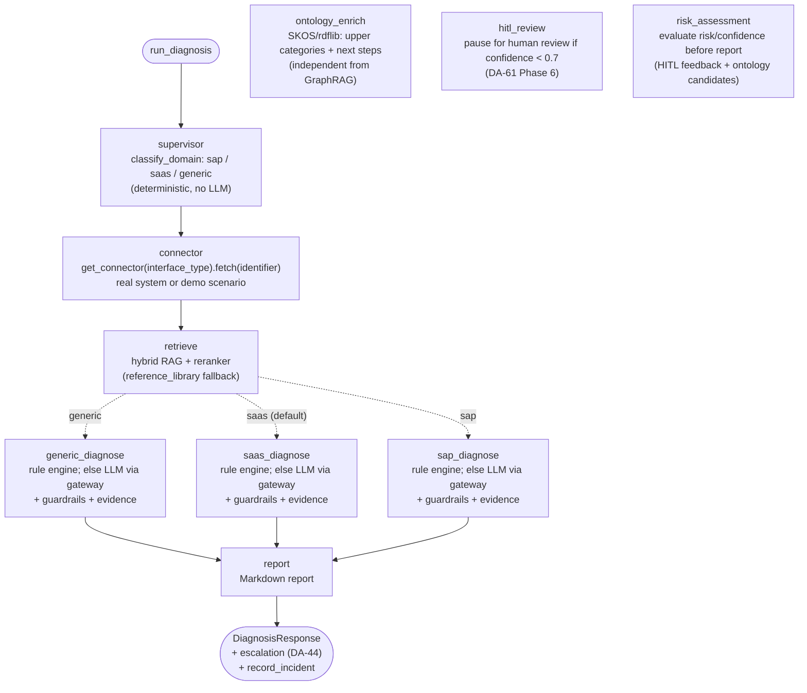

# Integration Incident Copilot

**An AI agent that diagnoses enterprise integration incidents — SAP and beyond — and shows the evidence behind every answer.**

[](https://github.com/marcos-slima/integration-incident-copilot/actions/workflows/tests.yml)
[](https://github.com/marcos-slima/integration-incident-copilot/actions/workflows/quality.yml)
[](pyproject.toml)
[](LICENSE)

English · [Português (Brasil)](README.pt-BR.md)

An IDoc stuck in status 51, an OAuth token that expired in a CPI iFlow, a
ServiceNow ticket about a failed Salesforce sync: the Copilot reads the
incident, fetches the facts from the source system, searches the knowledge
base and returns the **probable root cause, concrete next steps and the
sources it relied on**, each tagged with how far it can be trusted.

<p align="center">
  
</p>

<p align="center"><sub>Real run of the quickstart below: the rule engine answers a known error with no LLM call. The UI is in Portuguese.</sub></p>

## Why it exists

Getting AI into SAP support usually runs through SAP AI Core and BTP, which
leaves out teams still on ECC on-premise or without a BTP budget. This project
shows that a production-minded diagnostic agent can run **locally (Ollama)**
or on a provider the customer already has, without giving up governance:
deterministic decisions where they are possible, explicit evidence where an
LLM is involved, and a hard policy on where confidential data may go. The
cost comparison is in [`docs/TCO_SAP_AI_CORE_VS_SELF_HOSTED.md`](docs/TCO_SAP_AI_CORE_VS_SELF_HOSTED.md).

## What makes it different

| | What it means in practice |
|---|---|
| **Deterministic first** | 22 curated rules answer known errors (IDoc 51, expired OAuth, RFC connection refused…) before any LLM call: instant, free, auditable. Such answers carry no prompt version, because no prompt produced them. |
| **Evidence, not self-assessment** | Every answer lists its sources with a trust level (`system_observed`, `retrieved_document`, `simulated`, `user_reported`). Confidence is capped by the evidence, and a source the LLM cites but was never retrieved is discarded. |
| **Data sovereignty by real origin** | Free text is treated as confidential by default. Confidential data only reaches a local model or a cloud origin you explicitly allowlist; the decision is made on the provider's real URL, not its label. `GET /llm/policy` shows the effective policy. |
| **Multi-agent, deterministic routing** | A supervisor routes each incident to an SAP, SaaS or generic specialist with plain code, not with an LLM. |
| **Built for other agents** | REST, **MCP** (Streamable HTTP), **A2A 0.3** (JSON-RPC 2.0) and **CloudEvents 1.0** (webhook and AMQP 1.0 for SAP Event Mesh / Solace) all run the same pipeline. |
| **Contract drift detection** | Watches OData `$metadata`, classifies changes as breaking or additive, and opens an incident before a consumer breaks in production. |
| **Measured and gated** | Retrieval quality runs in CI against a bundled evaluation set; 20 quality gates check the claims the documentation makes, and the architecture diagrams are generated from the code or tested against it. |

## Architecture

The orchestration graph below is **generated from `app/agent/graph.py`** and a
test fails if it drifts. The C4 views, the state contract, trust boundaries,
the AI Gateway decision tree, the state machines and the deployment view are
in [`docs/ARCHITECTURE.md`](docs/ARCHITECTURE.md#mapa-dos-diagramas).

<!-- grafo-gerado:inicio (scripts/graph_diagram.py --write; nao editar a mao) -->

**Default: GRAPH_RAG_ENABLED=false**


```mermaid
flowchart TD
    inicio(["run_diagnosis"])
    supervisor["supervisor<br/>classify_domain: sap / saas / generic<br/>(deterministic, no LLM)"]
    connector["connector<br/>get_connector(interface_type).fetch(identifier)<br/>real system or demo scenario"]
    retrieve["retrieve<br/>hybrid RAG + reranker<br/>(reference_library fallback)"]
    sap_diagnose["sap_diagnose<br/>rule engine; else LLM via gateway<br/>+ guardrails + evidence"]
    saas_diagnose["saas_diagnose<br/>rule engine; else LLM via gateway<br/>+ guardrails + evidence"]
    generic_diagnose["generic_diagnose<br/>rule engine; else LLM via gateway<br/>+ guardrails + evidence"]
    report["report<br/>Markdown report"]
    ontology_enrich["ontology_enrich<br/>SKOS/rdflib: upper categories + next steps<br/>(independent from GraphRAG)"]
    hitl_review["hitl_review<br/>pause for human review if confidence < 0.7<br/>(DA-61 Phase 6)"]
    risk_assessment["risk_assessment<br/>evaluate risk/confidence before report<br/>(HITL feedback + ontology candidates)"]
    fim(["DiagnosisResponse<br/>+ escalation (DA-44)<br/>+ record_incident"])
    inicio --> supervisor
    connector --> retrieve
    generic_diagnose --> report
    report --> fim
    retrieve -.->|"generic"| generic_diagnose
    retrieve -.->|"saas (default)"| saas_diagnose
    retrieve -.->|"sap"| sap_diagnose
    saas_diagnose --> report
    sap_diagnose --> report
    supervisor --> connector
```

<!-- grafo-gerado:fim -->

## Quickstart

Requirements: Python 3.12, [uv](https://docs.astral.sh/uv/) and Docker. No
LLM is needed for this first run.

```bash
git clone https://github.com/marcos-slima/integration-incident-copilot.git
cd integration-incident-copilot
uv sync

# Local configuration. The compose file requires the three passwords even for
# services you do not start; API_KEY is fixed so the curl below can use it.
cp .env.example .env
echo "EMBEDDING_BACKEND=fastembed" >> .env   # in-process embeddings, no Ollama
for v in API_KEY POSTGRES_PASSWORD GRAFANA_PASSWORD NEO4J_PASSWORD; do
  echo "$v=$(python3 -c 'import secrets; print(secrets.token_urlsafe(24))')" >> .env
done

# Vector store and knowledge base (15 sample incident playbooks)
docker compose up -d qdrant
uv run python -m app.rag.ingest --target incidents

# API
uv run uvicorn app.main:app
```

In a second terminal, diagnose an IDoc stuck in status 51 using the RFC
connector's demo scenario:

```bash
API_KEY=$(grep '^API_KEY=' .env | cut -d= -f2)
curl -s -X POST http://127.0.0.1:8000/diagnose \
  -H "X-API-Key: $API_KEY" -H "Content-Type: application/json" \
  -d '{"description": "IDoc stuck in status 51", "interface_type": "rfc", "identifier": "RFC-IDOC-51-DEMO"}'
```

Abridged response:

```json
{
  "agent_domain": "sap",
  "matched_source": "rule_engine:sap_idoc_status_51",
  "llm_provider_used": "rule_engine",
  "model_confidence": 0.9,
  "evidence": [
    {"source_type": "rule_engine", "trust_level": "system_observed"},
    {"source_type": "connector", "trust_level": "simulated"},
    {"source_type": "rag", "trust_level": "retrieved_document"},
    {"source_type": "user", "trust_level": "user_reported"}
  ],
  "escalation": {"escalation": "grounded", "should_escalate": false}
}
```

**Next steps**

- **Interactive API docs:** <http://127.0.0.1:8000/docs>.
- **Free-text incidents** (anything the rules do not cover) need an LLM:
  - local: `ollama pull qwen3-coder-next` and keep `LLM_PROVIDER=ollama`;
  - cloud: set `LLM_PROVIDER=openai` or `azure_openai` with its credentials,
    and allow the origin as described in section 6 of the
    [troubleshooting guide](docs/TROUBLESHOOTING.md).
- **Web UI:**
  - build it with `cd frontend && npm ci && npm run build` and open <http://127.0.0.1:8000>;
  - create a login with
    `uv run python -c "from app.auth import hash_password; print(hash_password('your-password'))"`
    and add `WEB_UI_USERS=<user>:<hash>` to `.env`;
  - restart `uvicorn` so it picks up the build and the new user.
- **Full stack in containers** (API, Qdrant, Postgres, Grafana; Neo4j optional):
  [`scripts/start-docker.sh`](scripts/start-docker.sh) and the
  [getting started guide](docs/GETTING_STARTED.md).
- **After `docker compose down -v`**, re-index with `--reset`: the ingestion
  state lives on disk, not in Qdrant.

## Ways to use it

| Surface | Entry point | Authentication |
|---|---|---|
| REST | `POST /diagnose`, `POST /diagnose/async` | `X-API-Key` or the UI session |
| Web UI | `/` (React + Vite) | user and password, HttpOnly session cookie |
| CLI | `uv run python -m app.agent.graph --interface rfc --id RFC-IDOC-51-DEMO "IDoc stuck in status 51"` | none (local) |
| MCP | `/mcp`, tools `diagnose_incident` and `list_connectors` | `X-API-Key` |
| A2A 0.3 | `POST /a2a`, card at `/.well-known/agent-card.json` | `X-A2A-Api-Key` |
| Events | `POST /events/incident` (CloudEvents 1.0) or an AMQP 1.0 queue | `X-Event-Mesh-Api-Key` |
| Human feedback | `POST /incidents/{id}/verify` (feeds GraphRAG) | `X-API-Key` |

## Connectors

All ten share one contract, `fetch(identifier) → ConnectorResult`. Each runs
against the real system when its variable is set and falls back to demo
scenarios otherwise. **Implemented is not validated:** the last column says
which ones have been exercised against a real instance.

| Connector | System | Validated against a real instance |
|---|---|---|
| `rfc` | SAP ECC / S/4HANA via pyrfc | logon yes (ABAP trial); IDoc read no |
| `servicenow` | ServiceNow ITSM | yes |
| `salesforce` | Salesforce | yes |
| `cap` | SAP CAP (OData v4, XSUAA) | yes (BTP trial) |
| `odata` | SAP CPI / Integration Suite | no |
| `successfactors` | SAP SuccessFactors Employee Central | no |
| `workday` | Workday | no |
| `ariba` | SAP Ariba / Business Network | no |
| `po` | SAP PO/PI (on-premise, behind a façade) | no (non-public API) |
| `apim` | SAP API Management analytics | no (speculative schema) |

Variables, demo identifiers and how to add a connector:
[`docs/CONNECTORS.md`](docs/CONNECTORS.md).

## Quality and evaluation

| What | Result | Where |
|---|---|---|
| Retrieval on the bundled evaluation set (18 in-scope queries, 10 out of scope) | Hit@1 94.4 %, Hit@3 100 %, MRR 0.972; 9 of 10 out-of-scope queries rejected | CI job `rag-quality` |
| Quality gates | 20 deterministic checks: dataset, reranker invariant, prompt digest vs. the measured prompt, documentation links, symbols and environment variables, connector reachability | CI job `deterministic` |
| Database | migrations applied and checked; the 45 dashboard queries and the contract-drift end-to-end tests run against a real PostgreSQL | CI job `migrations_and_dashboards` |
| Use cases | nine scenarios with the numbers measured by tests | [`docs/CASOS_DE_USO.md`](docs/CASOS_DE_USO.md) |

The evaluation set is small, and the chosen reranker's advantage over the
baseline (ms-marco-L6) is one query out of 18, which is not statistically
significant; see [`docs/RERANKER_BENCHMARK.md`](docs/RERANKER_BENCHMARK.md).
What the gates **do not** cover is listed in
[`docs/QUALITY_GATES.md`](docs/QUALITY_GATES.md).

## Project status

The project is under active development. In 2026-10 a full audit was
followed by verified fixes, and these limits remain open:

- **Kyma:** the manifests in `deploy/kyma/` have never been applied to a real cluster.
- **Connectors:** six of the ten have not been validated against a real instance (table above).
- **Vector store outage:** with Qdrant down, `/diagnose` returns 500 even when a rule would have answered.
- **Prompt-injection gap:** web-search results returned to the ReAct agent are not yet sanitized.

Each of these is documented in [`docs/ARCHITECTURE.md`](docs/ARCHITECTURE.md).

## Documentation

| If you want to… | Read |
|---|---|
| Run it for the first time | [Getting started](docs/GETTING_STARTED.md) → [User guide](docs/USER_GUIDE.md) |
| See how it works, with diagrams | [Architecture](docs/ARCHITECTURE.md) |
| Understand *why* it was built this way | [Architecture decisions](docs/DECISOES_DE_ARQUITETURA.md) (50 recorded decisions) |
| Follow real scenarios end to end | [Use cases](docs/CASOS_DE_USO.md) |
| Configure a connector | [Connectors](docs/CONNECTORS.md) |
| Fix something | [Troubleshooting](docs/TROUBLESHOOTING.md) |
| Index of everything | [docs/README.md](docs/README.md) |

The documentation beyond this page is in Portuguese.

## Tech stack

FastAPI · LangGraph · LangChain · Qdrant (hybrid dense + BM25, cross-encoder
reranker) · Neo4j (optional GraphRAG) · Ollama / OpenAI / Azure OpenAI ·
PostgreSQL + Alembic · Redis + RQ · React + Vite · Langfuse · Grafana ·
python-qpid-proton (AMQP 1.0) · Docker Compose · SAP BTP Kyma.

## Author

**Marcos Silva Lima**: SAP architect, 18+ years in SAP integration
(Integration Suite, ABAP, CAP, BTP), working on AI architecture for
enterprise landscapes.

## License

[MIT](LICENSE)
