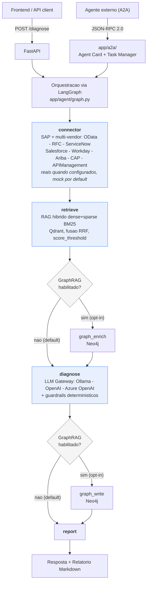

# Integration Incident Copilot

[](https://github.com/marcos-lima/integration-incident-copilot/actions/workflows/tests.yml)
[](LICENSE)

> 📋 Veja o [processo de desenvolvimento](docs/PROCESSO_DESENVOLVIMENTO.md) seguido neste projeto, fase por fase.
>
> 📚 Índice de toda a documentação: **[docs/README.md](docs/README.md)** — por onde começar, o que é referência atual e o que é registro histórico.

Assistente de IA para diagnóstico de incidentes de integrações.
Recebe a descrição de um incidente, lê logs/payloads, consulta um
catálogo de APIs/documentos via RAG, identifica o provável ponto de
falha, sugere causa raiz e próximos passos, e gera um relatório em
Markdown.

**Por que este projeto existe:** o SAP AI Core exige HANA Cloud como
camada obrigatória (dezenas de milhares de euros/ano, independente do
consumo de IA), o que exclui estruturalmente quem ainda está em ECC
on-premise ou não tem orçamento/infra para BTP — cerca de 40-45% da
base de clientes SAP ECC no mundo, segundo Gartner/IDC. Este projeto é
a prova técnica de que dá para levar IA de diagnóstico real (RAG +
agente + conectores) para esse público, rodando local ou sobre um
provedor que o cliente já tenha — ver
[TCO_SAP_AI_CORE_VS_SELF_HOSTED.md](docs/TCO_SAP_AI_CORE_VS_SELF_HOSTED.md).
E não fica restrito a SAP: o mesmo contrato de conector (`app/connectors/`)
já cobre cinco sistemas de referência não-SAP/multi-vendor de verdade
(ServiceNow, Salesforce, Workday, SAP Ariba), não só mock — ver seção
"Conectores" em [docs/ARCHITECTURE.md](docs/ARCHITECTURE.md).

## Arquitetura


```mermaid
flowchart TD
    A["Frontend / API client"] -->|"POST /diagnose"| C["FastAPI"]
    B["Agente externo (A2A)"] -->|"JSON-RPC 2.0"| D["app/a2a/<br/>Agent Card + Task Manager"]
    C --> E["Orquestracao via LangGraph<br/>app/agent/graph.py"]
    D --> E
    E --> F["<b>connector</b><br/>SAP + multi-vendor: OData - RFC - ServiceNow<br/>Salesforce - Workday - Ariba - CAP - APIManagement<br/><i>reais quando configurados, mock por default</i>"]
    F --> G["<b>retrieve</b><br/>RAG hibrido dense+sparse BM25<br/>Qdrant, fusao RRF, score_threshold"]
    G --> H{"GraphRAG<br/>habilitado?"}
    H -->|"sim (opt-in)"| I["graph_enrich<br/>Neo4j"]
    H -->|"nao (default)"| J["<b>diagnose</b><br/>LLM Gateway: Ollama - OpenAI - Azure OpenAI<br/>+ guardrails deterministicos"]
    I --> J
    J --> K{"GraphRAG<br/>habilitado?"}
    K -->|"sim (opt-in)"| L["graph_write<br/>Neo4j"]
    K -->|"nao (default)"| M["<b>report</b>"]
    L --> M
    M --> N["Resposta + Relatorio Markdown"]

    style H fill:#f5f5f5,stroke:#999
    style K fill:#f5f5f5,stroke:#999
    style F fill:#e8f0fe,stroke:#4285f4
    style G fill:#e8f0fe,stroke:#4285f4
    style J fill:#e8f0fe,stroke:#4285f4
```

Ver [docs/ARCHITECTURE.md](docs/ARCHITECTURE.md) para o detalhamento
por camada (API / A2A / orquestração / LLM Gateway / RAG+GraphRAG /
conectores).

## Stack

- **API**: FastAPI + Pydantic
- **A2A**: Agent Card + servidor JSON-RPC 2.0 (`app/a2a/`), em paralelo
  ao REST, mesma orquestração por trás — ver
  [proposta original](docs/proposals/a2a-interoperability-layer.md)
- **Orquestração**: LangGraph
- **LLM Gateway**: plugável — Ollama (default, local-first), OpenAI ou
  Azure OpenAI (`app/llm/factory.py`), sem trocar código do grafo
- **RAG**: LangChain + Qdrant (vector store) + GraphRAG opt-in via Neo4j
  (`app/rag/graph_store.py`, desligado por default)
- **Observabilidade**: Langfuse (opcional; tracing de todo o fluxo do
  agente quando configurado)
- **Conectores**: OData / RFC / ServiceNow / Salesforce / Workday / SAP
  Ariba / SAP CAP / SAP API Management (schema especulativo, ver
  ARCHITECTURE.md) — reais (chamada HTTP/OAuth2 de verdade) quando
  configurados, caem em mock só sem credencial/endpoint informado

## Desenvolvimento local

Opção 1 — self-contained, sem depender de infraestrutura pessoal
(recomendado para rodar/demonstrar este repositório isoladamente):

```bash
docker compose up -d      # sobe Ollama + Qdrant + a API
docker compose exec ollama ollama pull qwen3-coder-next:latest
docker compose exec ollama ollama pull nomic-embed-text
```

Opção 2 — ambiente de desenvolvimento local (fora de container):

```bash
uv sync
uv run uvicorn app.main:app --reload
```

Pré-requisitos da Opção 2: Qdrant e Ollama acessíveis (localmente ou
via `~/ai-stack`, que também traz Neo4j reservado para uso futuro e o
stack completo do Langfuse — ver nota em
[docs/ARCHITECTURE.md](docs/ARCHITECTURE.md)).

## Status

Projeto em desenvolvimento — portfólio da trilha SAP Architect → AI
Architect.


## Decisões de Arquitetura

Registro dos problemas reais encontrados durante o desenvolvimento e
como foram resolvidos — processo de engenharia, não só o resultado
final.

| DA | Seção | O que é |
|---|---|---|
| 1 | [1](#decisoes-de-arquitetura) | RAG top-1 (evita mistura de contexto) |
| 2 | [2](#decisoes-de-arquitetura) | `seed=42` obrigatório para determinismo Ollama |
| 3 | [3](#decisoes-de-arquitetura) | Guardrails em código, não em prompt |
| 4 | [4](#decisoes-de-arquitetura) | Comparações de modelo via promptfoo: `qwen2.5-coder:32b` ganhou do |
| 8 | [8](#decisoes-de-arquitetura) | Comparações de modelo via promptfoo: `qwen2.5-coder:32b` ganhou do |
| 14 | [14](#decisoes-de-arquitetura) | Camada A2A (Agent2Agent) JSON-RPC 2.0 |
| 15 | — | Evidence/Trust Layer determinística |
| 16 | — | `is_grounded` via evidence_strength (nunca autoavaliação LLM) |
| 17 | — | Fallback para reference_library quando evidência fraca |
| 18 | [16](#decisoes-de-arquitetura) | Auth X-API-Key obrigatória em `/diagnose` e `/a2a` |
| 19 | [17](#decisoes-de-arquitetura) | Servidor MCP (capability catalog) |
| 20 | [18](#decisoes-de-arquitetura) | Hybrid Inference: Ollama local → cloud fallback |
| 21 | [19](#decisoes-de-arquitetura) | GraphRAG hardening: `(DriverError, TransientError)` vs `Neo4jError |
| 22 | [20](#decisoes-de-arquitetura) | Multi-agent: supervisor → sap/saas/generic (sem LLM) |
| 23 | [21](#decisoes-de-arquitetura) | Event Mesh via webhook CloudEvents → `run_diagnosis()` |
| 24 | [22](#decisoes-de-arquitetura) | Deploy SAP BTP Kyma Runtime |
| 25 | [24](#decisoes-de-arquitetura) | Evidence/Trust Layer v2 + threshold RAG pós-reranker |
| 26 | [25](#decisoes-de-arquitetura) | AI Gateway v1: policy + circuit breaker + budget |
| 27 | [26](#decisoes-de-arquitetura) | Capability Registry FAIL-CLOSED |
| 28 | [27](#decisoes-de-arquitetura) | GraphRAG modelo `VERIFIED_AS` + endpoint `/incidents/{id}/verify` |
| 29 | [28](#decisoes-de-arquitetura) | Benchmark rerankers → mmarco-mMiniLMv2 vence (+7pp Hit@1) |
| 30 | — | PII redaction ampliado + smart log truncation + backoff exponencia |
| 33 | ARCHITECTURE | Rule Engine determinístico (pré-filtro LLM, 14 regras SAP) |
| 43 | [29](#decisoes-de-arquitetura) | Soberania de dados por origin real, fail-closed |
| 44 | [30](#decisoes-de-arquitetura) | Sinal determinístico de escalonamento em 3 tiers (prep. tier 3) |
| 45 | [31](#decisoes-de-arquitetura) | Universalidade de provider: rota auditada + capacidades por origin |
| 46 | — | Registro gerenciado de modelos/credenciais por ORIGEM (LLM_REGISTR |
| 47 | — | Credenciais cifradas em repouso com Fernet (master key no .env, nu |
| 48 | — | Metering de tokens REAIS (usage_metadata, não estimativa) persisti |
| 49 | [33](#decisoes-de-arquitetura) | Catálogo de sistemas integrados (`integration_systems`) na superfí |
| 50 | [34](#decisoes-de-arquitetura) | Correlação `incidents` ↔ catálogo por `system_key` (exato, vindo d |
| 51 | [35](#decisoes-de-arquitetura) | Quality gates: invariantes de avaliação verificadas por máquina (d |
| 52 | [36](#decisoes-de-arquitetura) | Detecção de drift de contrato SAP: probe `$metadata` (interface se |
| 53 | [37](#decisoes-de-arquitetura) | Prompt de diagnóstico como artefato versionado: `PromptSpec` (vers |

| DA | Seção | O que é |
|---|---|---|
| 1 | [1](#decisoes-de-arquitetura) | RAG top-1 (evita mistura de contexto) |
| 2 | [2](#decisoes-de-arquitetura) | `seed=42` obrigatório para determinismo Ollama |
| 3 | [3](#decisoes-de-arquitetura) | Guardrails em código, não em prompt |
| 4 | [4](#decisoes-de-arquitetura) | Comparações de modelo via promptfoo: `qwen2.5-coder:32b` ganhou do |
| 8 | [8](#decisoes-de-arquitetura) | Comparações de modelo via promptfoo: `qwen2.5-coder:32b` ganhou do |
| 14 | [14](#decisoes-de-arquitetura) | Camada A2A (Agent2Agent) JSON-RPC 2.0 |
| 15 | [15](#decisoes-de-arquitetura) | Evidence/Trust Layer determinística |
| 16 | [15](#decisoes-de-arquitetura) | `is_grounded` via evidence_strength (nunca autoavaliação LLM) |
| 17 | [15](#decisoes-de-arquitetura) | Fallback para reference_library quando evidência fraca |
| 18 | [16](#decisoes-de-arquitetura) | Auth X-API-Key obrigatória em `/diagnose` e `/a2a` |
| 19 | [17](#decisoes-de-arquitetura) | Servidor MCP (capability catalog) |
| 20 | [18](#decisoes-de-arquitetura) | Hybrid Inference: Ollama local → cloud fallback |
| 21 | [19](#decisoes-de-arquitetura) | GraphRAG hardening: `(DriverError, TransientError)` vs `Neo4jError |
| 22 | [20](#decisoes-de-arquitetura) | Multi-agent: supervisor → sap/saas/generic (sem LLM) |
| 23 | [21](#decisoes-de-arquitetura) | Event Mesh via webhook CloudEvents → `run_diagnosis()` |
| 24 | [22](#decisoes-de-arquitetura) | Deploy SAP BTP Kyma Runtime |
| 25 | [24](#decisoes-de-arquitetura) | Evidence/Trust Layer v2 + threshold RAG pós-reranker |
| 26 | [25](#decisoes-de-arquitetura) | AI Gateway v1: policy + circuit breaker + budget |
| 27 | [26](#decisoes-de-arquitetura) | Capability Registry FAIL-CLOSED |
| 28 | [27](#decisoes-de-arquitetura) | GraphRAG modelo `VERIFIED_AS` + endpoint `/incidents/{id}/verify` |
| 29 | [28](#decisoes-de-arquitetura) | Benchmark rerankers → mmarco-mMiniLMv2 vence (+7pp Hit@1) |
| 30 | **—** | PII redaction ampliado + smart log truncation + backoff exponencia |
| 33 | ARCHITECTURE | Rule Engine determinístico (pré-filtro LLM, 14 regras SAP) |
| 43 | [29](#decisoes-de-arquitetura) | Soberania de dados por origin real, fail-closed |
| 44 | [30](#decisoes-de-arquitetura) | Sinal determinístico de escalonamento em 3 tiers (prep. tier 3) |
| 45 | [31](#decisoes-de-arquitetura) | Universalidade de provider: rota auditada + capacidades por origin |
| 46 | [32](#decisoes-de-arquitetura) | Registro gerenciado de modelos/credenciais por ORIGEM (LLM_REGISTR |
| 47 | [32](#decisoes-de-arquitetura) | Credenciais cifradas em repouso com Fernet (master key no .env, nu |
| 48 | [32](#decisoes-de-arquitetura) | Metering de tokens REAIS (usage_metadata, não estimativa) persisti |
| 49 | [33](#decisoes-de-arquitetura) | Catálogo de sistemas integrados (`integration_systems`) na superfí |
| 50 | [34](#decisoes-de-arquitetura) | Correlação `incidents` ↔ catálogo por `system_key` (exato, vindo d |
| 51 | [35](#decisoes-de-arquitetura) | Quality gates: invariantes de avaliação verificadas por máquina (d |
| 52 | [36](#decisoes-de-arquitetura) | Detecção de drift de contrato SAP: probe `$metadata` (interface se |
| 53 | [37](#decisoes-de-arquitetura) | Prompt de diagnóstico como artefato versionado: `PromptSpec` (vers |

> **Índice das decisões.** Derivado dos headings desta página e conferido por
> `implemented_das_documented` (`scripts/quality_gate.py`): DA registrada no
> `CLAUDE.md` sem seção própria reprova o build. `—` = registrada e ainda sem
> prosa. `nota informal` = decisão real que nunca recebeu DA. DAs agrupadas
> numa seção (ex.: DA-15/16/17, DA-46/47/48) compartilham o número dela.

| DA | Seção | O que é |
|---|---|---|
| 1 | [1](#decisoes-de-arquitetura) | RAG top-1 (evita mistura de contexto) |
| 2 | [2](#decisoes-de-arquitetura) | `seed=42` obrigatório para determinismo Ollama |
| 3 | [3](#decisoes-de-arquitetura) | Guardrails em código, não em prompt |
| 4 | [4](#decisoes-de-arquitetura) | Comparações de modelo via promptfoo: `qwen2.5-coder:32b` ganhou do |
| 8 | [8](#decisoes-de-arquitetura) | Comparações de modelo via promptfoo: `qwen2.5-coder:32b` ganhou do |
| 14 | [14](#decisoes-de-arquitetura) | Camada A2A (Agent2Agent) JSON-RPC 2.0 |
| 15 | [15](#decisoes-de-arquitetura) | Evidence/Trust Layer determinística |
| 16 | [15](#decisoes-de-arquitetura) | `is_grounded` via evidence_strength (nunca autoavaliação LLM) |
| 17 | [15](#decisoes-de-arquitetura) | Fallback para reference_library quando evidência fraca |
| 18 | [16](#decisoes-de-arquitetura) | Auth X-API-Key obrigatória em `/diagnose` e `/a2a` |
| 19 | [17](#decisoes-de-arquitetura) | Servidor MCP (capability catalog) |
| 20 | [18](#decisoes-de-arquitetura) | Hybrid Inference: Ollama local → cloud fallback |
| 21 | [19](#decisoes-de-arquitetura) | GraphRAG hardening: `(DriverError, TransientError)` vs `Neo4jError |
| 22 | [20](#decisoes-de-arquitetura) | Multi-agent: supervisor → sap/saas/generic (sem LLM) |
| 23 | [21](#decisoes-de-arquitetura) | Event Mesh via webhook CloudEvents → `run_diagnosis()` |
| 24 | [22](#decisoes-de-arquitetura) | Deploy SAP BTP Kyma Runtime |
| 25 | [24](#decisoes-de-arquitetura) | Evidence/Trust Layer v2 + threshold RAG pós-reranker |
| 26 | [25](#decisoes-de-arquitetura) | AI Gateway v1: policy + circuit breaker + budget |
| 27 | [26](#decisoes-de-arquitetura) | Capability Registry FAIL-CLOSED |
| 28 | [27](#decisoes-de-arquitetura) | GraphRAG modelo `VERIFIED_AS` + endpoint `/incidents/{id}/verify` |
| 29 | [28](#decisoes-de-arquitetura) | Benchmark rerankers → mmarco-mMiniLMv2 vence (+7pp Hit@1) |
| 30 | [29](#decisoes-de-arquitetura) | PII redaction ampliado + smart log truncation + backoff exponencia |
| 33 | ARCHITECTURE | Rule Engine determinístico (pré-filtro LLM, 14 regras SAP) |
| 43 | [30](#decisoes-de-arquitetura) | Soberania de dados por origin real, fail-closed |
| 44 | [31](#decisoes-de-arquitetura) | Sinal determinístico de escalonamento em 3 tiers (prep. tier 3) |
| 45 | [32](#decisoes-de-arquitetura) | Universalidade de provider: rota auditada + capacidades por origin |
| 46 | [33](#decisoes-de-arquitetura) | Registro gerenciado de modelos/credenciais por ORIGEM (LLM_REGISTR |
| 47 | [33](#decisoes-de-arquitetura) | Credenciais cifradas em repouso com Fernet (master key no .env, nu |
| 48 | [33](#decisoes-de-arquitetura) | Metering de tokens REAIS (usage_metadata, não estimativa) persisti |
| 49 | [34](#decisoes-de-arquitetura) | Catálogo de sistemas integrados (`integration_systems`) na superfí |
| 50 | [35](#decisoes-de-arquitetura) | Correlação `incidents` ↔ catálogo por `system_key` (exato, vindo d |
| 51 | [36](#decisoes-de-arquitetura) | Quality gates: invariantes de avaliação verificadas por máquina (d |
| 52 | [37](#decisoes-de-arquitetura) | Detecção de drift de contrato SAP: probe `$metadata` (interface se |
| 53 | [38](#decisoes-de-arquitetura) | Prompt de diagnóstico como artefato versionado: `PromptSpec` (vers |

### 1. Alucinação por mistura de contexto (DA-1)

**Problema:** ao passar os 3 documentos mais relevantes (RAG top-3)
inteiros no prompt, o LLM ocasionalmente combinava causa raiz de
documentos diferentes (ex: misturava conceitos de IDoc e OData numa
única resposta), mesmo com instrução explícita para não fazer isso.

**Solução:** restringir o contexto passado ao LLM a apenas o
**documento mais relevante** (texto completo), citando os demais só
pelo nome, sem conteúdo. Eliminou a possibilidade de mistura na raiz,
por design, em vez de depender de instrução de prompt.

### 2. Não-determinismo com temperature=0 (DA-2)

**Problema:** o mesmo prompt, rodado duas vezes com `temperature=0.0`
no Ollama, produzia respostas diferentes — incluindo uma alucinação
completa numa das execuções. `temperature=0` não garante determinismo
total sem um `seed` explícito.

**Solução:** fixar `seed=42` na chamada ao `ChatOllama`. Validado com
5 execuções idênticas seguidas do mesmo cenário antes considerado
instável.

### 3. Guardrail determinístico para dados de fallback (DA-3)

**Problema:** quando um conector SAP não reconhece um identificador
(cenário simulado/mock não mapeado), o LLM às vezes ainda tentava
vincular a um documento específico da base de conhecimento com
confiança moderada-alta, mesmo orientado por prompt a não fazer isso.

**Solução:** não depender só da autoavaliação do LLM para essa
propriedade de segurança. O código verifica deterministicamente se o
conector retornou um dado de fallback (`ConnectorResult.is_fallback`)
e, nesse caso, **impõe um teto de confiança (0.4)** independente do
que o modelo reportar.

### 4. Comparação formal de modelos (qwen3:30b-a3b vs qwen2.5-coder:32b) (DA-4)

**Contexto:** os problemas 1 e 3 acima ocorreram especificamente com
o `qwen3:30b-a3b` (MoE, ~3B parâmetros ativos). Antes de assumir que
o modelo era a causa raiz, foi feita uma comparação formal usando
[promptfoo](https://www.promptfoo.dev/), rodando o **pipeline
completo real** (conector + RAG + guardrails) contra os dois modelos,
não o LLM isolado.

**Resultado:** nos casos com correspondência clara, os dois modelos
tiveram desempenho equivalente. No caso crítico — identificador de
sistema desconhecido, sem correspondência real na base de
conhecimento — o `qwen2.5-coder:32b` reconheceu sozinho a ausência de
correspondência (`matched_source: null`), enquanto o `qwen3:30b-a3b`
tentou vincular um documento específico mesmo assim (só não virou
problema visível por causa do guardrail do item 3).

**Decisão:** `qwen2.5-coder:32b` (denso, 32B parâmetros) adotado como
modelo de produção do grafo. Validado com a suíte completa de testes
(16/16 `pytest`) após a troca. Trade-off aceito: tempo de inferência
maior (~2min49s vs ~1min20s nos 16 testes) em troca de comportamento
mais confiável sob incerteza.

> **Superada na Fase 12:** o modelo de produção foi trocado para
> `qwen3-coder-next:latest` após paridade técnica no promptfoo
> (10/10 PASS, `concurrency: 1`). A comparação acima segue válida como
> registro histórico do critério usado — `qwen2.5-coder:32b` não é mais
> o modelo em produção. Ver `docs/PROCESSO_DESENVOLVIMENTO.md` Fase 12.

### 5. Observabilidade real com Langfuse (nota informal — sem DA)

**Contexto:** o Langfuse estava configurado desde o início do
projeto, mas sem nenhum código realmente enviando dados para lá —
configuração presente, tracing ausente.

**Implementado:** cada node do grafo (`connector`, `retrieve`,
`diagnose`, `report`) é instrumentado com `@observe`, e a chamada ao
LLM usa o `CallbackHandler` do LangChain — capturando tempo de
execução, tokens e o payload completo de entrada/saída de cada etapa,
visível em `http://localhost:3000`.

**Bug encontrado e corrigido no processo:** o SDK não fazia `flush()`
automático antes do processo terminar, então traces ficavam no buffer
e nunca chegavam ao Langfuse. Corrigido chamando `get_client().flush()`
nos dois pontos onde o processo pode terminar: no lifespan de
shutdown do FastAPI (`app/main.py`) e ao final da execução via CLI
(`app/agent/graph.py`, bloco `if __name__ == "__main__"`) - não uma
fixture de teste (`pytest` sobe/derruba o app via `TestClient`, que
já passa pelo mesmo lifespan).

### 6. Configuração centralizada (eliminando hardcoded) (nota informal — sem DA)

**Problema encontrado:** apesar de existir um `.env` desde o início
do projeto, o código nunca o lia — URLs do Qdrant, modelo do LLM e
outras configurações estavam fixas como constantes Python, espalhadas
em múltiplos arquivos. Trocar de modelo exigia editar código-fonte
(`sed` direto no arquivo), não mudar uma variável de ambiente.

**Solução:** `app/config.py`, uma classe `Settings` (via
`pydantic-settings`) como única fonte de verdade, lida do `.env`. Um
comando (`uv run python -m app.config`) imprime a configuração
efetiva a qualquer momento, com segredos mascarados — permite
verificar o que está realmente configurado sem depender de leitura de
código-fonte.

### 7. Segurança e CI antes da publicação (nota informal — sem DA)

Antes de tornar o repositório público:

- **`gitleaks`**: varredura de **todo o histórico do git** (não só o
  estado atual) em busca de segredos vazados — confirmado limpo antes
  do primeiro push
- **`pre-commit`**: hooks automáticos (lint/format via `ruff`,
  detecção de segredo, bloqueio de arquivo grande >5MB) rodando em
  todo commit local, dali em diante
- **GitHub Actions**: workflow de CI rodando lint + testes unitários
  a cada push/PR — o badge de status no topo deste README reflete o
  resultado real da última execução, não uma alegação

### 8. Segunda comparação de modelo: qwen3.6:35b-a3b avaliado e rejeitado (DA-8)

**Contexto:** meses após a decisão pelo `qwen2.5-coder:32b` (seção 4),
a Alibaba lançou o `qwen3.6:35b-a3b` (MoE, 36B total/3B ativos,
sucessor da série que havia sido descartada na primeira comparação).
Repetiu-se o mesmo processo formal via `promptfoo`, contra o mesmo
pipeline real e os mesmos 10 casos de teste — incluindo o caso crítico
(`IDoc travado` / conector RFC) repetido 3 vezes para medir
estabilidade.

**Resultado:** em 7 dos 10 casos, desempenho equivalente ou
ligeiramente superior ao modelo atual (respostas mais detalhadas,
confiança bem calibrada no caso de segurança do identificador
desconhecido). Porém, no caso crítico repetido 3 vezes, o
`qwen3.6:35b-a3b` **falhou nas 3 execuções de forma idêntica**: o
modelo não devolveu um JSON estruturado válido
(`"Nao foi possivel estruturar a resposta do modelo"`,
`confidence: 0.0`), enquanto o `qwen2.5-coder:32b` acertou as 3 vezes
com 90% de confiança.

**Decisão:** manter `qwen2.5-coder:32b` em produção. Uma falha
determinística e reproduzível (3/3) no cenário mais crítico do
pipeline desqualifica o candidato, independente do desempenho médio
nos demais casos — confiabilidade sob o caso mais exigente pesa mais
que desempenho médio.

> **Superada na Fase 12:** o modelo de produção foi trocado para
> `qwen3-coder-next:latest` (paridade 10/10 no promptfoo), depois desta
> comparação. O critério desta seção — reprodutibilidade no caso crítico
> como requisito de desqualificação — segue valendo e foi reaplicado na
> Fase 12.

**Valor do processo, não só do resultado:** esta comparação também
prova que a decisão de modelo não é estática — é revisitada com
critério formal sempre que surge um candidato relevante, com a mesma
metodologia e o mesmo pipeline real usados desde a primeira vez,
gerando decisões comparáveis ao longo do tempo.

### 9. Achados de code review: estado global, parsing frágil, limites ausentes (nota informal — sem DA)

Uma revisão de código externa identificou 10 pontos; a triagem separou
o que era real do que era falso alarme ou já havia sido corrigido:

- **Falso alarme:** alegação de que `report_node`/`run_diagnosis`
  estariam ausentes do arquivo — não procede, ambos existem e
  funcionam (o revisor provavelmente viu um trecho cortado, não o
  arquivo completo)
- **Já corrigido antes da revisão:** singleton no retriever e
  `ensure_collection` fora do loop de batch (ver seções anteriores)
- **Confirmados e corrigidos nesta rodada:**
  - `LLM_MODEL` como global mutável de módulo → injetado via `state`/
    parâmetro em `run_diagnosis(..., llm_model=...)`, eliminando risco
    de corrida entre execuções concorrentes
  - Parsing de JSON manual e frágil → `llm.with_structured_output(DiagnosisModel, include_raw=True)`, com o parsing manual antigo mantido como *fallback*, não mais como único caminho
  - `confidence` sem validação de range → `Field(ge=0.0, le=1.0)` no
    schema Pydantic **+** clamp defensivo no código (a mesma filosofia
    de guardrail em camadas já usada para o fallback do conector,
    agora estendida)
  - `logs`/`payload` sem limite de tamanho → `max_length` no Pydantic
    (rejeita entrada absurda na API) e truncamento mais apertado na
    montagem do prompt (protege o contexto/custo do LLM)
  - Zero teste da camada HTTP → `tests/test_api.py` com `TestClient`
  - `Dockerfile` não copiava `data/`, então o fallback de documentos
    de exemplo quebraria em produção → corrigido, com nota explícita
    de que a biblioteca de 36GB nunca deve entrar na imagem e que
    `.env` deve ser injetado em runtime, não commitado na imagem
  - `@app.on_event` (deprecated, ainda funcional mas legado) →
    migrado para o padrão `lifespan` do FastAPI
- **Achado adicional durante a correção do item acima:** a primeira
  tentativa de restaurar a orientação sobre `matched_source` usou
  `Field(description=...)` no schema Pydantic, assumindo que o
  LangChain injetaria essa descrição como contexto textual pro LLM.
  **Isso não teve efeito nenhum** — confirmado porque as respostas do
  modelo saíram byte-a-byte idênticas antes e depois da mudança
  (esperado com `temperature=0`/`seed` fixo apenas se o prompt
  realmente enviado não mudou). Causa real: `with_structured_output`
  no Ollama usa o schema JSON para restringir **tipo/formato** da
  geração (decodificação restrita por gramática), não para injetar
  descrições como instrução legível pelo modelo. A correção que
  funcionou de fato foi devolver a instrução como **texto explícito
  no prompt**, confirmada visualmente via `--debug` antes de rodar a
  suíte completa de novo. Lição: ao adotar saída estruturada via
  schema, texto explícito no prompt continua necessário para lógica
  de preenchimento — o schema garante a forma, não o conteúdo.

### 10. LLM Gateway plugável (não hardcoded em Ollama) (nota informal — sem DA)

**Contexto:** o projeto nasceu 100% Ollama/local por decisão
deliberada (custo zero de API para prototipar). O posicionamento do
produto evoluiu para viabilizar IA em clientes que não conseguem
adotar o SAP AI Core — o que não significa que todo cliente rodará
100% local: alguns já têm OpenAI/Azure OpenAI contratado, ou querem
mais capacidade do que o hardware local aguenta para um caso
específico. `diagnose_node` instanciava `ChatOllama` diretamente,
então trocar de provedor exigiria editar o grafo.

**Decisão:** extrair a escolha do provedor para `app/llm/factory.py`
(`get_chat_model()`), selecionado via `Settings.llm_provider`
(ollama/openai/azure_openai). Deliberadamente **não** foi criada uma
interface própria (tipo um `LLMProvider.generate()` do zero) — o
factory devolve direto um `BaseChatModel` do LangChain, já que todo o
resto do grafo (`with_structured_output`, callbacks do Langfuse) já
depende do contrato do LangChain. Reaproveitar o polimorfismo que a
lib já oferece é menos código e menos superfície de bug do que
reimplementar o mesmo contrato — uma escolha de "reuso vs.
reinvenção", não só "adicionar abstração".

**Validação:** falha alto e claro (`ConfigurationError`), nunca
silenciosa, quando o provedor escolhido não tem a configuração
necessária (ex: `openai` sem `OPENAI_API_KEY`) — mesma filosofia dos
guardrails determinísticos das seções 1 e 3.

### 11. Conector real para sistema não-SAP (ServiceNow) e caminho RFC honesto (nota informal — sem DA)

**Contexto:** até aqui, os conectores (`ODataConnector`,
`RFCConnector`) eram mocks assumidos como tal — corretos para
prototipagem, mas insuficientes para provar a promessa de "integração
SAP + não-SAP" que o posicionamento atual do produto assume.

**Decisão:** `ServiceNowConnector` faz chamada HTTP real contra a
Table API do ServiceNow (`GET /api/now/table/incident`) quando
`SERVICENOW_INSTANCE_URL` está configurado, caindo em modo demo/mock
apenas na ausência dessa configuração — mesmo princípio dos conectores
SAP mock (funcionar sem depender de credencial de cliente real), não
uma limitação técnica. Testado via `httpx.MockTransport`, exercitando
o código HTTP de verdade (parâmetros de query, autenticação, parsing
de resposta, tratamento de erro de rede) sem precisar de uma instância
ServiceNow real.

Em paralelo, `RFCConnector` ganhou um modo `use_real=True` com
detecção de feature do `pyrfc` (SAP NetWeaver RFC SDK — binário da
SAP, fora do PyPI): sem o SDK instalado, pedir `use_real=True` falha
com `ConfigurationError` explicando exatamente o que falta, em vez de
cair silenciosamente no mock. RFC (não só OData) é o caminho mais
relevante para o público-alvo do projeto: clientes ainda em ECC
on-premise tipicamente só têm RFC/BAPI como via de automação.

**Por que isso importa para o posicionamento:** prova com código —
não só com docstring de intenção — que o "e outras plataformas" da
proposta de valor do projeto é real: existe pelo menos um sistema
não-SAP com integração de fato funcional, ao lado de um caminho SAP
(RFC) claramente desenhado para o cliente mais restrito (ECC
on-premise), que é justamente quem não consegue pagar SAP AI Core.

### 12. Fechando os conectores multi-vendor (Salesforce, Workday, SAP Ariba) e o caminho real do OData (nota informal — sem DA)

**Contexto:** a seção anterior fechou 1 dos 4 cenários de referência
multi-vendor do posicionamento do produto (ServiceNow), escolhido
primeiro por ter a API pública mais simples de implementar de verdade
— não por prioridade de negócio. Isso deixava uma dívida técnica
explícita: Salesforce, Workday e SAP Ariba continuavam mock puro, e o
`ODataConnector` não tinha nem o esqueleto `use_real` que o `RFCConnector`
já tinha ganhado.

**Decisão:** os três conectores restantes (`SalesforceConnector`,
`WorkdayConnector`, `AribaConnector`) foram implementados seguindo
**exatamente** o mesmo critério do `ServiceNowConnector` — OAuth2 (client
credentials em todos os três casos) contra o token endpoint documentado
de cada fornecedor, seguido da chamada REST real; ausência de
configuração cai em mock, presença ativa o caminho real, sem mudar
nenhum outro arquivo do projeto. `ODataConnector` ganhou o mesmo padrão
`use_real`/`ConfigurationError` que o `RFCConnector` já tinha, fechando
a assimetria entre os dois conectores SAP mock.

**Validação:** cada conector tem teste via `httpx.MockTransport`
simulando as duas chamadas (token OAuth2 + recurso), provando que o
código de produção (montagem do request, header `Authorization: Bearer`,
parsing da resposta, tratamento de erro HTTP/rede) funciona de verdade
— sem, para nenhum dos três, uma conta/sandbox real disponível para
validar contra produção (mesma ressalva já feita para
`RFCConnector._fetch_real` desde a Fase 8, agora consistente em todo o
projeto, não uma exceção isolada).

**O que isso NÃO é:** uma alegação de que os 4 cenários de referência
(SuccessFactors↔Workday, Salesforce↔SAP, SAP Ariba↔S/4HANA,
ServiceNow↔SAP) estão "prontos para produção" — estão prontos para
**demonstração técnica com credenciais reais em 10 minutos** (trocar
`.env`, sem tocar código), o que é uma barra bem mais alta que "mock
bonito", mas ainda abaixo de "testado contra um cliente real".

### 13. GraphRAG (Neo4j) deixa de ser só campo de configuração (nota informal — sem DA)

**Contexto:** desde a Fase 4, `Settings` tinha campos para Neo4j e a
documentação dizia explicitamente "reservado para uso futuro, nenhum
código usa isso hoje" — um campo de configuração sem nenhuma
implementação por trás, o tipo exato de coisa que este projeto
criticou no `genai-engineering-template` (documentação descrevendo
funcionalidade que o código não entrega).

**Decisão:** implementar o código real (`app/rag/graph_store.py`) —
grava cada diagnóstico no Neo4j como grafo relacional
(Incident/Interface/System/Document) e consulta esse grafo por
histórico de incidentes na mesma interface antes de gerar um novo
diagnóstico — mas manter **desligado por default**
(`GRAPH_RAG_ENABLED=false`). A decisão de negócio de não priorizar
GraphRAG não mudou (Qdrant resolve o caso de uso principal; grafo só
compensa com meses de histórico real acumulado); o que mudou é que
agora existe uma estrutura real e testada para ligar quando fizer
sentido, em vez de só um parágrafo de intenção.

**Validação:** `tests/test_graph_store.py` usa uma sessão Neo4j FAKE
(implementa só `.run()`, mesmo espírito do `httpx.MockTransport`) para
provar que as queries Cypher corretas são disparadas e os dados voltam
mapeados certo. Também validado que `build_graph()` produz o MESMO
grafo LangGraph de antes desta fase quando a flag está desligada
(nenhum node novo é adicionado) — mudança de comportamento zero no
caminho default.

**Honestidade mantida:** não testado contra um Neo4j real (sem Docker
daemon disponível no ambiente onde isso foi construído) — mesma
ressalva já aplicada ao `RFCConnector._fetch_real`.

### 14. Camada A2A (Agent2Agent) implementada, com a ressalva de GA preservada (DA-14)

**Contexto:** a proposta em
[docs/proposals/a2a-interoperability-layer.md](docs/proposals/a2a-interoperability-layer.md)
estava arquivada desde antes da Fase 8, com dois pré-requisitos
explícitos para sair do papel: conectores SAP fechados e suíte de
testes automatizada madura. As Fases 7/8 (e a seção 12 acima)
satisfazem os dois.

**Decisão:** implementar o subconjunto do protocolo A2A necessário
para o critério de aceite original — Agent Card (`GET
/.well-known/agent-card.json`), task manager e servidor JSON-RPC 2.0
(`POST /a2a`, métodos `message/send` e `tasks/get`) — em `app/a2a/`,
sem depender de nenhum SDK externo de A2A (a proposta original já
citava a imaturidade dessas SDKs como risco a validar antes de
começar). O task manager chama a MESMA função (`run_diagnosis`) que o
`/diagnose` REST — zero lógica de diagnóstico duplicada entre os dois
protocolos.

**Simplificação deliberada:** dos 8 estados de task do protocolo A2A,
só os 4 alcançáveis por um agente síncrono e autocontido como este
foram implementados (`submitted -> working -> completed|failed`).
Autenticação é uma chave estática opcional via header, não OAuth2/JWT
— documentado como gap de produção, não escondido.

**Validação:** `tests/test_a2a.py` prova o critério de aceite original
mecanicamente — o endpoint A2A produz o mesmo relatório que o
`/diagnose` para a mesma entrada (via injeção de dependência do
`diagnosis_fn` no `TaskManager`, sem precisar de um LLM real no ar para
o teste), e uma falha na orquestração vira task `failed` (erro de
negócio), não um HTTP 500 (erro de transporte) — a diferença que
importa para um agente externo saber se deve tentar de novo ou não.

**Ressalva que NÃO muda com esta implementação:** o suporte A2A do
Joule continua unidirecional (outbound) hoje — o Agent Gateway que
habilitaria o Joule a chamar este Copilot como par (inbound) está
pré-GA, previsto para Q4/2026. Este endpoint é compatível com o
protocolo aberto A2A (padrão vendor-neutral, Linux Foundation), não uma
integração já consumível pelo Joule.

### 15. Evidence/Trust Layer entre RAG/conectores e o LLM (DA-15/16/17)

**Contexto:** uma revisão arquitetural externa apontou três riscos
concretos, não hipotéticos, num agente que já correlaciona dado de
conector + RAG + web search antes de chamar o LLM: (1) dado não
sanitizado de conector/RAG chegando cru no prompt (superfície de
prompt injection); (2) `confidence` sendo só auto-relato do LLM, sem
nenhum piso objetivo; (3) GraphRAG podia gravar uma hipótese do LLM no
grafo e, num incidente futuro, ela voltar ao prompt como se fosse fato
histórico confirmado — um loop de retroalimentação epistêmica.

**Decisão:** refatoração controlada, preservando 100% do stack
existente (LangGraph + Qdrant + Ollama + Langfuse + conectores + A2A) —
não um rewrite. `sanitize_untrusted_input` (já existente) passou a
envolver TODO dado de conector/RAG antes de entrar no prompt, não só
parte dele. `evidence_strength` — sinal objetivo (dado real de conector
OU score de retrieval do documento top-1, nunca auto-relato do LLM) —
vira um TETO duro sobre `confidence` (`min(confidence, evidence_strength
+ 0.25)`), exposto na API (`DiagnosisResponse.evidence_strength`). No
Neo4j, todo incidente grava seu `evidence_strength`/`is_grounded`, e
`graph_context()` só traz para o prompt incidentes históricos
`is_grounded=true` por padrão — uma hipótese fraca vira `"HIPOTESE NAO
CONFIRMADA (baixa evidencia - nao trate como fato)"` em vez de
silenciosamente virar "causa raiz confirmada anteriormente".

**Bugs reais encontrados no caminho (não deixados como débito):** um
regex de detecção de prompt injection quebrado (`re.error: global flags
not at the start of the expression` — flags inline `(?i)` por padrão,
inválido quando concatenados via `"|".join()`) e dois bugs de
ranking em `app/rag/retriever.py` (score composto RRF+cosine vazando
para o campo que devia ser cosine puro; fallback para a biblioteca de
referência sendo aplicado sempre, não só na ausência de match) que
inflavam a confiança de diagnósticos com pouca ou nenhuma evidência
real — corrigidos de raiz, não contornados.

**Validação:** suíte completa (71 testes) verde, incluindo dois testes
novos que provam que uma hipótese não fundamentada é filtrada por
padrão do contexto de grafo e rotulada como tal quando explicitamente
incluída.

### 16. Autenticação de `/diagnose` e `/a2a` sempre exigida, com geração automática de chave (DA-18)

**Contexto:** `API_KEY`/`A2A_API_KEY` vazios no `.env` significavam
autenticação completamente desabilitada — um gap silencioso, só visível
lendo o código-fonte, não um comportamento documentado como tal.

**Decisão:** `app/main.py::_ensure_api_keys_configured()` roda no
`lifespan` do FastAPI e garante que nenhuma das duas chaves fica vazia
em memória — se o operador não configurou uma no `.env`, uma é gerada
(`secrets.token_urlsafe(32)`) e avisada em `WARNING` no log de startup.
Preserva "clone e rode" (zero config obrigatória) sem deixar os
endpoints abertos por padrão. Comparação de chave via
`secrets.compare_digest` (não `==`), para não vazar tamanho/prefixo por
timing attack.

**Validação:** `tests/test_api.py`/`tests/test_a2a.py` cobrem chave
correta/incorreta/ausente em ambos endpoints, geração automática quando
ausente, preservação quando já configurada, e o Agent Card refletindo o
`securityScheme` quando `A2A_API_KEY` está setada.

### 17. Servidor MCP (Model Context Protocol) - capability catalog read-first (DA-19)

**Contexto:** terceiro item do roadmap arquitetural planejado (depois
do Evidence Layer e do fechamento de autenticação do A2A) — MCP como
CONTRATO DE CAPABILITIES para agentes externos, não mais um protocolo
isolado de "conectar um LLM a uma ferramenta". A especificação MCP de
2026 caminha explicitamente para stateless scaling, cache de capability
catalog e autorização empresarial, o que aproxima MCP de infraestrutura
de produção.

**Decisão:** expor o Copilot como SERVIDOR MCP (não cliente — a leitura
alternativa, migrar os conectores para consumir MCP externo, fica para
uma fase seguinte e deliberadamente fora deste escopo) em `POST /mcp/`,
via `app/mcp/server.py` (SDK oficial `mcp`, classe `MCPServer`). Duas
ferramentas, ambas READ-ONLY por design ("leitura primeiro" no
roadmap): `diagnose_incident` (chama a MESMA `run_diagnosis()` de
`/diagnose`/`/a2a` — zero lógica duplicada pela terceira vez) e
`list_connectors` (inspeciona `settings` sem nenhuma chamada de rede,
informa mock vs. real por `interface_type`). Autenticação reusa o MESMO
`X-API-Key` de `/diagnose` (DA-18) via um middleware ASGI simples, em
vez do `AuthSettings`/`TokenVerifier` OAuth2 do SDK — manter um único
mecanismo de autenticação em toda a superfície HTTP (REST + A2A + MCP),
não três.

**Detalhe de implementação que valeu registrar:**
`StreamableHTTPSessionManager.run()` só pode rodar uma vez por
instância de processo, e `app.mount()` não propaga eventos de lifespan
para sub-apps automaticamente — seu ciclo de vida entra explicitamente
no `lifespan` do app FastAPI raiz. E `POST /mcp` sem barra final sofre
`307 Temporary Redirect` do Starlette antes mesmo de chegar na checagem
de autenticação (comportamento padrão de `app.mount()`, não específico
do MCP) — documentado em `docs/DEPLOY.md`, não deixado como surpresa.

**Validação:** `tests/test_mcp.py` cobre as duas tools como funções
Python diretas (o decorator `@mcp.tool()` não envolve a função
original) e a fronteira de autenticação via `TestClient` real no app
montado — incluindo um teste de round-trip completo do handshake
`initialize` do protocolo MCP contra um servidor `uvicorn` real rodando
de verdade nesta sessão (não só mockado).

### 18. Hybrid Inference - fallback de resiliência entre providers de LLM (DA-20)

**Contexto:** quarto item do roadmap arquitetural planejado. Três
critérios possíveis para decidir quando escalar de Ollama local para
nuvem: resiliência (fallback em falha de transporte), qualidade
(escalar por `evidence_strength` baixo, ver DA-15) ou roteamento por
complexidade do caso antes de chamar o LLM. Escolhido: **resiliência**
— as outras duas custam uma segunda chamada de LLM em parte dos casos e
exigem calibrar um limiar subjetivo; resiliência só age quando o
provider primário está genuinamente indisponível.

**Decisão:** `app/llm/factory.py::invoke_with_hybrid_fallback()` roda a
chamada com `settings.llm_provider` e, se `settings.llm_fallback_provider`
estiver configurado (vazio por default — comportamento idêntico a antes
desta fase) **e** a falha for de transporte (`ConnectionError`/
`httpx.ConnectError`/`httpx.TimeoutException` — Ollama fora do ar,
timeout de rede), refaz a MESMA chamada com o provider de fallback
antes de desistir. Erro de aplicação (JSON malformado, prompt inválido)
nunca aciona o fallback — mascarar um bug real atrás de uma segunda
chamada de LLM seria pior do que deixá-lo estourar. Os sub-agentes de diagnóstico
(`sap_diagnosis_node`/`saas_diagnosis_node`, ver DA-22) são os consumidores
hoje; qual provider respondeu de fato fica exposto em
`DiagnosisResponse.llm_provider_used` — transparência, não um fallback
silencioso.

**Validação:** `tests/test_llm_factory.py` cobre as quatro decisões
(usa primário quando funciona, propaga erro quando não há fallback
configurado, troca de provider em falha de transporte, desiste com
`ConfigurationError` quando os dois falham) e, especificamente, que um
erro de **aplicação** (não de transporte) nunca aciona uma tentativa de
fallback — o caso que provaria que a lógica está mascarando bugs em vez
de lidar com indisponibilidade real.

### 19. GraphRAG como camada de conhecimento operacional - hardening (DA-21)

**Contexto:** quinto item do roadmap arquitetural planejado. GraphRAG
(`app/rag/graph_store.py`) já existia como código real desde uma fase
anterior, mas desligado por default (`GRAPH_RAG_ENABLED=false`, ver
Decisão #9) e sem Neo4j real acessível neste ambiente de
desenvolvimento (sem Docker daemon). A opção considerada aqui não foi
"validar contra Neo4j real" (impossível neste ambiente) nem "ligar por
default" (decisão de negócio da #9 continua valendo), e sim: **revisar
o código existente por lacunas de design que só aparecem em uso
operacional contínuo** (não numa demo de poucos incidentes) e corrigi-las
sem depender de infraestrutura real.

**Decisão - três reforços, nenhum muda o comportamento com a flag
desligada:**

1. **Degradação graciosa por tipo de exceção** — `GRAPH_UNAVAILABLE_EXCEPTIONS`
   (`neo4j.exceptions.DriverError` + `TransientError`) é o catch-tuple
   usado agora em `graph_enrich_node`/`graph_write_node`
   (`app/agent/nodes.py`): uma falha de infraestrutura do Neo4j
   (conexão recusada, timeout, restart do servidor) não derruba mais o
   diagnóstico inteiro — cai para "sem histórico"/"escrita pulada" com
   um log de warning. Deliberadamente exclui `Neo4jError` em geral: um
   `ConstraintError`/`CypherSyntaxError` é bug nosso (Cypher/schema
   errado), não indisponibilidade de infra, e deve continuar
   propagando — mesmo princípio de separar falha de transporte de erro
   de aplicação usado no Hybrid Inference (DA-20). `ensure_constraints()`
   também passou a rodar sozinho no `lifespan` do FastAPI quando a flag
   está ligada (`app/main.py`), eliminando o passo manual `--init`
   sem bloquear o startup se o Neo4j estiver temporariamente fora do ar.
2. **Formatação com deduplicação por recorrência** —
   `format_graph_context_for_prompt()` agrupa ocorrências CONSECUTIVAS
   da mesma causa raiz numa única linha com contador ("já ocorreu 3x"),
   em vez de repetir a mesma linha e desperdiçar orçamento de prompt
   numa interface "flapping" (falhando repetidamente pela mesma causa).
3. **Utilitário manual de limpeza** — `prune_ungrounded_hypotheses()`
   (CLI `--prune-ungrounded --older-than-days N`) remove hipóteses NÃO
   confirmadas antigas; incidentes com causa raiz confirmada nunca são
   tocados, sob nenhuma idade, e a função nunca é chamada automaticamente.

**Validação:** `tests/test_graph_store.py` (dedup consecutivo vs.
não-consecutivo, contagem de prune, garantia de que a query do prune
filtra por `is_grounded=false`) e `tests/test_nodes_graph_degradation.py`
(novo — `graph_enrich_node`/`graph_write_node` degradam em
`DriverError`/`TransientError` mas propagam `CypherSyntaxError`), todos
com driver Neo4j fake (`FakeSession`), mesmo padrão de
`httpx.MockTransport` usado nos conectores HTTP. **Não-objetivo
explícito:** validação contra um Neo4j real continua pendente, por
limitação deste ambiente (sem Docker) — decisão aceita explicitamente
ao escopar esta fase.

### 20. Multi-agent - supervisor + especialistas por domínio (DA-22)

**Contexto:** sexto item do roadmap arquitetural planejado. O único
node de diagnóstico existente (`diagnose_node`) usava uma persona fixa
de "especialista em integração SAP" para QUALQUER conector — incidente
de webhook do Salesforce recebia a mesma expertise "OData/IDoc/RFC/CPI"
de um incidente de RFC. Isso contradizia o princípio de design já
registrado neste log (#8/#13): SAP é um conector entre iguais, não o
eixo arquitetural do produto.

**Decisão:** um `supervisor_node` (`app/agent/supervisor.py`) roda
PRIMEIRO no grafo — antes até do `connector` — e classifica
deterministicamente (sem LLM) o domínio do incidente a partir de
`interface_type` (ou, na ausência dele, palavras-chave SAP na
descrição). O grafo (`app/agent/graph.py::_route_to_specialist`, via
`add_conditional_edges`) direciona para UM dos dois sub-agentes
especialistas — nunca os dois no mesmo incidente:

- `sap_diagnosis_node` — persona SAP (OData, IDoc, RFC, CPI/Integration
  Suite, BTP)
- `saas_diagnosis_node` — persona multi-fornecedor (ServiceNow,
  Salesforce, Workday, Ariba, APIs REST/OAuth2), também cobrindo o
  caso "domínio não identificado" com raciocínio generalista

Os dois compartilham o mesmo núcleo (`_run_diagnosis_agent`) — agente
ReAct, Hybrid Inference (DA-20), parsing de JSON e guardrails de
confiança (DA-15) continuam idênticos; só a persona/expertise do
prompt muda. `DiagnosisResponse.agent_domain` expõe qual domínio foi
usado — mesma filosofia de transparência de `llm_provider_used`
(DA-20), nunca um roteamento silencioso.

**Validação:** `tests/test_supervisor.py` (classificação determinística
pura) e `tests/test_nodes_multiagent.py` (persona correta por
sub-agente, roteamento condicional, salvaguarda contra `agent_domain`
ausente, propagação até `DiagnosisResponse`) — mockando
`invoke_with_hybrid_fallback` diretamente, sem depender de LLM real.
`build_graph()` verificado compilando com sucesso nos dois modos de
GraphRAG (ligado/desligado), confirmando os nodes esperados.

### 21. Event Mesh - ingestão orientada a evento (DA-23)

**Contexto:** sexto item do roadmap arquitetural planejado. Até esta
fase o Copilot só reagia a chamadas explícitas (`/diagnose` humano,
A2A, MCP) — para virar um copiloto de verdade em produção, precisa
reagir a eventos publicados por sistemas de monitoração (CPI, Solution
Manager, um listener de fila/IDoc), não só esperar alguém chamar a API.

**Decisão:** `POST /events/incident` (`app/main.py` + `app/events/`)
recebe um envelope [CloudEvents](https://cloudevents.io/) — o formato
que o SAP Event Mesh usa em modo **REST/Webhook push subscription**
(além do AMQP 1.0 nativo) — e dispara `run_diagnosis()` automaticamente.
Webhook foi escolhido em vez de um consumidor AMQP porque é um modo de
entrega de primeira classe do próprio Event Mesh e o único testável de
ponta a ponta sem depender de um broker real — mesma lógica pragmática
de DA-19/DA-21. Só `type ==
"com.sap.integration.incident.detected.v1"` é aceito hoje (`Literal`
em `IncidentEventEnvelope`); qualquer outro valor vira `422`
automaticamente. Autenticação usa uma chave **dedicada**
(`X-Event-Mesh-Api-Key`, gerada automaticamente se não configurada,
mesmo padrão DA-18) — isolada de `API_KEY`/`A2A_API_KEY`, porque o
webhook secret normalmente vive num sistema externo fora do controle
direto deste projeto.

**Não-objetivo explícito:** processamento é síncrono (sujeito ao mesmo
rate limit de `/diagnose`) e não há consumo AMQP direto — fila
real/backpressure seria evolução natural se o volume justificar, não
um gap escondido.

**Validação:** `tests/test_events.py` cobre mapeamento evento→
`IncidentRequest`, chamada a `run_diagnosis()`, autenticação (401),
rejeição de `type` desconhecido (422), limite de tamanho (422) e
geração automática da chave — tudo mockado, sem Ollama/Qdrant reais.

### 22. Deploy em produção - SAP BTP Kyma Runtime (DA-24)

**Contexto:** último item do roadmap arquitetural planejado. Até esta
fase o projeto só rodava via `docker-compose.yml` (dev/demo local) -
faltava o empacotamento real para um ambiente de produção SAP,
completando a jornada "protótipo de portfólio → produto demonstrável".

**Decisão (escopo escolhido: "manifests reais de deploy no Kyma", não
integração mais profunda com serviços BTP como XSUAA/Destination):**
`deploy/kyma/` traz Deployment (2 réplicas, probes em `/health`,
usuário não-root), Service, HorizontalPodAutoscaler (2-6 réplicas por
CPU - resposta direta a uma limitação já identificada na revisão do
DA-23: picos de eventos aumentam chamadas simultâneas ao LLM Gateway),
ConfigMap e um `secret.example.yaml` — template com todo valor
prefixado `CHANGE-ME`, nunca aplicado direto. O `APIRule` (módulo API
Gateway do Kyma) usa `accessStrategy: noop`, já que o Copilot tem sua
própria autenticação por API key em cada endpoint (DA-18/DA-23) — não
duplica autenticação na camada de rede.

Ao revisar o empacotamento, três problemas reais no `Dockerfile` foram
corrigidos na origem (não contornados só nos manifests): build não
reprodutível (`uv sync` sem lockfile no build), container rodando como
root, e o bug já documentado de `uv run` ressincronizando dependências
de dev a cada start (agora `CMD` chama `.venv/bin/uvicorn` direto) —
`docker-compose.yml` não precisa mais do `command:` override que
contornava esse último problema.

**Não-objetivos explícitos:** nenhum manifest foi validado contra um
cluster Kyma real, nem imagem Docker construída de fato (sem cluster
ou Docker acessível neste ambiente de desenvolvimento — mesma honestidade
já aplicada ao Neo4j/DA-21 e ao MCP/DA-19); o schema do CRD `APIRule`
deve ser conferido contra o cluster alvo antes de aplicar; Qdrant e
Neo4j continuam pré-requisitos externos, não implantados por este bundle.

**Validação:** `tests/test_kyma_manifests.py` (11 testes) — todo YAML
sintaticamente válido, namespace consistente entre recursos, probes
em `/health` (nunca endpoint autenticado), Pod não-root, HPA/APIRule
apontando para os recursos certos, `kustomization.yaml` referenciando
só arquivos existentes.

Isso fecha o roadmap arquitetural consolidado deste projeto (AI Gateway
→ A2A/API auth → MCP → Hybrid Inference → GraphRAG → Multi-agent →
Event Mesh → BTP/Kyma), todo executado nesta mesma sessão de trabalho.

### 23. Follow-up pós-roadmap — multi-stage build do frontend + alinhamento de modelo default (nota informal — sem DA)

Uma revisão arquitetural externa apontou dois problemas reais que
sobreviveram à DA-24: (1) o `Dockerfile` não buildava o frontend
(React/Vite) a partir do código-fonte — esperava um `static/dist/` já
pronto, que está no `.gitignore` e não existe num clone limpo,
quebrando exatamente o fluxo de build descrito no
`deploy/kyma/README.md` (isso já estava autodenunciado como pendência
em `docs/DEPLOY.md`, mas não foi corrigido durante a DA-24); (2) o
modelo LLM default divergia entre `app/config.py`
(`qwen3-coder-next:latest`, fonte canônica) e `.env.example`/
`docker-compose.yml` (ambos `qwen2.5-coder:32b`).

Corrigido com um segundo estágio no `Dockerfile`
(`node:22-slim AS frontend-build`, `npm ci && npm run build`) cujo
resultado é copiado para `static/dist` no estágio final via
`COPY --from=frontend-build`; `.dockerignore` adicionado (não
existia); `docs/DEPLOY.md` seção 2 atualizada; `.env.example` e
`docker-compose.yml` alinhados ao modelo canônico do `config.py`.
Validado rodando `npm ci && npm run build` isoladamente (gera o
`dist/` esperado) — build de imagem Docker completo não testado
(Docker indisponível neste ambiente, mesma limitação já registrada na
DA-24).

### 24. Evidence/Trust Layer + correção do threshold do RAG antes do reranker (DA-25)

Uma segunda revisão arquitetural externa apontou dois itens P0
restantes (os outros dois do backlog, Docker multi-stage e `uv.lock`,
já tinham sido corrigidos no item anterior).

**RAG:** o `score_threshold` (cosseno denso) era aplicado *antes* do
reranker (cross-encoder) — um documento com BM25/RRF excelente mas
cosseno moderado (ex: 0.47) era descartado sem o reranker nunca ter a
chance de avaliar o par query+chunk de verdade. Invertido: o pool de
candidatos da fusão RRF cresceu (antes o próprio Qdrant já truncava
para `top_k` antes de qualquer filtragem), todos os candidatos são
reranqueados, e só depois um hit é admitido se o cosseno *ou* o
`rerank_score` (clampado 0-1) atingir o threshold — o reranker ganhou
um caminho próprio para "salvar" um documento que o cosseno sozinho
descartaria.

**Evidence/Trust Layer:** `DiagnosisResponse` ganhou `evidence:
list[Evidence]` — uma entrada por fonte real consultada (conector,
RAG, GraphRAG, busca web, descrição do usuário), com `trust_level`
decidido pelo TIPO da fonte (`system_observed` > `retrieved_document`
> `web_untrusted` > `user_reported`), montada 100% deterministicamente
em `_assemble_evidence()` — o LLM nunca cita suas próprias fontes,
mesmo princípio já usado em `evidence_strength` (DA-15). Muda a
resposta de "o LLM deu uma resposta" para "o LLM produziu uma hipótese
sustentada por evidências rastreáveis" — pré-requisito que a própria
revisão apontou como necessário antes de qualquer evolução do MCP para
tools de escrita.

**Validação:** `tests/test_retriever_evidence_threshold.py` (8 testes,
infraestrutura mockada) + `tests/test_evidence.py` (13 testes) — 132
testes passando no total (`-m "not integration"`).

**Itens do backlog da revisão que seguem em aberto** (sem ação
agendada): AI Gateway real (auth/policy/routing/budget/PII-DLP/tenant
isolation), Tool/Agent Execution Policy, Capability Registry, evolução
do schema do GraphRAG (`VERIFIED_AS` — verificação humana separada de
hipótese do LLM), benchmark científico de rerankers para o domínio
SAP/PT-BR/EN técnico.

### 25. AI Gateway v1 - policy de roteamento, circuit breaker e budget (DA-26)

O "LLM Gateway" existente (`app/llm/factory.py`) era, na prática, um
LLM Provider Factory — a revisão externa apontou corretamente a
diferença. `app/llm/gateway.py` (novo) centraliza toda chamada LLM
(`_run_diagnosis_agent` não chama mais `invoke_with_hybrid_fallback`
diretamente) e adiciona:

- **Policy de roteamento por sensibilidade**: incidente com dado real
  de conector (não mock/fallback) é `confidential` e nunca pode ser
  roteado a um provider cloud — nem como fallback. Fecha um gap real:
  o setup default (local primário + cloud como fallback) faria um
  Ollama fora do ar vazar dado real de produção SAP para fora.
- **Circuit breaker** de verdade por provider (closed/open, cooldown
  configurável), substituindo o try/except simples da DA-20.
- **Budget**: estimativa de custo por chamada, rejeitada antes de
  invocar o provider se ultrapassar um teto configurável.
- **Audit log** estruturado por tentativa.

Auth permanece na borda HTTP (API key, DA-18/23) — não duplicada
aqui. Ficam de fora desta v1 (backlog em aberto): PII/DLP de verdade,
tenant isolation, e circuit breaker compartilhado entre réplicas
(é in-memory por processo).

**Validação:** `tests/test_llm_gateway.py` (20 testes) — 152 testes
passando no total (`-m "not integration"`).

### 26. Capability Registry + Agent Execution Policy (DA-27)

Último item P1 da revisão externa. O servidor MCP (DA-19) só tinha
autenticação de transporte (X-API-Key compartilhada) — sem
diferenciação de risco por tool. `app/mcp/policy.py` (novo) cria um
`CAPABILITY_REGISTRY` (uma entrada `ToolPolicy` por tool — risco,
destrutividade, scopes exigidos, se precisa de aprovação, sensibilidade
do dado) e `enforce()`, **fail-closed**: uma tool sem entrada no
registry é negada por padrão. `diagnose_incident` e `list_connectors`
agora chamam `enforce()` antes de executar.

Como as duas tools atuais são 100% read-only, o comportamento
observável não muda — o valor é preparar o terreno: qualquer tool
futura de **escrita** (ex: reiniciar um iFlow) precisa
obrigatoriamente de uma entrada no registry antes de ser exposta, ou
é negada em runtime. Resolve o ponto mais forte da revisão: com
tools de escrita, prompt injection deixa de ser "diagnóstico errado"
e vira um problema de autorização operacional.

**Validação:** `tests/test_mcp_policy.py` (9 testes) — 161 testes
passando no total (`-m "not integration"`).

Fecha os itens P0/P1 do backlog priorizado pela revisão externa. Os
itens P2 restantes (evolução do schema do GraphRAG com `VERIFIED_AS`,
benchmark científico de rerankers) seguem sem ação agendada.

### 27. GraphRAG - modelo `VERIFIED_AS` (DA-28)

Penúltimo item do backlog priorizado pela revisão externa (P2). O
risco apontado: `is_grounded` (DA-16) é um proxy *automático* —
`evidence_strength >= GROUNDED_EVIDENCE_THRESHOLD` no momento do
diagnóstico — ainda é a hipótese do LLM, só que com evidência forte o
suficiente para não ser descartada de cara. Sem uma distinção
explícita entre "hipótese com boa evidência" e "fato confirmado por
alguém que investigou depois", o grafo corria o risco de virar um
loop de retroalimentação epistêmico: a hipótese do LLM de hoje vira
"histórico" (fato) para o próximo diagnóstico na mesma interface, sem
nunca ter sido de fato confirmada.

Escopo escolhido — só o modelo `VERIFIED_AS`, não o grafo de topologia
completo (`System→API→iFlow→Event→Credential`) que a revisão também
menciona como evolução possível: o repositório não tem fonte de dados
real para topologia hoje, e inventar uma seria pior que não ter a
funcionalidade.

- **`verify_incident(incident_id, verified_root_cause, verified_by)`**
  (`app/rag/graph_store.py`) — grava
  `(Incident)-[:VERIFIED_AS {verified_by, verified_at}]->(RootCause
  {text})` e marca `Incident.verified = true`. Chamada EXPLÍCITA
  apenas — nunca inferida por score.
- **`POST /incidents/{incident_id}/verify`** (novo endpoint,
  autenticado com o mesmo `X-API-Key` de `/diagnose`) — a superfície
  para um humano (ou outro sistema, ex: ticket fechado com causa
  confirmada) registrar a verificação.
- **`DiagnosisResponse.incident_id`** — pré-requisito que faltava:
  antes desta mudança, o id gravado no Neo4j era gerado dentro de
  `graph_write_node` e descartado, nunca chegando ao caller — não
  havia como saber qual id referenciar em `/verify`. Agora é gerado
  uma vez em `run_diagnosis()`, passado pelo `CopilotState`, usado por
  `graph_write_node`, e devolvido na resposta (`None` quando GraphRAG
  está desligado ou o incidente não tinha interface/identificador
  suficientes para ser gravado).
- **`graph_context()`** passa a incluir um incidente `verified=true`
  mesmo que `is_grounded` seja `false` — uma verificação humana é mais
  forte que o proxy automático de evidência.
- **`format_graph_context_for_prompt()`** ganha um terceiro nível de
  confiança no texto injetado no prompt: "causa raiz VERIFICADA"
  (mais forte) > "causa raiz confirmada anteriormente" (`is_grounded`,
  automático) > "HIPÓTESE NÃO CONFIRMADA" (mais fraco). Quando
  verificado, usa `verified_root_cause` (a causa confirmada, que pode
  divergir da hipótese original do LLM) em vez de `root_cause`.


**Atualização (avaliação externa, médio prazo item 5 — "Métricas e
feedback"):** `POST /incidents/{id}/verify` deixou de exigir GraphRAG
ligado. Agora tem dois efeitos independentes — gravar `VERIFIED_AS` no
grafo (comportamento original acima, inalterado quando GraphRAG está
ligado) e registrar um score booleano `diagnosis_correct` no trace
Langfuse original, via um novo campo `DiagnosisResponse.trace_id`
(capturado em `run_diagnosis()`, independente de GraphRAG) e um novo
campo `trace_id`/`correct` no corpo de `VerifyIncidentRequest`. Sem
GraphRAG ligado e sem `trace_id`, o endpoint agora devolve 400 (nada
para registrar), não mais 404 — 404 continua reservado para "GraphRAG
ligado mas o incidente não existe no grafo".

**Validação:** novos testes em `tests/test_graph_store.py`
(`verify_incident`, filtro de `graph_context`, formatação por nível de
confiança), `tests/test_api.py` (endpoint `/verify`, 404 quando
desligado/incidente inexistente, autenticação), `tests/test_nodes_multiagent.py`
(`incident_id` threading em `run_diagnosis`) e
`tests/test_nodes_graph_degradation.py` (`graph_write_node` usa o
`incident_id` do state) — 180 testes passando no total
(`-m "not integration"`).

Fecha os itens P2 do backlog priorizado pela revisão externa. O único
item restante do backlog completo é o benchmark científico de
rerankers (P2 também, mas tratado à parte por ser um artefato de
avaliação, não uma mudança de arquitetura).

### 28. Benchmark científico de rerankers (DA-29)

Último item do backlog da segunda revisão arquitetural externa. O
reranker de produção (`cross-encoder/ms-marco-MiniLM-L-6-v2`) nunca
tinha sido comparado formalmente contra alternativas — inclusive
alternativas **multilíngues**, relevante porque as queries reais são
majoritariamente em português, enquanto o baseline foi treinado só em
inglês (MS MARCO).

`scripts/benchmark_rerankers.py` reranqueia o corpus inteiro de
`data/sample_docs/` (chunked com os mesmos parâmetros de produção)
contra os 13 casos *in-scope* de `data/eval/rag_eval_dataset.json`,
para 4 modelos candidatos, medindo Hit@1/Recall@5/MRR@5/nDCG@5
(lógica pura em `app/rag/eval_metrics.py`, testada sem depender de
nenhum modelo carregado) + latência + RAM + contagem de parâmetros.

**Resultado:** o candidato multilíngue leve
(`cross-encoder/mmarco-mMiniLMv2-L12-H384-v1`) supera o baseline em
toda métrica de qualidade (Hit@1 0.85→0.92, MRR@5 0.92→0.96, nDCG@5
0.94→0.97) e empata em qualidade com um candidato multilíngue maior
(`BAAI/bge-reranker-base`) sendo 3.5x mais rápido. Metodologia
completa, resultados detalhados por query e a recomendação (não
aplicada nesta fase — troca de uma linha, documentada, pendente de
decisão do operador) em `docs/RERANKER_BENCHMARK.md`.

**Validação:** `tests/test_eval_metrics.py` (15 testes, lógica pura de
ranking) — 195 testes passando no total (`-m "not integration"`). O
benchmark em si (`scripts/benchmark_rerankers.py`) não roda no CI/
suíte de testes — baixa 4 modelos reais do Hugging Face Hub e mede
latência real, mesmo tratamento dado a `scripts/eval_rag.py` (scripts
de avaliação ficam fora de `-m "not integration"`, que cobre só a
suíte de testes automatizada).

Com isso, **todos os itens do backlog da segunda revisão arquitetural
externa estão fechados** (P0/P1/P2 — ver `learnings.md` do projeto
para o histórico completo item a item).

**Atualização (avaliação externa, médio prazo item 6 — "Fila
assíncrona"):** novo `POST /diagnose/async` enfileira o diagnóstico via
RQ (mesmo Redis usado pela persistência de tasks A2A, item 2 acima —
ver `app/queue.py`) e devolve `{"job_id", "status": "queued"}` (202),
em vez de bloquear a requisição até o LLM terminar. `GET
/diagnose/async/{job_id}` faz o polling do resultado
(`{"job_id", "status", "result", "error"}`). `POST /diagnose` síncrono
continua existindo sem nenhuma mudança. Sem `REDIS_URL` configurada,
os dois endpoints assíncronos devolvem 503 em vez de degradar
silenciosamente. O processamento de verdade depende de um worker RQ
rodando (`docker compose --profile async up -d redis worker`) — sem
ele, jobs enfileirados ficam presos em `"queued"` indefinidamente.

**Validação:** `tests/test_queue.py` (camada `DiagnosisQueue`
testada com fakes, sem Redis/RQ reais) e `tests/test_api.py`
(endpoints `/diagnose/async`, incluindo 503 sem `REDIS_URL` e 404 para
job inexistente).

**Atualização (avaliação externa, médio prazo item 7 — "Testes de
contrato dos conectores + Neo4j no CI"):** duas mudanças
independentes fecham este item, o último dos sete do médio prazo:

1. **Cassettes de conectores** (`tests/cassettes/`): os testes
   `*_real_mode_success` de `tests/test_connectors.py` e
   `tests/test_cap_connector.py` (ServiceNow, SAP CPI/OData,
   Salesforce, Workday, Ariba, CAP) agora carregam o corpo da resposta
   HTTP simulada de um arquivo `.json` documentado (via
   `tests/cassette_loader.py::load_cassette()`), em vez de um dict
   inventado inline no teste — cada cassette tem um campo `_source`
   apontando para a documentação pública da API real correspondente.
   **Deliberadamente fora de escopo:** o conector de API Management
   (schema já autodocumentado como especulativo — corrigi-lo é o item
   de longo prazo "Validação real do API Management connector") e o
   RFC (depende do SDK proprietário `pyrfc`, não instalado no CI).
2. **Smoke test do GraphRAG contra Neo4j real** — novo job
   `neo4j-smoke` no CI (`.github/workflows/tests.yml`), que sobe um
   Neo4j real como *service container* e roda
   `tests/test_graph_store_neo4j_smoke.py` (marker `neo4j_smoke`,
   `pyproject.toml`). Os testes existentes de `app/rag/graph_store.py`
   usavam só um `FakeSession` em memória — nunca tinham sido
   executados contra um Neo4j de verdade, risco apontado
   explicitamente pela revisão ("schema/constraints em runtime").
   Localmente (ou no job padrão "test", sem Neo4j disponível), esses
   testes são pulados (`pytest.skip`) via a própria fixture, não pelo
   marker `integration` — ver docstring do arquivo para o porquê.

Com isso, **todos os 7 itens do médio prazo da segunda revisão
arquitetural externa estão fechados** (rate limit global, persistência
A2A, circuit breaker, redaction de PII, métricas/feedback, fila
assíncrona e este). Resta só o longo prazo, ainda não autorizado.

### 29. Redaction de PII antes do prompt e do Langfuse, com truncamento inteligente e backoff (DA-30)

**O problema.** Havia truncamento (`_truncate` em `nodes.py`) e ele limita
**tamanho**, não **conteúdo**. Um operador colando o log de um IDoc no
descrição do incidente fazia o e-mail, o CPF e o número do documento
inteirarem o prompt do LLM — e, pior, chegarem ao Langfuse: o `@observe` do
SDK captura os argumentos **e** o retorno de *toda* função decorada, ou
seja, o `CopilotState` inteiro, não só o prompt que Havíamos sanitizado
à mão. O ponto cego não era o que passava pelo prompt: era o que passava
por volta dele.

**A solução: três peças independentes, porque são três lugares diferentes.**

1. **Redaction (`app/redaction.py`), regex-based.** `redact_pii_text()`
   entra dentro de `sanitize_untrusted_input` e cobre o caminho *antes do
   prompt*. `redact_pii_deep()` é passada como `mask=` na construção do
   client Langfuse e cobre o caminho *antes do Langfuse* — esse é o ponto:
   o SDK aplica a máscara a **qualquer** input/output capturado pelo
   `@observe`, inclusive o que nenhuma sanitização manual alcançaria.
   Padrões: e-mail, CNPJ, CPF, número de IDoc (16 dígitos), bearer token e
   senha em JSON/YAML/env/XML. As duas últimas famílias preservam a chave
   ou a tag (`"password": "[PASSWORD_REDACTED]"`), porque uma linha de log
   que vira `[REDACTED]` inteiro não serve para diagnosticar nada.
2. **CPF sem pontuação só com contexto** (`_redact_cpf_digits_with_context`).
   `\d{11}` sozinho é ambíguo: telefone, serial, OTP, timestamp. Redigir
   qualquer 11 dígitos apaga um aviso que o operador não consegue usar. A
   substituição é feita por função auxiliar que exige vizinhança de CPF —
   é o caso em que ser permissivo destrói o sinal.
3. **Truncamento inteligente** (`_smart_truncate`) e **backoff exponencial
   com jitter** (`llm/gateway.py`, `llm_gateway_backoff_base_seconds=0.5`,
   teto de 8s, `2 ** min(n-1, 6)`): o gateway deixa de martelar um provedor
   fora do ar e deixa de cortar o log no meio da evidência útil.

**Limitações (deliberadamente registradas):**
- **Não é DLP.** É regex sobre os padrões nomeados na avaliação, sem NER nem
  classificador: CPF em formato exótico, telefone, endereço e nome próprio
  passam. O próprio `app/llm/gateway.py` mantém o não-objetivo anotado
  ("PII/DLP de verdade... permanece pendente") — isto reduz o gap, não o
  fecha.
- O backoff é do **gateway**, não do `factory`: chamadas diretas ao factory
  fora do AI Gateway não têm retry nem backoff. Invariante 3 é o que mantém
  isso raro, e é por isso que ela existe.
- `_smart_truncate` corta por tamanho de bloco, não por semântica: um log
  enorme com a causa na última linha perde a causa. O redaction é
   patterns-based, o truncamento é structural.

### 30. Governança de soberania de dados por origin real (DA-43)

O AI Gateway (DA-26) roteia por *nome* de provider, mas "confidencial"
é uma propriedade do **endpoint de destino**, não do rótulo. Um
`OPENAI_BASE_URL` apontando para um gateway interno continua sendo um
terceiro; o mesmo nome `openai` pode ser OpenAI pública ou um LLM
corporativo. A política anterior confiava no rótulo, e o modo
desconhecido caía em **fail-open** — a configuração mais perigosa
possível numa governança de dado.

**Solução:** `data_sovereignty_mode` passou a ser `Literal` estrito
(`strict` | `cloud_with_dlp`), com `confidential_allowed_origins`
explicitamente listado e **fail-closed** (allowlist vazia ou modo
desconhecido negam). `resolve_provider_origin()` normaliza a origin
real da rota efetiva e decide por ela; `describe_effective_policy()`
expõe a decisão e o motivo. Novo endpoint autenticado
`GET /llm/policy` (mesmo `X-API-Key` de `/diagnose`, via
`RequireApiKeyMiddleware`) permite auditar a política efetiva sem
expor credencial.

**Validação:** `tests/test_llm_governance.py` — 43 testes cobrindo
normalização de origin, allowlist, fail-closed, modo inválido, **o LLM
não ser construído quando a decisão é deny** (o ponto que realmente
importa: negar antes de instanciar cliente), o contrapositivo
permitido e o endpoint HTTP. Suíte completa: 620 testes
(`-m "not integration"`).

**Limitações:** `llm_fallback_provider` não aceita `ollama`, então
"cloud primário + fallback local" é hoje inexpressável na
configuração. E `verify_api_key` compara string vazia com string
vazia: com `settings.api_key == ""` a comparação passa, e a proteção
depende do lifespan gerar uma chave no startup. Em produção
funciona; em teste que não rode o lifespan, não.

### 31. Sinal determinístico de escalonamento em três tiers (DA-44)

Preparo para um tier 3 (modelo pago: GPT/Claude/Gemini): o pipeline
precisa decidir *quando* escalar, e o sinal disponível — `evidence_strength`
(DA-15) — **não serve**, por três motivos verificados no código:

1. **Piso que satura.** `nodes.py::_compute_evidence_strength()` faz
   `strength = max(rag_score, 0.75)` quando o conector é real. Com dado
   real de conector, qualquer limiar acima de 0.75 **nunca dispara** —
   e conector real é o caminho de produção.
2. **Não sabe de que tier veio a evidência.** `sap_incident_docs`
   (40 pts curados) e `sap_reference_library` (28.962 chunks de
   manuais genéricos) passam pelo mesmo reranker e pela mesma escala,
   mas não têm o mesmo peso probatório. Um limiar único não está bem
   definido.
3. **Satura e não discrimina.** Mede "quanto contexto existe", não "o
   modelo acertou": um modelo que alucina confiante recebe o mesmo
   número que um que acerta.

**Solução:** `app/agent/escalation.py` entrega um sinal **novo e
aditivo** — `compute_escalation_signal()` devolve um
`EscalationDecision` imutável, derivado apenas de fatos já decididos em
código: `is_mock`/`is_fallback`, `hit["collection"]`,
`rerank_score_calibrated` e `matched_source is None`. **Não altera
`evidence_strength`** — mexer nele para acomodar cascata enfraqueceria
DA-16, e o módulo declara isso explicitamente. O módulo também não
conhece nenhum provider: `escalate_to` devolve o rótulo abstrato
`cloud_premium` e quem invoca passa pelo AI Gateway (DA-26), que aplica
a política de DA-43. Um teste garante que o módulo não cita `openai`,
`anthropic` ou `gemini`, para que a política não possa ser contornada
por ele.

**Validação empírica (não só unitária — contra o pipeline real):**
- O caso que motivou a DA ("algo estranho aconteceu", identifier
  desconhecido) produziu `top_evidence=0.383` e sinal
  `curated_tier_weak` → escala. **A regra de abstenção não disparou**:
  o guardrail só anula `matched_source` quando o documento *não* está
  entre os recuperados, e aqui ele estava, apenas com evidência
  semântica fraca. Se a DA tivesse implementado só a abstenção, a
  falha real teria passado — o que valida ter regras múltiplas e
  contradiz a hipótese de que abstenção seria "o sinal mais forte".
- Controle (IDoc status 51, resolvido pelo rule engine):
  `top_evidence=1.000`, sinal `grounded`, sem escalonamento. Correto.
- 17 testes unitários em `tests/test_escalation.py`, incluindo
  determinismo, imutabilidade, ausência de vazamento de conteúdo no
  log e o contrapositivo central (escala com conector real, onde
  `evidence_strength` é cego).

**Limitações (deliberadamente registradas):**
- `FLOOR_TIER_MIN_EVIDENCE = 0.62` e `CURATED_TIER_MIN_EVIDENCE = 0.45`
  **não foram calibrados** contra o corpus de 28.962 chunks. São pontos
  de partida escolhidos pela escala de sigmoid (DA-42), a serem
  substituídos por medição no re-baseline. Hipótese, não constante
  validada.
- O caminho em que `evidence_strength` fica cego **não é reproduzível
  neste lab**: nenhum conector produz `is_mock=False` —
  `rfc_connector.py` se declara simulador e devolve `is_mock=True`
  mesmo para identifier reconhecido. A cegueira do piso de 0.75 foi
  verificada por **leitura de código**, não por execução.
- `REFERENCE_FALLBACK_THRESHOLD = 0.85` (`retriever.py`) é justificado
  num comentário que citava "766k+ chunks" — corpus que nunca existiu
  aqui; o real tem 28.962, 26× menor. O limiar precisa de
  re-calibração. (Corrigido o comentário; o valor fica pendente.)
- O tier 3 **não faz parte desta DA**: esta decide se há caso para
  escalar, não quem escala.

### 32. Universalidade de provider: rota auditada, capacidades por origin, identidade de embedding (DA-45)

**O problema.** "Qualquer modelo que o cliente quiser, é só informar" era
meia verdade. `ChatOpenAI(base_url=...)` fala `/chat/completions`, então
qualquer endpoint OpenAI-compatible (Groq, Cerebras, Together, Fireworks,
OpenRouter, DeepSeek, Mistral, xAI, vLLM, llama.cpp) já era mudança de
`.env`, e o modelo já era texto livre. O que travava o cliente eram duas
coisas:

1. `llm_provider` era um `Literal` de três valores — e `llm_fallback_provider`
   tinha só dois, o que tornava **inexpressível** o pedido mais comum de
   cliente: cloud primário com local no fallback.
2. O que sabia sobre o destino era um `bool` global (`llm_send_seed`) mais um
   `Literal`. "Este destino aceita `seed`?" é uma pergunta **por destino**,
   respondida globalmente.

O segundo ponto não era teórico. `seed` não faz parte do contrato mínimo da
API OpenAI: o endpoint OpenAI-compatible do **Gemini** devolve
`400 "Unknown name \"seed\""` e não há fallback — a request inteira é
recusada. A resposta óbvia (desligar o `seed`) desligava a invariante de
determinismo do projeto inteiro, e foi o que obrigou o comparativo Promptfoo
a rodar com `LLM_SEND_SEED=0` no processo: um problema local resolvido com
uma perda global.

**A solução: a fronteira é a rota, não o rótulo.**

| Camada | Onde vive | Quem muda |
|---|---|---|
| rota (provider + origin + capacidades) | código (`llm/routes.py`) | só por DA |
| **modelo** | `.env`, texto livre | o cliente, o tempo todo |

O cliente informa `LLM_MODEL=...` e funciona. O que exige PR é **adicionar um
fornecedor**, e isso é deliberado, não limitação: é a diferença entre
"provider agnostic" e "config sem governança".

**Três peças:**

- **`llm/origins.py`** — `normalize_origin()` e `resolve_provider_origin()`.
  Módulo neutro porque `gateway.py` importa `factory.py`: o factory precisa
  da origin e não pode importar o gateway. `gateway.py` re-exporta os dois
  nomes, então `from app.llm.gateway import normalize_origin` (usado pelos
  testes de DA-43) continua funcionando.
- **`llm/capabilities.py`** — perfil por **origin**, pelo mesmo motivo de
  DA-43: `openai` apontando para Gemini e para `api.openai.com` não são o
  mesmo destino. `llm_send_seed` passa a tri-state — `None` (default)
  consulta a tabela, `True`/`False` são override explícito que **sempre**
  vence. O default é deliberadamente **não conservador**: destino
  desconhecido continua recebendo `seed`, porque a tabela remove casos
  *conhecidos*, não adivinha sobre destinos que já funcionam hoje.
- **`llm/routes.py`** — a tabela auditada. `LLM_ROUTE` no `.env` seleciona a
  rota; nome desconhecido, `llm_provider` em conflito, ou origin real
  incoerente com a classe declarada **falham no boot** (via
  `model_validator` em `config.py`), não em produção.

O guard de coerência funciona nas duas direções: `local_lab` exige loopback
(declarar rota local apontando para a internet mentiria na auditoria) e
`enterprise_azure` exige origin remota (o inverso). A expressão é
`is_loopback_origin(actual) == route.require_loopback`.

**Identidade de embedding (`rag/embedding_guard.py`).** A cambio conexo,
porque "trocar de provider" traz junto a tentação de trocar de embedding, e
isso **não é** uma mudança de uma linha. A checagem que existia em
`ingest.py` comparava só a **dimensão** — e `nomic-embed-text` (768) e
`mxbai-embed-large` (768) têm a mesma dimensão e espaços vetoriais
incomparáveis. A busca não degrada: ela passa a devolver resposta plausível e
errada, que é pior que indisponibilidade (DA-3: guardrail em código, não na
confiança do LLM). Como 768 é a dimensão mais comum do ecossistema, a
colisão não é exótica.

O guard grava a identidade no **metadata da collection** (`update_collection`,
não `set_payload` — payload é de ponto, identidade é da collection inteira) e
verifica em escrita e leitura, uma vez por processo (`verify_once`, para não
virar latência por query). Três estados, e o terceiro é o honesto: bate →
segue; diverge → **falha**; ausente (collection anterior à DA-45) → **avisa**,
sem derrubar um corpus de 22 GB por metadado ausente. Um guard que tratasse
"desconhecido" como "ok" seria o próprio bug; um que tratasse como "erro"
seria impraticável. O próximo ingest grava a identidade e a partir dali a
verificação passa a ser definitiva.

**Validação:** 42 testes em `tests/test_llm_routes.py` (capacidades por
origin, precedência do override, guard de coerência nos dois sentidos, boot
fail-closed, `ollama` como fallback) e 20 em `tests/test_embedding_guard.py`
(incluindo `test_dimensao_igual_nao_significa_embedding_igual`, que
reproduz exatamente a colisão que a checagem de dimensão não pega). Suíte
total: 682 testes, sem regressão.

**Limitações (deliberadamente registradas):**
- `self_hosted_openai` é a rota mais permissiva (qualquer origin não-loopback)
  porque vLLM/LM Studio/gateways corporativos não têm origin fixa. É a que
  mais merece revisão em auditoria.
- A separação origem→capacidades é uma **tabela versionada com o código**.
  Um destino novo que recuse `seed` continua recebendo `seed` até alguém
  registrar a origin; o override explícito é o caminho curto, e é por isso
  que ele existe.
- Mudar `embedding_model` ainda exige reindexar 22 GB. O guard transforma
  isso de *silêncio* em *erro na hora certa*; não elimina o custo.
- Bedrock e APIs não OpenAI-compatible **não** são "só configuração": exigem
  adapter/rota nova. "Qualquer modelo" vale para qualquer modelo atrás de um
  contrato OpenAI-compatible.

### 33. Registro gerenciado de modelos, credenciais cifradas e metering real (DA-46/47/48)

**O problema.** DA-45 tornou o `.env` "fonte da verdade" para modelos e
credenciais. Mas todo o conhecimento de custo e consumo vivia em lugar nenhum:
o teto de budget do gateway era uma **estimativa** (`_estimate_cost_usd`,
heurística) e nenhum `token_usage` real era persistido — o operador descobria
gasto de provisão cloud num relatório do provedor, não no produto. Credenciais
em plano-texto no `.env` e no historico do VCS tampouco eram administráveis por
origen com rotacao controlada.

**A solução: três peças opt-in, dirigidas por banco, todas fail-closed.**

| DA | O que muda | Onde vive |
|---|---|---|
| DA-46 | `LLM_REGISTRY_DB=true` faz `get_chat_model` ler o **registro** (`llm_models`/`llm_credentials` por ORIGIN) em vez do `.env`; registry vazio/indisponível = `ConfigurationError`, nunca fallback silencioso | `app/admin/` (models, repository, runtime) + `llm/factory.py` |
| DA-47 | Credencial por origin cifrada em repouso com **Fernet**; master key (`LLM_CREDENTIALS_MASTER_KEY`) vive no `.env`, nunca em runtime; rotação incrementa `key_version` e grava novo ciphertext | `app/admin/crypto.py` |
| DA-48 | Metering de **tokens reais** (`usage_metadata`) via callback `on_llm_end` no AI Gateway; persistencia **síncrona best-effort** (psycopg2) no periodo aberto de `(origin, model)`; percentual consumido vs `monthly_limit_tokens` | `llm/gateway.py` + `app/admin/metering.py` |

Detalhes de desenho relevantes:

- **Superficie admin** (`/admin` Jinja2 + `/admin/api/*` JSON): as páginas são
  **shell sem dado sensível** — os dados só chegam via API protegida por
  `X-API-Admin-Key` (chave dedicada `ADMIN_API_KEY`, sem reuso da `API_KEY`).
  Sem `DATABASE_URL` as rotas de dados respondem `503 "Persistencia nao
  configurada"` (a UI não finge sucesso sem banco atrás).
- **Identidade**: a chave do registro continua sendo a **origin
  real** (DA-45), nunca o rótulo do provider. Modelo continua fora de tabela de
  rotas (invariante 8).
- **Metering nunca quebra o diagnóstico**: o escritor é sincrono best-effort
  (mesma filosofia de `record_incident`); DB fora do ar → linha vazada, não
  exceção.
- **Custo por provider**: preço em `price_{in,out}_per_1m` usado para `cost_usd`;
  Ollama = 0 (local). A captura cobre OpenAI-compatible (`token_usage`) e Ollama
  (`prompt_eval_count`/`eval_count`).
- **Opção default OFF**: testes unitários continuam com `DATABASE_URL=""` e o
  `.env` mandando (sem regressão de execução); a superfície admin responde 503.

**Validação:** 42 testes em `tests/test_admin_{crypto,security,runtime,routes}.py`,
`tests/test_admin_repository.py` e `tests/test_metering.py` (roundtrip Fernet,
rotação, fail-closed sem banco, auth por chave, acumulo multi-chamada, no-op
best-effort). Migracao validada contra PostgreSQL real (UUID nativo, indice
parcial `uq_llm_usage_open` com `WHERE period_end IS NULL`). Suíte total: 724
testes, sem regressão.

**Limitações (deliberadamente registradas):**
- Sem Postgres/`DATABASE_URL` não há metering nem registro; é o preço do design
  opt-in — ligar a flag sem banco por trás é erro de configuração (fail-closed),
  e o próprio `/admin/api/registry/status` expõe `db_configured` para depurar.
- O callback de metering captura `usage_metadata` dos models **gerenciados
  pelo AI Gateway** (DA-26); chamadas diretas a `factory` fora do gateway não
  são contabilizadas (e não devem existir — invariante 3).
- Um provider com resposta sem `usage` (não-OpenAI-não-Ollama) não incrementa
  metering; o modelo continua com orçamento estimado.

### 34. Catálogo de sistemas integrados gerenciados pela superfície admin (DA-49)

**O problema.** O mapa do que o copiloto observa (SAP OData, SAP RFC,
ServiceNow, Salesforce, Workday, Ariba, CAP, APIM) vivia espalhado em runbooks
e `.env`: não havia um registro operacional único de *quais* sistemas existem,
em que ambiente (prod/stage/dev), com que conector e status — o tipo de tabela
que um operador de iPaaS mantém por Excel.

**A solução.** Fase B da superfície admin: `integration_systems`, um catálogo
fechado e auditável, no mesmo regime da Fase A (DA-46/47/48):

- `system_key` (slug único, ex. `sap_odata_prod`) é o identificador estável do
  sistema; `connector_type` usa **o mesmo Literal fechado do pipeline**
  (`odata/rfc/servicenow/salesforce/workday/ariba/cap/apim` — `app/models.py`),
  a ponte natural para correlacionar o registro ao `interface_type` de um
  incidente.
- `environment` (`prod/stage/dev/test`) e `status` (`active/degraded/offline/
  trial`) são enums fechados validados na API (`422` com a lista de aceitos),
  `vendor`/`base_url`/`notes` livres.
- Endpoints `/admin/api/systems` (GET/POST) e `/admin/api/systems/{id}`
  (GET/PATCH/DELETE), criados no mesmo router FAIL-CLOSED de `/admin/api/models`
  (`ADMIN_API_KEY` dedicada; sem `DATABASE_URL` → `503`). A página
  `/admin/systems` (Jinja2, shell sem dado sensível) lista o catálogo com
  marcação visual `active/degraded/offline` e toggle rápido de status.
- `/admin/api/registry/status` ganhou `systems_count` — a UI/opsDashboard
  consegue ver o tamanho do catálogo junto do registro de modelos.

**Validação:** 10 testes novos em `tests/test_admin_systems.py` (CRUD do
repository sobre aiosqlite com modelos reais + rotas HTTP completas com DB vivo
monkeypatchado em `app.db.AsyncSessionLocal`: 201/404/409/422/200, allowlist do
PATCH e contagem). Migration `004` validada contra PostgreSQL real do compose
(UUID nativo, `UNIQUE(system_key)`, índices por `connector_type`/`status`).
Smoke E2E com uvicorn real + asyncpg confirmou a criação/validação/remoção no
banco. Suíte total: 734 testes, sem regressão.

**Limitações (deliberadamente registradas):**
- O catálogo ainda não **vincula** sistemas a incidentes (a correlação por
  `connector_type`/`connector_source_system` fica para a Fase C, junto da
  observabilidade Grafana); hoje é um registro operacional, não um gráfico.
- `integration_systems` é servido junto às demais tabelas admin: Fase A e B
  compartilham o mesmo `DATABASE_URL` — sem banco, a página `/admin/systems`
  fica navegável mas sem dado (mesmo comportamento de `/admin/models`).

### 35. Correlação de incidentes com o catálogo de sistemas + verificação persistida (DA-50)

**O problema.** A DA-49 criou o catálogo de sistemas integrados, mas ele era um
registro morto: ninguém conseguia responder *quais sistemas estão gerando
incidente* nem *de qual sistema veio este incidente*. Três falhas concretas:

1. `IncidentRequest.connector_source_system` existia no contrato e **nunca
   chegava ao pipeline** — o `graph.run_diagnosis` montava o `initial_state`
   sem ele, e `build_incident_row()` gravava sempre o rótulo genérico do
   conector (`"OData"`, `"SAP CAP"`), que não é chave de catálogo.
2. `POST /incidents/{id}/verify` só escrevia no Neo4j e no Langfuse. A tabela
   `incidents` — origem de todos os dashboards Grafana — tinha
   `verified_at`/`diagnosis_correct` **sempre NULL**: a taxa de verificação e a
   acurácia eram permanentemente zero, independentemente de quantas
   verificações o operador fizesse.
3. A verificação respondia "nada a registrar" (400) quando o SQL estava
   disponível e o incidente existia na tabela, porque o SQL nem era um efeito
   do endpoint.

**A solução.** Fase C, em três partes:

- **Propagação.** `CopilotState.connector_source_system` +
  `initial_state` em `app/agent/graph.py`; `build_incident_row()` prefere o
  valor informado pelo cliente e só cai para o rótulo do conector quando ele
  não veio.
- **Correlação determinística** (`app/admin/correlation.py`, funções puras sem
  I/O, para testar e auditar sem banco):
  1. `connector_source_system` casa exatamente com um `system_key` → match
     exato (o cliente disse qual sistema é);
  2. senão, `interface_type == connector_type` do catálogo → se houver
     **exatamente um** sistema daquele tipo, resolve; se houver mais de um
     (mesmo conector em `prod` e `stage`), devolve **ambíguo** com os
     candidatos, sem escolher — fail-closed, mesmo princípio da Capability
     Registry (DA-27);
  3. sem candidato, `none`.
  Sem `FK` e sem migration: a ponte é o valor que o cliente já envia.
- **Superfície de leitura.** `GET /admin/api/incidents` (filtros por
  `system_key`/`interface_type`/`verified`, cada linha com o sistema
  resolvido), `GET /admin/api/incidents/{id}` (com `description` e evidências),
  `GET /admin/api/systems/{id}/incidents` (drill-down que reaplica a **mesma**
  regra sobre o catálogo inteiro), `incidents_count`/`unverified_count` em
  `/admin/api/registry/status`, a tela `/admin/incidents` (filtros, detalhe
  sob demanda, drill-down a partir de `/admin/systems?system_key=`) e o dashboard
  Grafana `iic-systems` (12 painéis). O `POST /incidents/{id}/verify` passou a
  gravar no SQL como **terceiro efeito independente** e best-effort: roda antes
  do 404 do grafo (um incidente presente na tabela e ausente no Neo4j não
  perde o veredito — o GraphRAG é opcional) e `correct` ausente grava
  `verified_at` deixando `diagnosis_correct` NULL, em vez de coagir para `True`
  e inflar a acurácia dos dashboards.

**Validação.** 38 testes novos em `tests/test_da50_incidents.py` (correlação
pura: precedência do match exato, ambiguidade, fail-closed; `IncidentRepository`
de **produção** com filtros; rotas HTTP com SQLite em arquivo — a mesma
estratégia de `tests/test_admin_systems.py`; `record_verification` com
`diagnosis_correct=None` preservado; wiring do endpoint com `sql_updated`);
`scripts/validate_dashboards.py` novo. Suíte: **772 testes, sem regressão** (era
734). O validador executa **45 queries** dos 4 dashboards contra o PostgreSQL
real do compose — 45/45 OK.

**Bugs encontrados e corrigidos no caminho** (ambos derrubavam painéis inteiros
sem erro visível fora do Grafana):
- `scripts/generate_reports.py`: `evidence_strength IN ('high','critical')`
  numa coluna **FLOAT** (migration 002) → `invalid input syntax for type double
  precision`. Agora `>= 0.7`.
- `deploy/grafana/dashboards/dashboard_ipaas.json`: `ROUND(<double>, 1)` não
  existe no Postgres (`round(double precision, integer)`) → `::numeric`.
- `scripts/validate_dashboards.py` (novo): ao reproduzir as macros do Grafana
  para rodar a query no `psql`, o primeiro rascunho gerava
  `date_trunc(INTERVAL '1 hour', ...)` e `date_trunc('30 ms', ...)` para o
  shorthand `'30m'` — `date_trunc` exige o argumento **textual**, e o mapa de
  unidades agora cobre `s/m/h/d/w` explicitamente.

**Limitações (deliberadamente registradas):**
- A correlação por `connector_type` é **ambígua por definição** quando o mesmo
  conector atende mais de um ambiente: o operador resolve na tela filtrando por
  `system_key` depois de informar o valor no request. O sistema não escolhe.
- `system_key` não é validado contra o catálogo no `/diagnose` (o request é
  aceito mesmo sem correspondência no catálogo) — a não correspondência aparece
  como `none`/`ambiguous` na leitura, não como erro no diagnóstico. Validar no
  `/diagnose` transformaria um registro analítico opcional em precondição de
  negócio.
- Sem `DATABASE_URL`, `/admin/incidents` e a API de incidentes respondem `503`
  (fail-closed) e o dashboard fica vazio — a verificação no SQL só existe
  quando há Postgres, como todo o resto da superfície admin.
- `scripts/validate_dashboards.py` valida sintaxe e execução de `SELECT`, não
  o resultado visual dos painéis; ele também substitui as variáveis de template
  por `TRUE` (equivalente a "All"), então um erro que só aparece com um filtro
  específico selecionado ainda pode escapar.

### 36. Quality gates: transformar alegações de qualidade em invariantes verificadas (DA-51)

**O problema.** As afirmações mais fortes deste README eram verificadas à mão,
uma única vez, e nunca mais: "10/10 no promptfoo" (Fase 12), "hit@1 0.923 do
mmarco sobre o baseline" (DA-29), as "45 queries dos 4 dashboards" (DA-50) e a
tabela `integration_systems` com migration `004`. O CI (`.github/workflows/tests.yml`)
rodava ruff, pytest com cobertura ≥ 80% e pip-audit/bandit — **nada** disso.
Um dataset de avaliação podia ser esvaziado, um `expected_sources` podia apontar
para documento que não existe mais, o modelo de produção podia ser trocado sem
ninguém reexecutar o benchmark, e uma migration podia só funcionar na base
local. Nenhuma dessas regressões quebraria o build. A DA-50 provou o custo
desse buraco: três bugs de SQL (`evidence_strength` em coluna FLOAT,
`ROUND(double,int)`, `date_trunc` com intervalo) derrubavam painéis inteiros sem
deixar rastro em log ou teste.

**A solução.** Camada de gates com duas categorias, porque "testar tudo no CI"
sem LLM e sem infra é uma fantasia:

- **Determinístico** (`app/evaluation/gates.py` + `scripts/quality_gate.py`) —
  segundos, sem LLM, sem Qdrant, roda em todo push: schema e piso do dataset de
  avaliação; todo `expected_sources` presente no corpus; presença de casos
  `hard`/`out_of_scope`; **invariante DA-29 automatizada** (o
  `RERANKER_MODEL` em produção tem que ser o vencedor medido no benchmark, com
  hit@1 e margem mínima sobre o baseline ms-marco); validade das três configs do
  promptfoo, inclusive se os scripts `exec:` referenciados ainda existem;
  existência de baseline de LLM; e `candidate_das_fresh`, que falha o build se
  uma DA marcada como "candidata" no `CLAUDE.md` já tiver seção em
  `docs/ARCHITECTURE.md`.
- **Job `migrations_and_dashboards`** — Postgres efêmero, `alembic upgrade head`
  em banco limpo e as 45 queries dos 4 dashboards. É a **primeira vez** que as
  migrations são validadas por máquina neste repositório.
- **Job `llm_eval`** — promptfoo agendado (03:17 UTC) ou manual, com comparação
  contra baseline versionado em `data/eval/promptfoo_baseline.json`. Sem
  provider configurado o job escreve "NÃO EXECUTADO" no summary em vez de
  reportar verde: os configs do promptfoo usam provider **local** (`exec:`) e o
  runner hospedado não tem Ollama nem o modelo de 51 GB.

**O que o gate encontrou no primeiro dia.** Dois problemas reais, nenhum deles
visível para a suite:

1. `candidate_das_fresh` acusou a **DA-32** listada como candidata "aguardam
   Kyma" no `CLAUDE.md`, embora entregue em `67b78e8`
   (`app/events/amqp_consumer.py`) e documentada em `docs/ARCHITECTURE.md`.
2. A primeira versão do check de schema rejeitava `expected_sources: []` — mas
   os dois casos `out_of_scope` do dataset têm essa lista vazia **de propósito**
   ("fora do escopo: deve retornar baixa confiança"). O gate estava certo sobre
   a forma e errado sobre o significado. Hoje `out_of_scope` *exige* lista
   vazia, e lista preenchida nesse caso falha, porque o caso se contradiz.

**Validação.** 34 testes novos em `tests/test_quality_gate.py` — a maioria
testando que o gate **falha** quando deve (dataset encolhido, `hard` removido,
modelo divergente do vencedor, margem insuficiente, YAML quebrado, script de
provider apagado, DA entregue marcada como candidata, regressão de promptfoo,
payload malformado). Suíte: **806 testes**. O caminho do job de migrações foi
simulado localmente contra um banco descartável: `001 → 004` e 45/45 queries.

**Limitações (deliberadamente registradas):**
- `reranker_invariant` confere que o modelo em produção é o vencedor *medido
  antes*; reexecutar o benchmark exige Qdrant + cross-encoder e continua manual
  (`scripts/benchmark_rerankers.py`).
- O gate de LLM não roda em todo PR, por custo e por causa do provider local.
  Onde não roda, ele avisa — não mascara.
- `normalize_promptfoo_results` recusa payload vazio ou de formato
  desconhecido, mas valida o *envelope* do promptfoo  por forma, então uma
  mudança de formato do promptfoo exige tocar no normalizador.
- Detalhe completo, incluindo o que estes gates **não** cobrem:
  `docs/QUALITY_GATES.md`.

### 37. Detecção de drift de contrato SAP: baseline, severidade e incidente (DA-52)

**O problema.** O `ODataConnector` lia campos **hardcoded**
(`MessageId`, `StatusText`, `MessageType`, `RetryCount` — `odata_connector.py:177`)
e nunca perguntava ao SAP qual era o contrato publicado. Quando alguém
removesse um desses campos no backend, o sintoma era um `AttributeError`
dentro do conector — ou pior, um `None` silencioso — horas depois, com o
diagnóstico blaming no CPIs em vez do SAP. A falha estava no *contrato* e
ninguém media contrato. Pior ainda: o modo de falha mais comum
(field removido) é indistinguível, no log, de SAP fora do ar.

Duas armadilhas específicas de um detector de drift:

1. **Ausência de dado não é "sem mudança".** Um SAP inacessível, um
   conector mock e um sistema sem introspecção produzem a mesma coisa que
   uma ausência real de drift. Tratar qualquer um dos três como `clean` é
   a forma mais fácil de construir um detector que nunca alarma.
2. **O SAP republica o serviço o tempo todo** e cada publicação troca
   namespace, versão de `Annotation` e ordem de `Property`. Um detector
   que compare o XML bruto gera ruído todo dia e é desligado na primeira
   semana.

**A solução.** Quatro estados, porque a distinção entre *não verificável* e
*verificado e igual* é justamente o que o detector precisa expressar:

> Quatro, não cinco. `unavailable` e `not_introspectable` seriam estados
> distintos e **não existem** — ambos caem em `unverified`, que carrega a
> diferença em `reason`. Ver a última limitação desta seção.

| Estado | Significado | Abre incidente? |
|---|---|---|
| `first_observation` | não há baseline ainda | não (grava baseline) |
| `clean` | comparado com baseline, idêntico | não |
| `drift` | comparado, mudou | só se `breaking` |
| `unverified` | **não** deu para comparar | nunca |

O fluxo é `probe → normalizar → hashear → diff → baseline → sinal`:

- **Probe** (`fetch_contract()` na interface `SAPConnector`, interface
  segregada: os outros 8 conectores herdam `None` em vez de devolver um
  contrato vazio). O `ODataConnector` lê `$metadata` **reusando o OAuth
  existente**. Falha de leitura nunca vira `None` genérico sem motivo: o
  motivo vai para `unverified.reason`.
- **Normalizar antes de hashear** (`app/contracts/model.py`): Properties,
  Entities e Annotations viram `tuple` ordenada; namespace, versão e
  `max_length` de anotação volátil ficam de fora do fingerprint. Como o
  XML volta a ser canônico, o fingerprint é comparável entre dias.
- **Severidade** (`app/contracts/diff.py`), fechada e testada: campo ou
  entidade removida, tipo trocado, `nullability` estreitada, `MaxLength`
  reduzido, chave alterada, `abstract` → breaking. Campo novo, tipo
  alargado, `MaxLength` maior → additive. Reordenação, whitespace,
  doc, namespace → cosmetic. Rename provável (mesmo tipo, mesmo índice,
  um dos lados `Nullable` só) é **cosmetic**, não breaking: errar para
  breaking transforma o detector em alarme falso.
- **Baseline** (`app/contracts/baseline.py`, migration `005`): append-only
  em `system_contracts`, sem FK para `integration_systems` — é histórico
  de observação, não registro de cadastro, e a FK só criaria ordem de
  escrita e orphan na migração. Baseline é a observação mais recente por
  `system_key`.
- **Sinal** (`app/contracts/observe.py`): só `breaking` vira
  `IncidentEventEnvelope` → `handle_incident_event` → `run_diagnosis`
  (DA-23), com `source="schema-drift-detector"`. O `connector_source_system`
  recebe o **`system_key` exato** do catálogo (DA-50), não um rótulo
  livre: com 2+ candidatos, a correlação por `connector_type` é
  `ambiguous` e fail-closed por invariante 12.

**O que apareceu na implementação.** Três coisas que só aparecem quando o
caminho inteiro roda, não nas unidades:

1. `app/db.py::get_sync_session_factory` usava `@lru_cache` de **zero
   argumentos** sobre `settings.database_url`, que é mutável. A primeira
   chamada sem `DATABASE_URL` cacheava `None` para sempre — sem exceção,
   sem log. O próprio docstring admitia que o cache "precisa ser
   invalidado", mas nada expunha isso. Trocado por cache **chaveado pela
   URL**, que reconstrói quando a config muda e nunca cacheia o `None`.
   Bug real, encontrado pelo teste e2e, não por leitura.
2. `POST /incidents/{id}/verify` grava `verified_at` mas deixa
   `diagnosis_correct` NULL por decisão (invariante 13). Isso torna
   `verified` **incontável** como métrica de acerto — mais uma razão para
   a DA-52 não tentar medir qualidade por esse campo.
3. Uma migration validada em `001 → 005` e de volta não prova que o
   *mapper* do ORM bate com o schema. Divergência de coluna, índice ou
   nome só aparece quando o SELECT real roda.

**Validação.** 89 testes novos: 21 do parser/fingerprint, 35 da matriz de
severidade, 23 de orquestração e **10 end-to-end** atravessando conector →
HTTP → parser → **PostgreSQL real** → diff → CloudEvent, no job
`migrations_and_dashboards` do CI (Postgres efêmero, `alembic upgrade
head` já aplicado). O e2e inclui os casos que só quebram em produção:
republicação sem mudança, SAP fora do ar não zerando o baseline, drift
vindo depois de queda de leitura, dois sistemas sem compartilhar baseline,
e o CLI devolvendo exit ≠ 0 para breaking. Suíte: **903 testes**.

**Limitações (deliberadamente registradas):**
- Só **OData** tem introspecção. RFC e os 6 SaaS herdam
  `fetch_contract() → None` e ficam em `unverified` até ganharem probe
  próprio; a interface já está pronta, o parseador é que não.
- `unverified` **sai com código 0** no CLI (`scripts/check_contract_drift.py`).
  SAP fora do ar não é motivo para marcar build vermelho: o detector não
  tem opinião, e saída de erro transformaria "não deu para checar" em
  "deu errado" — a confusão que o preflight de RAM resolveu no sentido
  oposto. Quem precisa dos três estados lê `--json`.
- **Baseline persistido antes da emissão do evento**: se o SAP quebrar
  entre os dois passos, o incidente se perde sem retry. O recorte atual é
  12 mudanças por evento; o corte do histórico é append-only e o
  fingerprint do baseline só avança quando houve publicação real.
- Detecção é **reativa por polling**, não por webhook: quem agenda é
  operação externa. Não há scheduler no repo.
- `unavailable`/`not_introspectable` não são estados separados: hoje
  `unverified` carrega o motivo em `reason`. Separar exigiria distinguir
  "o SAP disse que não tem contrato" de "o SAP não respondeu", e o
  detector hoje não sabe a diferença.

### 38. Prompt de diagnóstico como artefato versionado, com gate contra o prompt medido (DA-53)

**O problema.** O prompt de diagnóstico — o texto mais caro e mais
influente do sistema — era três f-strings dentro de `app/agent/nodes.py`
(a persona, o template, a instrução de saída), e a tabela `incidents` não
guardava nem o modelo nem o prompt. Duas consequências, nenhuma visível:

1. **Um incidente gravado era irreproduzível.** `llm_provider_used` diz
   *qual transporte* respondeu, não *qual modelo* nem *qual prompt*. Quando
   o modelo canônico mudou (DA-4/8, e de novo na DA-12), não havia como
   responder "quais diagnósticos antigos saíram do modelo antigo?".
2. **Não dava para saber se o prompt em produção era o prompt medido.** O
   harness do promptfoo **chama `run_diagnosis` de verdade**
   (`scripts/promptfoo_provider.py:30`) — ele não tem cópia do prompt. Isso
   é uma boa notícia para a fidelity da medição e uma péssima para
   rastreabilidade: o 10/10 da Fase 12 mede o texto de `nodes.py`, e trocar
   uma palavra ali invalidava a medição **sem deixar rastro nenhum**. O
   `RERANKER_MODEL` tinha invariante automatizada desde a DA-29; o prompt,
   que era a variável mais sensível, não tinha nada.

O caso mais traiçoeiro: editar um `Field(description=...)` do
`DiagnosisModel`. O LangChain injeta essas descrições no schema de
tool-calling (`app/agent/state.py:18-24`), então elas **são** prompt — em
outro arquivo, sem nenhuma menção a prompt. Já quebrou uma vez
(`matched_source` parou de ser preenchido) e nada automatizado pegaria.

**A solução.** `app/agent/prompts.py` é a fonte única do artefato, e o
digest é o que amarra produção à medição.

- **`PromptSpec`**: `version` (`1.0.0`) + `digest` (sha256 de um tuplo
  canônico com versão, template, **nomes dos slots**, as três personas, a
  instrução de saída e **nomes + descrições + constraints dos campos do
  `DiagnosisModel`**). Incluir o schema no digest é o ponto: é o que faz
  o gate enxergar uma edição de `Field` feita a dez arquivos de distância.
- **Nomes dos slots no digest, não o conteúdo.** Um slot novo (ou removido)
  muda a estrutura do prompt e reprova o gate; o texto de um log não muda
  nada. Se o digest cobrisse o conteúdo variável, cada incidente teria um
  digest próprio e a coluna `incidents.prompt_digest` não serviria para
  atribuir nada.
- **Proveniência no caminho real**: `_run_diagnosis_agent` grava
  `prompt_version`/`prompt_digest` no diagnóstico, `graph.py` os leva para
  `DiagnosisResponse`, e `build_incident_row` para a tabela `incidents`
  (migration `006`, com `llm_model` — que já circulava em `CopilotState` e
  nunca era persistido). O `report_markdown` mostra modelo e versão do
  prompt, para quem lê o diagnóstico.
- **Gate `prompt_digest_measured`**, moldado no `reranker_invariant` da
  DA-29: o digest de produção tem que ser o digest gravado em
  `data/eval/prompt_baseline.json`, que é a declaração "este texto foi o
  medido". Verificado com três mutações, todas reprovadas: uma palavra no
  template, **um `Field(description=)` do `DiagnosisModel`**, e um slot
  novo no template.

**A decisão que custou menos e protegeu mais: não tocar no texto.** Era
tentador gerar a instrução de saída a partir do `DiagnosisModel` e matar
a duplicação entre `nodes.py:951-960` e `state.py:43-50`. Isso
mudaria o prompt — e o texto medido. Eu trocaria um bug latente por um
benchmark invalidado e um gate vermelho. O texto ficou como está, e o digest
passa a **incluir os dois**, de modo que mexer em qualquer um dos dois
exige re-medição. A duplicação continua, mas deixou de ser invisível.

**Validação.** 44 testes novos em `tests/test_prompt_versioning.py`, e o
resto do trabalho foi provar que **não mudou nada**: o texto extraído foi
conferido byte a byte contra o renderizado pré-DA-53, em quatro cenários
(sap/saas/generic/sem-contexto), com os sha256 travados em teste
(`GOLDEN_SHA256`). Se um byte mudar, o teste falha e aponta que o promptfoo
precisa ser reexecutado. Também: o digest é estável entre processos
(subprocesso, senão a coluna seria inagrupável), o `render()` falha alto em
slot faltando ou sobrando (senão um bloco de contexto desapareceria em
silêncio), e `build_incident_row` bate com as colunas do ORM nos dois
sentidos. Migration `006` validada em `001 → 006 → 005 → 006 → head` num
Postgres descartável, com insert real pelo ORM nos dois cenários (LLM com
proveniência, rule engine sem) e as 45 queries dos dashboards ainda
verdes. Suíte: **947 testes** (903 da DA-52 + 44 novos).

**Limitações (deliberadamente registradas):**
- **O digest não é um snapshot do que foi enviado.** Dois incidentes com o
  mesmo digest usaram o mesmo *template*; o contexto (logs, RAG, conector)
  era diferente. Para auditar o prompt exato de um incidente seria preciso
  persistir o prompt renderizado, e aí entra PHI e custo de armazenamento
  — decisão que não tomei aqui.
- **O gate confia numa declaração.** Ele compara produção com
  `data/eval/prompt_baseline.json`, mas nada impede que alguém rode
  `--write-prompt-baseline` sem ter executado o promptfoo. O comando não
  aceita digest digitado à mão (seria exatamente o artefato em que o gate
  não deve confiar), mas a evolução natural — ligar o digest ao resultado do
  promptfoo versionado — não foi feita.
- **Proveniência de prompt não entra no event mesh.**
  `IncidentEventData` é o lado **entrada** (`POST /events/incident`
  representa o que um humano digitaria em `/diagnose`); a origem do
  diagnóstico não pertence a um payload de entrada.
- **Incidentes anteriores a `006` ficam com as colunas nulas.** Não há backfill:
  não existe forma honesta de saber qual prompt gerou um diagnóstico gravado
  antes de a informação existir.
- **Análise por prompt continua não sendo possível.** O digest identifica o
  artefato, não mede qualidade por versão. Faltaria achar as linhas por
  `prompt_digest` e comparar acurácia — e a invariante 13 já proíbe usar
  `verified`/`diagnosis_correct` para isso.
