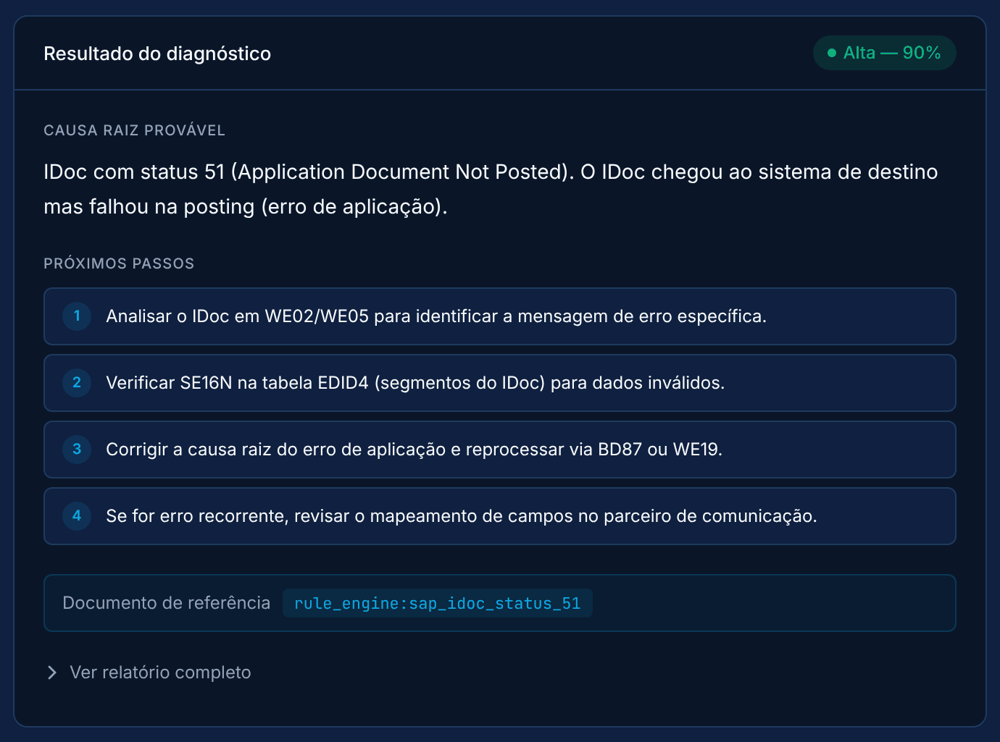
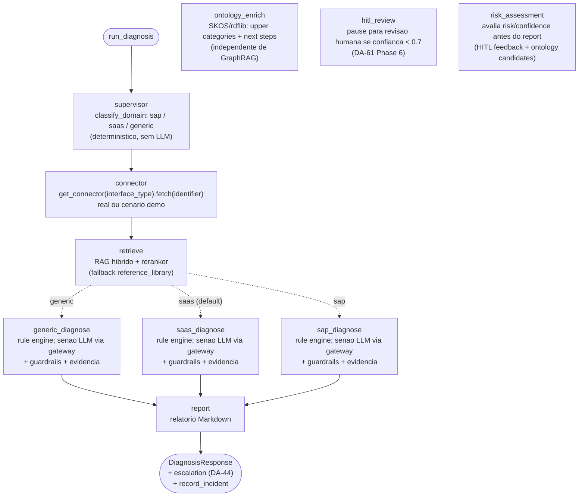

# Integration Incident Copilot

**Agente de IA que diagnostica incidentes de integração corporativa, SAP e não-SAP, e mostra a evidência por trás de cada resposta.**

[](https://github.com/marcos-slima/integration-incident-copilot/actions/workflows/tests.yml)
[](https://github.com/marcos-slima/integration-incident-copilot/actions/workflows/quality.yml)
[](pyproject.toml)
[](LICENSE)

[English](README.md) · Português (Brasil)

Um IDoc travado em status 51, um token OAuth que expirou num iFlow do CPI, um
chamado do ServiceNow sobre uma sincronização do Salesforce que falhou: o
Copilot lê o incidente, busca os fatos no sistema de origem, consulta a base
de conhecimento e devolve a **causa raiz provável, os próximos passos e as
fontes em que se apoiou**, cada uma marcada com o quanto merece confiança.

<p align="center">
  
</p>

<p align="center"><sub>Execução real do início rápido abaixo: o rule engine responde a um erro conhecido sem chamar o LLM.</sub></p>

## Por que existe

Levar IA ao suporte SAP costuma passar pelo SAP AI Core e pelo BTP, o que
deixa de fora quem ainda está em ECC on-premise ou não tem orçamento de BTP.
Este projeto mostra que um agente de diagnóstico pensado para produção pode
rodar **localmente (Ollama)** ou num provedor que o cliente já tenha, sem
abrir mão de governança: decisão determinística onde ela é possível,
evidência explícita onde há LLM e uma política rígida sobre para onde o dado
confidencial pode ir. A comparação de custo está em
[`docs/TCO_SAP_AI_CORE_VS_SELF_HOSTED.md`](docs/TCO_SAP_AI_CORE_VS_SELF_HOSTED.md).

## O que o diferencia

| | Na prática |
|---|---|
| **Determinístico primeiro** | 22 regras curadas respondem erros conhecidos (IDoc 51, OAuth expirado, conexão RFC recusada…) antes de qualquer chamada ao LLM: na hora, sem custo e auditável. Essas respostas não têm versão de prompt, porque nenhum prompt as produziu. |
| **Evidência, não autoavaliação** | Toda resposta lista as fontes com um nível de confiança (`system_observed`, `retrieved_document`, `simulated`, `user_reported`). A confiança é limitada pela evidência, e uma fonte que o LLM cita sem ter sido recuperada é descartada. |
| **Soberania de dados pela origem real** | Texto livre é tratado como confidencial por padrão. Dado confidencial só vai para um modelo local ou para uma origem na nuvem que você libere explicitamente; a decisão usa a URL real do provedor, não o rótulo. `GET /llm/policy` mostra a política em vigor. |
| **Multiagente com roteamento determinístico** | Um supervisor encaminha cada incidente para um especialista SAP, SaaS ou genérico com código, não com LLM. |
| **Feito para outros agentes** | REST, **MCP** (Streamable HTTP), **A2A 0.3** (JSON-RPC 2.0) e **CloudEvents 1.0** (webhook e AMQP 1.0 para SAP Event Mesh / Solace) executam o mesmo pipeline. |
| **Detecção de drift de contrato** | Observa o `$metadata` OData, classifica a mudança como breaking ou aditiva e abre incidente antes que o consumidor quebre em produção. |
| **Medido e com gates** | A qualidade da busca roda no CI contra um conjunto de avaliação versionado; 20 quality gates conferem o que a documentação afirma, e os diagramas de arquitetura são gerados do código ou testados contra ele. |

## Arquitetura

O grafo de orquestração abaixo é **gerado de `app/agent/graph.py`**, e um
teste reprova se ele divergir. As visões C4, o contrato de estado, as
fronteiras de confiança, a árvore de decisão do AI Gateway, as máquinas de
estado e a implantação estão em
[`docs/ARCHITECTURE.md`](docs/ARCHITECTURE.md#mapa-dos-diagramas).

<!-- grafo-gerado:inicio (scripts/graph_diagram.py --write; nao editar a mao) -->

**Default: GRAPH_RAG_ENABLED=false**



<!-- grafo-gerado:fim -->

## Início rápido

Requisitos: Python 3.12, [uv](https://docs.astral.sh/uv/) e Docker. Esta
primeira execução não precisa de LLM.

```bash
git clone https://github.com/marcos-slima/integration-incident-copilot.git
cd integration-incident-copilot
uv sync

# Configuração local. O compose exige as três senhas mesmo para serviços que
# você não vai subir; a API_KEY é fixada para o curl abaixo usá-la.
cp .env.example .env
echo "EMBEDDING_BACKEND=fastembed" >> .env   # embeddings no processo, sem Ollama
for v in API_KEY POSTGRES_PASSWORD GRAFANA_PASSWORD NEO4J_PASSWORD; do
  echo "$v=$(python3 -c 'import secrets; print(secrets.token_urlsafe(24))')" >> .env
done

# Banco vetorial e base de conhecimento (15 playbooks de incidentes de exemplo)
docker compose up -d qdrant
uv run python -m app.rag.ingest --target incidents

# API
uv run uvicorn app.main:app
```

Em outro terminal, diagnostique um IDoc travado em status 51 com o cenário de
demonstração do conector RFC:

```bash
API_KEY=$(grep '^API_KEY=' .env | cut -d= -f2)
curl -s -X POST http://127.0.0.1:8000/diagnose \
  -H "X-API-Key: $API_KEY" -H "Content-Type: application/json" \
  -d '{"description": "IDoc travado em status 51", "interface_type": "rfc", "identifier": "RFC-IDOC-51-DEMO"}'
```

Resposta, resumida:

```json
{
  "agent_domain": "sap",
  "matched_source": "rule_engine:sap_idoc_status_51",
  "llm_provider_used": "rule_engine",
  "model_confidence": 0.9,
  "evidence": [
    {"source_type": "rule_engine", "trust_level": "system_observed"},
    {"source_type": "connector", "trust_level": "simulated"},
    {"source_type": "rag", "trust_level": "retrieved_document"},
    {"source_type": "user", "trust_level": "user_reported"}
  ],
  "escalation": {"escalation": "grounded", "should_escalate": false}
}
```

**Próximos passos**

- **Documentação interativa da API:** <http://127.0.0.1:8000/docs>.
- **Incidentes em texto livre** (o que as regras não cobrem) precisam de LLM:
  - local: `ollama pull qwen3-coder-next` e mantenha `LLM_PROVIDER=ollama`;
  - nuvem: `LLM_PROVIDER=openai` ou `azure_openai` com as credenciais, e
    libere a origem como na seção 6 do
    [guia de troubleshooting](docs/TROUBLESHOOTING.md).
- **Interface web:**
  - gere com `cd frontend && npm ci && npm run build` e abra <http://127.0.0.1:8000>;
  - crie um login com
    `uv run python -c "from app.auth import hash_password; print(hash_password('sua-senha'))"`
    e acrescente `WEB_UI_USERS=<usuario>:<hash>` ao `.env`;
  - reinicie o `uvicorn` para ele carregar o build e o novo usuário.
- **Stack completo em containers** (API, Qdrant, Postgres, Grafana; Neo4j opcional):
  [`scripts/start-docker.sh`](scripts/start-docker.sh) e o
  [guia de primeiros passos](docs/GETTING_STARTED.md).
- **Depois de `docker compose down -v`**, reindexe com `--reset`: o estado da
  ingestão fica em disco, não no Qdrant.

## Formas de uso

| Superfície | Ponto de entrada | Autenticação |
|---|---|---|
| REST | `POST /diagnose`, `POST /diagnose/async` | `X-API-Key` ou a sessão da UI |
| Interface web | `/` (React + Vite) | usuário e senha, cookie de sessão HttpOnly |
| CLI | `uv run python -m app.agent.graph --interface rfc --id RFC-IDOC-51-DEMO "IDoc travado em status 51"` | nenhuma (local) |
| MCP | `/mcp`, ferramentas `diagnose_incident` e `list_connectors` | `X-API-Key` |
| A2A 0.3 | `POST /a2a`, card em `/.well-known/agent-card.json` | `X-A2A-Api-Key` |
| Eventos | `POST /events/incident` (CloudEvents 1.0) ou fila AMQP 1.0 | `X-Event-Mesh-Api-Key` |
| Feedback humano | `POST /incidents/{id}/verify` (alimenta o GraphRAG) | `X-API-Key` |

## Conectores

Os dez seguem o mesmo contrato, `fetch(identifier) → ConnectorResult`. Cada
um fala com o sistema real quando a variável dele está preenchida e usa
cenários de demonstração caso contrário. **Implementado não é validado:** a
última coluna diz quais já foram exercitados contra uma instância real.

| Conector | Sistema | Validado contra instância real |
|---|---|---|
| `rfc` | SAP ECC / S/4HANA via pyrfc | logon sim (ABAP trial); leitura de IDoc não |
| `servicenow` | ServiceNow ITSM | sim |
| `salesforce` | Salesforce | sim |
| `cap` | SAP CAP (OData v4, XSUAA) | sim (BTP trial) |
| `odata` | SAP CPI / Integration Suite | não |
| `successfactors` | SAP SuccessFactors Employee Central | não |
| `workday` | Workday | não |
| `ariba` | SAP Ariba / Business Network | não |
| `po` | SAP PO/PI (on-premise, atrás de uma fachada) | não (API não pública) |
| `apim` | analytics do SAP API Management | não (schema especulativo) |

Variáveis, identificadores de demonstração e como adicionar um conector:
[`docs/CONNECTORS.md`](docs/CONNECTORS.md).

## Qualidade e avaliação

| O quê | Resultado | Onde |
|---|---|---|
| Busca no conjunto de avaliação versionado (18 consultas no escopo, 10 fora) | Hit@1 94,4 %, Hit@3 100 %, MRR 0,972; 9 de 10 consultas fora de escopo rejeitadas | job de CI `rag-quality` |
| Quality gates | 20 verificações determinísticas: dataset, invariante do reranker, digest do prompt contra o prompt medido, links, símbolos e variáveis de ambiente da documentação, alcance dos conectores | job de CI `deterministic` |
| Banco de dados | migrations aplicadas e conferidas; as 45 consultas dos dashboards e os testes ponta a ponta de drift de contrato rodam contra PostgreSQL real | job de CI `migrations_and_dashboards` |
| Casos de uso | nove cenários com os números medidos por testes | [`docs/CASOS_DE_USO.md`](docs/CASOS_DE_USO.md) |

O conjunto de avaliação é pequeno, e a vantagem do reranker escolhido sobre o
baseline (ms-marco-L6) é de uma consulta em 18, sem significância estatística;
ver [`docs/RERANKER_BENCHMARK.md`](docs/RERANKER_BENCHMARK.md). O que os gates
**não** cobrem está em [`docs/QUALITY_GATES.md`](docs/QUALITY_GATES.md).

## Situação do projeto

O projeto está em desenvolvimento ativo. Em outubro de 2026 passou por uma
auditoria completa, seguida de correções verificadas, e estes limites
continuam em aberto:

- **Kyma:** os manifests de `deploy/kyma/` nunca foram aplicados num cluster real.
- **Conectores:** seis dos dez não foram validados contra instância real (tabela acima).
- **Queda do banco vetorial:** com o Qdrant fora do ar, o `/diagnose` responde 500 mesmo quando uma regra resolveria.
- **Brecha de prompt injection:** o resultado da busca web devolvido ao agente ReAct ainda não é sanitizado.

Cada um está documentado em [`docs/ARCHITECTURE.md`](docs/ARCHITECTURE.md).

## Documentação

| Se você quer… | Leia |
|---|---|
| Rodar pela primeira vez | [Primeiros passos](docs/GETTING_STARTED.md) → [Guia de uso](docs/USER_GUIDE.md) |
| Ver como funciona, com diagramas | [Arquitetura](docs/ARCHITECTURE.md) |
| Entender *por que* foi feito assim | [Decisões de arquitetura](docs/DECISOES_DE_ARQUITETURA.md) (50 decisões registradas) |
| Acompanhar cenários reais de ponta a ponta | [Casos de uso](docs/CASOS_DE_USO.md) |
| Configurar um conector | [Conectores](docs/CONNECTORS.md) |
| Resolver um problema | [Troubleshooting](docs/TROUBLESHOOTING.md) |
| Índice de tudo | [docs/README.md](docs/README.md) |

## Stack

FastAPI · LangGraph · LangChain · Qdrant (busca híbrida densa + BM25, reranker
cross-encoder) · Neo4j (GraphRAG opcional) · Ollama / OpenAI / Azure OpenAI ·
PostgreSQL + Alembic · Redis + RQ · React + Vite · Langfuse · Grafana ·
python-qpid-proton (AMQP 1.0) · Docker Compose · SAP BTP Kyma.

## Autor

**Marcos Silva Lima**: arquiteto SAP com mais de 18 anos em integração SAP
(Integration Suite, ABAP, CAP, BTP), atuando em arquitetura de IA para
ambientes corporativos.

## Licença

[MIT](LICENSE)
