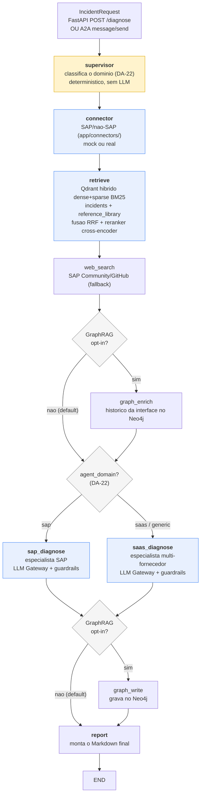

# Arquitetura Detalhada

Visao tecnica do que existe hoje no codigo - nao um plano aspiracional.
Para o "porque" de cada decisao (problemas reais encontrados e como
foram resolvidos), ver a secao "Decisoes de Arquitetura" no
[README](../README.md); este documento e o "o que" e "onde".

## Fluxo

Os nodes `graph_enrich`/`graph_write` (GraphRAG) so entram no grafo
quando `GRAPH_RAG_ENABLED=true` - com a flag desligada (default), o
grafo compilado tem a mesma sequencia de nodes de antes da fase
GraphRAG, byte a byte (ver secao GraphRAG abaixo). O `supervisor` e o
roteamento condicional para `sap_diagnose`/`saas_diagnose` (DA-22,
secao Multi-agent abaixo) rodam SEMPRE, com ou sem GraphRAG - e a unica
mudanca estrutural que se aplica nos dois modos do grafo.

Cada etapa e um node do grafo (definidos em `app/agent/nodes.py`, orquestrados em `app/agent/graph.py`), instrumentado com
`@observe` (Langfuse). O estado (`CopilotState`) flui entre nodes; o
grafo e compilado uma vez (`get_graph()`, singleton em processo).

Dois "consumidores" chamam a mesma orquestracao (`run_diagnosis`), sem
nenhuma logica duplicada entre eles: o endpoint REST `/diagnose`
(`app/main.py`) e a camada A2A (`app/a2a/`, ver secao propria abaixo).

## Camadas

| Camada | Onde | Responsabilidade |
|---|---|---|
| API | `app/main.py` | FastAPI, `/health`, `/diagnose`, Agent Card A2A, servidor MCP (`/mcp`); rate limiting 10/min por IP (slowapi); API Key via `X-API-Key` (API_KEY no .env, ou gerada automaticamente no startup se ausente - DA-18) |
| A2A | `app/a2a/` | Camada de interoperabilidade externa (Agent Card, task manager, JSON-RPC), chama a mesma orquestracao do `/diagnose` |
| Orquestracao | `app/agent/graph.py` · `app/agent/nodes.py` · `app/agent/state.py` | Grafo LangGraph (orquestrador ~136 linhas), nodes (connector/retrieve/web_search/diagnose/report), tipos (CopilotState, DiagnosisModel) |
| LLM Gateway | `app/llm/factory.py` | Escolhe o `BaseChatModel` (Ollama/OpenAI/Azure OpenAI) a partir de `Settings` |
| RAG | `app/rag/` | Ingestao (`ingest.py`) com pymupdf4llm + schema rico; retrieval unificado (`retriever.py`) — hybrid search + reranker cross-encoder; GraphRAG opt-in (`graph_store.py`) via Neo4j |
| Conectores | `app/connectors/` | Um por sistema externo (OData, RFC, ServiceNow, Salesforce, Workday, SAP Ariba, SAP CAP, SAP API Management); interface comum em `base.py` |
| Config | `app/config.py` | Unica fonte de verdade (`.env` + defaults), nunca hardcoded espalhado |
| Modelos | `app/models.py` | Contratos Pydantic da API (`IncidentRequest`/`DiagnosisResponse`) |

Esta nao e uma Clean Architecture "de livro" com pastas
`domain/application/infrastructure` separadas - e uma separacao
pragmatica por responsabilidade, que ja evita a mistura de
preocupacoes que aquele padrao existe para prevenir (a logica de
prompt/guardrail, por exemplo, sao funcoes puras em `app/agent/nodes.py`,
testaveis sem subir API nem grafo).

**Nota honesta sobre `app/services/`:** a pasta existe (criada cedo,
"para quando precisar") mas continua vazia - propositalmente. Hoje
`run_diagnosis()` (em `app/agent/graph.py`) ja cumpre o papel de "camada de
servico": e a unica funcao que os dois consumidores existentes
(`/diagnose` e `app/a2a/task_manager.py`) chamam, sem duplicar logica
entre eles. Criar uma classe/modulo `IncidentDiagnosisService` que so
delegasse para essa mesma funcao seria indirecao sem beneficio real -
exatamente o tipo de "camada vazia por vaidade arquitetural" que este
documento critica no `genai-engineering-template` (`src/application/`
la tambem vazio, mas la sem nada que cumprisse o papel por baixo). Se
um dia houver mais de uma logica de orquestracao real para coordenar
(nao so repassar uma chamada), a pasta ganha conteudo entao - nao antes.

## LLM Gateway - por que e como

Ver `app/llm/factory.py` e a Decisao de Arquitetura #10 no README. Em
uma frase: `Settings.llm_provider` decide entre Ollama (default,
local-first, sem custo de API), OpenAI ou Azure OpenAI, sem o resto do
codigo (`app/agent/nodes.py`, prompt, guardrails) precisar saber qual foi
escolhido - todos implementam a mesma interface `BaseChatModel` do
LangChain.

## Hybrid Inference - fallback de resiliencia (DA-20)

Quarto item do roadmap "Projeto evolucao planejada" (apos AI Gateway/
Evidence Layer, fechamento de autenticacao do A2A e servidor MCP).
Criterio escolhido: RESILIENCIA, nao roteamento por qualidade/
complexidade (as duas alternativas descartadas - escalar por
`evidence_strength` baixo, ou rotear por complexidade do caso antes de
chamar o LLM - custam uma segunda chamada de LLM em parte dos casos e
exigem calibrar um limiar; resiliencia so entra em acao quando o
provider primario esta genuinamente indisponivel).

`app/llm/factory.py::invoke_with_hybrid_fallback()` roda a chamada com
`settings.llm_provider` (Ollama, tipicamente) e, SE
`settings.llm_fallback_provider` estiver configurado (`.env`, vazio por
default = comportamento identico a antes desta fase) E a falha for de
TRANSPORTE (`ConnectionError`/`httpx.ConnectError`/
`httpx.TimeoutException` - Ollama fora do ar, timeout de rede), refaz a
MESMA chamada com o provider de fallback antes de desistir. Erro de
APLICACAO (JSON malformado, prompt invalido) NUNCA aciona o fallback -
subir normalmente evita mascarar um bug real atras de uma segunda
chamada de LLM (custo/latencia desnecessarios). Os sub-agentes de
diagnostico (`sap_diagnosis_node`/`saas_diagnosis_node`, ver DA-22
logo abaixo) usam isso, via `_run_diagnosis_agent()`, para a chamada
ao agente ReAct; qual provider respondeu de fato fica exposto em
`DiagnosisResponse.llm_provider_used` - transparencia, nao so um
fallback silencioso.

## Conectores - mock vs. real, hoje

Todo conector agora segue o MESMO criterio: configuracao ausente = modo
demo/mock; configuracao presente = chamada real. Nenhum exige mudar
codigo Python para ativar - so preencher variaveis no `.env`.

| Conector | Estado hoje | Falta so |
|---|---|---|
| `ODataConnector` | **Real** (OAuth2 client_credentials + OData v2) quando `ODATA_SERVICE_URL` configurado | Um tenant CPI/Integration Suite real para validar contra producao |
| `RFCConnector` | **Real, validado contra ABAP Cloud Developer Trial real** (A4H rel 754, `RFC_SYSTEM_INFO` via `pyrfc` 3.3.1 + SDK 7.50 PL19) | `BAPI_IDOC_STATUS` nao disponivel no Trial — criar funcao Z ou usar landscape real para validar BAPI especifica |
| `ServiceNowConnector` | **Real, validado contra ServiceNow PDI real** (Table API via HTTP, Basic Auth) | Nada - segundo conector com validacao ponta-a-ponta contra sistema real |
| `SalesforceConnector` | **Real, validado contra Salesforce Developer Edition real** (OAuth2 Client Credentials + SOQL) | Nada - primeiro conector com validacao ponta-a-ponta contra sistema real, nao so mock |
| `WorkdayConnector` | **Real** (OAuth2 + REST) quando `WORKDAY_TENANT` configurado | Um tenant Workday real |
| `AribaConnector` | **Real** (OAuth2 + REST) quando `ARIBA_BASE_URL` configurado | Acesso a Ariba Network/API Business Hub |
| `CAPConnector` | **Real, validado contra SAP CAP real** (OData v4 + XSUAA client_credentials, BTP Trial) | Nada - terceiro conector com validacao ponta-a-ponta contra sistema real |
| `APIManagementConnector` | ⚠️ **Implementado com schema ESPECULATIVO** (OAuth2 Client Credentials + endpoint assumido por analogia a produtos similares - NAO confirmado contra documentacao real do SAP API Management) | Validar contrato real da Analytics API contra um tenant de verdade; corrigir endpoint/schema conforme necessario |

**Nota sobre a assimetria SuccessFactors↔Workday:** o cenario de
referencia "SuccessFactors↔Workday" e representado hoje SO pelo lado
Workday - "SuccessFactors" aparece apenas como contexto narrativo no
payload mock do `WorkdayConnector` (`grep -rn "SuccessFactors" app/`
confirma isso: zero classe/modulo, so docstring/comentario). Nao ha
`SuccessFactorsConnector` implementado. Isso e uma decisao implicita,
nao documentada ate agora - registrada aqui para nao parecer descuido.

Por que ainda nao foi fechado: SuccessFactors expoe OData v2 (SFAPI)
com autenticacao via SAML bearer assertion, mais complexa que o
padrao OAuth2 client_credentials ja usado nos demais conectores -
exigiria um mecanismo de auth novo, nao reuso do que ja existe.
Registrado como proximo item de backlog de conectores, nao
implementado nesta fase (mesma disciplina de "um conector por vez,
validado, antes do proximo" aplicada aos demais).

"Real" aqui quer dizer: o codigo de producao (fetch de token OAuth2,
montagem do header, parsing da resposta) e exercitado de verdade nos
testes via `httpx.MockTransport` simulando a API documentada de cada
fornecedor - nao existe, para nenhum destes tres ultimos (Salesforce/
Workday/Ariba) nem para o RFC, uma conta/tenant real disponivel para
validar contra producao. Essa e a mesma ressalva ja feita sobre
`RFCConnector._fetch_real` desde a Fase 8, agora estendida a todos os
conectores no mesmo padrao - nao e uma limitacao nova, e a mesma
limitacao aplicada com consistencia.

Por que RFC (nao so OData) importa para o posicionamento do produto:
clientes ainda em ECC on-premise, sem BTP/Integration Suite, tipicamente
so tem RFC/BAPI como via de automacao - e essa e a base de clientes que
nao consegue adotar SAP AI Core (que exige HANA Cloud). Ver
[TCO_SAP_AI_CORE_VS_SELF_HOSTED.md](TCO_SAP_AI_CORE_VS_SELF_HOSTED.md).

## RAG

Duas collections Qdrant (`app/rag/ingest.py`) — ambas participam do
fluxo de diagnostico a partir da v2.0:

- `sap_incident_docs` — documentos de troubleshooting (`.md`), hybrid
  search (dense + BM25 esparso, fusao RRF)
- `sap_reference_library` — PDFs tecnicos SAP (guias, notas, livros),
  busca densa; schema rico: `source`, `text`, `filename`, `page_number`,
  `document_id`, `chunk_index`, `file_hash`, `title`, `category`,
  `ingested_at` (parser: `pymupdf4llm`, preserva estrutura Markdown)

**Retrieval unificado (`_retrieve_unified`):** consulta as duas
collections em paralelo, funde os resultados por score composto
(`alpha=0.7 × cosine + 0.3 × rrf_normalizado`) e passa os candidatos
para o **reranker semantico** (`cross-encoder/ms-marco-MiniLM-L-6-v2`
via `sentence-transformers`) que reordena por relevancia real ao par
`(query, chunk)` — muito mais preciso que similaridade de cosseno pura.

**Ingestao:** idempotente por IDs deterministicos
(`md5(document_id::chunk_index)`) — sem delete-before-upsert. Estado
salvo por hash de conteudo (`hash:filename`) em vez de path, detectando
mudancas mesmo com renomeacao de arquivo.

## GraphRAG (Neo4j) - opt-in, nao no caminho default

`app/rag/graph_store.py` implementa o que antes era so "reservado para
uso futuro": grava cada diagnostico concluido no Neo4j como um grafo
(`Incident -AFFECTS-> Interface -RUNS_ON-> System`, `Incident
-HAS_ROOT_CAUSE_IN-> Document`) e consulta esse grafo por incidentes
anteriores na MESMA interface antes de gerar um novo diagnostico -
contexto de recorrencia ("essa RFC destination ja teve 3 incidentes
antes, sempre pela mesma causa") que a busca vetorial no Qdrant nao da,
porque Qdrant acha o documento de CONHECIMENTO mais parecido, nao o
HISTORICO relacional de uma interface especifica.

Continua **desligado por default** (`GRAPH_RAG_ENABLED=false`) - a
decisao de manter assim nao mudou (ver Decisao de Arquitetura #9): o
Qdrant ja resolve o caso de uso principal, e o grafo so agrega valor
depois de meses de historico real acumulado, nao com os 8 documentos de
demonstracao deste repositorio. A diferenca em relacao a antes desta
fase e que agora **existe codigo real, testado (com driver fake, ver
`tests/test_graph_store.py`), pronto para ligar** quando fizer sentido:

1. `docker compose --profile graphrag up -d neo4j` (nao sobe com
   `docker compose up` default - profile dedicado, ver `docker-compose.yml`)
2. `GRAPH_RAG_ENABLED=true` no `.env`

Nao ha um passo 3 manual: desde a Decisao de Arquitetura #19 (DA-21),
`ensure_constraints()` roda sozinho no `lifespan` do FastAPI quando a
flag esta ligada (ver `app/main.py`) - o antigo
`uv run python -m app.rag.graph_store --init` continua disponivel para
uso manual/explicito, mas deixou de ser obrigatorio.

Nao ha nada para descomentar no Python - so essa flag + a infra de fato
existir. Com a flag desligada, `build_graph()` monta exatamente a mesma
sequencia de nodes de antes desta fase (ver `app/agent/graph.py`),
custo zero. **Nao testado contra um Neo4j real** (sem Docker daemon
disponivel no ambiente onde isso foi construido) - mesma ressalva
honesta do `RFCConnector._fetch_real`.

### Hardening operacional (DA-21): degradacao graciosa, dedup e limpeza

Ligar GraphRAG significa que o Neo4j passa a estar no caminho critico
de CADA diagnostico (`graph_enrich_node` antes, `graph_write_node`
depois - ver `app/agent/graph.py`). Sem cuidado, uma instabilidade
pontual do Neo4j (restart, rede, pool esgotado) derrubaria o
diagnostico inteiro por causa de uma camada que deveria ser so um
enriquecimento, nao uma dependencia rigida. Tres reforcos, todos
cobertos por teste com driver fake (`tests/test_graph_store.py`,
`tests/test_nodes_graph_degradation.py`):

- **Degradacao graciosa por tipo de excecao** - `GRAPH_UNAVAILABLE_EXCEPTIONS`
  (`neo4j.exceptions.DriverError` + `TransientError`) delimita exatamente
  o que conta como "infra indisponivel agora, siga sem grafo": conexao
  recusada, timeout, servidor em restart. `graph_enrich_node` cai para
  "sem historico" (`graph_history: []`) e `graph_write_node` pula a
  escrita, ambos logando um `warning` - o diagnostico principal (RAG +
  LLM) segue intacto. Deliberadamente NAO inclui `Neo4jError` em geral:
  um `ConstraintError`/`CypherSyntaxError` sinaliza um bug NOSSO
  (Cypher ou schema errado), nao indisponibilidade de infra, e continua
  propagando normalmente - mesmo principio que separa falha de
  transporte de erro de aplicacao no Hybrid Inference (DA-20).
- **Formatacao com deduplicacao por recorrencia** -
  `format_graph_context_for_prompt()` agrupa ocorrencias CONSECUTIVAS
  da mesma causa raiz numa unica linha com contador ("ja ocorreu 3x"),
  em vez de repetir a mesma linha e desperdicar orcamento de prompt numa
  interface "flapping" (falhando repetidamente pela mesma causa).
  Agrupamento e so entre vizinhos - a lista ja vem mais-recente-primeiro,
  e uma causa diferente intercalada quebra o agrupamento, para nao
  esconder que algo diferente aconteceu no meio.
- **Utilitario manual de limpeza** - `prune_ungrounded_hypotheses()`
  (CLI: `--prune-ungrounded --older-than-days N`, default 90) remove
  hipoteses NAO confirmadas (`is_grounded=false`) antigas, que so
  acumulam ruido no grafo sem nunca terem sido corroboradas. Incidentes
  com causa raiz confirmada (`is_grounded=true`) nunca sao tocados, sob
  nenhuma idade. E manutencao explicita do operador - nunca chamada
  automaticamente por nenhum node ou pelo `lifespan`, mesmo principio de
  "nada e deletado sem o operador pedir" usado em outras partes deste
  projeto.

**Nao-objetivo explicito desta fase**: nenhuma das tres mudancas acima
foi validada contra um Neo4j real (mesma limitacao de ambiente das
demais integracoes reais deste projeto - sem Docker disponivel onde
isso foi construido). A cobertura de teste e com driver fake
(`FakeSession`, mesmo padrao usado nos conectores HTTP com
`httpx.MockTransport`); validar contra um Neo4j real fica como proximo
passo do lado do operador/autor, fora deste ambiente de desenvolvimento.

## Multi-agent - supervisor + especialistas por dominio (DA-22)

Antes desta fase, um unico node (`diagnose_node`) tratava QUALQUER
incidente com uma persona fixa de "especialista em integracao SAP" -
incoerente com o principio de design deste projeto de que SAP e um
conector entre iguais, nao o eixo arquitetural (ver Decisao de
Arquitetura #8/#13 no README). Um incidente de webhook do Salesforce
recebia a mesma expertise "OData/IDoc/RFC/CPI" que um incidente de RFC.

**Decisao:** um `supervisor_node` (`app/agent/supervisor.py`) roda
PRIMEIRO no grafo (antes ate do `connector`) e classifica
deterministicamente o dominio do incidente:

- `interface_type` em `{odata, rfc, cap}` -> `"sap"`
- `interface_type` em `{servicenow, salesforce, workday, ariba}` ->
  `"saas"`
- sem `interface_type` (fluxo por descricao livre): palavra-chave SAP
  na descricao (`idoc`, `iflow`, `cpi`, `rfc`, `bapi`, `abap`, `btp`,
  etc.) -> `"sap"`; senao -> `"generic"`

A classificacao e CODIGO, nao uma chamada de LLM - mesmo principio ja
aplicado aos guardrails de confianca (DA-15): decisao estrutural
barata, deterministica e 100% testavel sem depender de infraestrutura
de IA. `app/agent/graph.py::_route_to_specialist` le `agent_domain` do
estado e direciona o grafo (via `add_conditional_edges`) para UM dos
dois sub-agentes especialistas - nunca os dois no mesmo incidente, sem
duplicar custo de chamada de LLM:

- `sap_diagnosis_node` - persona SAP (OData, IDoc, RFC, CPI/Integration
  Suite, BTP)
- `saas_diagnosis_node` - persona multi-fornecedor (ServiceNow,
  Salesforce, Workday, Ariba, APIs REST/OAuth2 em geral); tambem cobre
  `"generic"` (nenhum dominio identificado), aplicando o mesmo
  raciocinio generalista de troubleshooting de integracao

Os dois sub-agentes compartilham o mesmo nucleo (`_run_diagnosis_agent`
em `app/agent/nodes.py`) - agente ReAct, Hybrid Inference (DA-20),
parsing de JSON e guardrails de confianca (DA-15) permanecem
IDENTICOS; a unica diferenca entre eles e a persona/expertise injetada
no prompt. Qual dominio foi usado fica exposto em
`DiagnosisResponse.agent_domain` (mesma filosofia de transparencia do
`llm_provider_used`, DA-20) e aparece no relatorio Markdown final.

**Validacao:** `tests/test_supervisor.py` (classificacao pura, sem
LLM) e `tests/test_nodes_multiagent.py` (cada sub-agente recebe a
persona certa, o roteamento condicional manda para o node certo -
incluindo o caso de seguranca `agent_domain` ausente cair no
especialista generalista em vez de quebrar - e `agent_domain` chega
ate `DiagnosisResponse`), todos mockando `invoke_with_hybrid_fallback`
diretamente (sem Ollama real, mesmo padrao de `test_llm_factory.py`).
`build_graph()` foi verificado manualmente compilando com sucesso nos
dois modos (GraphRAG ligado/desligado), confirmando os nodes esperados
no grafo resultante.

## Rodando sem depender do `~/ai-stack` pessoal

O `docker-compose.yml` na raiz deste repositorio sobe Ollama + Qdrant +
a API num unico `docker compose up -d`, sem depender do stack completo
de observabilidade (`~/ai-stack`, com Langfuse/Postgres/ClickHouse/
Redis/MinIO) usado no ambiente de desenvolvimento pessoal. Isso importa
porque este projeto tambem funciona como demonstracao para terceiros
(cliente, entrevistador) - que nao tem, nem deveriam precisar montar,
o ambiente pessoal do autor so para rodar o projeto uma vez. Langfuse
continua opcional: sem as chaves configuradas, o app roda normalmente,
so sem tracing.

## A2A (Agent2Agent) - interoperabilidade externa

`app/a2a/` implementa a proposta arquivada em
[docs/proposals/a2a-interoperability-layer.md](proposals/a2a-interoperability-layer.md)
(ler esse documento para o contexto de negocio completo e a ressalva
sobre a GA inbound do Joule, prevista para Q4/2026 e ainda nao
disponivel). Em resumo tecnico:

- **Agent Card** (`app/a2a/agent_card.py`), publicado em
  `GET /.well-known/agent-card.json` (path padrao do protocolo A2A)
- **Task manager** (`app/a2a/task_manager.py`) - traduz uma mensagem
  A2A em `IncidentRequest` e chama `run_diagnosis()`, a MESMA funcao
  usada pelo `/diagnose` REST; nao ha logica de diagnostico duplicada
- **Servidor JSON-RPC 2.0** (`app/a2a/server.py`), montado em
  `POST /a2a`, com os metodos `message/send` e `tasks/get`

Simplificacao deliberada: dos 8 estados de task que o protocolo A2A
define, so os 4 que este agente sincrono e autocontido realmente
alcanca sao implementados (`submitted -> working -> completed|failed`)
- `input_required`/`auth_required`/`canceled`/`rejected` nao se aplicam
a um agente que nao pede dado adicional a meio do processo nem tem
fluxo de autorizacao interativo. Autenticacao e uma chave estatica via
header (`A2A_API_KEY`). Desde a DA-18, essa chave NUNCA fica vazia em
memoria: se nao vier do `.env`, `app/main.py::_ensure_api_keys_configured`
gera uma aleatoria no startup e avisa no log - o endpoint nunca fica
silenciosamente aberto. Uma chave de OAuth2/JWT entre agentes continua
sendo o gap de producao real (exigiria um fluxo de autorizacao
interoperavel entre agentes de fornecedores diferentes), nao uma
limitacao escondida.

Testado com FastAPI `TestClient` + um `diagnosis_fn` stub injetado no
`TaskManager` (mesmo padrao de injecao de dependencia dos conectores
HTTP) - inclui um teste que prova que uma falha na orquestracao vira
task com `status.state == "failed"`, nao um erro HTTP 500, que e o
comportamento correto de um agente A2A (erro de negocio, nao de
transporte).

## MCP (Model Context Protocol) - capability catalog, nao so "conectar um LLM a uma ferramenta"

`app/mcp/server.py` expoe o Copilot como SERVIDOR MCP (nao cliente -
decisao explicita, ver docstring do modulo para a leitura alternativa
descartada), montado em `POST /mcp/` (com barra final - `app.mount()`
redireciona 307 a partir de `/mcp` sem barra, comportamento padrao do
Starlette, nao especifico do MCP). Terceiro item do roadmap "Projeto
evolucao planejada", depois de AI Gateway minimo/Evidence Layer (DA-15/
16/17) e do fechamento de autenticacao do A2A (DA-18) - a especificacao
MCP de 2026 caminha para stateless scaling, cache de capability catalog
e autorizacao empresarial, o que aproxima MCP de infraestrutura de
producao em vez de um protocolo isolado.

Duas ferramentas, ambas READ-ONLY ("leitura primeiro" - o roadmap e
explicito sobre isso):

- `diagnose_incident` - chama a MESMA `run_diagnosis()` usada por
  `/diagnose` e `/a2a`; nao ha logica de diagnostico duplicada pela
  terceira vez.
- `list_connectors` - inspeciona `settings` (sem nenhuma chamada de
  rede) e informa, por `interface_type`, se o conector esta configurado
  para dados reais ou opera em modo demo/mock.

Autenticacao: reusa `settings.api_key` (o MESMO X-API-Key de
`/diagnose`, DA-18) via `RequireApiKeyMiddleware`, um middleware ASGI
simples - o SDK MCP oferece `AuthSettings`/`TokenVerifier` (OAuth2)
para autorizacao enterprise real, mas isso seria sobre-engenharia
tendo REST e A2A ja usando API Key estatica; manter um unico mecanismo
de autenticacao em toda a superficie HTTP em vez de dois.

Detalhe de implementacao que vale registrar (pegou um teste real nesta
fase): `StreamableHTTPSessionManager.run()` - que gerencia as sessoes
MCP - so pode ser chamado UMA vez por instancia de processo; por isso
seu ciclo de vida entra no `lifespan` do app FastAPI raiz (`app.mount()`
NAO propaga eventos de lifespan para sub-apps automaticamente), e por
isso os testes em `tests/test_mcp.py` usam um UNICO
`with TestClient(app) as ...` para toda a suite daquele arquivo.

## Event Mesh - ingestao orientada a evento (DA-23)

Ate esta fase, o Copilot so reagia a chamadas EXPLICITAS: `POST
/diagnose` humano, mensagem A2A, ou tool call MCP. Fechando o sexto
item do roadmap arquitetural, `POST /events/incident`
(`app/main.py` + `app/events/`) permite que um sistema de monitoracao
externo (CPI, Solution Manager, um listener de fila/IDoc) dispare o
diagnostico automaticamente, publicando um evento em vez de esperar
alguem chamar a API.

**Formato do evento:** [CloudEvents](https://cloudevents.io/) -
`type`/`source`/`id`/`time`/`data` - o mesmo formato que o SAP Event
Mesh usa em modo **REST/Webhook push subscription** (alem do AMQP 1.0
nativo). `data` carrega exatamente os mesmos campos de
`IncidentRequest` (a informacao e a MESMA que um humano digitaria em
`/diagnose`, so que originada automaticamente). Hoje so um `type` e
reconhecido - `com.sap.integration.incident.detected.v1` - modelado
como `Literal` em `IncidentEventEnvelope` (`app/models.py`): qualquer
outro valor e rejeitado com `422` automaticamente pelo Pydantic, em
vez de tentar interpretar silenciosamente um payload de formato
desconhecido.

**Por que webhook e nao um consumidor AMQP:** nao e um atalho para
evitar montar um broker real - webhook e um modo de entrega de
PRIMEIRA CLASSE do proprio SAP Event Mesh, documentado ao lado do
AMQP, e e o unico que da para exercitar de ponta a ponta com testes
reais (TestClient HTTP) sem depender de infraestrutura externa - mesma
logica pragmatica ja aplicada ao GraphRAG (DA-21) e ao MCP (DA-19).

**Decisao de auth:** `X-Event-Mesh-Api-Key` e uma chave DEDICADA,
separada de `X-API-Key` (`/diagnose`) e `X-A2A-Api-Key` (`/a2a`) -
mesmo padrao de geracao automatica no startup se nao configurada
(DA-18). Isolamento deliberado: o webhook secret normalmente fica
configurado num sistema de monitoracao externo (fora do controle
direto deste projeto), entao um vazamento ali nao deve comprometer os
outros dois canais de acesso.

`app/events/consumer.py::handle_incident_event()` converte o evento em
`IncidentRequest` e chama a MESMA `run_diagnosis()` usada por
`/diagnose` e pela camada A2A - nenhuma logica de diagnostico
duplicada, so mais um ponto de entrada.

**Nao-objetivo explicito desta fase:** processamento assincrono/fila
real (hoje e sincrono - o webhook so retorna quando o diagnostico
termina, sujeito ao mesmo rate limit de 10/min de `/diagnose`) e
consumo AMQP direto do SAP Event Mesh - se o volume de eventos ou a
necessidade de backpressure justificar, isso e evolucao natural futura,
nao um gap escondido.

**Validacao:** `tests/test_events.py` cobre o mapeamento evento ->
IncidentRequest, a chamada a `run_diagnosis()`, autenticacao (401 sem
chave/chave errada), rejeicao de `type` desconhecido (422), limite de
tamanho da descricao (422, mesma regra de `/diagnose`) e geracao
automatica da chave no startup - tudo com `run_diagnosis` mockado, sem
depender de Ollama/Qdrant reais.

## Testes

Testes unitarios (`tests/test_connectors.py`, `test_llm_factory.py`,
`test_graph_store.py`, `test_a2a.py`,
`test_api.py::test_health_endpoint`) rodam sem nenhuma infraestrutura
externa - inclusive os caminhos HTTP reais dos conectores
(ServiceNow/OData/Salesforce/Workday/Ariba), via `httpx.MockTransport`,
e o GraphRAG, via uma sessao Neo4j fake. Testes marcados
`@pytest.mark.integration` (`test_graph_e2e.py`, `test_retriever.py`,
os `/diagnose` de `test_api.py`) exigem Qdrant + Ollama rodando e sao
pulados automaticamente (nao falham) quando essa stack nao esta
acessivel - ver `tests/conftest.py`. O CI (`.github/workflows/tests.yml`)
roda `pytest tests/ -m "not integration"` - toda a suite nao-integracao,
nao mais um arquivo especifico (gap corrigido nesta fase).
