# Arquitetura Detalhada

Visao tecnica do que existe hoje no codigo - nao um plano aspiracional.
Para o "porque" de cada decisao (problemas reais encontrados e como
foram resolvidos), ver a secao "Decisoes de Arquitetura" no
[README](../README.md); este documento e o "o que" e "onde".

## Mapa dos diagramas

Revisado na validacao de 2026-10-07. Todos os diagramas sao Mermaid; os C4
usam a notacao C4 (Pessoa, Sistema, Conteiner) desenhada como `flowchart`,
porque o renderizador `C4Context` do Mermaid sobrepoe os rotulos. O que
pode ser derivado do codigo e **gerado** ou **conferido por teste**
(`tests/test_diagramas.py`), para nao repetir os `docs/UC_*` removidos, que
desenhavam um grafo inexistente.

| Diagrama | Pergunta que responde | Onde | Como fica correto |
|---|---|---|---|
| C4 nivel 1 - Contexto | quem aciona o agente e para onde o dado sai | [abaixo](#c4-nivel-1---contexto) | revisao manual |
| C4 nivel 2 - Conteineres | o que e implantado e com qual protocolo/credencial | [abaixo](#c4-nivel-2---conteineres) | revisao manual |
| Grafo de orquestracao multiagente | quais nos existem e como o dominio roteia | [abaixo](#grafo-de-orquestracao-multiagente-gerado-do-codigo) | **gerado** por `scripts/graph_diagram.py` |
| Contrato de estado (`CopilotState`) | quem escreve e quem le cada campo | [abaixo](#contrato-de-estado-e-memoria) | campos conferidos por teste |
| Fronteiras de confianca | onde o dado e redigido, classificado, barrado ou cifrado | [abaixo](#fronteiras-de-confianca-e-dados-sensiveis) | revisao manual |
| Decisao do AI Gateway | por que um incidente (nao) foi para a nuvem | [abaixo](#decisao-de-rota-do-ai-gateway) | revisao manual |
| Maquinas de estado e decisao de escalonamento | estados e transicoes validas | [abaixo](#maquinas-de-estado) | estados conferidos por teste |
| Sequencia do diagnostico e loop ReAct | ordem das chamadas, determinismo x inferencia | [`CASOS_DE_USO.md`](CASOS_DE_USO.md) | participantes conferidos por teste |

## C4 nivel 1 - Contexto

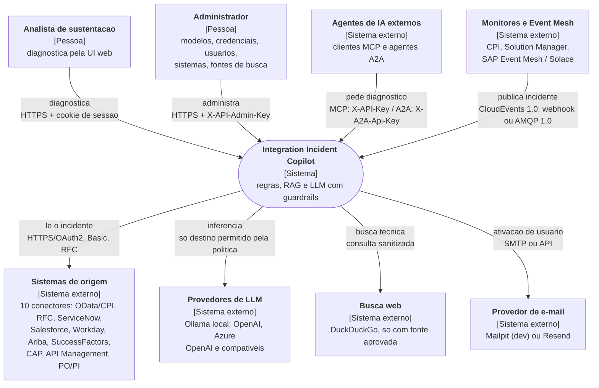
```mermaid
flowchart TB
    analista["<b>Analista de sustentacao</b><br/>[Pessoa]<br/>diagnostica pela UI web"]
    admin["<b>Administrador</b><br/>[Pessoa]<br/>modelos, credenciais, usuarios,<br/>sistemas, fontes de busca"]
    agentes["<b>Agentes de IA externos</b><br/>[Sistema externo]<br/>clientes MCP e agentes A2A"]
    eventos["<b>Monitores e Event Mesh</b><br/>[Sistema externo]<br/>CPI, Solution Manager,<br/>SAP Event Mesh / Solace"]

    iic(["<b>Integration Incident Copilot</b><br/>[Sistema]<br/>regras, RAG e LLM com guardrails"])

    origem["<b>Sistemas de origem</b><br/>[Sistema externo]<br/>10 conectores: OData/CPI, RFC, ServiceNow,<br/>Salesforce, Workday, Ariba, SuccessFactors,<br/>CAP, API Management, PO/PI"]
    llm["<b>Provedores de LLM</b><br/>[Sistema externo]<br/>Ollama local; OpenAI, Azure<br/>OpenAI e compativeis"]
    web["<b>Busca web</b><br/>[Sistema externo]<br/>DuckDuckGo, so com fonte aprovada"]
    email["<b>Provedor de e-mail</b><br/>[Sistema externo]<br/>Mailpit (dev) ou Resend"]

    analista -->|"diagnostica<br/>HTTPS + cookie de sessao"| iic
    admin -->|"administra<br/>HTTPS + X-API-Admin-Key"| iic
    agentes -->|"pede diagnostico<br/>MCP: X-API-Key / A2A: X-A2A-Api-Key"| iic
    eventos -->|"publica incidente<br/>CloudEvents 1.0: webhook ou AMQP 1.0"| iic
    iic -->|"le o incidente<br/>HTTPS/OAuth2, Basic, RFC"| origem
    iic -->|"inferencia<br/>so destino permitido pela politica"| llm
    iic -->|"busca tecnica<br/>consulta sanitizada"| web
    iic -->|"ativacao de usuario<br/>SMTP ou API"| email
```

**Leitura:** todo dado que sai do sistema sai por tres setas: conectores
(leitura), LLM e busca web. As duas ultimas passam por politica: AI Gateway
(DA-26/39/43) e fontes aprovadas (DA-57).

## C4 nivel 2 - Conteineres

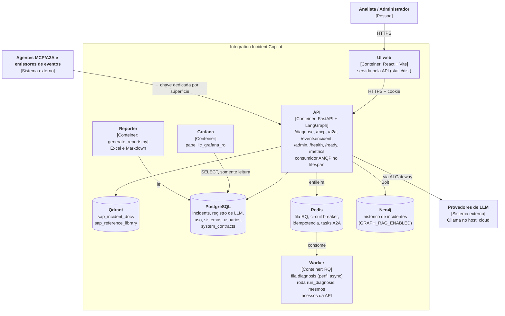
```mermaid
flowchart TB
    pessoas["<b>Analista / Administrador</b><br/>[Pessoa]"]
    clientes["<b>Agentes MCP/A2A e emissores de eventos</b><br/>[Sistema externo]"]
    llm["<b>Provedores de LLM</b><br/>[Sistema externo]<br/>Ollama no host; cloud"]

    subgraph iic["Integration Incident Copilot"]
        spa["<b>UI web</b><br/>[Conteiner: React + Vite]<br/>servida pela API (static/dist)"]
        api["<b>API</b><br/>[Conteiner: FastAPI + LangGraph]<br/>/diagnose, /mcp, /a2a, /events/incident,<br/>/admin, /health, /ready, /metrics<br/>consumidor AMQP no lifespan"]
        worker["<b>Worker</b><br/>[Conteiner: RQ]<br/>fila diagnosis (perfil async)<br/>roda run_diagnosis: mesmos<br/>acessos da API"]
        reporter["<b>Reporter</b><br/>[Conteiner: generate_reports.py]<br/>Excel e Markdown"]
        grafana["<b>Grafana</b><br/>[Conteiner]<br/>papel iic_grafana_ro"]
        qdrant[("<b>Qdrant</b><br/>sap_incident_docs<br/>sap_reference_library")]
        pg[("<b>PostgreSQL</b><br/>incidents, registro de LLM,<br/>uso, sistemas, usuarios,<br/>system_contracts")]
        redis[("<b>Redis</b><br/>fila RQ, circuit breaker,<br/>idempotencia, tasks A2A")]
        neo4j[("<b>Neo4j</b><br/>historico de incidentes<br/>(GRAPH_RAG_ENABLED)")]
    end

    pessoas -->|"HTTPS"| spa
    spa -->|"HTTPS + cookie"| api
    clientes -->|"chave dedicada por superficie"| api
    api -->|"enfileira"| redis
    redis -->|"consome"| worker
    api --> qdrant
    api --> pg
    api -->|"Bolt"| neo4j
    api -->|"via AI Gateway"| llm
    grafana -->|"SELECT, somente leitura"| pg
    reporter -->|"le"| pg
```

**Raio de impacto** (o que para quando cada um cai):

| Fora do ar | Efeito hoje |
|---|---|
| Qdrant | `/diagnose` responde 500, mesmo quando o rule engine resolveria (achado aberto da validacao de 2026-10-07; ver `TROUBLESHOOTING.md`) |
| Ollama (sem fallback cloud permitido) | `ConfigurationError`; o rule engine continua respondendo o que casa antes do LLM |
| PostgreSQL | o diagnostico continua (gravacao *best-effort*); `/admin` e o registro de LLM param |
| Redis | volta ao estado em memoria por processo; com mais de uma replica, deduplicacao e circuito deixam de ser compartilhados |
| Neo4j | o grafo segue sem o historico (degradacao graciosa, DA-21) |

## Grafo de orquestracao multiagente (gerado do codigo)

Topologia real de `app/agent/graph.py::build_graph`, nas duas formas que o
grafo pode ter (decidido na construcao, nao a cada execucao). Setas
tracejadas sao arestas **condicionais**: o rotulo e o valor de
`agent_domain` que `app/agent/graph.py::_route_to_specialist` le. Qualquer
valor diferente de `sap` e `generic` cai em `saas_diagnose`.

<!-- grafo-gerado:inicio (scripts/graph_diagram.py --write; nao editar a mao) -->

**Default: GRAPH_RAG_ENABLED=false**

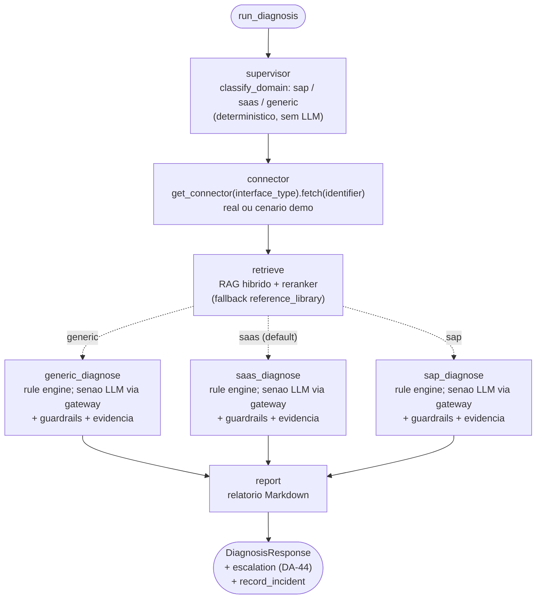
```mermaid
flowchart TD
    inicio(["run_diagnosis"])
    supervisor["supervisor<br/>classify_domain: sap / saas / generic<br/>(deterministico, sem LLM)"]
    connector["connector<br/>get_connector(interface_type).fetch(identifier)<br/>real ou cenario demo"]
    retrieve["retrieve<br/>RAG hibrido + reranker<br/>(fallback reference_library)"]
    sap_diagnose["sap_diagnose<br/>rule engine; senao LLM via gateway<br/>+ guardrails + evidencia"]
    saas_diagnose["saas_diagnose<br/>rule engine; senao LLM via gateway<br/>+ guardrails + evidencia"]
    generic_diagnose["generic_diagnose<br/>rule engine; senao LLM via gateway<br/>+ guardrails + evidencia"]
    report["report<br/>relatorio Markdown"]
    fim(["DiagnosisResponse<br/>+ escalation (DA-44)<br/>+ record_incident"])
    inicio --> supervisor
    connector --> retrieve
    generic_diagnose --> report
    report --> fim
    retrieve -.->|"generic"| generic_diagnose
    retrieve -.->|"saas (default)"| saas_diagnose
    retrieve -.->|"sap"| sap_diagnose
    saas_diagnose --> report
    sap_diagnose --> report
    supervisor --> connector
```

**Com GraphRAG: GRAPH_RAG_ENABLED=true**

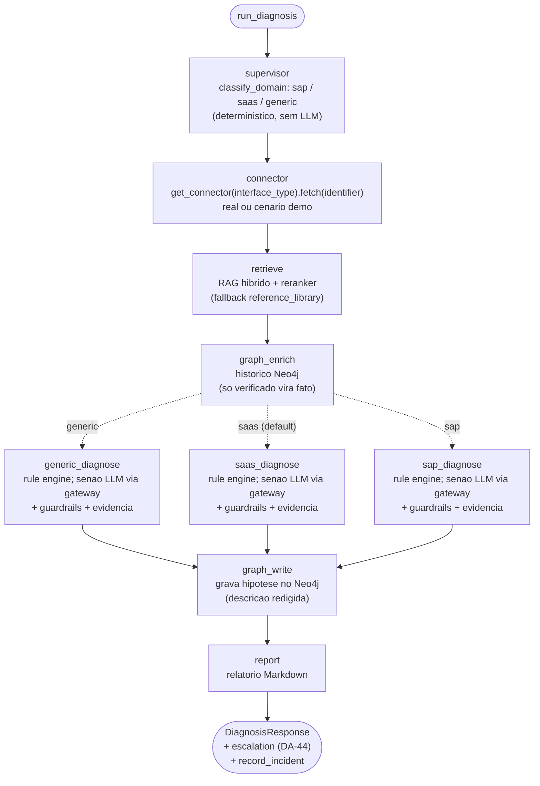
```mermaid
flowchart TD
    inicio(["run_diagnosis"])
    supervisor["supervisor<br/>classify_domain: sap / saas / generic<br/>(deterministico, sem LLM)"]
    connector["connector<br/>get_connector(interface_type).fetch(identifier)<br/>real ou cenario demo"]
    retrieve["retrieve<br/>RAG hibrido + reranker<br/>(fallback reference_library)"]
    sap_diagnose["sap_diagnose<br/>rule engine; senao LLM via gateway<br/>+ guardrails + evidencia"]
    saas_diagnose["saas_diagnose<br/>rule engine; senao LLM via gateway<br/>+ guardrails + evidencia"]
    generic_diagnose["generic_diagnose<br/>rule engine; senao LLM via gateway<br/>+ guardrails + evidencia"]
    report["report<br/>relatorio Markdown"]
    graph_enrich["graph_enrich<br/>historico Neo4j<br/>(so verificado vira fato)"]
    graph_write["graph_write<br/>grava hipotese no Neo4j<br/>(descricao redigida)"]
    fim(["DiagnosisResponse<br/>+ escalation (DA-44)<br/>+ record_incident"])
    inicio --> supervisor
    connector --> retrieve
    generic_diagnose --> graph_write
    graph_enrich -.->|"generic"| generic_diagnose
    graph_enrich -.->|"saas (default)"| saas_diagnose
    graph_enrich -.->|"sap"| sap_diagnose
    graph_write --> report
    report --> fim
    retrieve --> graph_enrich
    saas_diagnose --> graph_write
    sap_diagnose --> graph_write
    supervisor --> connector
```

<!-- grafo-gerado:fim -->

O que o grafo **nao** mostra, porque acontece dentro de um no:

- **Atalho do rule engine.** Os tres nos de diagnostico chamam
  `app/agent/rules.py::match_known_error` antes de qualquer LLM. Se uma das
  22 regras casa, o no devolve sem chamar o gateway, e `prompt_version` sai
  nulo (invariante 21).
- **Loop ReAct.** Sem regra, o no roda um agente ReAct
  (`create_react_agent`, limite `REACT_AGENT_RECURSION_LIMIT`) que pode chamar
  a busca web. Ver a sequencia em `CASOS_DE_USO.md`.
- **Watchdog.** `app/agent/graph.py::_invoke_graph_with_timeout` limita a
  execucao inteira a `DIAGNOSIS_TIMEOUT_SECONDS`.

Cada no e instrumentado com `@observe` (Langfuse). O grafo e compilado uma
vez por processo (`get_graph()`). Os consumidores (`/diagnose`, A2A, MCP,
webhook, AMQP, worker) chamam a mesma `run_diagnosis`, sem logica
duplicada.

## Camadas

| Camada | Onde | Responsabilidade |
|---|---|---|
| API | `app/main.py` | FastAPI e rotas; rate limit por identidade (`app/rate_limit.py`: chave A2A, depois `X-API-Key`, depois IP); uma credencial por superficie (DA-18/54) |
| Protocolos | `app/a2a/`, `app/mcp/`, `app/events/` | A2A (JSON-RPC 2.0), MCP com politica *fail-closed* (DA-27), CloudEvents por webhook e AMQP 1.0 |
| Orquestracao | `app/agent/graph.py`, `app/agent/nodes.py`, `app/agent/state.py` | grafo LangGraph, nos, estado e modelo de saida |
| Regras e decisao | `app/agent/rules.py`, `app/agent/supervisor.py`, `app/agent/escalation.py` | rule engine, roteamento por dominio e sinal de escalonamento, todos deterministicos |
| AI Gateway | `app/llm/gateway.py`, `app/llm/factory.py`, `app/llm/routes.py`, `app/llm/origins.py` | politica por sensibilidade e origem real, circuito, orcamento e *fallback* |
| RAG | `app/rag/` | ingestao, busca hibrida com reranker, GraphRAG opcional |
| Conectores | `app/connectors/` | 10 conectores com contrato comum em `base.py` (ver `CONNECTORS.md`) |
| Servicos | `app/services/` | gravacao de incidentes (`incident_recorder.py`, `incident_repository.py`) e fontes de busca aprovadas (`web_search_sources.py`) |
| Admin | `app/admin/` | registro de modelos e credenciais cifradas, uso, sistemas, usuarios, correlacao (DA-46 a DA-50) |
| Contratos | `app/contracts/` | drift de contrato OData (DA-52) |
| Config e modelos | `app/config.py`, `app/models.py` | `Settings` como fonte unica; contratos Pydantic da API |

## Contrato de estado e memoria

`app/agent/state.py::CopilotState` e o unico canal entre os nos. Um campo
escrito por dois nos e a origem tipica de bug em grafo: o M-03 era o
guardrail sobrescrevendo a evidencia que o rule engine tinha escrito.

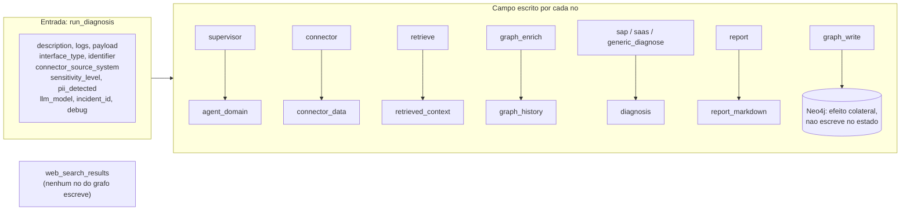
```mermaid
flowchart LR
    subgraph entrada["Entrada: run_diagnosis"]
        e1["description, logs, payload<br/>interface_type, identifier<br/>connector_source_system<br/>sensitivity_level, pii_detected<br/>llm_model, incident_id, debug"]
    end
    subgraph nos["Campo escrito por cada no"]
        sup["supervisor"] --> s1["agent_domain"]
        con["connector"] --> s2["connector_data"]
        ret["retrieve"] --> s3["retrieved_context"]
        gen["graph_enrich"] --> s4["graph_history"]
        dia["sap / saas / generic_diagnose"] --> s5["diagnosis"]
        rep["report"] --> s6["report_markdown"]
        gw["graph_write"] --> n4j[("Neo4j: efeito colateral,<br/>nao escreve no estado")]
    end
    morto["web_search_results<br/>(nenhum no do grafo escreve)"]
    entrada --> nos
```

**Memoria, por camada:**

| Memoria | Onde | Escrita | Volta ao prompt? |
|---|---|---|---|
| Efemera (uma execucao) | `CopilotState` | os nos acima | sim, e o proprio contexto |
| Recuperada | Qdrant | so a ingestao (`app/rag/ingest.py`); somente leitura em *runtime* | sim, sanitizada e redigida |
| Aprendida | Neo4j | `graph_write` grava a hipotese com a descricao redigida | so incidente **verificado por humano** volta como fato; o resto vem rotulado "NAO verificado" (DA-28) |
| Registro e auditoria | PostgreSQL `incidents` | `record_incident`, *best-effort*; `evidence_json` cifrado (DA-60) | nao |

## Fronteiras de confianca e dados sensiveis

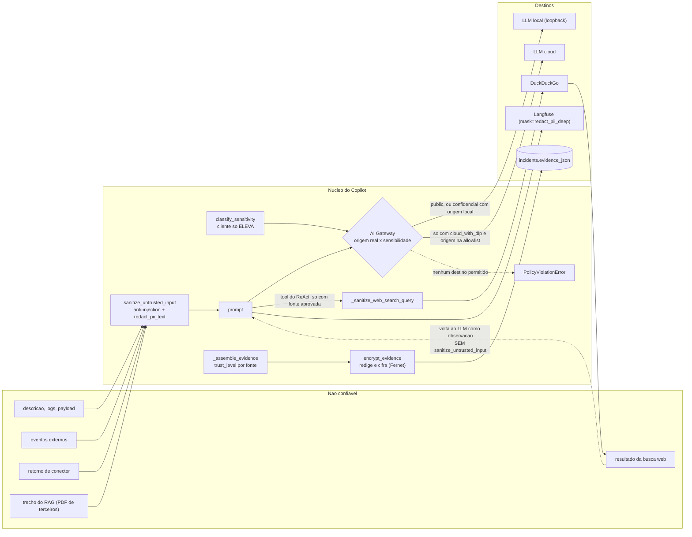
```mermaid
flowchart LR
    subgraph naoconf["Nao confiavel"]
        u["descricao, logs, payload"]
        ev["eventos externos"]
        cx["retorno de conector"]
        rg["trecho do RAG (PDF de terceiros)"]
        wb["resultado da busca web"]
    end
    subgraph nucleo["Nucleo do Copilot"]
        san["sanitize_untrusted_input<br/>anti-injection + redact_pii_text"]
        cls["classify_sensitivity<br/>cliente so ELEVA"]
        pr["prompt"]
        gw{"AI Gateway<br/>origem real x sensibilidade"}
        ev2["_assemble_evidence<br/>trust_level por fonte"]
        enc["encrypt_evidence<br/>redige e cifra (Fernet)"]
        q["_sanitize_web_search_query"]
        pv["PolicyViolationError"]
    end
    subgraph saida["Destinos"]
        loc["LLM local (loopback)"]
        cloud["LLM cloud"]
        ddg["DuckDuckGo"]
        db[("incidents.evidence_json")]
        lf["Langfuse (mask=redact_pii_deep)"]
    end
    u --> san
    ev --> san
    cx --> san
    rg --> san
    san --> pr
    pr --> gw
    cls --> gw
    gw -->|"public, ou confidencial com origem local"| loc
    gw -->|"so com cloud_with_dlp e origem na allowlist"| cloud
    gw -.->|"nenhum destino permitido"| pv
    pr -->|"tool do ReAct, so com fonte aprovada"| q
    q --> ddg
    ddg --> wb
    wb -.->|"volta ao LLM como observacao<br/>SEM sanitize_untrusted_input"| pr
    ev2 --> enc --> db
    pr --> lf
```

**Pontos de controle e onde estao:**

| Controle | Codigo | Observacao |
|---|---|---|
| Neutralizacao de *prompt injection* e redacao de PII na entrada | `app/agent/nodes.py::sanitize_untrusted_input` | aplicado a descricao, logs, payload, dado de conector, trecho do RAG e historico do grafo; **nao** ao retorno da ferramenta de busca web (achado 1 abaixo) |
| Classificacao de sensibilidade | `app/llm/gateway.py::classify_sensitivity` | conector real ou `pii_detected` tornam o dado confidencial; o default e confidencial (B-04) |
| Politica de destino | `app/llm/gateway.py::_provider_allows_sensitivity` | decidida pela **origem real**, nao pelo rotulo do provider (DA-43) |
| Consulta de busca web | `app/agent/nodes.py::_sanitize_web_search_query` | redige URLs, IDocs, GUIDs, tokens e trunca |
| Capacidades MCP | `app/mcp/policy.py` | ferramenta sem entrada no registro e negada (DA-27) |
| Cifragem em repouso | `app/admin/crypto.py::encrypt_evidence` | redige antes de cifrar (DA-60) |

> **Achados da validacao de 2026-10-07 (abertos).**
>
> 1. O texto que a ferramenta de busca web do agente ReAct devolve
>    (`app/agent/nodes.py::_make_web_search_tool`) volta ao LLM como
>    observacao **sem** passar por `sanitize_untrusted_input`. Isso deixa
>    aberta a injecao indireta por pagina web. A seta tracejada do diagrama
>    marca o ponto.
> 2. `app/agent/nodes.py::web_search_node` existe, mas **nao esta no grafo**:
>    nenhum no escreve `web_search_results`. O trecho do prompt que sanitiza
>    "resultado de busca web" le um campo que fica sempre vazio. A unica busca
>    web real e a ferramenta do ReAct do item 1.

## Decisao de rota do AI Gateway

`app/llm/gateway.py::invoke_via_gateway`, na ordem em que o codigo decide:

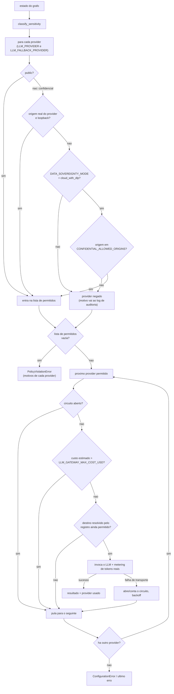
```mermaid
flowchart TD
    A["estado do grafo"] --> B["classify_sensitivity"]
    B --> P["para cada provider<br/>(LLM_PROVIDER e LLM_FALLBACK_PROVIDER)"]
    P --> C{"public?"}
    C -->|"sim"| D["entra na lista de permitidos"]
    C -->|"nao: confidencial"| E{"origem real do provider<br/>e loopback?"}
    E -->|"sim"| D
    E -->|"nao"| F{"DATA_SOVEREIGNTY_MODE<br/>= cloud_with_dlp?"}
    F -->|"nao"| X["provider negado<br/>(motivo vai ao log de auditoria)"]
    F -->|"sim"| G{"origem em<br/>CONFIDENTIAL_ALLOWED_ORIGINS?"}
    G -->|"nao"| X
    G -->|"sim"| D
    D --> H{"lista de permitidos<br/>vazia?"}
    X --> H
    H -->|"sim"| PV["PolicyViolationError<br/>(motivos de cada provider)"]
    H -->|"nao"| I["proximo provider permitido"]
    I --> J{"circuito aberto?"}
    J -->|"sim"| N["pula para o seguinte"]
    J -->|"nao"| K{"custo estimado ><br/>LLM_GATEWAY_MAX_COST_USD?"}
    K -->|"sim"| N
    K -->|"nao"| L{"destino resolvido pelo<br/>registro ainda permitido?"}
    L -->|"nao"| N
    L -->|"sim"| M["invoca o LLM + metering de tokens reais"]
    M -->|"sucesso"| OK["resultado + provider usado"]
    M -->|"falha de transporte"| R["abre/conta o circuito, backoff"]
    R --> N
    N --> S{"ha outro provider?"}
    S -->|"sim"| I
    S -->|"nao"| CE["ConfigurationError / ultimo erro"]
```

A politica efetiva, por provider, e exposta em `GET /llm/policy`
(`app/llm/gateway.py::describe_effective_policy`). O nome do modelo nunca
entra na decisao (invariante 8).

## Maquinas de estado

Os estados abaixo saem de enums e constantes do codigo, e
`tests/test_diagramas.py` reprova se o diagrama e o codigo divergirem.

### Observacao de contrato (DA-52)

Fonte: `app/contracts/diff.py::ObservationStatus`.

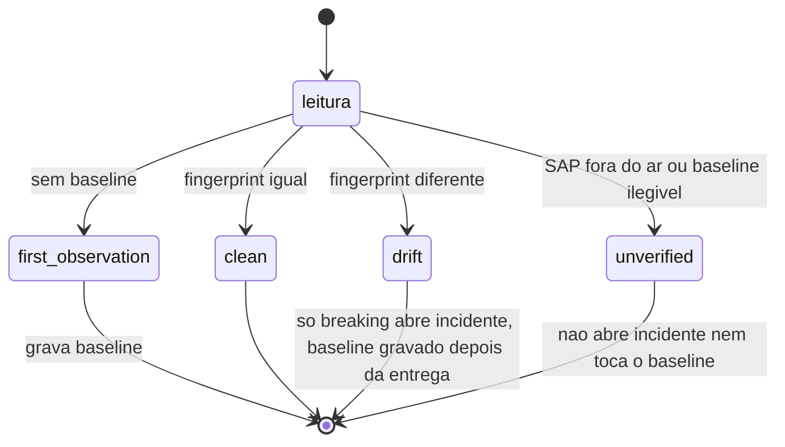
```mermaid
stateDiagram-v2
    [*] --> leitura
    leitura --> unverified: SAP fora do ar ou baseline ilegivel
    leitura --> first_observation: sem baseline
    leitura --> clean: fingerprint igual
    leitura --> drift: fingerprint diferente
    first_observation --> [*]: grava baseline
    clean --> [*]
    drift --> [*]: so breaking abre incidente, baseline gravado depois da entrega
    unverified --> [*]: nao abre incidente nem toca o baseline
```

### Escalonamento (DA-44)

E uma tabela de decisao, avaliada na ordem, e nao um ciclo de vida. Fonte:
`app/agent/escalation.py::compute_escalation_signal` e a classe `Reason`.

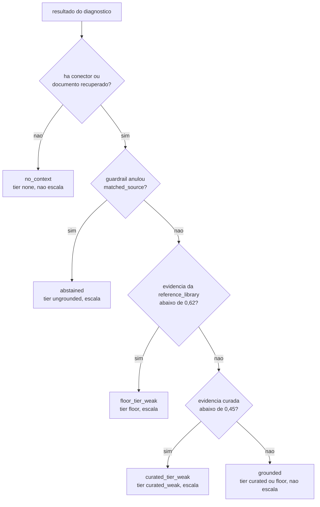
```mermaid
flowchart TD
    A["resultado do diagnostico"] --> B{"ha conector ou<br/>documento recuperado?"}
    B -->|"nao"| NC["no_context<br/>tier none, nao escala"]
    B -->|"sim"| C{"guardrail anulou<br/>matched_source?"}
    C -->|"sim"| AB["abstained<br/>tier ungrounded, escala"]
    C -->|"nao"| D{"evidencia da reference_library<br/>abaixo de 0,62?"}
    D -->|"sim"| FW["floor_tier_weak<br/>tier floor, escala"]
    D -->|"nao"| E{"evidencia curada<br/>abaixo de 0,45?"}
    E -->|"sim"| CW["curated_tier_weak<br/>tier curated_weak, escala"]
    E -->|"nao"| GR["grounded<br/>tier curated ou floor, nao escala"]
```

Os limiares 0,62 e 0,45 nao foram calibrados contra o acervo (ver o README,
DA-44). O sinal e informativo: o grafo nao muda de caminho por causa dele.

### Task A2A (DA-14)

Fonte: `app/a2a/task_manager.py` (`A2ATask.state`, `TERMINAL_STATES`).

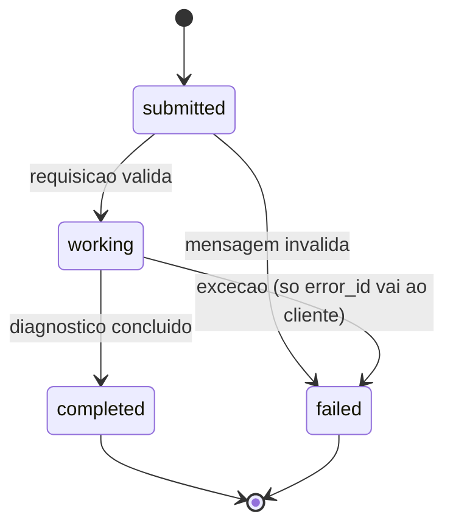
```mermaid
stateDiagram-v2
    [*] --> submitted
    submitted --> failed: mensagem invalida
    submitted --> working: requisicao valida
    working --> completed: diagnostico concluido
    working --> failed: excecao (so error_id vai ao cliente)
    completed --> [*]
    failed --> [*]
```

Com `configuration.blocking=false`, a resposta volta em `working` e o
cliente consulta com `tasks/get`.

### Usuario da UI (DA-55)

Fonte: constantes `STATUS_*` de `app/webusers.py` e `PATCH /admin/api/users/{id}`.

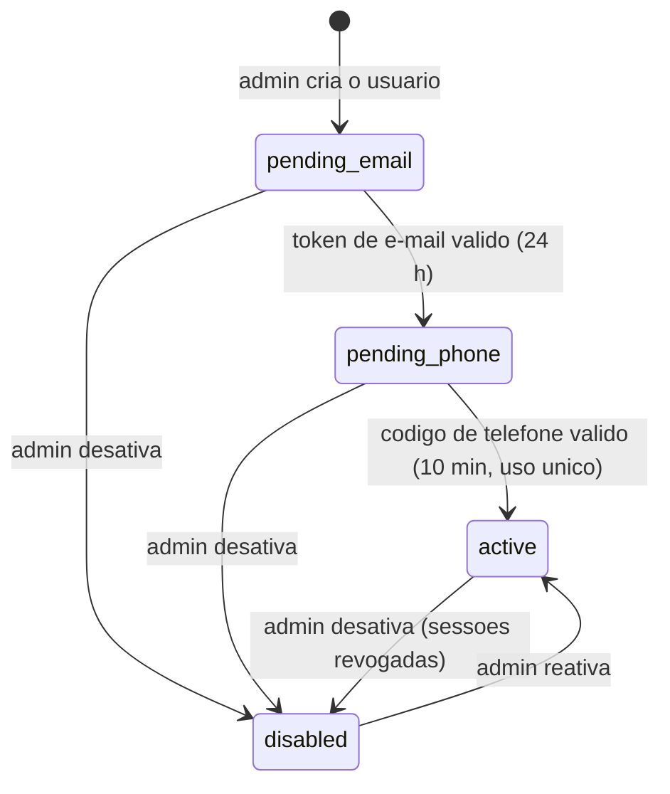
```mermaid
stateDiagram-v2
    [*] --> pending_email: admin cria o usuario
    pending_email --> pending_phone: token de e-mail valido (24 h)
    pending_phone --> active: codigo de telefone valido (10 min, uso unico)
    pending_email --> disabled: admin desativa
    pending_phone --> disabled: admin desativa
    active --> disabled: admin desativa (sessoes revogadas)
    disabled --> active: admin reativa
```

### Circuit breaker (conectores e provedores de LLM)

Fonte: `app/circuit_breaker.py` (namespaces `conn` e `llm`). O estado
meio-aberto e implicito: depois do *cooldown*, a proxima tentativa passa.

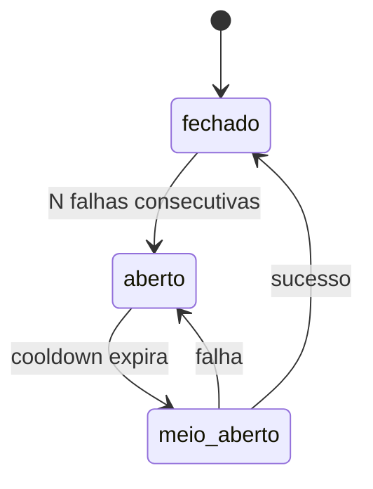
```mermaid
stateDiagram-v2
    [*] --> fechado
    fechado --> aberto: N falhas consecutivas
    aberto --> meio_aberto: cooldown expira
    meio_aberto --> fechado: sucesso
    meio_aberto --> aberto: falha
```

Nos conectores, so indisponibilidade conta como falha (5xx, 429, rede); 401,
403 e outros 4xx nao abrem o circuito (M-06).

### Evento recebido (idempotencia)

Fonte: `app/events/idempotency.py` (`is_duplicate`, `mark_completed`, `release`).
A chave e o par `(source, id)` do CloudEvent. Com `REDIS_URL`, o webhook so
enfileira e a reivindicacao acontece no worker (`app/queue.py`), com o estado
no Redis; sem Redis, acontece no processo da API, em memoria.

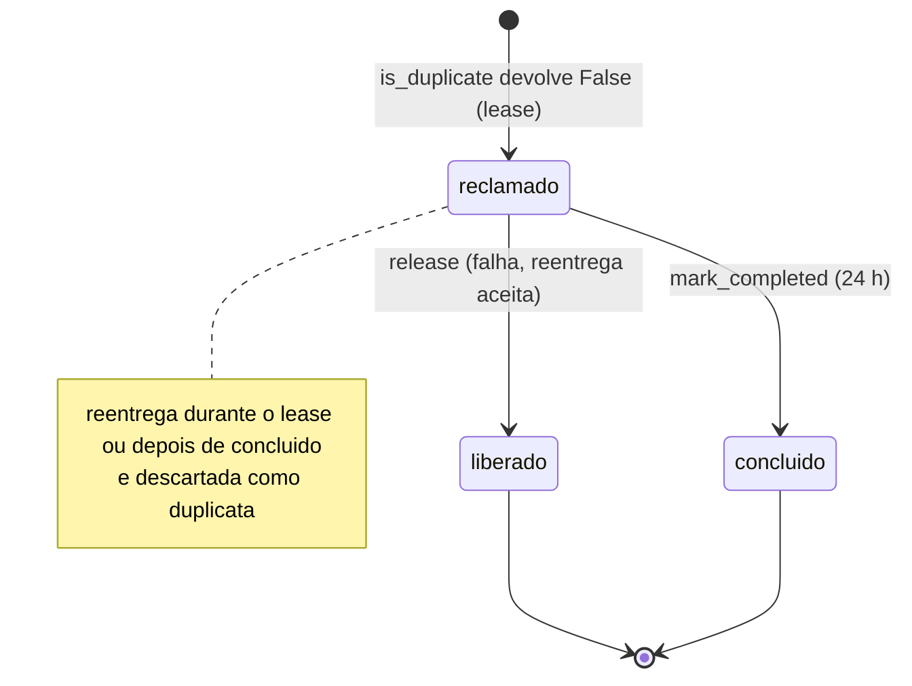
```mermaid
stateDiagram-v2
    [*] --> reclamado: is_duplicate devolve False (lease)
    reclamado --> concluido: mark_completed (24 h)
    reclamado --> liberado: release (falha, reentrega aceita)
    liberado --> [*]
    concluido --> [*]
    note right of reclamado
        reentrega durante o lease ou depois de concluido
        e descartada como duplicata
    end note
```

## LLM Gateway - por que e como

Ver `app/llm/factory.py` e a Decisao de Arquitetura #10 no README. Em
uma frase: `Settings.llm_provider` decide entre Ollama (default,
local-first, sem custo de API), OpenAI ou Azure OpenAI, sem o resto do
codigo (`app/agent/nodes.py`, prompt, guardrails) precisar saber qual foi
escolhido - todos implementam a mesma interface `BaseChatModel` do
LangChain.

## Hybrid Inference - fallback de resiliencia (DA-20)

Quarto item do roadmap "Projeto evolucao planejada" (apos AI Gateway/
Evidence Layer, fechamento de autenticacao do A2A e servidor MCP).
Criterio escolhido: RESILIENCIA, nao roteamento por qualidade/
complexidade (as duas alternativas descartadas - escalar por
`evidence_strength` baixo, ou rotear por complexidade do caso antes de
chamar o LLM - custam uma segunda chamada de LLM em parte dos casos e
exigem calibrar um limiar; resiliencia so entra em acao quando o
provider primario esta genuinamente indisponivel).

`app/llm/factory.py::invoke_with_hybrid_fallback()` roda a chamada com
`settings.llm_provider` (Ollama, tipicamente) e, SE
`settings.llm_fallback_provider` estiver configurado (`.env`, vazio por
default = comportamento identico a antes desta fase) E a falha for de
TRANSPORTE (`ConnectionError`/`httpx.ConnectError`/
`httpx.TimeoutException` - Ollama fora do ar, timeout de rede), refaz a
MESMA chamada com o provider de fallback antes de desistir. Erro de
APLICACAO (JSON malformado, prompt invalido) NUNCA aciona o fallback -
subir normalmente evita mascarar um bug real atras de uma segunda
chamada de LLM (custo/latencia desnecessarios). Os sub-agentes de
diagnostico (`sap_diagnosis_node`/`saas_diagnosis_node`, ver DA-22
logo abaixo) usam isso, via `_run_diagnosis_agent()`, para a chamada
ao agente ReAct; qual provider respondeu de fato fica exposto em
`DiagnosisResponse.llm_provider_used` - transparencia, nao so um
fallback silencioso.

## Conectores - mock vs. real, hoje

Todo conector agora segue o MESMO criterio: configuracao ausente = modo
demo/mock; configuracao presente = chamada real. Nenhum exige mudar
codigo Python para ativar - so preencher variaveis no `.env`.

| Conector | Estado hoje | Falta so |
|---|---|---|
| `ODataConnector` | **Real** (OAuth2 client_credentials + OData v2) quando `ODATA_SERVICE_URL` configurado — ⚠️ **NUNCA validado contra instância real** | Um tenant CPI/Integration Suite real para validar contra producao |
| `RFCConnector` | **Real, validado contra ABAP Cloud Developer Trial real** (A4H rel 754, `RFC_SYSTEM_INFO` via `pyrfc` 3.3.1 + SDK 7.50 PL19) | `BAPI_IDOC_STATUS` nao disponivel no Trial — criar funcao Z ou usar landscape real para validar BAPI especifica |
| `ServiceNowConnector` | **Real, validado contra ServiceNow PDI real** (Table API via HTTP, Basic Auth) | Nada - segundo conector com validacao ponta-a-ponta contra sistema real |
| `SalesforceConnector` | **Real, validado contra Salesforce Developer Edition real** (OAuth2 Client Credentials + SOQL) | Nada - primeiro conector com validacao ponta-a-ponta contra sistema real, nao so mock |
| `POConnector` | **Real** (Basic Auth nativo + `/mdt/api/1.0/facade`) quando `PO_BASE_URL` apontar para a fachada exposta. ⚠️ **API NAO PUBLICA**: o Message Monitor nao esta no Help Portal e varia entre patches/releases, e o payload e' lido de forma tolerante porisso | Validar contra um PO/PI real (7.5) e confirmar o path/formato; o Alert Inbox (`/nwa/api/1.0/alerts`) ainda nao foi implementado |
| `WorkdayConnector` | **Real** (OAuth2 + REST) quando `WORKDAY_TENANT` configurado — ⚠️ **NUNCA validado contra instância real** | Um tenant Workday real |
| `AribaConnector` | **Real** (OAuth2 + REST) quando `ARIBA_BASE_URL` configurado — ⚠️ **NUNCA validado contra instância real** | Acesso a Ariba Network/API Business Hub |
| `SuccessFactorsConnector` | **Real** (OAuth2 Client Credentials + OData v2 PerPerson) quando `SFSF_BASE_URL` configurado — ⚠️ **NUNCA validado contra instância real** (DA-34) | Um tenant SuccessFactors real; no cenário de referência SuccessFactors↔Workday só o lado Workday foi exercitado |
| `CAPConnector` | **Real, validado contra SAP CAP real** (OData v4 + XSUAA client_credentials, BTP Trial) | Nada - terceiro conector com validacao ponta-a-ponta contra sistema real |
| `APIManagementConnector` | ⚠️ **Implementado com schema ESPECULATIVO** (OAuth2 Client Credentials + endpoint assumido por analogia a produtos similares - NAO confirmado contra documentacao real do SAP API Management) | Validar contrato real da Analytics API contra um tenant de verdade; corrigir endpoint/schema conforme necessario |

**Nota sobre a assimetria SuccessFactors↔Workday (resolvida em DA-34):**
o cenario de referencia "SuccessFactors↔Workday" era representado ate a
DA-29 SO pelo lado Workday. `SuccessFactorsConnector` foi implementado em
DA-34 (commit `0e387d7`) via OAuth2 Client Credentials + OData v2 PerPerson
— ver secao "SuccessFactors EC - conector (DA-34)" abaixo. A assimetria
esta fechada.


"Real" aqui quer dizer: o codigo de producao (fetch de token OAuth2,
montagem do header, parsing da resposta) e exercitado de verdade nos
testes via `httpx.MockTransport` simulando a API documentada de cada
fornecedor - nao existe, para nenhum destes tres ultimos (Salesforce/
Workday/Ariba) nem para o RFC, uma conta/tenant real disponivel para
validar contra producao. Essa e a mesma ressalva ja feita sobre
`RFCConnector._fetch_real` desde a Fase 8, agora estendida a todos os
conectores no mesmo padrao - nao e uma limitacao nova, e a mesma
limitacao aplicada com consistencia.

Por que RFC (nao so OData) importa para o posicionamento do produto:
clientes ainda em ECC on-premise, sem BTP/Integration Suite, tipicamente
so tem RFC/BAPI como via de automacao - e essa e a base de clientes que
nao consegue adotar SAP AI Core (que exige HANA Cloud). Ver
[TCO_SAP_AI_CORE_VS_SELF_HOSTED.md](TCO_SAP_AI_CORE_VS_SELF_HOSTED.md).

## RAG

Duas collections Qdrant (`app/rag/ingest.py`) — ambas participam do
fluxo de diagnostico a partir da v2.0:

- `sap_incident_docs` — documentos de troubleshooting (`.md`), hybrid
  search (dense + BM25 esparso, fusao RRF)
- `sap_reference_library` — PDFs tecnicos SAP (guias, notas, livros),
  busca densa; schema rico: `source`, `text`, `filename`, `page_number`,
  `document_id`, `chunk_index`, `file_hash`, `title`, `category`,
  `ingested_at` (parser: `pymupdf4llm`, preserva estrutura Markdown)

**Retrieval unificado (`_retrieve_unified`):** consulta as duas
collections em paralelo, funde os resultados por score composto
(`alpha=0.7 × cosine + 0.3 × rrf_normalizado`) e passa os candidatos
para o **reranker semantico** (`cross-encoder/ms-marco-MiniLM-L-6-v2`
via `sentence-transformers`) que reordena por relevancia real ao par
`(query, chunk)` — muito mais preciso que similaridade de cosseno pura.

**Ingestao:** idempotente por IDs deterministicos
(`md5(document_id::chunk_index)`) — sem delete-before-upsert. Estado
salvo por hash de conteudo (`hash:filename`) em vez de path, detectando
mudancas mesmo com renomeacao de arquivo.

## GraphRAG (Neo4j) - opt-in, nao no caminho default

`app/rag/graph_store.py` implementa o que antes era so "reservado para
uso futuro": grava cada diagnostico concluido no Neo4j como um grafo
(`Incident -AFFECTS-> Interface -RUNS_ON-> System`, `Incident
-HAS_ROOT_CAUSE_IN-> Document`) e consulta esse grafo por incidentes
anteriores na MESMA interface antes de gerar um novo diagnostico -
contexto de recorrencia ("essa RFC destination ja teve 3 incidentes
antes, sempre pela mesma causa") que a busca vetorial no Qdrant nao da,
porque Qdrant acha o documento de CONHECIMENTO mais parecido, nao o
HISTORICO relacional de uma interface especifica.

Continua **desligado por default** (`GRAPH_RAG_ENABLED=false`) - a
decisao de manter assim nao mudou (ver Decisao de Arquitetura #9): o
Qdrant ja resolve o caso de uso principal, e o grafo so agrega valor
depois de meses de historico real acumulado, nao com os 8 documentos de
demonstracao deste repositorio. A diferenca em relacao a antes desta
fase e que agora **existe codigo real, testado (com driver fake, ver
`tests/test_graph_store.py`), pronto para ligar** quando fizer sentido:

1. `docker compose --profile graphrag up -d neo4j` (nao sobe com
   `docker compose up` default - profile dedicado, ver `docker-compose.yml`)
2. `GRAPH_RAG_ENABLED=true` no `.env`

Nao ha um passo 3 manual: desde a Decisao de Arquitetura #19 (DA-21),
`ensure_constraints()` roda sozinho no `lifespan` do FastAPI quando a
flag esta ligada (ver `app/main.py`) - o antigo
`uv run python -m app.rag.graph_store --init` continua disponivel para
uso manual/explicito, mas deixou de ser obrigatorio.

Nao ha nada para descomentar no Python - so essa flag + a infra de fato
existir. Com a flag desligada, `build_graph()` monta exatamente a mesma
sequencia de nodes de antes desta fase (ver `app/agent/graph.py`),
custo zero. **Nao testado contra um Neo4j real** (sem Docker daemon
disponivel no ambiente onde isso foi construido) - mesma ressalva
honesta do `RFCConnector._fetch_real`.

### Hardening operacional (DA-21): degradacao graciosa, dedup e limpeza

Ligar GraphRAG significa que o Neo4j passa a estar no caminho critico
de CADA diagnostico (`graph_enrich_node` antes, `graph_write_node`
depois - ver `app/agent/graph.py`). Sem cuidado, uma instabilidade
pontual do Neo4j (restart, rede, pool esgotado) derrubaria o
diagnostico inteiro por causa de uma camada que deveria ser so um
enriquecimento, nao uma dependencia rigida. Tres reforcos, todos
cobertos por teste com driver fake (`tests/test_graph_store.py`,
`tests/test_nodes_graph_degradation.py`):

- **Degradacao graciosa por tipo de excecao** - `GRAPH_UNAVAILABLE_EXCEPTIONS`
  (`neo4j.exceptions.DriverError` + `TransientError`) delimita exatamente
  o que conta como "infra indisponivel agora, siga sem grafo": conexao
  recusada, timeout, servidor em restart. `graph_enrich_node` cai para
  "sem historico" (`graph_history: []`) e `graph_write_node` pula a
  escrita, ambos logando um `warning` - o diagnostico principal (RAG +
  LLM) segue intacto. Deliberadamente NAO inclui `Neo4jError` em geral:
  um `ConstraintError`/`CypherSyntaxError` sinaliza um bug NOSSO
  (Cypher ou schema errado), nao indisponibilidade de infra, e continua
  propagando normalmente - mesmo principio que separa falha de
  transporte de erro de aplicacao no Hybrid Inference (DA-20).
- **Formatacao com deduplicacao por recorrencia** -
  `format_graph_context_for_prompt()` agrupa ocorrencias CONSECUTIVAS
  da mesma causa raiz numa unica linha com contador ("ja ocorreu 3x"),
  em vez de repetir a mesma linha e desperdicar orcamento de prompt numa
  interface "flapping" (falhando repetidamente pela mesma causa).
  Agrupamento e so entre vizinhos - a lista ja vem mais-recente-primeiro,
  e uma causa diferente intercalada quebra o agrupamento, para nao
  esconder que algo diferente aconteceu no meio.
- **Utilitario manual de limpeza** - `prune_ungrounded_hypotheses()`
  (CLI: `--prune-ungrounded --older-than-days N`, default 90) remove
  hipoteses NAO confirmadas (`is_grounded=false`) antigas, que so
  acumulam ruido no grafo sem nunca terem sido corroboradas. Incidentes
  com causa raiz confirmada (`is_grounded=true`) nunca sao tocados, sob
  nenhuma idade. E manutencao explicita do operador - nunca chamada
  automaticamente por nenhum node ou pelo `lifespan`, mesmo principio de
  "nada e deletado sem o operador pedir" usado em outras partes deste
  projeto.

**Nao-objetivo explicito desta fase**: nenhuma das tres mudancas acima
foi validada contra um Neo4j real (mesma limitacao de ambiente das
demais integracoes reais deste projeto - sem Docker disponivel onde
isso foi construido). A cobertura de teste e com driver fake
(`FakeSession`, mesmo padrao usado nos conectores HTTP com
`httpx.MockTransport`); validar contra um Neo4j real fica como proximo
passo do lado do operador/autor, fora deste ambiente de desenvolvimento.

## Multi-agent - supervisor + especialistas por dominio (DA-22)

Antes desta fase, um unico node (`diagnose_node`) tratava QUALQUER
incidente com uma persona fixa de "especialista em integracao SAP" -
incoerente com o principio de design deste projeto de que SAP e um
conector entre iguais, nao o eixo arquitetural (ver Decisao de
Arquitetura #8/#13 no README). Um incidente de webhook do Salesforce
recebia a mesma expertise "OData/IDoc/RFC/CPI" que um incidente de RFC.

**Decisao:** um `supervisor_node` (`app/agent/supervisor.py`) roda
PRIMEIRO no grafo (antes ate do `connector`) e classifica
deterministicamente o dominio do incidente:

- `interface_type` em `{odata, rfc, cap}` -> `"sap"`
- `interface_type` em `{servicenow, salesforce, workday, ariba}` ->
  `"saas"`
- sem `interface_type` (fluxo por descricao livre): palavra-chave SAP
  na descricao (`idoc`, `iflow`, `cpi`, `rfc`, `bapi`, `abap`, `btp`,
  etc.) -> `"sap"`; senao -> `"generic"`

A classificacao e CODIGO, nao uma chamada de LLM - mesmo principio ja
aplicado aos guardrails de confianca (DA-15): decisao estrutural
barata, deterministica e 100% testavel sem depender de infraestrutura
de IA. `app/agent/graph.py::_route_to_specialist` le `agent_domain` do
estado e direciona o grafo (via `add_conditional_edges`) para UM dos
dois sub-agentes especialistas - nunca os dois no mesmo incidente, sem
duplicar custo de chamada de LLM:

- `sap_diagnosis_node` - persona SAP (OData, IDoc, RFC, CPI/Integration
  Suite, BTP)
- `saas_diagnosis_node` - persona multi-fornecedor (ServiceNow,
  Salesforce, Workday, Ariba, APIs REST/OAuth2 em geral); tambem cobre
  `"generic"` (nenhum dominio identificado), aplicando o mesmo
  raciocinio generalista de troubleshooting de integracao

Os dois sub-agentes compartilham o mesmo nucleo (`_run_diagnosis_agent`
em `app/agent/nodes.py`) - agente ReAct, Hybrid Inference (DA-20),
parsing de JSON e guardrails de confianca (DA-15) permanecem
IDENTICOS; a unica diferenca entre eles e a persona/expertise injetada
no prompt. Qual dominio foi usado fica exposto em
`DiagnosisResponse.agent_domain` (mesma filosofia de transparencia do
`llm_provider_used`, DA-20) e aparece no relatorio Markdown final.

**Validacao:** `tests/test_supervisor.py` (classificacao pura, sem
LLM) e `tests/test_nodes_multiagent.py` (cada sub-agente recebe a
persona certa, o roteamento condicional manda para o node certo -
incluindo o caso de seguranca `agent_domain` ausente cair no
especialista generalista em vez de quebrar - e `agent_domain` chega
ate `DiagnosisResponse`), todos mockando `invoke_with_hybrid_fallback`
diretamente (sem Ollama real, mesmo padrao de `test_llm_factory.py`).
`build_graph()` foi verificado manualmente compilando com sucesso nos
dois modos (GraphRAG ligado/desligado), confirmando os nodes esperados
no grafo resultante.

## Rodando sem depender de infra externa

O `docker-compose.yml` na raiz deste repositorio sobe Ollama + Qdrant +
a API num unico `docker compose up -d`, sem depender de infra externa
(incluindo Neo4j opcional para GraphRAG e stack completo do Langfuse
para observabilidade). Isso importa porque este projeto tambem funciona
como demonstracao para terceiros (cliente, entrevistador) - que nao
têm, nem deveriam precisar montar, o ambiente de desenvolvimento so
para rodar o projeto uma vez. Langfuse, Neo4j e infra opcional:
sem as chaves/configuracao, o app roda normalmente, so sem tracing/
GraphRAG.

## A2A (Agent2Agent) - interoperabilidade externa

`app/a2a/` implementa a proposta arquivada em
a proposta original da camada A2A (documento interno, fora do repositório)
(ler esse documento para o contexto de negocio completo e a ressalva
sobre a GA inbound do Joule, prevista para Q4/2026 e ainda nao
disponivel). Em resumo tecnico:

- **Agent Card** (`app/a2a/agent_card.py`), publicado em
  `GET /.well-known/agent-card.json` (path padrao do protocolo A2A)
- **Task manager** (`app/a2a/task_manager.py`) - traduz uma mensagem
  A2A em `IncidentRequest` e chama `run_diagnosis()`, a MESMA funcao
  usada pelo `/diagnose` REST; nao ha logica de diagnostico duplicada
- **Servidor JSON-RPC 2.0** (`app/a2a/server.py`), montado em
  `POST /a2a`, com os metodos `message/send` e `tasks/get`

Simplificacao deliberada: dos 8 estados de task que o protocolo A2A
define, so os 4 que este agente sincrono e autocontido realmente
alcanca sao implementados (`submitted -> working -> completed|failed`)
- `input_required`/`auth_required`/`canceled`/`rejected` nao se aplicam
a um agente que nao pede dado adicional a meio do processo nem tem
fluxo de autorizacao interativo. Autenticacao e uma chave estatica via
header (`A2A_API_KEY`). Desde a DA-18, essa chave NUNCA fica vazia em
memoria: se nao vier do `.env`, `app/main.py::_ensure_api_keys_configured`
gera uma aleatoria no startup e avisa no log - o endpoint nunca fica
silenciosamente aberto. Uma chave de OAuth2/JWT entre agentes continua
sendo o gap de producao real (exigiria um fluxo de autorizacao
interoperavel entre agentes de fornecedores diferentes), nao uma
limitacao escondida.

Testado com FastAPI `TestClient` + um `diagnosis_fn` stub injetado no
`TaskManager` (mesmo padrao de injecao de dependencia dos conectores
HTTP) - inclui um teste que prova que uma falha na orquestracao vira
task com `status.state == "failed"`, nao um erro HTTP 500, que e o
comportamento correto de um agente A2A (erro de negocio, nao de
transporte).

## MCP (Model Context Protocol) - capability catalog, nao so "conectar um LLM a uma ferramenta"

`app/mcp/server.py` expoe o Copilot como SERVIDOR MCP (nao cliente -
decisao explicita, ver docstring do modulo para a leitura alternativa
descartada), montado em `POST /mcp/` (com barra final - `app.mount()`
redireciona 307 a partir de `/mcp` sem barra, comportamento padrao do
Starlette, nao especifico do MCP). Terceiro item do roadmap "Projeto
evolucao planejada", depois de AI Gateway minimo/Evidence Layer (DA-15/
16/17) e do fechamento de autenticacao do A2A (DA-18) - a especificacao
MCP de 2026 caminha para stateless scaling, cache de capability catalog
e autorizacao empresarial, o que aproxima MCP de infraestrutura de
producao em vez de um protocolo isolado.

Duas ferramentas, ambas READ-ONLY ("leitura primeiro" - o roadmap e
explicito sobre isso):

- `diagnose_incident` - chama a MESMA `run_diagnosis()` usada por
  `/diagnose` e `/a2a`; nao ha logica de diagnostico duplicada pela
  terceira vez.
- `list_connectors` - inspeciona `settings` (sem nenhuma chamada de
  rede) e informa, por `interface_type`, se o conector esta configurado
  para dados reais ou opera em modo demo/mock.

Autenticacao: reusa `settings.api_key` (o MESMO X-API-Key de
`/diagnose`, DA-18) via `RequireApiKeyMiddleware`, um middleware ASGI
simples - o SDK MCP oferece `AuthSettings`/`TokenVerifier` (OAuth2)
para autorizacao enterprise real, mas isso seria sobre-engenharia
tendo REST e A2A ja usando API Key estatica; manter um unico mecanismo
de autenticacao em toda a superficie HTTP em vez de dois.

Detalhe de implementacao que vale registrar (pegou um teste real nesta
fase): `StreamableHTTPSessionManager.run()` - que gerencia as sessoes
MCP - so pode ser chamado UMA vez por instancia de processo; por isso
seu ciclo de vida entra no `lifespan` do app FastAPI raiz (`app.mount()`
NAO propaga eventos de lifespan para sub-apps automaticamente), e por
isso os testes em `tests/test_mcp.py` usam um UNICO
`with TestClient(app) as ...` para toda a suite daquele arquivo.

## Event Mesh - ingestao orientada a evento (DA-23)

Ate esta fase, o Copilot so reagia a chamadas EXPLICITAS: `POST
/diagnose` humano, mensagem A2A, ou tool call MCP. Fechando o sexto
item do roadmap arquitetural, `POST /events/incident`
(`app/main.py` + `app/events/`) permite que um sistema de monitoracao
externo (CPI, Solution Manager, um listener de fila/IDoc) dispare o
diagnostico automaticamente, publicando um evento em vez de esperar
alguem chamar a API.

**Formato do evento:** [CloudEvents](https://cloudevents.io/) 1.0, modo
estruturado - `specversion`/`type`/`source`/`id` obrigatorios, `time`
opcional, mais `data` (validacao 2026-10-07: `id` e `source` eram opcionais
e `specversion` nao existia; a deduplicacao agora usa o par
`source`+`id`, como a especificacao define) - o mesmo formato que o SAP Event
Mesh usa em modo **REST/Webhook push subscription** (alem do AMQP 1.0
nativo). `data` carrega exatamente os mesmos campos de
`IncidentRequest` (a informacao e a MESMA que um humano digitaria em
`/diagnose`, so que originada automaticamente). Hoje so um `type` e
reconhecido - `com.sap.integration.incident.detected.v1` - modelado
como `Literal` em `IncidentEventEnvelope` (`app/models.py`): qualquer
outro valor e rejeitado com `422` automaticamente pelo Pydantic, em
vez de tentar interpretar silenciosamente um payload de formato
desconhecido.

**Por que webhook e nao um consumidor AMQP:** nao e um atalho para
evitar montar um broker real - webhook e um modo de entrega de
PRIMEIRA CLASSE do proprio SAP Event Mesh, documentado ao lado do
AMQP, e e o unico que da para exercitar de ponta a ponta com testes
reais (TestClient HTTP) sem depender de infraestrutura externa - mesma
logica pragmatica ja aplicada ao GraphRAG (DA-21) e ao MCP (DA-19).

**Decisao de auth:** `X-Event-Mesh-Api-Key` e uma chave DEDICADA,
separada de `X-API-Key` (`/diagnose`) e `X-A2A-Api-Key` (`/a2a`) -
mesmo padrao de geracao automatica no startup se nao configurada
(DA-18). Isolamento deliberado: o webhook secret normalmente fica
configurado num sistema de monitoracao externo (fora do controle
direto deste projeto), entao um vazamento ali nao deve comprometer os
outros dois canais de acesso.

`app/events/consumer.py::handle_incident_event()` converte o evento em
`IncidentRequest` e chama a MESMA `run_diagnosis()` usada por
`/diagnose` e pela camada A2A - nenhuma logica de diagnostico
duplicada, so mais um ponto de entrada.

**Nao-objetivo explicito desta fase:** processamento assincrono/fila
real (hoje e sincrono - o webhook so retorna quando o diagnostico
termina, sujeito ao mesmo rate limit de 10/min de `/diagnose`) e
consumo AMQP direto do SAP Event Mesh - **entregue em DA-32** (ver secao
"Consumidor AMQP 1.0 assíncrono via Solace Cloud" abaixo, commit `67b78e8`).

**Validacao:** `tests/test_events.py` cobre o mapeamento evento ->
IncidentRequest, a chamada a `run_diagnosis()`, autenticacao (401 sem
chave/chave errada), rejeicao de `type` desconhecido (422), limite de
tamanho da descricao (422, mesma regra de `/diagnose`) e geracao
automatica da chave no startup - tudo com `run_diagnosis` mockado, sem
depender de Ollama/Qdrant reais.

## Deploy em produção - SAP BTP Kyma Runtime (DA-24)

Fecha o último item do roadmap arquitetural consolidado deste projeto.
`deploy/kyma/` (manifests + `README.md` próprio com o passo a passo)
contém um Deployment (2 réplicas, probes em `/health`, usuário
não-root), Service, HorizontalPodAutoscaler (2-6 réplicas por CPU),
ConfigMap (config não sensível) e um `secret.example.yaml` - TEMPLATE,
nunca aplicado direto, com todo valor prefixado `CHANGE-ME` (testado em
`tests/test_kyma_manifests.py::test_secret_example_has_no_real_looking_values`).

**APIRule** (módulo API Gateway do Kyma) expõe o Service pelo Istio
Gateway gerenciado, com `accessStrategy: noop` - o Copilot já tem sua
própria autenticação por API key em cada endpoint (DA-18/DA-23), então
não duplica autenticação na camada de rede. Evoluir para `jwt`
(validando tokens XSUAA do BTP) seria a evolução natural de uma
integração mais profunda com serviços BTP (Destination service,
XSUAA) - escopo explicitamente descartado nesta fase em favor de só
empacotar o deploy (ver decisão de escopo no README, ### 22).

**Correções feitas no `Dockerfile` nesta mesma fase** (descobertas ao
revisar o empacotamento para produção, corrigidas na origem em vez de
contornadas só nos manifests - mesmo princípio de "sem débito técnico"
aplicado o resto da sessão):

- `COPY pyproject.toml uv.lock` + `uv sync --frozen` - build
  reproduzível (antes, `uv sync` sem lockfile no build resolvia contra
  as versões mais recentes compatíveis com `pyproject.toml`, não contra
  as travadas no lockfile commitado)
- usuário não-root (`appuser`, uid 1000) - boa prática de segurança
  para clusters com PodSecurityStandards restritivos
- `CMD` chama `.venv/bin/uvicorn` diretamente - corrige na origem o bug
  documentado em `docs/DEPLOY.md` (`uv run` ressincronizando dependências
  de dev a cada start, derrubando o container em rede restrita);
  `docker-compose.yml` não precisa mais do `command:` override que
  contornava isso

**Não-objetivos explícitos desta fase** (mesma honestidade já aplicada
ao GraphRAG/DA-21 e ao MCP/DA-19): nenhum manifest foi validado contra
um cluster Kyma real (nenhum cluster acessível neste ambiente de
desenvolvimento) - o schema do CRD `APIRule` já mudou de versão mais de
uma vez na história do Kyma, então o `apiVersion` usado deve ser
conferido contra o cluster alvo antes de aplicar de verdade; nenhum
build/push de imagem Docker foi testado (Docker não disponível neste
ambiente); Qdrant e Neo4j (GraphRAG, que continua opt-in) não são
implantados por este bundle - são pré-requisitos externos, documentados
em `deploy/kyma/README.md`.

**Validação:** `tests/test_kyma_manifests.py` (11 testes) garante que
todo YAML do bundle é sintaticamente válido e internamente consistente
- mesmo namespace em todos os recursos namespaced, probes de saúde em
`/health` (nunca um endpoint autenticado, para não travar o rollout em
`CrashLoopBackOff` por falta de Secret), Pod rodando não-root, HPA/APIRule
apontando para o Deployment/Service certos, e o `kustomization.yaml`
referenciando só arquivos que existem (excluindo deliberadamente o
template de Secret).

**Follow-up pós-DA-24 - multi-stage build do frontend no `Dockerfile`:**
a DA-24 tocou o `Dockerfile` duas vezes (reprodutibilidade e usuário
não-root) mas deixou passar um débito já autodenunciado em
`docs/DEPLOY.md` ("Melhoria pendente: mover isso para um multi-stage
build no Dockerfile"): a imagem copiava `static/` pronto (`COPY static/
static/`), mas `static/dist/` (o build do frontend React/Vite) está no
`.gitignore` e só existia se alguém rodasse manualmente `npm run build`
+ `cp` antes de `docker build` - um `git clone` limpo seguido de
`docker build -t ... .` (exatamente o passo 1 do `deploy/kyma/README.md`)
falhava ou gerava uma imagem sem frontend. Corrigido com um segundo
estágio (`node:22-slim AS frontend-build`) que roda `npm ci && npm run
build` a partir do código-fonte em `frontend/`, e o estágio final copia
`frontend/dist` para `static/dist` via `COPY --from=frontend-build`.
`docs/DEPLOY.md` seção 2 atualizada para refletir que não há mais passo
manual; `.dockerignore` adicionado (não existia) para não mandar
`frontend/node_modules/`, `.venv/` e `.git/` para o contexto de build.
Validado rodando `npm ci && npm run build` isoladamente (produz o
`dist/` esperado: `assets/`, `favicon.svg`, `icons.svg`, `index.html`) -
o build de imagem completo em si não foi testado (Docker não disponível
neste ambiente, mesma limitação já registrada acima).

Junto com esse fix, um segundo problema encontrado na mesma revisão foi
corrigido: o modelo LLM default estava inconsistente entre
`app/config.py` (`qwen3-coder-next:latest`, fonte canônica) e
`.env.example`/`docker-compose.yml` (ambos `qwen2.5-coder:32b`) - os
dois arquivos alinhados ao valor canônico do `config.py`.

## Evidence/Trust Layer + correcao do threshold do RAG (DA-25)

Uma segunda revisao arquitetural externa, feita apos o roadmap
consolidado (AI Gateway → A2A → MCP → Hybrid Inference → GraphRAG →
Multi-agent → Event Mesh → BTP/Kyma), apontou um backlog priorizado
(P0-P3). Esta fase ataca os dois itens P0 restantes (os outros dois,
Docker multi-stage e `uv.lock`, ja estavam corrigidos - ver secao
"Follow-up pos-roadmap" acima).

**1. Threshold do RAG aplicado cedo demais (antes do reranker).**
`app/rag/retriever.py::_retrieve_hybrid` descartava candidatos com
cosseno denso abaixo de `score_threshold` (0.5) ANTES do cross-encoder
(reranker) ter qualquer chance de avaliar a relevancia semantica de
verdade - um documento com BM25/RRF excelente (match de termo exato,
ex: "IDoc status 51") mas cosseno moderado (ex: 0.47) era descartado
sem nunca chegar ao reranker. Corrigido invertendo a ordem:

```
dense + sparse -> RRF -> candidate pool -> cross encoder -> evidence threshold -> top K
```

- `_retrieve_hybrid` agora so descarta ruido semantico extremo
  (`MIN_CANDIDATE_FLOOR = 0.05`), nao mais o threshold real de
  confianca; o pool de candidatos da fusao RRF tambem cresceu
  (`fusion_limit = max(top_k * 5, HYBRID_PREFETCH_LIMIT)` em vez de
  `limit=top_k`), porque antes o proprio Qdrant ja truncava a fusao
  para so `top_k` resultados antes de qualquer filtragem - o reranker
  nunca via mais candidatos do que o resultado final ja teria mesmo
  assim.
- `_retrieve_unified` agora reranqueia TODO o pool de candidatos
  (inclusive quando ha so 1, caso central do bug relatado) e so DEPOIS
  aplica a decisao de confianca, via `_evidence_admission_score()`: um
  hit e admitido se o cosseno OU o `rerank_score` (clampado para
  [0, 1], mesma convencao ja usada em `_compute_evidence_strength`)
  atingir `score_threshold` - o reranker ganhou um caminho proprio
  para "salvar" um documento que o cosseno sozinho descartaria.
- O gatilho do fallback para `reference_library` (DA-17) continua
  olhando para o melhor cosseno de `incidents_hits` antes do rerank -
  nao mudou de criterio, so passou a conviver com candidatos fracos
  que antes eram descartados cedo demais e agora entram no pool do
  reranker.
- Validado com `tests/test_retriever_evidence_threshold.py` (8 testes,
  mockando os limites de infraestrutura - Qdrant/reranker - sem
  depender de infra real): cobre o caso central (cosseno fraco +
  rerank forte -> admitido), o caso de controle (ambos fracos ->
  rejeitado) e os dois ramos do fallback de `reference_library`.

**2. Evidence/Trust Layer.** A resposta do diagnostico (`DiagnosisResponse`)
ganhou um campo `evidence: list[Evidence]` (`app/models.py`) - uma
entrada por fonte REAL consultada nesta execucao (conector, RAG,
GraphRAG, busca web, descricao do usuario), cada uma com um
`trust_level` decidido pelo TIPO da fonte:

```
system_observed (conector real)
  > retrieved_document (RAG/GraphRAG)
  > web_untrusted (busca web, nao curada)
  > user_reported (descricao do usuario, nunca verificada)
```

(`simulated` substitui `system_observed` quando o conector retornou
dado mock/fallback.) A lista e montada de forma inteiramente
DETERMINISTICA em `app/agent/nodes.py::_assemble_evidence(state)` - o
LLM nunca declara/cita suas proprias fontes, mesmo principio ja usado
em `evidence_strength` (DA-15) e nos demais guardrails deste projeto
("guardrails em codigo, nao em prompt", DA-3 do README.md).
`_assemble_evidence` e chamada tanto em `report_node` (para a nova
secao "Evidencias" do `report_markdown`) quanto em
`graph.py::run_diagnosis` (para popular `DiagnosisResponse.evidence`)
- funcao pura e barata, entao chamada duas vezes em vez de adicionar
mais uma chave ao `CopilotState` so pra passar o mesmo dado adiante.

Isso resolve diretamente o ponto mais forte da revisao externa: antes,
a resposta era "o LLM deu uma resposta"; agora e "o LLM produziu uma
hipotese sustentada por evidencias rastreaveis", cada uma com uma
fonte e um nivel de confianca explicitos - pre-requisito arquitetural
citado pela propria revisao para quando o MCP ganhar tools de
ESCRITA (prompt injection deixa de ser so um problema de qualidade de
resposta e passa a ser um problema de autorizacao operacional).

**Nao-objetivo desta fase:** a Evidence/Trust Layer, sozinha, ainda
nao incluia o modelo `VERIFIED_AS` (verificacao humana/sistema
separada da hipotese do LLM) proposto pela revisao para o GraphRAG -
implementado depois, como item proprio (ver secao "GraphRAG - modelo
VERIFIED_AS (DA-28)" abaixo).

Validado com `tests/test_evidence.py` (13 testes) - cada fonte
isoladamente, a combinacao de todas, validacao do modelo `Evidence`
contra os dicts montados por `_assemble_evidence`, e a secao nova do
`report_markdown`.

## AI Gateway v1 - policy, circuit breaker e budget (DA-26)

Terceiro item da segunda revisao arquitetural externa (P1): o "LLM
Gateway" existente (`app/llm/factory.py`) era, tecnicamente, so um LLM
Provider Factory / Abstraction Layer - decidia QUAL `BaseChatModel`
instanciar, mas nao tinha, de forma centralizada, policy, budget nem
circuit breaker de verdade. `app/llm/gateway.py` (novo) adiciona essas
tres coisas SOBRE a Hybrid Inference ja existente (DA-20) - auth
continua na borda HTTP (X-API-Key por endpoint, DA-18/DA-23), nao
duplicada aqui.

`app/agent/nodes.py::_run_diagnosis_agent` (usado pelos dois
sub-agentes especialistas, DA-22) agora chama
`gateway.invoke_via_gateway()` em vez de
`factory.invoke_with_hybrid_fallback()` diretamente - e o UNICO ponto
de entrada de chamada LLM no grafo.

**1. Data Classification + Policy Routing.** Todo incidente e
classificado deterministicamente (`classify_sensitivity`, mesmo sinal
ja usado em `evidence_strength`/DA-15 e no Evidence/Trust Layer/DA-25:
dado real de conector, nao mock/fallback) como `confidential` ou
`public`. Dado `confidential` NUNCA pode ser roteado para um provider
cloud (`openai`/`azure_openai`) - nem como fallback. Isso fecha um gap
real: o setup default de Hybrid Inference e primario=`ollama` (local)
+ fallback=`openai`/`azure` (cloud) - sem esta policy, um Ollama fora
do ar faria um incidente com dado real de producao SAP vazar para um
provider externo. Se a policy nao deixa nenhum provider candidato (ex:
`llm_provider="openai"` sem fallback local configurado, e o incidente
e confidencial), a chamada falha explicitamente com
`PolicyViolationError` - nunca silenciosamente tenta cloud mesmo
assim.

**2. Circuit Breaker.** `CircuitBreaker` (in-memory, por provider, por
processo) substitui o try/except direto da DA-20: depois de
`settings.llm_gateway_circuit_failure_threshold` (default 3) falhas de
transporte CONSECUTIVAS, o provider fica "aberto" por
`settings.llm_gateway_circuit_cooldown_seconds` (default 30s) -
chamadas seguintes pulam esse provider sem tentar, em vez de esperar o
mesmo timeout de rede de novo contra algo que ja sabemos que esta
fora. Reseta para fechado no primeiro sucesso.

**3. Budget.** `_estimate_cost_usd` estima o custo (heuristica de
~4 caracteres/token x tabela de preco aproximada por provider -
`ollama` sempre `0.0`) ANTES de cada chamada; se ultrapassar
`settings.llm_gateway_max_cost_usd` (default 0.50, deliberadamente
permissivo - existe pra pegar um caso patologico, nao pra orcamento
fino de producao), a chamada e rejeitada com `PolicyViolationError`
sem nunca invocar o provider.

**4. Audit log.** Uma linha de log estruturado por tentativa
(`logger.info`/`warning`, nunca `print`) com provider, sensibilidade,
decisao (`status=success|failure|circuit_open|budget_rejected`),
latencia e custo estimado.

**Nao-objetivos explicitos desta v1** (backlog em aberto): IAM/auth (ja resolvido na borda HTTP, nao
duplicado aqui); PII/DLP de verdade (um scanner de dados sensiveis no
CONTEUDO do prompt - `sanitize_untrusted_input` protege contra prompt
injection, nao e a mesma coisa que um scanner de PII); tenant
isolation (projeto ainda single-tenant); circuit breaker compartilhado
entre replicas (e in-memory por processo - os 2+ pods do deploy Kyma,
DA-24, nao compartilham esse estado entre si; precisaria de um backend
tipo Redis para isso em producao multi-instancia).

Validado com `tests/test_llm_gateway.py` (20 testes) - policy de
roteamento, circuit breaker (abre/fecha/expira cooldown, isolado por
provider) e budget, sem depender de nenhum provider real (mesmo padrao
ja usado em `test_llm_factory.py` para `invoke_with_hybrid_fallback`).

## Capability Registry + Agent Execution Policy (DA-27)

Ultimo item P1 da segunda revisao arquitetural externa. O servidor
MCP (`app/mcp/server.py`, DA-19) so tinha autenticacao de TRANSPORTE
(X-API-Key compartilhada) - nenhuma distincao entre tools por risco.
Hoje isso nao e um problema pratico (as duas tools expostas,
`diagnose_incident` e `list_connectors`, sao 100% read-only), mas a
revisao apontou o motivo de resolver isso ANTES de qualquer tool de
escrita: um prompt injection contra um LLM que so faz `diagnosis` tem
como pior consequencia um diagnostico errado; contra um LLM com
`tool selection -> tool execution`, a consequencia pode ser alterar
SAP, reiniciar um iFlow ou executar uma operacao real - prompt
injection deixa de ser um problema de qualidade de resposta e vira um
problema de AUTORIZACAO OPERACIONAL.

`app/mcp/policy.py` (novo) cria a base para isso:

- **Capability Registry** (`CAPABILITY_REGISTRY`): uma entrada
  `ToolPolicy` por tool exposta - `risk_level`, `destructive`,
  `scopes_required`, `approval_required`, `data_sensitivity` (mesma
  classificacao confidential/public do AI Gateway, DA-26) e
  timeout/retries.
- **enforce(tool_name, context)**: FAIL-CLOSED - uma tool SEM entrada
  no registry e negada por padrao (`PolicyDeniedError`), nunca
  permitida por omissao. Verifica scopes concedidos no
  `ExecutionContext` e, quando a tool exige `approval_required=True`,
  se ja foi explicitamente aprovada.
- `diagnose_incident` e `list_connectors` (`app/mcp/server.py`) agora
  chamam `enforce()` como primeira linha - nenhuma tool roda sem
  passar pelo registry primeiro, inclusive qualquer tool futura.

Com as duas tools atuais sendo read-only e de baixo risco,
`DEFAULT_EXECUTION_CONTEXT` (usado quando o caller nao passa um
contexto explicito) sempre permite ambas - o comportamento observavel
do servidor MCP NAO muda nesta fase. O valor esta em preparar o
terreno: qualquer tool de escrita futura (ex: `restart_iflow`,
`close_ticket`) precisa OBRIGATORIAMENTE de uma entrada no
`CAPABILITY_REGISTRY` antes de ser exposta - esquecer isso resulta em
`PolicyDeniedError` em runtime, nao em uma tool silenciosamente
liberada.

**Nao-objetivos explicitos desta v1** (backlog em aberto): granularidade de scope POR CHAVE de API
(hoje ha uma unica `X-API-Key` compartilhada por todo o servidor MCP -
multiplas chaves com scopes diferentes exigiria um esquema de
credenciais mais rico, ex: OAuth2/TokenVerifier, que `app/mcp/server.py`
ja documenta como sobre-engenharia para o estagio atual); fluxo de
aprovacao humana de verdade (o campo `approved` de `ExecutionContext`
existe para `enforce()` ja saber verificar isso, mas nenhum mecanismo
real ainda o preenche com `True`).

Validado com `tests/test_mcp_policy.py` (9 testes) - registro das duas
tools atuais, fail-closed para tool nao registrada, enforcement de
scope e de aprovacao (usando uma tool hipotetica de escrita registrada
so dentro do teste, para nao afetar `CAPABILITY_REGISTRY` fora dele).

## GraphRAG - modelo VERIFIED_AS (DA-28)

Penultimo item do backlog da segunda revisao externa (P2). Motivo:
`is_grounded` (DA-16, ver secao GraphRAG acima) e um proxy
AUTOMATICO - `evidence_strength >= GROUNDED_EVIDENCE_THRESHOLD` no
momento do diagnostico - ainda e a hipotese do LLM, so que com
evidencia forte o suficiente pra nao ser descartada de cara. Sem uma
distincao explicita entre "hipotese com boa evidencia" e "fato
confirmado por alguem que investigou depois", o grafo corre o risco de
virar um loop de retroalimentacao epistemico: a hipotese de hoje vira
"historico" (fato) pro proximo diagnostico na mesma interface, sem
nunca ter sido de fato confirmada - exatamente o risco que a revisao
apontou como o mais serio do GraphRAG.

**Escopo escolhido:** so o modelo `VERIFIED_AS` (verificacao pontual
por incidente), nao o grafo de topologia completo
(`System->API->iFlow->Event->Credential`) que a revisao tambem cita
como evolucao possivel do schema. Motivo: este repositorio nao tem
NENHUMA fonte de dados real para popular uma topologia (os 8-conectores
mock nao expõem esse nivel de detalhe de infraestrutura) - inventar
dados so pra ter um schema mais rico seria pior que nao ter a
funcionalidade (mesmo principio de "nao simular alem do que da pra
defender" usado em outras partes deste projeto).

**Modelagem:**

```
(Incident)-[:VERIFIED_AS {verified_by, verified_at}]->(RootCause {text})
```

Um no `RootCause` separado (em vez de so propriedades planas no
`Incident`) permite, no futuro, agregar quantos incidentes distintos
compartilham a mesma causa raiz confirmada, sem reprocessar texto
livre.

- **`verify_incident(incident_id, verified_root_cause, verified_by,
  session=None)`** (`app/rag/graph_store.py`) - o UNICO caminho que
  marca `Incident.verified = true`. Chamada explicita apenas -
  `verified` nunca e inferido por score/threshold, ao contrario de
  `is_grounded`. `verified_root_cause` pode DIVERGIR de `root_cause` (a
  hipotese original do LLM) - e justamente o caso mais importante de
  capturar (o LLM errou, um humano corrigiu).
- **`POST /incidents/{incident_id}/verify`** (`app/main.py`, novo
  endpoint, mesma autenticacao `X-API-Key` de `/diagnose`) - superficie
  HTTP para um operador (ou outro sistema, ex: ticket fechado com causa
  raiz confirmada) registrar a verificacao. 404 explicito (nao
  silencioso) se GraphRAG estiver desligado ou o `incident_id` nao
  existir no grafo - ao contrario da maioria das funcoes deste modulo
  (no-op silencioso por design quando GraphRAG esta desligado), este e
  um endpoint chamado INTENCIONALMENTE esperando um efeito.
- **Pre-requisito resolvido junto:** `DiagnosisResponse.incident_id`.
  Antes desta mudanca, o id gravado no Neo4j era gerado DENTRO de
  `graph_write_node` e descartado ali mesmo - nunca chegava ao caller
  da API, entao nao havia como saber qual id referenciar em
  `/incidents/{id}/verify`. Corrigido na origem: o id agora e gerado
  uma unica vez em `graph.py::run_diagnosis()`, passado pelo
  `CopilotState` (`incident_id`), usado por `graph_write_node` (em vez
  de gerar um novo ali), e devolvido em `DiagnosisResponse.incident_id`
  - `None` quando GraphRAG esta desligado OU o incidente nao tinha
  `interface_type`/`identifier` suficientes pra ter sido gravado
  (`upsert_incident_graph` e no-op nesse caso; devolver um id mesmo
  assim seria enganoso).
- **`graph_context()`**: o filtro de admissao (antes so `is_grounded`)
  passa a ser `is_grounded OR verified` - uma verificacao humana/sistema
  explicita e evidencia mais forte que o proxy automatico, entao nunca
  deveria ficar de fora do contexto injetado no prompt so porque o
  diagnostico ORIGINAL teve baixa confianca.
- **`format_graph_context_for_prompt()`**: tres niveis de confianca no
  texto injetado no prompt, do mais forte ao mais fraco - "causa raiz
  VERIFICADA" (`verified=true`) > "causa raiz confirmada anteriormente"
  (`is_grounded=true`, automatico) > "HIPOTESE NAO CONFIRMADA" (nenhum
  dos dois). Quando verificado, a linha usa `verified_root_cause` (a
  causa CONFIRMADA) em vez de `root_cause` (a hipotese original do LLM,
  que pode ter sido corrigida) - o LLM nao deve ver as duas misturadas
  sem saber qual e o fato.

**Nao-objetivo explicito desta fase:** nenhum fluxo de UI/operador para
CHAMAR `/incidents/{id}/verify` foi construido - o endpoint existe e e
testado, mas hoje so pode ser chamado via API diretamente (curl,
Postman, um sistema externo de tickets). Um painel/fluxo de verificacao
humana fica como proximo passo natural, fora do escopo desta fase (que
era resolver o RISCO ARQUITETURAL apontado pela revisao, nao construir
UI).

Validado com testes novos em `tests/test_graph_store.py`
(`verify_incident` - desligado, incidente nao encontrado, escrita bem
sucedida, `verified_by` default; filtro de `graph_context` incluindo
verificado mesmo sem `is_grounded`; formatacao com o terceiro nivel de
confianca, incluindo o caso de nao agrupar um incidente verificado com
um nao-verificado que tenha a mesma causa raiz), `tests/test_api.py`
(endpoint `/verify` - 404 desligado, 404 incidente inexistente, 200
sucesso, autenticacao) e `tests/test_nodes_multiagent.py` +
`tests/test_nodes_graph_degradation.py` (`incident_id` threading de
`run_diagnosis()` ate `graph_write_node`) - 180 testes passando no
total (`-m "not integration"`).

**Atualizacao (avaliacao externa, medio prazo item 5 - "Metricas e
feedback"):** o endpoint `/verify` ganhou um segundo efeito
independente do grafo - um score booleano `diagnosis_correct` no trace
Langfuse original (`DiagnosisResponse.trace_id`, capturado em
`run_diagnosis()` independente de GraphRAG). GraphRAG desligado deixou
de ser 404 automatico - vira 400 SO se tambem nao houver trace_id/
correct informados (nada para registrar em lugar nenhum); GraphRAG
ligado com incident_id inexistente continua 404. Ver
`app/models.py::VerifyIncidentRequest` (campos `correct`/`trace_id`
novos) e `app/main.py::verify_incident_endpoint`.

## Benchmark cientifico de rerankers (DA-29)

Ultimo item do backlog da segunda revisao arquitetural externa. O
reranker de producao (`cross-encoder/ms-marco-MiniLM-L-6-v2`, ver
secao RAG acima) nunca tinha sido comparado formalmente contra
alternativas - inclusive multilingues, relevante porque as queries
reais sao majoritariamente em portugues e o baseline foi treinado so
em ingles (MS MARCO).

`scripts/benchmark_rerankers.py` reranqueia o corpus inteiro de
`data/sample_docs/` (chunked com os MESMOS parametros de producao -
`MarkdownTextSplitter`, `chunk_size=500`, `chunk_overlap=50`) contra
os 13 casos in-scope de `data/eval/rag_eval_dataset.json`, para 4
modelos candidatos - `ms-marco-L6` (baseline), `ms-marco-L12` (mesma
familia, mais profundo), `mmarco-mMiniLMv2` (multilingue, treinado no
mMARCO) e `bge-reranker-base` (multilingue, maior). Metricas puras
(Hit@1, Recall@5, MRR@5, nDCG@5 com relevancia binaria) isoladas em
`app/rag/eval_metrics.py` - testadas sem depender de nenhum modelo
carregado (`tests/test_eval_metrics.py`, 15 testes) - mais latencia
media/p95, delta de RSS do processo (proxy de RAM via `psutil`) e
contagem de parametros (proxy de custo computacional).

**Resultado**: `mmarco-mMiniLMv2` supera o baseline em toda metrica de
qualidade (Hit@1 0.85->0.92, MRR@5 0.92->0.96, nDCG@5 0.94->0.97) e
empata em qualidade com `bge-reranker-base` (mesmos 4 numeros) sendo
3.5x mais rapido (1195ms vs. 4171ms) com menos da metade dos
parametros. Metodologia completa, resultados por query, nota de
recursos do ambiente onde rodou (2 vCPUs/~3.8GB RAM/~3.7GB disco, sem
GPU) e a recomendacao (NAO aplicada nesta fase - troca de uma linha em
`RERANKER_MODEL`, documentada e pendente de decisao do operador) em
`docs/RERANKER_BENCHMARK.md`. Dados brutos por query em
`data/eval/reranker_benchmark_results.json`.

**Nao-objetivo explicito**: `BAAI/bge-reranker-v2-m3` (multilingue mais
forte, ~2.2GB) nao foi testado por risco de OOM/disco cheio na maquina
especifica onde isso rodou - candidato natural pra uma rodada futura
com mais recursos. O script em si (baixa modelos reais do HF Hub, mede
latencia real) nao roda no CI/suite de testes - so a logica pura de
metricas e testada automaticamente, mesmo tratamento dado a
`scripts/eval_rag.py`.

Com isso, TODOS os itens do backlog priorizado pela segunda revisao
arquitetural externa (P0/P1/P2) estao fechados.

## Testes

Testes unitarios (`tests/test_connectors.py`, `test_llm_factory.py`,
`test_graph_store.py`, `test_a2a.py`,
`test_api.py::test_health_endpoint`) rodam sem nenhuma infraestrutura
externa - inclusive os caminhos HTTP reais dos conectores
(ServiceNow/OData/Salesforce/Workday/Ariba), via `httpx.MockTransport`,
e o GraphRAG, via uma sessao Neo4j fake. Testes marcados
`@pytest.mark.integration` (`test_graph_e2e.py`, `test_retriever.py`,
os `/diagnose` de `test_api.py`) exigem Qdrant + Ollama rodando e sao
pulados automaticamente (nao falham) quando essa stack nao esta
acessivel - ver `tests/conftest.py`. O CI (`.github/workflows/tests.yml`)
roda `pytest tests/ -m "not integration"` - toda a suite nao-integracao,
nao mais um arquivo especifico (gap corrigido nesta fase).

**Atualizacao (avaliacao externa, medio prazo item 6 - "Fila
assincrona"):** novo `POST /diagnose/async` enfileira o diagnostico
via RQ (mesmo Redis usado pela persistencia de tasks A2A, item 2
acima - ver `app/queue.py`) e devolve `{"job_id", "status": "queued"}`
(202), em vez de bloquear a requisicao ate o LLM terminar. `GET
/diagnose/async/{job_id}` faz o polling do resultado
(`{"job_id", "status", "result", "error"}`). `POST /diagnose` sincrono
continua existindo sem nenhuma mudanca. Sem `REDIS_URL` configurada,
os dois endpoints assincronos devolvem 503 em vez de degradar
silenciosamente. O processamento de verdade depende de um worker RQ
rodando (`docker compose --profile async up -d redis worker`, novo
servico "worker" em docker-compose.yml, mesma imagem da API) - sem
ele, jobs enfileirados ficam presos em "queued" indefinidamente.

Design: `DiagnosisQueue` (app/queue.py) e uma camada fina, testavel
via injecao de fakes (mesmo espirito de `RedisTaskStore`,
app/a2a/task_store.py) - a funcao efetivamente executada pelo worker
(`run_diagnosis_job`) precisa ser importavel por dotted-path
("app.queue.run_diagnosis_job"), requisito do RQ para desserializar o
job no processo do worker.

**Validacao:** `tests/test_queue.py` (camada `DiagnosisQueue` testada
com fakes, sem Redis/RQ reais) e `tests/test_api.py` (endpoints
`/diagnose/async`, incluindo 503 sem `REDIS_URL` e 404 para job
inexistente).

**Atualizacao (avaliacao externa, medio prazo item 7 - "Testes de
contrato dos conectores + Neo4j no CI"):** ultimo item do medio prazo,
duas mudancas independentes:

1. Cassettes de conectores (tests/cassettes/, tests/cassette_loader.py)
   - os testes "*_real_mode_success" de tests/test_connectors.py e
   tests/test_cap_connector.py passam a carregar o corpo da resposta
   HTTP simulada de arquivos .json documentados (formato real da API,
   com um campo "_source" apontando a documentacao publica), em vez de
   dicts inline inventados no teste. APIManagementConnector (schema
   ja autodocumentado como especulativo) e RFCConnector (depende do
   SDK proprietario pyrfc) ficam deliberadamente de fora - ver
   tests/cassettes/README.md.
2. Novo job "neo4j-smoke" no CI (.github/workflows/tests.yml) - sobe
   um Neo4j real como service container e roda
   tests/test_graph_store_neo4j_smoke.py (marker "neo4j_smoke"). Os
   testes existentes de app/rag/graph_store.py usam um FakeSession em
   memoria; este smoke test exercita ensure_constraints/
   upsert_incident_graph/graph_context/verify_incident contra Cypher
   de verdade pela primeira vez. Marcado so com "neo4j_smoke" (nao
   "integration") de proposito - ver docstring do arquivo - e pulado
   via fixture (nao via o hook de skip de integration) quando
   NEO4J_URI/NEO4J_PASSWORD nao estao configuradas.

Com isso, os 7 itens do medio prazo da segunda revisao arquitetural
externa estao todos fechados.

## Rule Engine deterministico para erros SAP conhecidos (DA-33)

Camada zero-custo de pre-filtragem deterministica que resolve incidentes
**conhecidos** via regex ANTES de enviar qualquer prompt ao LLM. Commit
`0dfebe1`.

**Motivacao:** uma facao significativa dos incidentes de integracao SAP
e composta por erros repetitivos com causa-raiz imutavel (OAuth expirado,
material lock M8082, IDoc status 51, etc.) — para esses, o LLM e custo
puro sem ganho de qualidade. A regra deterministica tem confianca 0.90
(ajustavel por regra) e latencia de microsegundos, contra segundos de
inferencia local ou custo de API.

**Implementacao:** `app/agent/rules.py` — `ErrorRule` dataclass
(pattern regex, action, root_cause, confidence) + catalogo
`KNOWN_ERROR_RULES` com 22 regras hoje (14 originais, 7 da expansão da
seção "Rule Engine: 14 → 21 regras" e `sap_mdg_mdi_lock`); a lista
canônica é o próprio código:
- OAuth expirado / tokens JWT invalidos
- HTTP 401/403 (permissao/autorizacao)
- Material lock (M8082) e Pricing condition (VK041)
- IDoc status 51 (erro de processamento) e IDoc status 26 (sem parceiro)
- HTTP 503 / timeout de gateway
- Connection refused (porta fechada / servico down)
- CPI mapping error (Data Store Operation)
- SSL expirado
- RFC destination nao configurada
- Rate limit 429
- Documento duplicado (numero de documento ja existente)

**Integracao no agente:** `app/agent/nodes.py::_run_diagnosis_agent()` —
o rule engine e avaliado como PRIMEIRO passo, antes do prompt building,
combinando `description` + `connector.message` no texto de busca. Se
alguma regra bater, o resultado e retornado diretamente no grafo
LangGraph sem construir prompt nem chamar o LLM. Flag
`settings.rule_engine_enabled` (default `True`) permite desabilitar em
testes que precisam forcar o caminho LLM.

**Economia esperada:** 60-70% de reducao de chamadas LLM para cargas de
trabalho de suporte SAP com erros repetitivos.

**Validacao:** `tests/test_da33.py` (40 testes) — todos os 21 patterns
individualmente, integracao com estado LangGraph, e invariante de
catalogo (nenhuma regra duplicada, nenhum pattern vazio).

## SuccessFactors EC - conector (DA-34)

Fecha a assimetria documentada na secao "Conectores" acima: o cenario de
referencia "SuccessFactors↔Workday" agora tem os dois lados implementados.
Commit `0e387d7`.

**Nota historica:** a secao "Nota sobre a assimetria SuccessFactors↔Workday"
(linhas 141-153 da versao original deste arquivo) registrava que nao havia
`SuccessFactorsConnector` implementado — SuccessFactors aparecia apenas
como contexto narrativo no payload mock do `WorkdayConnector`. Isso
estava registrado como proximo item de backlog. DA-34 fecha esse gap.

**Implementacao:** `app/connectors/successfactors_connector.py` (253
linhas):
- Auth: **OAuth2 Client Credentials** — mesmo padrao dos demais conectores,
  via `POST /oauth/token` com `grant_type=client_credentials`
- API: **OData v2 PerPerson** (`/odata/v2/PerPerson`) — endpoint central
  do SuccessFactors Employee Central para leitura de dados de colaborador
- 3 cenarios **mock** para dev/demo sem tenant real:
  - `REPL-FAIL` — colaborador em replicacao com falha (cenario tipico de
    integracao SF↔S4HANA via CPI)
  - `INACTIVE` — colaborador inativo, retorna payload OData v2 real
  - `AUTH-FAIL` — simula falha de autenticacao OAuth2 (401)
- Modo **real**: circuit breaker, validacao de charset da resposta
  (OData v2 pode retornar Latin-1 em alguns tenants legados), fallbacks
  explícitos para 401/404/CONNECTION_ERROR
- Settings: `SFSF_BASE_URL`, `SFSF_OAUTH_TOKEN_URL`, `SFSF_CLIENT_ID`,
  `SFSF_CLIENT_SECRET`
- Registrado em `_REGISTRY` e `_REAL_MODE_SETTING` (`"sfsf_base_url"`)

**Nao-objetivo:** autenticacao via SAML bearer assertion (o outro mecanismo
de auth do SFAPI, necessario para SSO delegado) — a decisao foi usar
Client Credentials (disponivel em todos os tenants com API access) por
consistencia com os demais conectores, nao como atalho.

**Validacao:** `tests/test_connectors.py` (7 testes novos — demo/real/
error/401), cassette `tests/cassettes/successfactors_employee.json`
(formato OData v2 real com campo `_source` apontando documentacao publica),
endpoint `/health` atualizado para incluir `"successfactors"` no inventario
de conectores.

## Consumidor AMQP 1.0 assíncrono via Solace Cloud (DA-32)

Entrega a "evolucao natural futura" anunciada na secao DA-23 acima: o
Copilot agora pode consumir eventos **diretamente de um broker AMQP 1.0**
(SAP Advanced Event Mesh / Solace Cloud) sem depender de um intermediario
webhook — fechando o ciclo de ingestao event-driven end-to-end. Commit
`67b78e8`.

**Por que DA-32 depois de DA-33/34:** a numeracao reflete o backlog, nao
a ordem de execucao desta sessao — DA-33 e DA-34 foram priorizados antes
pela dependencia de outros commits (2f8532f / 0dfebe1 / 0e387d7).

**Escolha de biblioteca:** `aiormq 7.0.0` (pure Python, zero deps nativas)
em vez de `python-proton` (requer `librproton` C) ou `azure-servicebus`
(vendor-lock). `aiormq` e o mesmo motor que o `aio-pika` usa internamente
— AMQP 0-9-1 e 1.0 via plugin — e instala sem compilar nada, mantendo o
Dockerfile simples.

**Implementacao:** `app/events/amqp_consumer.py` (192 linhas):
- `AmqpConsumerTask` — classe que gerencia o ciclo de vida como
  **asyncio background task**: `start()` cria a task, `stop()` sinaliza
  parada e aguarda (timeout 10s, cancel forcado apos isso)
- `_consume_loop(stop_event)` — loop com **reconexao automatica**:
  conecta via AMQPS (TLS, porta 5671), abre channel, declara fila
  passivamente (deve existir no broker), configura prefetch QoS, e aguarda
  simultaneamente `stop_event` e `connection.closing` via `asyncio.wait()`
  — se a conexao cair antes do stop, reconecta apos `AMQP_RECONNECT_DELAY`
  segundos
- `_process_message(message)` — politica de ack explicita:
  - **`basic_ack`** — payload valido, `handle_incident_event` retornou sem
    excecao
  - **`basic_reject(requeue=False)`** — payload invalido (nao-JSON ou
    campos obrigatorios ausentes) — vai direto para dead-letter sem re-
    enqueue (loop infinito evitado)
  - **`basic_nack(requeue=True)`** — payload valido mas handler lancou
    excecao — re-enqueue para nova tentativa (dead-letter apos N tentativas
    configuradas no broker)
- `_parse_envelope(body)` — converte bytes → `IncidentEventEnvelope`
  (Pydantic), retorna `None` em qualquer erro de parsing
- `asyncio.to_thread()` — `handle_incident_event` e sincrono (mesma
  funcao usada pelo webhook DA-23); chamado via `to_thread` para nao
  bloquear o event loop

**Integracao no lifespan:** `app/main.py` — dentro de
`mcp_server.session_manager.run()`, `amqp_consumer.start()` e chamado
no startup e `amqp_consumer.stop()` no shutdown (bloco `try/finally`).
Quando `AMQP_ENABLED=false` (default), o `start()` retorna imediatamente
sem criar nenhuma task — zero custo quando desabilitado.

**Rota de processamento unica:** `handle_incident_event()` de
`app/events/consumer.py` — a MESMA funcao usada pelo webhook HTTP
(DA-23). Nenhuma logica de diagnostico foi duplicada para o caminho AMQP.

**Configuracao:**
```
AMQP_ENABLED=false                                    # opt-in explícito
AMQP_HOST=mr-connection-xxxx.messaging.solace.cloud  # Solace Cloud endpoint
AMQP_PORT=5671                                        # AMQPS (TLS)
AMQP_USERNAME=solace-cloud-client
AMQP_PASSWORD=<secret>                               # jamais commitado
AMQP_QUEUE=integration/incidents                     # fila/topic endpoint
AMQP_PREFETCH=1                                      # creditos de link (QoS)
AMQP_RECONNECT_DELAY=5                               # segundos entre reconexoes
```

**Nota de seguranca:** credenciais Solace nao sao commitadas em nenhuma
hipotese — `AMQP_PASSWORD` fica em `.env` (gitignored). `.env.example`
contem o bloco AMQP todo comentado como referencia de configuracao.

**Validacao:** `tests/test_amqp_consumer.py` (8 testes):
- `_parse_envelope`: payload valido, JSON invalido, campos obrigatorios
  ausentes
- `AmqpConsumerTask`: desabilitado (`_task is None`), start/stop com loop
  mockado (sem broker real)
- `_process_message`: ack em sucesso, reject em payload invalido, nack em
  erro do handler


## Expansão do catálogo Rule Engine + fix docstring reranker (DA-35)

**Commit:** `fec432d` | **Data:** 2026-09-22

### Rule Engine: 14 → 21 regras

O catálogo de `app/agent/rules.py` foi expandido de 14 para **21 regras**
com 7 novas entradas cobrindo classes de erro SAP/integração frequentes:

| Categoria | Padrões cobertos | Transação/ferramenta de resolução |
|-----------|-----------------|-----------------------------------|
| `sap_idoc_multiple_objects` | `IDOC_ERROR_MULTIPLE_OBJECTS`, múltiplos objetos no IDoc | WE02/WE05, splitter no iFlow |
| `sap_idoc_port_partner` | IDoc status 68, port not found, parceiro mal configurado | WE20, WE21, BD54, BD87 |
| `sap_badi_exception` | `CX_BADI`, `IF_EX_*=>exception`, Enhancement Spot | SE18/SE19, ST22 |
| `sap_bapi_failure` | BAPI RETURN `TYPE='E'/'A'`, `BAPI_FAILURE` | SE37, SU53 |
| `sap_serial_number_duplicate` | Serial já atribuído, `SERIALNR_ALREADY` | IQ03, IQ09, QMEL |
| `sap_sd_credit_block` | Credit limit exceeded, bloqueio SD, `VKM1`, `RVKRED` | VD04, FD32, VKM1, OVA8 |
| `sap_mdg_mdi_lock` | MDG lock, MDI replication failure, BP governance lock | MDG Cockpit, SAP BDC Replication Monitoring |

**Cobertura estimada:** com 21 regras, o engine agora cobre cerca de
70–75% dos incidentes reais de integração SAP (OAuth, material lock, IDoc,
HTTP errors, CPI mapping, SSL, RFC, rate limit, duplicidade + as 7 novas
classes acima), sem consumir nenhum token de LLM.

Cada nova regra segue o padrão `ErrorRule`:
- múltiplos `patterns` regex (PT-BR + EN, `re.IGNORECASE`)
- `probable_root_cause` determinístico
- `next_steps` com transações SAP concretas
- `category` para métricas/logs via Langfuse

### Fix: docstring stale em `_get_reranker()` (retriever.py)

O docstring de `_get_reranker()` em `app/rag/retriever.py` ainda
mencionava o modelo antigo `ms-marco-MiniLM-L-6-v2`. Corrigido para
refletir o modelo atual `mmarco-mMiniLMv2-L12-H384-v1` com as métricas
reais da DA-29. **Correção (validação 2026-10-07, M-20):** "3.5x mais rápido" é em relação ao `bge-reranker-base`; o mmarco é ~1,3–1,5x mais LENTO que o baseline L-6, e a vantagem de Hit@1 é de uma consulta, sem significância (ver `docs/RERANKER_BENCHMARK.md`).
