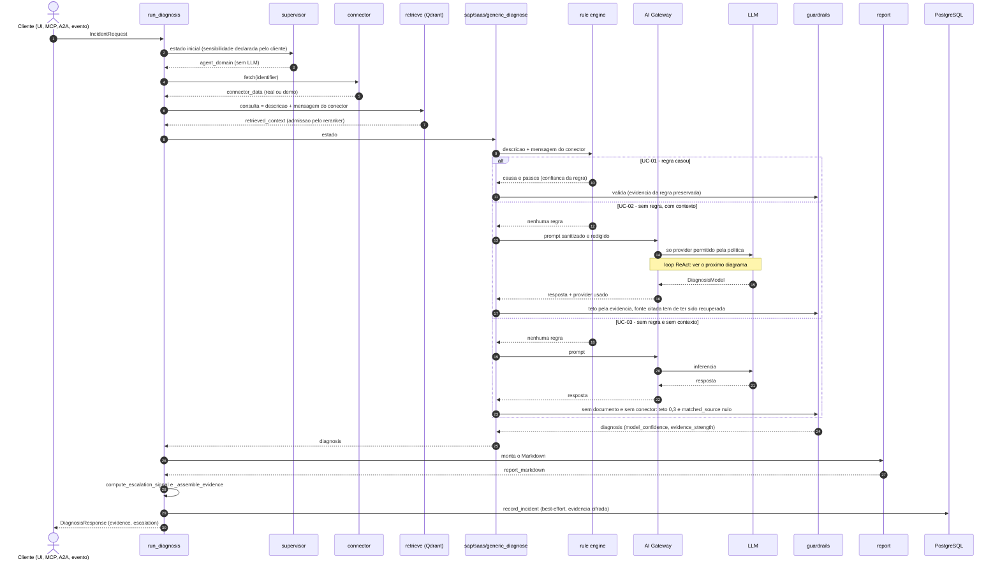
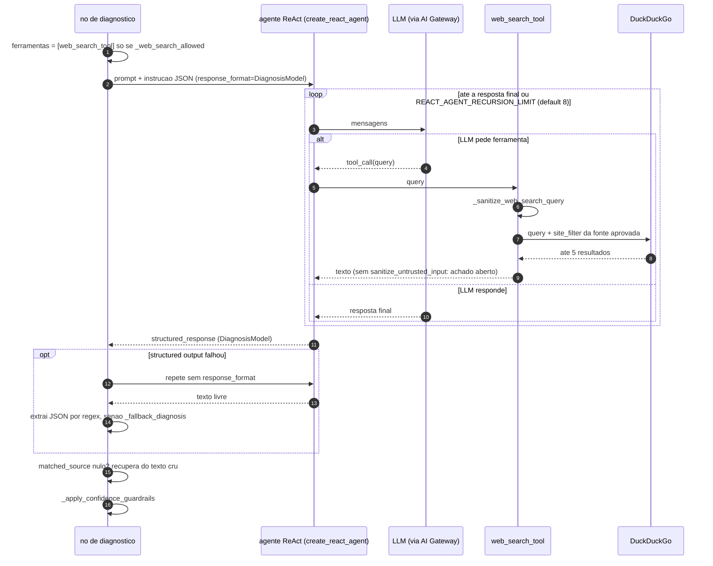

# Casos de uso — funcional e técnico

> **O que este documento é.** São nove cenários de uso do Integration Incident
> Copilot. Cada um traz:
>
> - o objetivo de negócio;
> - o que entra;
> - o caminho real no código (`arquivo.py::símbolo`, conferido pelo gate
>   `docs_code_references`);
> - o resultado observado;
> - as limitações;
> - o teste que sustenta as afirmações.
>
> **Por que substitui os `docs/UC_01..09`.** Na validação de 2026-10-07 (Bloco 5,
> DOC-01) os nove arquivos foram trocados por este. Eles mostravam código que
> não existe (`graph.ainvoke`, `rules_node`, `create_mock_connector`,
> `/events/webhook`, `PROMPT_VERSION = "v2.1.0"`…) e afirmavam, por exemplo,
> que "IDoc em status 51" não casava regra nenhuma, quando casa.
>
> **Regra deste documento.** Nenhum trecho de código aqui é "ilustrativo".
> Onde há número, ele saiu de `tests/test_casos_de_uso.py`, que roda o grafo
> real com duas substituições:
>
> - a busca no Qdrant devolve um trecho de `data/sample_docs`;
> - a chamada ao LLM devolve uma resposta fixa.
>
> Nos casos em que o LLM **não** deve ser chamado, o substituto falha se for.

## Visão geral do pipeline

O grafo e as maquinas de estado estao em [`ARCHITECTURE.md`](ARCHITECTURE.md)
(o grafo e gerado do codigo). Aqui fica a **ordem temporal**: quem chama quem,
e onde o caminho e deterministico ou passa por inferencia.

### Sequencia do diagnostico: tres caminhos



O rule engine roda **depois** do conector e do RAG: o texto que ele avalia
inclui a mensagem do conector. Os tres caminhos correspondem aos testes de
UC-01, UC-02 e UC-03 abaixo.

### Loop ReAct e chamada de ferramenta

Dentro do no de diagnostico, sem regra casada
(`app/agent/nodes.py::_run_diagnosis_agent`):



Sem fonte aprovada para o `interface_type`, a lista de ferramentas fica vazia
e o loop termina na primeira resposta do LLM.

| Etapa | Onde | O que faz |
|---|---|---|
| Domínio | `app/agent/supervisor.py::classify_domain` | `sap`, `saas` ou `generic`, sem LLM (invariante 6) |
| Conector | `app/agent/nodes.py::connector_node` | dado do sistema de origem; em modo demo, cenário simulado (`is_mock=True`) |
| RAG | `app/agent/nodes.py::retrieve_node` → `app/rag/retriever.py::retrieve` | busca híbrida + reranker; admissão pelo score calibrado (DA-25/42) |
| Diagnóstico | `app/agent/nodes.py::_run_diagnosis_agent` | **rule engine primeiro** (`app/agent/rules.py::match_known_error`); só sem regra chama o LLM, pelo AI Gateway (`app/llm/gateway.py::invoke_via_gateway`) |
| Guardrails | `app/agent/nodes.py::_apply_confidence_guardrails` | teto de confiança pela evidência, fonte citada tem de ter sido recuperada |
| Evidência | `app/agent/nodes.py::_assemble_evidence` | lista de fontes com `trust_level` (nunca autoavaliação do LLM) |
| Escalonamento | `app/agent/escalation.py::compute_escalation_signal` | sinal determinístico devolvido em `escalation` (informativo) |
| Persistência | `app/services/incident_recorder.py::record_incident` | linha em `incidents` (best-effort, só com `DATABASE_URL`) |

**Duas confianças na resposta:**

- `model_confidence` é o que o LLM disse, já cortado pelos guardrails;
- `diagnosis_confidence` é `evidence_strength × model_confidence`, calculada pelo pipeline.

Nenhuma das duas é probabilidade calibrada.

---

## UC-01 — IDoc em status 51, com conector RFC

**Objetivo.** O analista de sustentação SAP abre um incidente "IDoc travado".
A resposta deve vir em segundos e sem custo de LLM, porque o padrão é
conhecido.

**Entrada.** `description="IDoc travado com status 51"`,
`interface_type="rfc"`, `identifier="RFC-IDOC-51-DEMO"` (cenário de
demonstração do conector RFC).

**Caminho.**

1. `classify_domain` responde `sap`.
2. `app/connectors/rfc_connector.py::RFCConnector` devolve o cenário
   simulado. Sem `SAP_ASHOST`, o modo é demo.
3. `match_known_error` casa a regra `sap_idoc_status_51` (confiança 0,9). O
   texto avaliado é a descrição **mais** a mensagem do conector.
4. Retorno antecipado: o LLM **não** é chamado.

**Resultado observado.**

| Campo | Valor |
|---|---|
| `matched_source` | `rule_engine:sap_idoc_status_51` |
| `llm_provider_used` | `rule_engine` |
| `model_confidence` | 0,9 |
| `prompt_version` / `prompt_digest` | `null` (invariante 21: nenhum prompt produziu isto) |
| evidência | `rule_engine/system_observed`, `connector/simulated`, documento e descrição |

**Limitações.**

- Em modo demo o dado do conector é **simulado**.
- Em modo real, a função chamada (`BAPI_IDOC_STATUS`) nunca foi executada
  contra um sistema SAP. Ver o docstring de `app/connectors/rfc_connector.py`.

**Teste:** `tests/test_casos_de_uso.py::test_uc01_idoc_51_resolvido_pelo_rule_engine`.

---

## UC-02 — Incidente vindo do ServiceNow

**Objetivo.** Um incidente aberto no ITSM (ServiceNow) cita uma falha no
SAP. O Copilot cruza o chamado com a base de conhecimento.

**Entrada.** `interface_type="servicenow"`, `identifier="INC0010001"`
(cenário demo).

**Caminho.**

1. `classify_domain` responde `saas`.
2. `app/connectors/servicenow_connector.py::ServiceNowConnector` devolve o
   cenário.
3. Nenhuma regra casa, então `saas_diagnosis_node` chama o LLM pelo gateway.
4. `_apply_confidence_guardrails`:
   - aceita `matched_source` só se o documento foi recuperado;
   - limita a confiança pela força da evidência.

**Resultado observado** (resposta fixa do LLM: confiança 0,8, citando o
documento recuperado):

- `agent_domain = "saas"`;
- `matched_source = "servicenow_itsm_alert.md"`;
- `model_confidence = 0,8`: o cenário demo é reconhecido e a evidência
  (0,88) sustenta esse valor;
- `diagnosis_confidence = 0,88 × 0,8 ≈ 0,70`;
- `prompt_version` = o de `app/agent/prompts.py`;
- `escalation.escalation = "grounded"`.

**Variante: identificador que o conector não reconhece** (`INC9999999`). O
conector devolve dado de fallback, e o guardrail limita a confiança a 0,4,
com o prefixo `[confianca limitada - identificador nao reconhecido…]` na
causa provável.

**Variante: o LLM cita um documento que não foi recuperado.** O guardrail
zera `matched_source`, limita a confiança a 0,3, e o sinal de escalonamento
marca `abstained=True`, `should_escalate=True`.

**Testes.**

- `tests/test_casos_de_uso.py::test_uc02_servicenow_passa_pelo_llm`
- `tests/test_casos_de_uso.py::test_uc02_identificador_desconhecido_limita_a_confianca`
- `tests/test_casos_de_uso.py::test_uc02_fonte_inventada_pelo_llm_e_descartada`

---

## UC-03 — Texto livre, sem conector nem documento

**Objetivo.** O usuário descreve um problema que a base não cobre. O sistema
precisa **dizer que não sabe**, em vez de inventar.

**Caminho.**

1. `classify_domain` responde `generic`.
2. `retrieve` não admite nada.
3. `generic_diagnosis_node` chama o LLM.
4. Sem documento e sem conector, o guardrail limita a confiança a 0,3 e anula
   `matched_source`.

**Resultado observado.**

- `diagnosis_confidence = 0,0`;
- a evidência é só a descrição (`user/user_reported`);
- `escalation.escalation = "no_context"`.

**Busca web.** Ela é *fail-closed*. Com `WEB_SEARCH_POLICY=approved` (o
default), `app/agent/nodes.py::_web_search_allowed` só libera se houver uma
fonte aprovada para o `interface_type` em `web_search_sources` (DA-57). Sem
banco, não há busca.

**Testes.**

- `tests/test_casos_de_uso.py::test_uc03_generico_sem_contexto`
- `tests/test_casos_de_uso.py::test_uc03_busca_web_e_fail_closed_sem_fonte_aprovada`

---

## UC-04 — Rule engine (diagnóstico sem LLM)

**Objetivo.** Padrões recorrentes de integração são resolvidos de forma
determinística, auditável e sem custo.

**Catálogo.** São **22 regras** em `app/agent/rules.py::KNOWN_ERROR_RULES`.
A fonte é o código; não há tabela mantida à mão:

```bash
uv run python -c "from app.agent.rules import KNOWN_ERROR_RULES as R; print([r.category for r in R])"
```

**Comportamentos que importam** (validação 2026-10-07, M-02):

- Os padrões casam numa **janela curta dentro da mesma frase**, não em
  `.*` livre.
- **Negação direta** descarta o casamento ("não é token expirado").
- Um `401` genérico vira `auth_unauthorized` (confiança 0,75), não "token
  expirado".
- A força de evidência da regra (0,95 com dado real de conector, 0,70 só com
  texto) não é sobrescrita pelo guardrail (M-03).

**Teste:** `tests/test_casos_de_uso.py::test_uc04_catalogo_e_negacao`.

---

## UC-05 — Evidência fraca: fallback para a `reference_library`

**Objetivo.** Quando a base curada não tem nada forte, o sistema consulta o
acervo de referência (DA-17).

**Caminho.** Em `app/rag/retriever.py::_retrieve_unified`:

1. Se nenhum candidato de `sap_incident_docs` passa do limiar, a busca vai a
   `sap_reference_library` com o limiar próprio do fallback (0,665).
2. O resultado entra no pool do reranker.
3. A collection inexistente degrada sem erro.

**Desligável** (validação 2026-10-07, M-24). O acervo é montado a partir de
material de **terceiros**. Por isso `REFERENCE_LIBRARY_FALLBACK_ENABLED=false`
impede a consulta, e o `deploy/kyma/configmap.yaml` (demo pública) vem com
`false`.

**Limitação.** O limiar 0,665 foi medido contra um índice que não está
registrado. O gate `index_manifest` avisa até existir
`data/index_manifest.json` (M-23).

**Teste:** `tests/test_casos_de_uso.py::test_uc05_fallback_da_reference_library` (ligado e desligado).

---

## UC-06 — Ollama fora do ar: fallback para provider cloud

**Objetivo.** O diagnóstico continua quando o LLM local cai, **sem** que um
dado confidencial saia para a nuvem.

**Caminho** (`app/llm/gateway.py::invoke_via_gateway`):

1. **Sensibilidade** (`app/llm/gateway.py::classify_sensitivity`): dado real de
   conector é `confidential`. O que o cliente declara só **eleva** (GOV-01).
2. **Providers elegíveis** (`app/llm/gateway.py::_select_allowed_providers`):
   - avaliados pela **origem real** (DA-43), não pelo rótulo;
   - `confidential` só vai para uma origem na allowlist
     (`CONFIDENTIAL_ALLOWED_ORIGINS`) ou local.
3. **Falha de transporte** (rede, `httpx`, `openai.APIConnectionError`/`InternalServerError`):
   - abre o circuito do provider;
   - aplica backoff;
   - tenta o próximo provider elegível (R01).
4. **Política efetiva:** `GET /llm/policy` (`app/llm/gateway.py::describe_effective_policy`).

**Testes** (em `tests/test_llm_gateway.py`):

- `test_public_data_falls_back_to_cloud_on_transport_failure`
- `test_confidential_data_never_reaches_cloud_even_when_local_configured_as_primary`
- `test_confidential_data_with_only_cloud_configured_raises_policy_violation`
- `test_open_circuit_skips_provider_without_invoking_it`

---

## UC-07 — Evento do SAP Event Mesh (CloudEvents)

**Objetivo.** Um monitor externo (CPI, Solution Manager, Event Mesh) dispara
o diagnóstico sem ninguém abrir chamado.

**Entrada.** `POST /events/incident` com `X-Event-Mesh-Api-Key`, ou uma
mensagem AMQP 1.0 (`app/events/amqp_consumer.py::AmqpConsumerTask`). O
envelope é **CloudEvents 1.0 estrito** (M-16):

```json
{
  "specversion": "1.0",
  "type": "com.sap.integration.incident.detected.v1",
  "source": "/sap/cpi/monitor",
  "id": "evt-0001",
  "data": {"description": "IDoc travado com status 51", "interface_type": "rfc"}
}
```

**Caminho.**

1. `app/events/consumer.py::handle_incident_event_async` decide a execução:
   - com `REDIS_URL`, enfileira no RQ (durável);
   - sem `REDIS_URL`, roda em background no processo.
2. A deduplicação usa o par `(source, id)`: `app/events/idempotency.py::event_key`.

**Resultado observado.**

- O mesmo evento enviado duas vezes recebe 202 nas duas, mas gera **um**
  diagnóstico.
- Sem `specversion`, a resposta é 422 e aponta o campo, sem ecoar o valor.

**Limitações.**

- AMQP contra um broker Solace/Event Mesh real não foi testado neste
  ambiente.
- A DMQ depende da configuração da fila no broker.

**Teste:** `tests/test_casos_de_uso.py::test_uc07_webhook_cloudevents`.

---

## UC-08 — GraphRAG (histórico de incidentes no Neo4j)

**Objetivo.** Lembrar de incidentes parecidos já diagnosticados e,
principalmente, dos **verificados por humano**.

**Forma do grafo.** Ela é decidida na construção
(`app/agent/graph.py::build_graph`):

- com `GRAPH_RAG_ENABLED=true` entram `graph_enrich` (antes do diagnóstico) e
  `graph_write` (depois);
- sem ela (default), o grafo é o linear.

**Regras (AI-01):**

- **Fato:** só um incidente verificado por humano
  (`POST /incidents/{id}/verify` → `app/rag/graph_store.py::verify_incident`)
  volta ao prompt como fato.
- **Hipótese:** a hipótese não verificada aparece rotulada como **NÃO
  verificada** (`app/rag/graph_store.py::format_graph_context_for_prompt`).
- **Prune:** `app/rag/graph_store.py::prune_ungrounded_hypotheses` nunca apaga
  um incidente verificado.
- **Redação:** a descrição é redigida antes de ir ao Neo4j.

**Limitação.** Os testes usam uma sessão Neo4j falsa; o smoke contra Neo4j
real roda só no job `neo4j-smoke` do CI.

**Testes.**

- `tests/test_casos_de_uso.py::test_uc08_graphrag_muda_o_grafo`
- `tests/test_graph_store.py`

---

## UC-09 — Mudança de contrato OData (drift breaking)

**Objetivo.** Detectar que o SAP republicou um serviço OData com uma
propriedade a menos **antes** de o consumidor quebrar em produção.

**Caminho** (`scripts/check_contract_drift.py` → `app/contracts/observe.py::check_connector`):

1. `app/connectors/odata_connector.py::ODataConnector` lê `$metadata`
   (`fetch_contract`).
2. `app/contracts/odata.py::parse_odata_metadata` normaliza o contrato. O
   fingerprint ignora namespace e versão (invariante 18).
3. `app/contracts/diff.py::diff_contracts` classifica a mudança:
   - **breaking:** propriedade removida ou renomeada, tipo alterado,
     `MaxLength` novo ou menor;
   - **additive:** o resto.
4. Só `breaking` vira incidente, com um único ponto de emissão
   (`app/contracts/observe.py::emit_incident`). Se a entrega falhar, o
   baseline antigo fica e a próxima rodada detecta de novo.
5. `system_contracts` é append-only, garantido por trigger (migration 011).

**Estados possíveis.** `clean`, `drift`, `first_observation` e `unverified`.
O `unverified` ocorre com o SAP fora do ar ou baseline ilegível: nunca abre
incidente nem mexe no baseline.

**Testes.**

- `tests/test_contracts_e2e.py`: ciclo completo contra PostgreSQL real, com
  `IIC_TEST_DATABASE_URL`;
- `tests/test_bloco2_contracts_db.py`.

---

## Como manter este documento verdadeiro

- **Mudou um comportamento descrito aqui?** Mude o teste correspondente em
  `tests/test_casos_de_uso.py` **no mesmo commit**.
- **Referências a código:** sempre no formato `arquivo.py::símbolo`. O gate
  `docs_code_references` reprova símbolo inexistente.
- **Variáveis de ambiente:** o gate `docs_env_vars` confere as que aparecem
  aqui contra `app/config.py`, o compose e os manifests.
