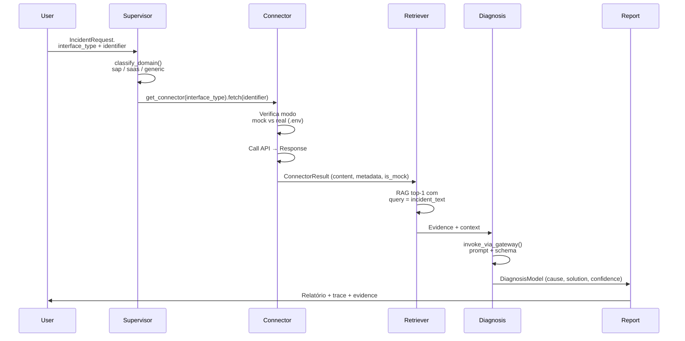

# Conectores Multi-Vendor — Guia de Integração

O Integration Incident Copilot suporta **10 conectores**, cada um
especializado em capturar dados de sistemas externos via API. Todos
seguem o mesmo padrão: `fetch(identifier)` → `ConnectorResult`.

Este documento cobre:

- Visão geral de como os conectores são usados no pipeline de diagnóstico
- Lista completa dos 10 conectores suportados com detalhes de API e credenciais
- Como adicionar um novo conector ao repositório
- Como testar conectores em modo mock ou real
- Erros comuns e soluções
- Limitações conhecidas (sem polling/webhooks/retry)

---

## Visão Geral

### Pipeline de Diagnóstico com Conector



**Pontos-chave:**

1. `supervisor_node` roteia para `connector_node` (DA-22)
2. `connector_node` usa `get_connector(interface_type).fetch(identifier)` (DA-22)
3. `ConnectorResult.is_mock=True` quando `.env` ausente; `False` quando `.env` presente
4. Resultado do conector vira parte da `Evidence` (DA-25)
5. Fallback para `reference_library` se `evidence_strength` for baixo (DA-17)

### Modo Mock vs Real

| Modo | Quando | Fonte de dados |
|---|---|---|
| `mock` | `.env` não tem as credenciais do conector | `httpx.MockTransport` (respostas pré-definidas) |
| `real` | `.env` tem as credenciais e API responde | API externa real |

Nenhum código precisa mudar: o conector detecta o modo automaticamente.

---

## Conectores Suportados

### 1. OData (`odata`)

| item | valor |
|---|---|
| **Sistemas** | SAP CPI, Integration Suite |
| **API** | OData v2 (oauth2_client_credentials) |
| **Identificador** | Nome do iFlow, MPL ID |
| **Credenciais `.env`** | `OAUTH2_CLIENT_ID`, `OAUTH2_CLIENT_SECRET`, `OAUTH2_TOKEN_URL`, `ODATA_BASE_URL` |
| **Modo mock** | ✅ Sim (via `httpx.MockTransport`) |
| **Validado** | ✅ Mock; ❌ Real (sem instância CPI) |

**Observações:**
- OAuth2 Client Credentials flow
- Parser EDMX ($metadata) para contrato (DA-52)
- Fingerprint canônico Features/Entities/Properties como tuple ordenada

---

### 2. RFC (`rfc`)

| item | valor |
|---|---|
| **Sistemas** | ECC, S/4HANA |
| **API** | pyrfc (RFC destination) |
| **Identificador** | RFC destination name, IDoc number |
| **Credenciais `.env`** | `RFC_DESTINATION`, `RFC_USER`, `RFC_PASSWORD`, `RFC_CLIENT`, `RFC_LANGU`, `RFCASHOST`, `RFCSYSID` |
| **Modo mock** | ✅ Sim |
| **Validado** | ✅ Mock; ❌ Real (sem instância ECC) |

**Observações:**
- Suporta chamada de funções RFC e leitura de IDocs
- Fallback para `RFC_DESTINATION` se `rfc_destination` não informado

---

### 3. ServiceNow (`servicenow`)

| item | valor |
|---|---|
| **Sistemas** | ServiceNow ITSM |
| **API** | REST (OAuth2 / Basic Auth) |
| **Identificador** | `INCxxxxx` (Case Number) |
| **Credenciais `.env`** | `SERVICENOW_INSTANCE`, `SERVICENOW_USERNAME`, `SERVICENOW_PASSWORD` |
| **Modo mock** | ✅ Sim |
| **Validado** | ✅ Mock; ❌ Real (sem instância ServiceNow) |

**Observações:**
- Query por `INCxxxxx` na tabela `incident`
- Campos: `short_description`, `caller_id`, `state`, `priority`, `description`

---

### 4. Salesforce (`salesforce`)

| item | valor |
|---|---|
| **Sistemas** | Salesforce (Sales/Service Cloud) |
| **API** | SOQL via REST |
| **Identificador** | Case Number (ex: `00847`) |
| **Credenciais `.env`** | `SALESFORCE_INSTANCE_URL`, `SALESFORCE_USERNAME`, `SALESFORCE_PASSWORD`, `SALESFORCE_SECURITY_TOKEN` |
| **Modo mock** | ✅ Sim |
| **Validado** | ✅ Mock; ❌ Real (sem instância Salesforce) |

**Observações:**
- Query por `CaseNumber = '00847'`
- CAMPO `Id` do Case usado como `identifier` futuro

---

### 5. Workday (`workday`)

| item | valor |
|---|---|
| **Sistemas** | Workday HCM |
| **API** | REST WWS (OAuth2) |
| **Identificador** | Event ID (ex: `WDEVT-xxx`) |
| **Credenciais `.env`** | `WORKDAY_TENANT`, `WORKDAY_USERNAME`, `WORKDAY_PASSWORD` |
| **Modo mock** | ✅ Sim |
| **Validado** | ✅ Mock; ❌ Real (sem instância Workday) |

**Observações:**
- Suporta consultas a Events, Employees, Compensation
- API REST WWS (nao SOAP) via OAuth2

---

### 6. Ariba (`ariba`)

| item | valor |
|---|---|
| **Sistemas** | SAP Ariba, Business Network |
| **API** | Open API (OAuth2) |
| **Identificador** | PO Number |
| **Credenciais `.env`** | `ARIBA_BASE_URL`, `ARIBA_CLIENT_ID`, `ARIBA_CLIENT_SECRET` |
| **Modo mock** | ✅ Sim |
| **Validado** | ✅ Mock; ❌ Real (sem instância Ariba) |

**Observações:**
- Suporta Purchase Orders e Orders
- Docstring aponta para dois produtos (Ariba + Business Network)

---

### 7. SuccessFactors (`successfactors`)

| item | valor |
|---|---|
| **Sistemas** | SuccessFactors EC |
| **API** | OData v2 (OAuth2) |
| **Identificador** | Person ID External |
| **Credenciais `.env`** | `SUCCESSFACTORS_INSTANCE`, `OAUTH2_CLIENT_ID`, `OAUTH2_CLIENT_SECRET`, `OAUTH2_TOKEN_URL` |
| **Modo mock** | ✅ Sim |
| **Validado** | ✅ Mock; ❌ Real (sem instância SuccessFactors) |

**Observações:**
- EC (Employee Central) via OData v2 PerPerson
- Mapeamento para `interface_type="successfactors"` DA-57

---

### 8. SAP PO/PI (`po`)

| item | valor |
|---|---|
| **Sistemas** | SAP PO/PI (on-premise) |
| **API** | Message Monitor `/mdt/api/1.0/facade` |
| **Identificador** | Message ID (`FAILED`, `HOLDING`, `ALL`) |
| **Credenciais `.env`** | `PO_BASE_URL`, `PO_USERNAME`, `PO_PASSWORD` |
| **Modo mock** | ✅ Sim |
| **Validado** | ⚠️ Mock (API não pública, não validada contra PO/PI real) |

**Observações:**
- Basic Auth nativa; OAuth2 opcional se API Management na frente
- Status: `FAILED`, `HOLDING`, `DELIVERING`, `DELIVERED`
- **API não pública e nunca validada contra PO/PI real** (aviso no docstring)

---

### 9. CAP (`cap`)

| item | valor |
|---|---|
| **Sistemas** | SAP CAP (Cloud Application Programming Model) |
| **API** | OData v4 (OAuth2) |
| **Identificador** | Entity ID via `$filter` |
| **Credenciais `.env`** | `CAP_BASE_URL`, `OAUTH2_CLIENT_ID`, `OAUTH2_CLIENT_SECRET`, `OAUTH2_TOKEN_URL` |
| **Modo mock** | ✅ Sim |
| **Validado** | ✅ Mock; ❌ Real (sem instância CAP) |

**Observações:**
- OData v4 (diferente do `odata` que usa v2)
- Filtros via `$filter` (ex: `ID eq 'xxx'`)

---

### 10. API Management (`apim`)

| item | valor |
|---|---|
| **Sistemas** | SAP API Management / Integration Suite (analytics) |
| **API** | OAuth2 / REST |
| **Identificador** | Proxy name |
| **Credenciais `.env`** | `APIM_ANALYTICS_URL`, `APIM_CLIENT_ID`, `APIM_CLIENT_SECRET` |
| **Modo mock** | ✅ Sim |
| **Validado** | ⚠️ Especulativo (schema nunca confirmado contra documentação real) |

**Observações:**
- Docstring diz *"Conector SAP API Management / Integration Suite"*
- Código lê `APIM_ANALYTICS_URL/events` — **eventos de analytics**, não orquestração
- **Schema nunca confirmado contra documentação real** (DA-45/DA-56)
- Não fecha a coluna `integration_suite` no mapa DA-58 (armadilha registrada)

---

## Configuração de Credenciais

Todas as credenciais são lidas de `.env`. Exemplo completo:

```bash
# OData (CPI)
OAUTH2_CLIENT_ID=cpi-client
OAUTH2_CLIENT_SECRET=secret123
OAUTH2_TOKEN_URL=https://api.sap.com/oauth/token
ODATA_BASE_URL=https://yourcpi.api.sap.com

# RFC (ECC/S/4HANA)
RFC_DESTINATION=ECC_PROD
RFC_USER=svc_rfc
RFC_PASSWORD=secret456
RFC_CLIENT=100
RFC_LANGU=EN
RFCASHOST=ecc.example.com
RFCSYSID=ECC

# ServiceNow
SERVICENOW_INSTANCE=https://instance.service-now.com
SERVICENOW_USERNAME=api_user
SERVICENOW_PASSWORD=secret789

# Salesforce
SALESFORCE_INSTANCE_URL=https://yourdomain.my.salesforce.com
SALESFORCE_USERNAME=user@example.com
SALESFORCE_PASSWORD=password
SALESFORCE_SECURITY_TOKEN=token123

# Workday
WORKDAY_TENANT=yourtenant
WORKDAY_USERNAME=user@tenant
WORKDAY_PASSWORD=secret

# Ariba
ARIBA_BASE_URL=https://api.ariba.com
ARIBA_CLIENT_ID=ariba-client
ARIBA_CLIENT_SECRET=ariba-secret

# SuccessFactors
SUCCESSFACTORS_INSTANCE=https://successfactors.example.com
OAUTH2_CLIENT_ID=sf-client
OAUTH2_CLIENT_SECRET=sf-secret
OAUTH2_TOKEN_URL=https://sfsf.auth.com/oauth/token

# SAP PO/PI
PO_BASE_URL=https://po.example.com/mdt/api/1.0/facade
PO_USERNAME=po_user
PO_PASSWORD=po_secret

# CAP
CAP_BASE_URL=https://cap.example.com
OAUTH2_CLIENT_ID=cap-client
OAUTH2_CLIENT_SECRET=cap-secret
OAUTH2_TOKEN_URL=https://cap.auth.com/oauth/token

# API Management
APIM_ANALYTICS_URL=https://apim.example.com/events
APIM_CLIENT_ID=apim-client
APIM_CLIENT_SECRET=apim-secret
```

### Verificação via Health Check

`GET /health` reporta estado de cada conector:

```json
{
  "odata": "real",
  "rfc": "mock",
  "servicenow": "mock",
  "salesforce": "mock",
  "workday": "mock",
  "ariba": "mock",
  "successfactors": "mock",
  "po": "mock",
  "cap": "mock",
  "apim": "mock"
}
```

- `real`: `.env` presente + chamada real bem-sucedida
- `mock`: `.env` ausente (mock ativo por padrão)
- `misconfigured`: `.env` presente mas API falhou (ex: 401, timeout)

---

## Como Adicionar Um Novo Conector

Adicionar um conector exige atualizar **8 superfícies** no total (DA-59):

### 1. Registry (`app/connectors/__init__.py`)

```python
_REGISTRY = {
    "odata": "ODataConnector",
    "rfc": "RFCConnector",
    # ... outros
    "seu_novo_conector": "SeuNuevoConnector",  # <- adicione aqui
}
```

### 2. Literal `IncidentRequest.interface_type`

```python
# app/models.py
class IncidentRequest(BaseModel):
    interface_type: Literal[
        "odata",
        "rfc",
        # ... outros
        "seu_novo_conector",  # <- adicione aqui
        # ...
    ]
```

### 3. Literal `IncidentEventData.interface_type`

```python
# app/models.py
class IncidentEventData(BaseModel):
    interface_type: Literal[
        "odata",
        "rfc",
        # ... outros
        "seu_novo_conector",  # <- adicione aqui
        # ...
    ]
```

### 4. Supervisor (`app/agent/supervisor.py`)

Classifique o domínio (`sap` / `saas` / `generic`):

```python
def classify_domain(interface_type: str) -> str:
    if interface_type in {"odata", "rfc", "po", "cap", "apim"}:
        return "sap"
    elif interface_type in {"servicenow", "salesforce", "workday", "ariba", "successfactors"}:
        return "saas"
    else:
        return "generic"
```

### 5. CLI (`app/cli/diagnose.py`)

Adicionar `interface_type` às opções:

```python
@click.command()
@click.option("--interface-type", type=click.Choice([
    "odata", "rfc", "servicenow", "salesforce",
    "workday", "ariba", "successfactors", "po", "cap", "apim",
    "seu_novo_conector",  # <- adicione aqui
], required=True)
```

### 6. UI Admin (`app/admin/templates/systems.html`)

Adicionar entry no dropdown:

```html
<select name="connector_type">
  <option value="odata">OData (CPI, Integration Suite)</option>
  <!-- ... -->
  <option value="seu_novo_conector">Seu Novo Conector</option>
</select>
```

### 7. Seed `web_search_sources` (`app/admin/models.py`)

```python
{
    "interface_type": "seu_novo_conector",
    "enabled": True,
    "source_name": "approved",
    "site_filter": "https://help.sap.com",
    "tech_term": "SAP",
}
```

### 8. `data/connector_coverage.yaml` (DA-58)

```yaml
seu_novo_conector:
  systems:
    - Seu Sistema
  mechanisms:
    - REST
    - OAuth2
  level: dedicated
  note: ""
```

Após adicionar, o **gate `connector_reachable` (DA-51)** vai detectar se alguma superfície foi esquecida.

---

## Testes de Conector

### Modo Mock (padrão)

Todos os conectores têm mock via `httpx.MockTransport`:

```python
# tests/test_odata_connector.py
def test_odata_mock_incident():
    mock_transport = httpx.MockTransport(odata_mock_response)
    result = ODataConnector(mock_transport).fetch("IFLOW-123")
    assert result.is_mock is True
    assert "error" in result.content.lower()
```

### Modo Real (com `.env`)

1. Configure as credenciais no `.env` (ver seção anterior)
2. Executar:

```bash
uv run pytest tests/ -m integration -v
```

⚠️ **Cuidado:** testes reais chamam APIsexternas. Use em ambiente controlado.

### Teste unitário com mock

```python
def test_rfc_mock():
    connector = RFCConnector()
    result = connector.fetch("RFC_DEST")
    assert result.is_mock is True
    assert "error" in result.content.lower()
```

### Erros simulados

```python
def test_http_401():
    mock_transport = httpx.MockTransport(status_code=401)
    connector = ODataConnector(mock_transport)
    result = connector.fetch("IFLOW")
    assert result.is_mock is True
    assert "401" in result.error or "Unauthorized" in result.error
```

---

## Erros Comuns

| Erro | Causa | Solução |
|---|---|---|
| `is_mock=True` mesmo com `.env` | `.env` não foi lido | Verificar caminho do `.env` e variáveis |
| `TimeoutError` | API externa lenta | Aumentar timeout no `httpx.Client(timeout=...)` |
| `401 Unauthorized` | Credenciais inválidas | Verificar `CLIENT_ID`/`CLIENT_SECRET` |
| `404 Not Found` | Identificador inválido | Verificar formato do `identifier` (ex: `INCxxxxx`) |
| `ConnectionRefusedError` | Host inalcançável | Verificar rede e firewall |

---

## Limitações Conhecidas

| Limitação | Impacto | Recomendação |
|---|---|---|
| **Sem polling** | Conector só responde a `fetch(identifier)` | Caller deve implementar cron/subscription |
| **Sem webhook subscriptions** | Não recebe eventos em tempo real | Polling manual ou external webhook |
| **Sem retry automático** | Falha = erro imediato | Retry no caller (ex: langgraph retry policy) |
| **Credenciais `.env`** | Não há UI para gerenciar | Usar `.env` ou K8s secrets |
| **Sem circuit-breaker por conector** | Chamadas falhas acumulam | Uso do `invoke_via_gateway` (DA-26) |

---

## Checklist ao Adicionar Um Novo Conector

Antes de commitar:

- [ ] Registry (`app/connectors/__init__.py`)
- [ ] Literal `IncidentRequest.interface_type`
- [ ] Literal `IncidentEventData.interface_type`
- [ ] Supervisor (`classify_domain()`)
- [ ] CLI (`app/cli/diagnose.py`)
- [ ] UI (`app/admin/templates/systems.html`)
- [ ] Seed `web_search_sources` (`app/admin/models.py`)
- [ ] `data/connector_coverage.yaml` (DA-58)
- [ ] Teste mock (`tests/test_*connector.py`)
- [ ] Teste real (com `.env`, ambiente controlado)
- [ ] Docstring com API, identificador, credenciais `.env`

Se algum item faltar, o **gate `connector_reachable` (DA-51)** reprovará o build.

---

## Notas Finais

- Todos os conectores seguem o padrão `fetch(identifier) → ConnectorResult`
- Modo mock ativado por ausência de `.env`; modo real, por presença
- `ConnectorResult.is_mock=True` quando mock; `False` quando chamada real bem-sucedida
- `Evidence` é construída deterministicamente em `_assemble_evidence` (DA-25)
- Fallback para `reference_library` se `evidence_strength` for baixo (DA-17)
- DA-57 e DA-58 adicionaram **7ª e 8ª superfícies** (seed `web_search_sources` e `data/connector_coverage.yaml`)

---

**Última atualização:** 2026-10-01
