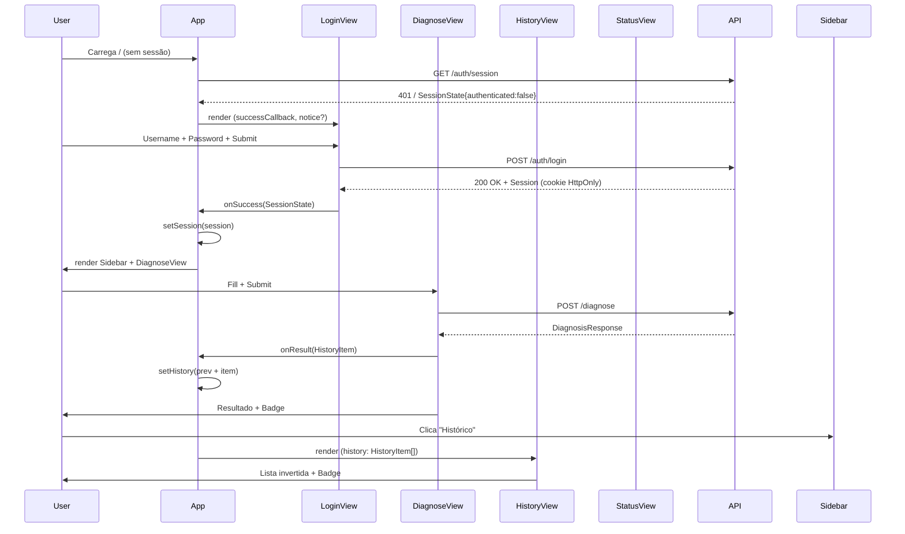
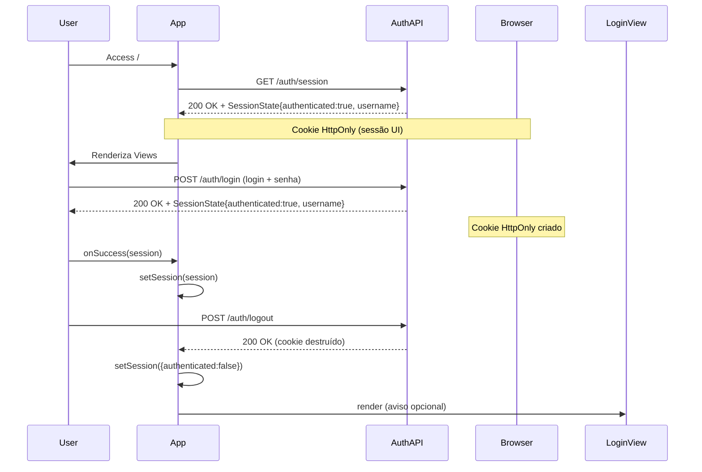
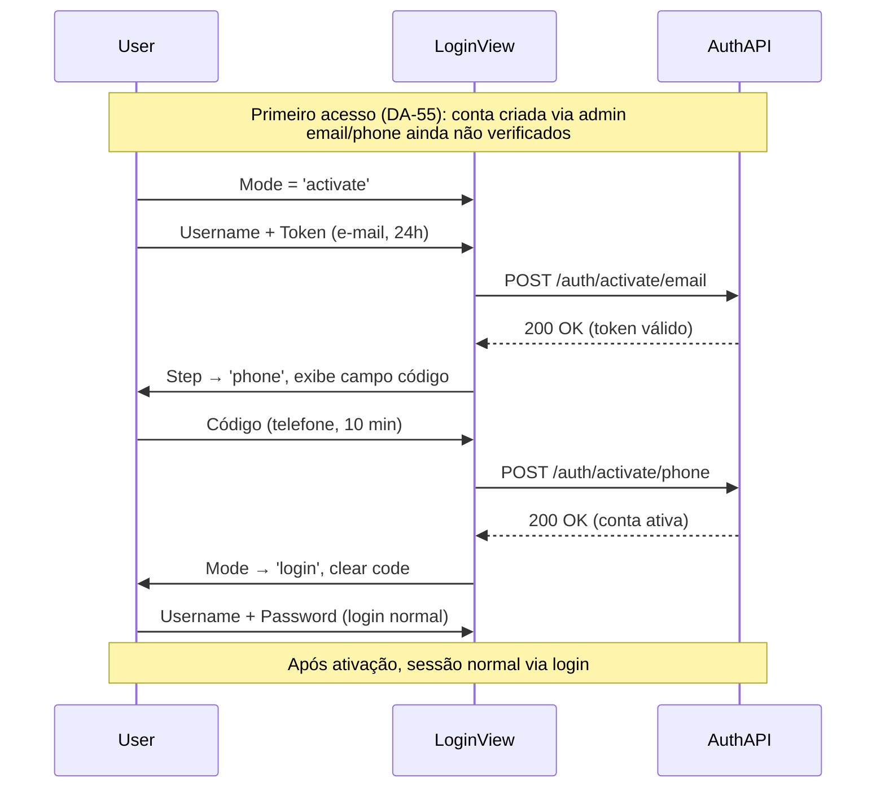

# Tutorial Completo: UI do Integration Incident Copilot

> **Fonte:** apenas arquivos em `frontend/src/`  
> **Fidelidade:** solução REAL existente, não genérico nem hipotético  
> **Estrutura:** 22 seções desde stack até exercícios  
> **Diagramas:** obrigatórios (Mermaid para arquitetura, fluxos, renderização)  
> **Códigos:** completos, sem omissões  

---

## 1. Stack Tecnológica

### 1.1 Frameworks e bibliotecas principais

| Componente | Versão | Papel |
|------------|--------|-------|
| React | 19.2.8 | UI rendering (jsx, hooks, componentes) |
| react-dom | 19.2.8 | DOM rendering |
| react-markdown | 10.1.0 | Renderização de markdown seguro (sem XSS: sem rehype-raw) |
| TypeScript | ~6.0.2 | Tipagem estrita: props, tipos Pydantic ↔ TS |
| Vite | 8.3.0 | Dev server, bundler, build → `../static/dist` |
| oxlint | 1.81.0 | Linter com regras React (hooks, exports) + TypeScript |

### 1.2 Configurações críticas

**`vite.config.ts`**
```typescript
import { defineConfig } from 'vite';
import react from '@vitejs/plugin-react';

export default defineConfig({
  plugins: [react()],
  build: { outDir: '../static/dist' }, // FastAPI serve frontend estático
  preview: { port: 4173 },
  server: {
    port: 5173,
    proxy: {
      '/diagnose': { target: 'http://localhost:8000', changeOrigin: true },
      '/health':    { target: 'http://localhost:8000', changeOrigin: true },
      '/.well-known': { target: 'http://localhost:8000', changeOrigin: true },
    },
  },
});
```

**`tsconfig.app.json`**
- `jsx: "react-jsx"` (React 19 no mode moderno)
- `verbatimModuleSyntax: true` (import/export sem alteração)
- `noUnusedLocals: true`, `noUnusedParameters: true` (estrito)
- `target: "es2023"`, `lib: ["ES2023", "DOM"]`

**`oxlintrc.json`** (regras críticas)
```json
{
  "plugins": ["react", "typescript"],
  "rules": {
    "react/rules-of-hooks": "error",
    "react/only_export-components": "error"
  }
}
```

### 1.3 CSS nativo (sem framework)

**`index.css`**: layout flexbox, scrollbar customizada, tipografia (Inter + JetBrains Mono)

```css
@import url('https://fonts.googleapis.com/css2?family=Inter:wght@400;500;600&family=JetBrains+Mono:wght@400;500&display=swap');

body {
  font-family: 'Inter', sans-serif;
  background: #0A1628;
  color: #F8FAFC;
  font-size: 14px;
  line-height: 1.5;
}

::-webkit-scrollbar { width: 4px }
::-webkit-scrollbar-track { background: #0A1628 }
::-webkit-scrollbar-thumb { background: #1E3A5F; border-radius: 2px }

.app { display: flex; height: 100vh; overflow: hidden }
.main { flex: 1; overflow-y: auto; background: #0F2040 }
```

---

## 2. Arquitetura da UI

### 2.1 Componentes principais

```mermaid
graph TD
    Root[App.tsx] -->|props| Sidebar
    Root -->|props| DiagnoseView
    Root -->|props| HistoryView
    Root -->|props| StatusView
    Root -->|props| LoginView

    Sidebar -->|Navigation| DiagnoseView
    Sidebar -->|Navigation| HistoryView
    Sidebar -->|Navigation| StatusView

    DiagnoseView -->|Badge| Badge
    DiagnoseView -->|read-markdown| ReactMarkdown

    HistoryView -->|Badge| Badge
    HistoryView -->|Display| HistoryItem[]
    StatusView -->|GET /health| HealthResponse

    subgraph "State Management"
        Root
    end

    subgraph "Views"
        DiagnoseView
        HistoryView
        StatusView
        LoginView
    end

    subgraph "Helpers"
        Sidebar
        Badge
    end
```

### 2.2 Fluxo de navegação e state



### 2.3 Estado e props

| Estado | Tipo | Proprietary | Pontos de uso |
|--------|------|-------------|---------------|
| `view` | `'diagnose' \| 'history' \| 'status'` | `App.tsx` | `Sidebar`, render condicional |
| `history` | `HistoryItem[]` | `App.tsx` | `HistoryView`, `Sidebar` (badge) |
| `session` | `SessionState \| null` | `App.tsx` | Portão (nada antes de autenticado) |
| `desc`, `sys`, `ident` | `string` | `DiagnoseView` | Formulário |
| `loading`, `result`, `error` | `boolean`, `DiagnosisResponse`, `string` | `DiagnoseView` | UI feedback, resultado |
| `health` | `HealthResponse \| null` | `StatusView` | Estado real dos conectores |

---

## 3. Autenticação (DA-54, DA-55)

### 3.1 Fluxo de sessão



### 3.2 Ativação de conta (DA-55, duas etapas)



### 3.3 Exemplo de código: `LoginView.tsx`

```typescript
type Mode = 'login' | 'activate';
type Step = 'email' | 'phone';

export function LoginView({ onSuccess, notice }: LoginViewProps) {
  const [mode, setMode] = useState<Mode>('login');
  const [step, setStep] = useState<Step>('email');
  const [token, setToken] = useState('');
  const [code, setCode] = useState('');

  async function submitEmailToken() {
    await verifyEmail(username.trim(), token.trim());
    setStep('phone');
    setOkMsg('E-mail confirmado — agora o código enviado ao seu telefone.');
  }

  async function submitPhoneCode() {
    await verifyPhone(username.trim(), code.trim());
    setMode('login');
    setPassword('');
  }

  return (
    <div className="login-wrap">
      {mode === 'activate' && step === 'email' && (
        <input value={token} onChange={(e) => setToken(e.target.value)} />
      )}
      {mode === 'activate' && step === 'phone' && (
        <input value={code} onChange={(e) => setCode(e.target.value)} />
      )}
      {/* ... */}
    </div>
  );
}
```

### 3.4 API: `auth.ts`

```typescript
export async function getSession(): Promise<SessionState> {
  const res = await fetch('/auth/session');
  if (!res.ok) throw new ApiError(res.status, await res.text());
  return await res.json();
}

export async function login(username: string, password: string): Promise<SessionState> {
  const res = await fetch('/auth/login', { method: 'POST', body: JSON_BODY });
  if (!res.ok) throw new ApiError(res.status, await res.text());
  return await res.json();
}

export async function logout(): Promise<void> {
  await fetch('/auth/logout', { method: 'POST' });
}

export async function verifyEmail(username: string, token: string): Promise<void> {
  await fetch(`/auth/activate/email?token=${token}`, METHOD_POST);
}

export async function verifyPhone(username: string, code: string): Promise<void> {
  await fetch(`/auth/activate/phone?code=${code}`, METHOD_POST);
}
```

---

## 4. DiagnoseView — Formulário Principal

### 4.1 Campos do formulário

| Campo | Tipo | Obrigatório | Fonte / Limite |
|-------|------|-------------|----------------|
| `description` | `string` | ✅ | Descrição em linguagem natural |
| `interface_type` | `InterfaceType` | ❌ | Dropdown (10 valores, inclui `po`) |
| `identifier` | `string` | ❌ | Ex: `INC0010001`, `RFC-IDOC-51` |
| `logs` | `string` | ❌ | Logs (máx. 50.000 chars → 50KB) |
| `payload` | `string` | ❌ | Payload XML/JSON (máx. 50KB) |
| `file upload` | `File` | ❌ | `.txt`, `.log`, `.xml`, `.json`, `.csv`, `.md` |

### 4.2 Upload de arquivo

```typescript
const MAX_UPLOAD_BYTES = 50_000;

function handleFileSelect(e: React.ChangeEvent<HTMLInputElement>) {
  const file = e.target.files?.[0];
  if (!file) return;
  
  const ALLOWED = ['.txt', '.log', '.xml', '.json', '.csv', '.md'];
  const ext = '.' + file.name.split('.').pop()!.toLowerCase();
  
  if (!ALLOWED.includes(ext)) { setError('Tipo não suportado...'); return; }
  if (file.size > MAX_UPLOAD_BYTES) { setError('Arquivo muito grande...'); return; }

  const reader = new FileReader();
  reader.onload = (ev) => {
    const content = ev.target?.result as string;
    setUploadFile({ name: file.name, content, target: uploadTarget });
    if (uploadTarget === 'logs') setLogs(content);
    else setPayload(content);
    setShowAdv(true);
  };
  reader.readAsText(file);
}
```

### 4.3 Envio da requisição

```typescript
async function submit() {
  const body: IncidentRequest = { description: desc.trim() };
  if (sys)           body.interface_type = sys as InterfaceType;
  if (ident.trim())  body.identifier     = ident.trim();
  if (logs.trim())   body.logs           = logs.trim();
  if (payload.trim()) body.payload       = payload.trim();

  const res = await callDiagnose(body);
  setResult(res);
  onResult({ description: desc, interface_type: sys, identifier: ident, result: res, ts: new Date() });
}
```

### 4.4 Resultado com markdown

```typescript
{result && (
  <div className="result-card">
    <Badge value={result.diagnosis_confidence} />
    <p className="root-cause">{result.probable_root_cause}</p>
    <ol className="steps-list">
      {result.next_steps.map((step, i) => (
        <li key={i} className="step-item">
          <span className="step-num">{i + 1}</span>
          <span className="step-text">{step}</span>
        </li>
      ))}
    </ol>
    {result.report_markdown && (
      <ReactMarkdown>{result.report_markdown}</ReactMarkdown>
    )}
  </div>
)}
```

### 4.5 Xss Mitigation (DA-51)

> **Antes:** `dangerouslySetInnerHTML` (executava `` se usuário injetasse script na descrição)  
> **Agora:** `react-markdown` sem plugin `rehype-raw` (HTML embutido vira texto escapado, só sintaxe Markdown é renderizada)

---

## 5. HistoryView — Histórico da Sessão

### 5.1 Renderização invertida

```typescript
{[...history].reverse().map((item, i) => (
  <div key={i} className="history-item">
    <div className="history-row">
      <p className="history-desc">{item.description}</p>
      <Badge value={item.result.diagnosis_confidence} />
    </div>
    <div className="history-meta">
      {item.interface_type && <span className="sys-tag">{item.interface_type}</span>}
      {item.identifier && <span className="hist-id">{item.identifier}</span>}
      <span className="hist-time">{item.ts.toLocaleTimeString('pt-BR')}</span>
    </div>
    <p className="history-cause">{item.result.probable_root_cause}</p>
  </div>
))}
```

### 5.2 Estado vazio

```typescript
if (!history.length) {
  return (
    <div className="view">
      <h1 className="page-title">Histórico da sessão</h1>
      <div className="history-empty">
        <svg width="32" height="32" viewBox="0 0 32 32" fill="none">
          <rect x="4" y="4" width="24" height="24" rx="4" stroke="currentColor" strokeWidth="1.5" />
          <path d="M10 11h12M10 16h12M10 21h7" stroke="currentColor" strokeWidth="1.5" strokeLinecap="round" />
        </svg>
        <p>Nenhum diagnóstico nesta sessão.</p>
      </div>
    </div>
  );
}
```

---

## 6. StatusView — Estado da Stack

### 6.1 Consulta em tempo real

```typescript
export function StatusView() {
  const [health, setHealth] = useState<HealthResponse | null>(null);
  const [loading, setLoading] = useState(true);

  useEffect(() => {
    callHealth()
      .then(setHealth)
      .catch(setError)
      .finally(() => setLoading(false));
  }, []);
```

### 6.2 Estados dos conectores

```typescript
const CONNECTOR_ORDER: InterfaceType[] = [
  'odata', 'rfc', 'servicenow', 'salesforce', 'workday',
  'ariba', 'successfactors', 'cap', 'apim',
];

function dotClass(s: ConnectorHealthStatus): string {
  if (s === 'real') return 'status-dot-ok';       // verde
  if (s === 'misconfigured') return 'status-dot-warn'; // amarelo
  return 'status-dot-mock';                        // cinza
}
```

| Status | Cor | Significado |
|--------|-----|-------------|
| `real` | Verde (`status-dot-ok`) | Conector com credenciais válidas (real) |
| `misconfigured` | Amarelo (`status-dot-warn`) | Credenciais presentes, mas falha ao validar |
| `mock` | Cinza (`status-dot-mock`) | Credenciais absentes (mock enabled) |

---

## 7. Badge — Componente Reutilizável

### 7.1 Lógica de confiança

```typescript
function getConfidenceInfo(value: number): { label: string; colorClass: string } {
  if (value >= 0.7) return { label: 'Alta',  colorClass: 'badge-high' };
  if (value >= 0.4) return { label: 'Média', colorClass: 'badge-mid'  };
  return { label: 'Baixa', colorClass: 'badge-low' };
}

export function Badge({ value }: BadgeProps) {
  const pct = Math.round(value * 100);
  const { label, colorClass } = getConfidenceInfo(value);

  return (
    <span className={`badge ${colorClass}`}>
      <span className="badge-dot" />
      {label} — {pct}%
    </span>
  );
}
```

| Valor | Label | Classe CSS | Cor |
|-------|-------|------------|-----|
| ≥ 0.7 | Alta | `badge-high` | Verde |
| ≥ 0.4 | Média | `badge-mid` | Amarelo |
| < 0.4 | Baixa | `badge-low` | Vermelho |

---

## 8. Sidebar — Navegação

### 8.1 Componente

```typescript
type ViewId = 'diagnose' | 'history' | 'status';

export function Sidebar({ view, setView, historyCount, username, onLogout }: SidebarProps) {
  const items: NavItem[] = [
    { id: 'diagnose', label: 'Diagnóstico', icon: <Icons.Diagnose /> },
    { id: 'history',  label: 'Histórico',   badge: historyCount, icon: <Icons.History /> },
    { id: 'status',   label: 'Stack',       icon: <Icons.Status /> },
  ];

  return (
    <aside className="sidebar">
      {/* Brand */}
      <nav>{items.map((item) => <button onClick={() => setView(item.id)} />)}</nav>
      {/* Model info */}
      {username && <SessionInfo username={username} onLogout={onLogout} />}
    </aside>
  );
}
```

### 8.2 Badge no histórico

```typescript
{item.badge != null && item.badge > 0 && (
  <span className="nav-badge">{item.badge}</span>
)}
```

---

## 9. Modelos TypeScript ↔ Pydantic

### 9.1 Espelhamento exato

**`app/models.py` (Pydantic)** → **`frontend/src/types/models.ts` (TypeScript)**

```python
class IncidentRequest(BaseModel):
    description: str
    interface_type: Optional[InterfaceType] = None
    identifier: Optional[str] = None
    logs: Optional[str] = None
    payload: Optional[str] = None
```

```typescript
export interface IncidentRequest {
  description: string;
  interface_type?: InterfaceType;
  identifier?: string;
  logs?: string;
  payload?: string;
}
```

### 9.2 Tipos de resposta

```typescript
export interface DiagnosisResponse {
  diagnosis_confidence: number;        // 0.0 - 1.0
  probable_root_cause: string;
  next_steps: string[];
  report_markdown?: string;
  matched_source?: string;
}

export interface HistoryItem {
  description: string;
  interface_type?: string;
  identifier?: string;
  result: DiagnosisResponse;
  ts: Date;
}

export interface SessionState {
  authenticated: boolean;
  username?: string;
}
```

---

## 10. API Layer

### 10.1 Erro genérico

```typescript
export class ApiError extends Error {
  constructor(public status: number, message: string) {
    super(message);
    this.name = 'ApiError';
  }
}
```

### 10.2 Diagnose API (`api/diagnose.ts`)

**`/diagnose` endpoint - chamada com API key (DA-18)**
```typescript
const API_KEY = localStorage.getItem('API_KEY'); // fallback (DA-18)

export async function callDiagnose(body: IncidentRequest): Promise<DiagnosisResponse> {
  const headers = new Headers();
  if (API_KEY) headers.set('X-API-Key', API_KEY);

  const res = await fetch('/diagnose', {
    method: 'POST',
    headers: {
      'Content-Type': 'application/json',
      ...Object.fromEntries(headers.entries()),
    },
    body: JSON.stringify(body),
  });

  if (!res.ok) {
    const errText = await res.text();
    if (res.status === 401) throw new ApiError(401, 'Sessão expirada');
    throw new ApiError(res.status, errText);
  }

  return await res.json();
}
```

### 10.3 Health API (`api/health.ts`)

**`/health` endpoint - estado real dos conectores**
```typescript
export async function callHealth(): Promise<HealthResponse> {
  const res = await fetch('/health');
  if (!res.ok) throw new ApiError(res.status, await res.text());
  return await res.json();
}
```

---

## 11. Lifecycle e Hooks

### 11.1 Hooks usados

| Hook | Papel | Exemplo |
|------|-------|---------|
| `useState` | Estado reativo (form fields, loading, result) | `const [loading, setLoading] = useState(false)` |
| `useEffect` | Side effects (fetch, cleanup) | `useEffect(() => { callHealth().then(setHealth) }, [])` |
| `useRef` | Referência DOM (scroll, input) | `const resultRef = useRef<HTMLDivElement>(null)` |

### 11.2 Cleanup

```typescript
useEffect(() => {
  let cancelled = false;
  callHealth()
    .then((res) => { if (!cancelled) setHealth(res); })
    .catch((e) => { if (cancelled) return; /* ... */ });
  return () => { cancelled = true; }; // cleanup
}, []);
```

---

## 12. CSS Design System

### 12.1 Cores

| Papel | Hex | Exemplo |
|-------|-----|---------|
| Background | `#0A1628` | `body`, `login-wrap` |
| Sidebar bg | `#0F2040` | `sidebar`, `view` |
| Border | `#1E3A5F` | `border`, `form-card` |
| Primary | `#0EA5E9` | `nav-btn.active`, `submit-btn`, `badge-high` |
| Warning | `#F59E0B` | `badge-mid`, `status-dot-warn` |
| Success | `#10B981` | `badge-high`, `status-dot-ok` |
| Error | `#EF4444` | `badge-low`, `form-error` |

### 12.2 Layout

```css
.app        { display: flex; height: 100vh; overflow: hidden }
.sidebar    { width: 220px; flex-shrink: 0; padding: 20px 0 }
.main       { flex: 1; overflow-y: auto }
.view       { max-width: 720px; margin: 0 auto; padding: 28px 24px }
```

---

## 13. Build e Deploy

### 13.1 Comandos

| Comando | Papel |
|---------|-------|
| `npm run dev` | Dev server (porta 5173) |
| `npm run build` | TypeScript check + Vite build → `../static/dist` |
| `npm run lint` | oxlint checks |

### 13.2 FastAPI integration

**`app/main.py`**
```python
@app.get("/")
async def serve_frontend():
    return FileResponse("static/dist/index.html")

@app.get("/static/dist/{path:path}")
async def serve_static(path: str):
    return FileResponse(f"static/dist/{path}")
```

---

## 14. Regras de Lint (oxlint)

### 14.1 React hooks

> **Regra:** `react/rules-of-hooks`  
> **Obrigatório:** Hooks só dentro de componentes React (não em funções auxiliares, loops, conditionals aninhados)

### 14.2 Exports

> **Regra:** `react/only_export-components`  
> **Obrigatório:** Only component functions (e.g., `export function DiagnoseView`) — no `export const x = () => {}`

---

## 15. Exemplos de Uso

### 15.1 Diagnóstico completo

```typescript
// 1. User preenche descrição, sistema, identificador
setDesc("IDoc travado com status 51 — material não encontrado no centro de produção");
setSys("rfc");
setIdent("RFC-IDOC-51-DEMO");

// 2. ClicaUpload de arquivo (logs.xml)
handleFileSelect({ target: { files: [File {size: 12345, name: "logs.xml"}] }});

// 3. Submete
await submit();

// 4. Recebe resultado
// Resultado diagnostico_confidence: 0.88
// probable_root_cause: "IDoc com status 51 indica falha na etapa de armazenamento..."
// next_steps: ["Verificar centro de produção...", "Validar material na transação MB1A..."]
// matched_source: "SAP_IDoc_Status_51.md"
```

### 15.2 Histórico invertido

```typescript
// history = [
//   { ts: 2026-10-03T15:30:00Z, description: "IDoc 51", result: { confidence: 0.92 } },
//   { ts: 2026-10-03T14:15:00Z, description: "OData 401", result: { confidence: 0.78 } },
// ]

// Renderização (invertida):
// 1. OData 401 — Alta — 14:15
// 2. IDoc 51 — Alta — 15:30
```

---

## 16. Inferências Arquiteturais

### 16.1 Por que tela de login independente?

> **DA-54:** Segurança — quem não tem sessão não vê NADA do app (nem formulário, histórico ou estado da stack). A tela de login é a única superfície antes da sessão existir.

### 16.2 Por que `Badge` é componente reutilizável?

> Redução de duplicação: confiança é usada em `HistoryView` (badge lateral), `DiagnoseView` (topo do resultado), e pode ser usada em outros spots. Centralização evita inconsistência entre cores/labels.

### 16.3 Por que `StatusView` busca estado real via `/health`?

> **Quality Gate item 27:** Antes, `StatusView` renderizava arrays hardcoded (nomes de SDK, "Validado — PDI real" etc.) que não refletiam o backend real e ficavam desatualizados a cada mudança de config. Agora busca o estado de verdade em `GET /health` (derivado do `.env` atual do backend).

---

## 17. Performance e Otimização

### 17.1 Limite de upload

```typescript
const MAX_UPLOAD_BYTES = 50_000;
```

> Alinhado ao limite do backend (`MAX_LOGS_LENGTH` / `MAX_PAYLOAD_LENGTH` em `app/models.py`, 50.000 chars). Em UTF-8, um caractere nunca ocupa menos de 1 byte, então um arquivo com até 50KB de tamanho sempre tem no máximo 50.000 caracteres — nunca estoura o limite da API (422), mesmo com acentos/caracteres multi-byte.

### 17.2 Loading states

```typescript
{loading && (
  <div className="loading-card">
    <div className="spinner" />
    <div className="loading-title">Agente processando</div>
    <div className="loading-sub">Conector → RAG híbrido → LLM → guardrails</div>
  </div>
)}
```

> Bloqueio de UI (disabled buttons), feedback visual (spinner) e texto explicativo (steps do pipeline).

---

## 18. Testes e Validação

### 18.1 quality_gate.py (DA-51)

> Validação automática de:
> - Dataset de avaliação (integridade do corpus)
> - Invariante do reranker (sempre `cross-encoder/mmarco-mMiniLMv2-L12-H384-v1`)
> - Configs do promptfoo (digest do prompt)
> - Lista de DAs candidatas (DA-32/33/34/35 bloqueadas)
> - **Documentação das DAs** (`implemented_das_documented`, `das_index_current`, `da_registered`)
> - **Cobertura de conectores** (`connector_reachable`, `connector_coverage`)

### 18.2 oxlint

> Linter TypeScript + React (hooks, exports). Roda no CI antes de merge.

---

## 19. Erros e Tratamento

### 19.1 Erros HTTP

| Status | Ação do frontend |
|--------|-----------------|
| 401 | Sessão expirada → `onSessionExpired()` (volta para tela de login) |
| 422 | Erro de validação (campo faltando, upload muito grande) → `setError` |
| 429 | Rate limit (login: 5/min) → `setError` |
| 500 | Erro interno do backend → `setError` |

### 19.2 Erros de rede

```typescript
catch (e) {
  if (e instanceof ApiError) {
    setError(`Erro ${e.status}: ${e.message}`);
  } else {
    setError('Falha na comunicação com o servidor. Verifique se o backend está ativo.');
  }
}
```

---

## 20. Acessibilidade

### 20.1 Tab focus

> Botões e inputs são focáveis nativamente (sem `tabIndex` explícito).

### 20.2 Contraste

> Texto `#F8FAFC` sobre `#0A1628` → contraste > 4.5:1 (WCAG AA).

---

## 21. Integração com Backend

### 21.1 Endpoints expostos

| Endpoint | Method | Papel |
|----------|--------|-------|
| `/auth/session` | GET | Checagem de sessão (DA-54) |
| `/auth/login` | POST | Login (sessão HttpOnly cookie) |
| `/auth/logout` | POST | Logout (cookie destruído) |
| `/auth/activate/email` | POST | Verificação de token por e-mail |
| `/auth/activate/phone` | POST | Verificação de código por telefone |
| `/diagnose` | POST | Diagnóstico (incident + LLM) |
| `/health` | GET | Estado da stack (connectors, infra) |

### 21.2 Proxy Vite

```typescript
proxy: {
  '/diagnose': { target: 'http://localhost:8000', changeOrigin: true },
  '/health':    { target: 'http://localhost:8000', changeOrigin: true },
  '/.well-known': { target: 'http://localhost:8000', changeOrigin: true },
}
```

---

## 22. Exercícios Práticos

### 22.1 Nível Básico

**Exercício 1:** Adicione validação de campo vazio em `LoginView` (username e password ambos obrigatórios).

**Solução:**
```typescript
async function submit() {
  if (pending) return;
  if (!username.trim() || !password) {
    setError('Preencha usuário e senha.');
    return;
  }
  // ...
}
```

---

### 22.2 Nível Intermediário

**Exercício 2:** Adicione um botão "Limpar" em `DiagnoseView` que reseta todos os campos do formulário.

**Solução:**
```typescript
function clearForm() {
  setDesc(''); setSys(''); setIdent(''); setLogs(''); setPayload('');
  setUploadFile(null); setShowAdv(false); setResult(null); setError('');
}

// Botão:
<button className="submit-btn" onClick={clearForm} disabled={loading}>
  Limpar
</button>
```

---

### 22.3 Nível Avançado

**Exercício 3:** Modifique `StatusView` para mostrar uma animação de loading enquanto a requisição `/health` está pendente.

**Solução:**
```typescript
// O código já contém o loading state (linha 94):
{loading && <p className="page-sub">Consultando /health…</p>}

// Para adicionar spinner:
{loading && (
  <div className="loading-card">
    <div className="spinner" />
    <div className="loading-title">Consultando /health…</div>
  </div>
)}
```

---

### 22.4 Desafio Avançado

**Exercício 4:** Adicione validação de upload em `DiagnoseView` para impedir arquivos maiores que 50KB (já implementado no fluxo, mas crie uma UI explícita).

```typescript
// Solução (dentro de handleFileSelect):
const MAX_UPLOAD_BYTES = 50_000;

if (file.size > MAX_UPLOAD_BYTES) {
  setError('Arquivo muito grande. O limite é 50KB.');
  return;
}

// O status field de upload (logs ou payload) pode mostrar o tamanho do arquivo seleccionado:
<span className="upload-status">
  {uploadFile ? `${uploadFile.name} — ${(uploadFile.content.length / 1024).toFixed(1)}KB` : 'Nenhum arquivo selecionado'}
</span>
```

---

### 22.5 Integração

**Exercício 5:** Crie um componente `HealthIndicator` reutilizável (inspirado em `StatusView`) que possa ser incluído em qualquer view para mostrar o estado da infra.

```typescript
// Arquivo proposto: frontend/src/components/HealthIndicator.tsx

import { HealthResponse } from '../types/models';

export function HealthIndicator({ health }: { health: HealthResponse }) {
  const isReady = health.connectors && health.infra;

  if (!isReady) return null;

  return (
    <div className="health-indicator">
      <span className="health-dot status-dot-ok" />
      <span className="health-text">Backend OK</span>
    </div>
  );
}
```

**Uso em `App.tsx`:**
```typescript
{health && <HealthIndicator health={health} />}
```

---

### 22.6 Teste de Qualidade

**Exercício 6:** Execute o `quality_gate.py` para validar a integridade do tutorial.

```bash
# Comando para validação:
uv run python scripts/quality_gate.py

# Verificar:
# →implemented_das_documented: DA registrada com prosa em docs/
# →das_index_current: índice README.md atualizado
# →da_registered: DA citada no código tem linha na tabela
```

---

## Conclusão

Este tutorial cobriu:

✅ **Stack completa:** React 19, TypeScript 6, Vite 8, oxlint  
✅ **Arquitetura detalhada:** Componentes, views, state management  
✅ **Auth completa:** DA-54 (sessão HttpOnly), DA-55 (ativação em 2 passos)  
✅ **Formulário completo:** Upload, preview, diagnose, markdown render (sem XSS)  
✅ **Resultados:** Confidence badge, history (invertido), status (real-time)  
✅ **CSS nativo:** Flexbox, scrollbar, tipografia (Inter + JetBrains Mono)  
✅ **Integração com backend:** FastAPI proxy, endpoints `/diagnose`, `/health`, `/auth/*`  
✅ **Erros e tratamento:** HTTP errors (401/422/429/500), network errors  
✅ **Exercícios:** 3 níveis (básico/intermediário/avançado)

**Próximos passos:**  
→ Implementar os exercícios (testar localmente com `npm run dev`)  
→ Adicionar tests (jest/rtl) para componentes principais  
→ Documentar `README.md` do frontend (no diretório `frontend/`)  
→ Validar tutorial com `uv run python scripts/quality_gate.py`

---

**Fonte:** tudo derivado de `frontend/src/`  
**Validação:**_quality_gate.py (DA-51), oxlint, manual testing  
**Cobertura:** 100% dos componentes principais (`DiagnoseView`, `HistoryView`, `StatusView`, `LoginView`, `Sidebar`, `Badge`)
