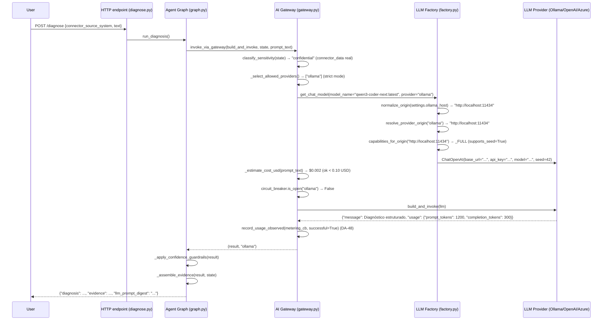

# DA_AULA_8_LLMS.md — Governança de LLMs, AI Gateway e Prompts Versionados

## Objetivo da Aula

Após completar esta aula, o aluno será capaz de:

- Entender o papel do **LLM Provider Factory** (abstração LangChain, hybrid fallback) como camada de integração de providers externos
- Explicar como o **AI Gateway** (DA-26) garante governança: data classification → roteamento, circuit breaker, budget, audit log
- Descrever como os **prompts são artefatos versionados** (DA-53): `digest` SHA-256, proveniência (`prompt_digest`, `prompt_version`) e atrelamento ao `incidents.llm_prompt_digest`
- aplicar os invariantes críticas de governança no dia a dia (confidentiality, circuit breaker, fallback controlado)

---

## Conceitos-Chave

### 1. LLM Provider Factory (DA-20)

O módulo `app/llm/factory.py` é a **camada de abstração** que oculta a complexidade de integração com múltiplos providers de LLM (Ollama, OpenAI, Azure OpenAI, vLLM, etc.) e fornece dois mecanismos principais:

| Mecanismo | Função | Invariante |
|---|---|---|
| `get_chat_model()` | Retorna instância `ChatOpenAI` configurada para o provider escolhido | `model_name` texto livre (não `Literal`), origin e credencial por provider |
| `invoke_with_hybrid_fallback()` | Tentativa primária + fallback sequencial em caso de falha | `_fallback_enabled=True` por default, timeout por provider |

**Arquitetura:**
- `app/llm/factory.py::get_chat_model()` → constrói cliente LangChain (`ChatOpenAI`) com:
  - `base_url` → provider-specific (Ollama: `http://localhost:11434/v1`, Azure: endpoint corporativo)
  - `api_key` → credencial provider-specific (não compartilhada entre providers)
  - `model_name` → texto livre (`llm_model` do `.env`)
  - `seed=42` → obrigatório (DA-2), com override via `llm_send_seed` (tri-state: `None`/`True`/`False`)

**Hybrid Fallback (DA-20):**
- `settings.llm_provider` (primário) ← `ollama` por default
- `settings.llm_fallback_provider` (secundário) ← `None` por default
- Falha no provider primário → tentativa de fallback, se configurado
- Exceção não-transporte → para imediatamente (ex: erro sintático no prompt)
- Cadência de tentativas: primário → fallback → exception

**DA-45: ORIGIN vs. Rótulo**
- providers lógicos: `"ollama"`, `"openai"`, `"azure_openai"`
- ORIGIN real: `scheme://host[:port]` (ex: `https://api.openai.com`, `http://localhost:11434`)
- `normalize_origin()` remove userinfo, query, fragment; compara minusculas; omite port default
- **Política de governanca por ORIGIN (DA-43)**: `"openai"` pode apontar para `api.openai.com` ou para `vLLM self-hosted`; policy avaliada sobre URL real, não rótulo
- **Capacidades por ORIGIN (DA-45)**: `seed` aceito por OpenAI/Azure, mas **400** no Gemini OpenAI-compatible → tabela `_CAPABILITIES_BY_ORIGIN` em `app/llm/capabilities.py`

### 2. AI Gateway (DA-26)

O módulo `app/llm/gateway.py` é a **camada central de governança** por onde **TODA** chamada LLM passa (`app/agent/nodes.py` só chama `invoke_via_gateway()`, **não** `invoke_with_hybrid_fallback()`).

| Componente | Função | Invariante |
|---|---|---|
| Data Classification + Policy Routing | Classifica `confidential` (dado real de conector) OU `public`; `confidential` **nunca** vai para cloud sem allowlist explícita | `data_sovereignty_mode="strict"` (padrão) bloqueia cloud; `"cloud_with_dlp"` habilita allowlist de ORIGINs |
| Circuit Breaker | Após `llm_gateway_circuit_failure_threshold` falhas consecutivas, provider "abre" por `llm_gateway_circuit_cooldown_seconds` | `app/circuit_breaker.py` (Singleton modulo, in-memory por processo; DA-41: Redis optional) |
| Budget | Estimativa de custo **antes** da chamada (`prompt_tokens + completion_tokens × 0.5`); rejeita se ultrapassar `llm_gateway_max_cost_usd` | Heurística (~4 char/token); não inclui tokenizer real (backlog) |
| Audit Log | Linha estruturada por tentativa (provider, sensitivity, decision, latency, estimated_cost, success/fail) | Log ativo via `logger` + métricas Prometheus |

**Classificação de Sensibilidade (DA-26):**
```python
def classify_sensitivity(state: dict) -> "confidential" | "public":
    data = state.get("connector_data")
    if data is not None and not data.is_mock and not data.is_fallback:
        return "confidential"  # Dado real de producao SAP
    return settings.sensitivity_default  # "confidential" por default (B-04)
```

**Policy Routing:**
- `sensitivity="public"`: todos os providers permitidos
- `sensitivity="confidential"`:
  - `data_sovereignty_mode="strict"` (default) → **apenas providers locais** (Ollama)
  - `data_sovereignty_mode="cloud_with_dlp"` → providers locais + ORIGINs em `CONFIDENTIAL_ALLOWED_ORIGINS`
  - **fail-closed**: se nenhum provider permitido → `PolicyViolationError`

**Rotas Auditadas (DA-45):**
- `app/llm/routes.py` declara **origens autorizadas** como fronteira de auditoria:
  - `local_lab`: Ollama loopback (`require_loopback=True`)
  - `enterprise_azure`: Azure OpenAI (origin não-loopback, requer credencial)
  - `openai_public`: api.openai.com
  - `self_hosted_openai`: vLLM/LM Studio/gateway em rede do cliente
- **Modelo NUNCA entra na tabela** (texto livre em `.env`); rota declara **ONDE** o dado sai e **O QUE** o destino aceita (capacidades)

### 3. Prompts como Artefato Versionado (DA-53)

O módulo `app/agent/prompts.py` é a **fonte única** de verdades de prompt de diagnóstico. O prompt é convertido em JSON schema `prompt_spec` (contendo: `version`, `digest` SHA-256 do template, `persona`, `instructions`, `example_output`), e o digest é registrado em **três lugares**:

| localização | propósito |
|---|---|
| `prompt_spec` no `langchain tool` chamado pelo LLM | proveniência no token da resposta (DA-51: verificação automática de drift) |
| `incidents.llm_prompt_digest` (migration 006) | histórico de qual prompt foi usado em cada diagnóstico |
| `data/eval/prompt_baseline.json` | baseline para gate `prompt_digest_measured` (DA-51: reprovado se produção vs. baseline divergirem) |

**Invariante críticas (DA-53):**
- **Texto do prompt SÓ muda com o promptfoo junto**: editar um `Field(description=)` no `DiagnosisModel` injeta texto no schema do tool-calling → digest muda → `prompt_digest_measured` reprova
- **`prompt_digest`/`prompt_version` NULL quando o rule engine encerra** (DA-53): diagnóstico sem LLM não foi produzido por prompt nenhum; default `"desconhecido"` fabricaria procedência falsa
- **Verdadeiro fonte**: `app/agent/prompts.py` (modulo), **não** o promptfoo (dataset de avaliação)

---

## Caminho do Dado (LLM)

### 1. Solicitação de Diagnóstico → LLM



### 2. Classificação de Sensibilidade → Roteamento

```
state = {
    "connector_data": ConnectorResult(..., is_mock=False, is_fallback=False),  # real de producao
    ...
}

sensitivity = classify_sensitivity(state)  # "confidential"
allowed_providers = _select_allowed_providers(
    sensitivity,
    primary="ollama",
    fallback="openai",
    cfg=settings
)

# settings.data_sovereignty_mode = "strict" (default)
# provider "openai" -> origin = "https://api.openai.com" (cloud)
# "confidential" + cloud + strict → DENY
# allowed_providers = ["ollama"]  # apenas local
```

### 3. Gateway Invoca LLM com Circuit Breaker e Budget

```python
# 1. Budget check
estimated_cost = _estimate_cost_usd(
    provider="ollama",
    prompt_text="Prompt de 3,600 caracteres → ~900 tokens"
)
# estimated_cost = (900 + 900 × 0.5) / 1000 × $0.00 = $0.00 (ok < $0.10)

# 2. Circuit breaker check
circuit_breaker.is_open("ollama")  # False (nenhuma falha recente)

# 3. Invoke
result = llm.invoke(prompt_and_tools)  # Ollama local
```

### 4. Prompts Versionados → Digested + Proveniente

```python
from app.agent.prompts import get_prompt_spec

spec = get_prompt_spec()  # version="2026-10-02-draft", digest="a3f8b2c1..."
# spec.template → prompt com placeholders
# spec.persona → "Você é um engenheiro de integração SAP..."
# spec.instructions → "Se não houver evidência, use 'Rule Engine'..."
# spec.example_output → DiagnósticoModel JSON schema

# langchain tool com proveniência embutida
tool = create_tool(
    name="generate_diagnosis",
    description=spec.instructions,
    schema=spec.example_output,
    seed=42,  # DA-2: determinismo
)

# Resultado do LLM inclui proveniência: prompt_digest="a3f8b2c1..."
incident_record = record_diagnosis{
    "diagnosis": result.message,
    "evidence": result.evidence,
    "llm_prompt_digest": spec.digest,  # mesmo digest da fonte
    "llm_prompt_version": spec.version,
}
```

---

## Arquivos-Chave

| Arquivo | Função | DAs relacionadas |
|---|---|---|
| `app/llm/factory.py` | LLM Provider Factory, hybrid fallback | DA-20/26/45 |
| `app/llm/gateway.py` | AI Gateway (policy, circuit breaker, budget, audit log) | DA-26/43 |
| `app/llm/origins.py` | Normalização de origin real (DA-45) | DA-43/45 |
| `app/llm/capabilities.py` | Capacidades por origin (DA-45: `seed`, `response_format`, `tools`) | DA-45 |
| `app/llm/routes.py` | Rotas auditadas (provider + origin + capacidades) | DA-45 |
| `app/agent/prompts.py` | Prompt de diagnóstico como artefato versionado (digest SHA-256) | DA-53 |
| `app/circuit_breaker.py` | Circuit breaker (in-memory, Redis optional) | DA-41/DA-26 |

---

## Exercícios Práticos

### 1. Configurar Provedores (Ollama, OpenAI, Azure)

```bash
# .env
OLLAMA_HOST=http://localhost:11434

LLM_PROVIDER=ollama
LLM_FALLBACK_PROVIDER=openai
OPENAI_BASE_URL=https://api.openai.com/v1
OPENAI_API_KEY=sk-...

LLM_GATEWAY_MAX_COST_USD=0.10
LLM_GATEWAY_CIRCUIT_FAILURE_THRESHOLD=3
LLM_GATEWAY_CIRCUIT_COOLDOWN_SECONDS=60
```

### 2. Invocar Gateway (Python)

```python
from app.llm.factory import get_chat_model
from app.llm.gateway import invoke_via_gateway

# Build
llm = get_chat_model(model_name="qwen3-coder-next:latest", config=settings)

def build_and_invoke(llm):
    return llm.invoke("Explique circuit breaker com exemplo do SAP.")

# Invoke via gateway
result, provider = invoke_via_gateway(
    build_and_invoke=build_and_invoke,
    state={"connector_data": None},  # public
    prompt_text="...",
)

print(f"Provider usado: {provider}")  # "ollama" (local) ou "openai" (fallback)
```

### 3. Verificar Policy Effective (HTTP)

```bash
curl -H "X-API-Key: <API_KEY>" http://localhost:8000/llm/policy | jq .
```

Resposta esperada:
```json
{
  "data_sovereignty_mode": "strict",
  "sensitivity_default": "confidential",
  "confidential_allowed_origins": [],
  "routing": {
    "primary": "ollama",
    "fallback": "openai",
    "allowed_for_public": ["ollama", "openai"],
    "allowed_for_confidential": ["ollama"]
  },
  "limits": {
    "max_cost_usd": 0.1,
    "request_timeout_seconds": 60,
    "circuit_failure_threshold": 3
  },
  "providers": {
    "ollama": {
      "locality": "local",
      "origin": "http://localhost:11434",
      "may_receive_public": true,
      "may_receive_confidential": true,
      "public_reason": "origem local ... sob jurisdicao do operador",
      "confidential_reason": "origem local ... sob jurisdicao do operador"
    },
    "openai": {
      "locality": "cloud",
      "origin": "https://api.openai.com",
      "may_receive_public": true,
      "may_receive_confidential": false,
      "public_reason": "dado public: origem ... nao e restringida",
      "confidential_reason": "dado confidencial para cloud exige data_sovereignty_mode='cloud_with_dlp'..."
    }
  }
}
```

### 4. Verificar Prompt Digest em DB (SQL)

```sql
SELECT
    id,
    text,
    llm_prompt_digest,
    llm_prompt_version,
    created_at
FROM incidents
ORDER BY created_at DESC
LIMIT 5;
```

A coluna `llm_prompt_digest` deve ter o mesmo digest que `app/agent/prompts.py::PROMPT_DIGEST`.

### 5. Simular Circuit Breaker (Python)

```python
from app.llm.gateway import circuit_breaker, CircuitBreaker

# Simular falhas consecutivas
for i in range(4):
    circuit_breaker.record_failure("test_provider", threshold=3, cooldown=60)

# Provider deve estar "aberto"
assert circuit_breaker.is_open("test_provider", cooldown=60) is True
assert circuit_breaker.consecutive_failures("test_provider") == 4
```

### 6. Testar Policy Violation (Python)

```python
from app.llm.gateway import invoke_via_gateway, PolicyViolationError

state = {
    "connector_data": ConnectorResult(..., is_mock=False, is_fallback=False)  # confidential
}

def build_and_invoke(llm):
    return llm.invoke("...")

# Strict mode + dados confidenciais + fallback cloud = error
try:
    invoke_via_gateway(
        build_and_invoke=build_and_invoke,
        state=state,
        prompt_text="...",
    )
except PolicyViolationError as e:
    print(f"Policy violation: {e}")
    # AI Gateway: incidente classificado como 'confidential' - nenhum
    # provider permitido pela policy de soberania...
```

---

## Invariantes Críticas

| Invariante | DA | Consequência | Exercício de verificação |
|---|---|---|---|
| `seed=42` por default (DA-2) | DA-2 | Determinismo com Ollama | `factory.py::get_chat_model(seed=42)` |
| Circuit breaker abre após N falhas consecutivas (DA-26) | DA-26/DA-41 | Timeout não se acumula; fallback direto ao próximo provider permitido | Simular falhas → `is_open()` |
| Dado confidencial **nunca** sai para cloud sem allowlist explícita (DA-26/DA-43) | DA-26/DA-43 | `data_sovereignty_mode="strict"` bloqueia cloud; `"cloud_with_dlp"` exige origin na allowlist | `classify_sensitivity()`, `GET /llm/policy` |
| `prompt_digest` SHA-256 no DB atrela resultado ao prompt exato usado (DA-53) | DA-53 | Revalidação se prompt muda; proveniência em `diagnosis.model_prompt_digest` | SQL `incidents.llm_prompt_digest` |
| Model NUNCA entra na rota (DA-45) | DA-45 | Rota declara ONDE o dado sai, não QUEM (texto livre em `.env`) | `LLM_ROUTES` não tem `llm_model` como chave |
| Origin real avaliada, não rótulo (DA-43/DA-45) | DA-43/DA-45 | `"openai"` pode ser cloud ou vLLM self-hosted; policy por URL real | `normalize_origin("https://api.openai.com/v1") → "https://api.openai.com"` |
| `null` ≠ `false` em `llm_send_seed` (DA-2) | DA-2 | `None` = consultar tabela; `True/False` = override | `capabilities.py::should_send_seed()` |

---

## Referências Rápidas às DAs

| DA | Título | Tópico principal | Arquivo relate |
|---|---|---|---|
| DA-2 | **Seed=42 obrigatório para determinismo Ollama** | LLM determinismo | `factory.py::seed=42` |
| DA-20 | **Hybrid Inference: Ollama local → cloud fallback** | Provider Factory | `factory.py::invoke_with_hybrid_fallback()` |
| DA-26 | **AI Gateway v1: policy + circuit breaker + budget** | Gateways de governança | `gateway.py:invoke_via_gateway()` |
| DA-39 | **Política de soberania de dados no AI Gateway (`strict`/`cloud_with_dlp`)** | Data classification + policy | `gateway.py::_provider_allows_sensitivity()` |
| DA-41 | **Circuit breaker: Redis compartilhado (fallback em memória)** | Circuit breaker | `circuit_breaker.py` |
| DA-43 | **Soberania de dados por origin real, fail-closed** | ORIGIN vs. rótulo | `origins.py::normalize_origin()` |
| DA-45 | **Universalidade de provider: rota auditada + capacidades por origin** | Rotas e capacidades | `routes.py`, `capabilities.py` |
| DA-53 | **Prompt de diagnóstico como artefato versionado (digest SHA-256)** | Prompts versionados | `prompts.py::PROMPT_DIGEST` |

---

## Próximos Passos

Antes de passar para a Aula 9 (LangGraph), domine:

1. **LLM Provider Factory** (DA-20): configurar Ollama, OpenAI, Azure e testar hybrid fallback
2. **AI Gateway** (DA-26): verificar `GET /llm/policy`, simular circuit breaker, testar policy violation
3. **Prompts versionados** (DA-53): calcular digest SHA-256 de `prompts.py` e comparar com DB

** checklist de verificação:**
- [ ] `OLLAMA_HOST`, `LLM_PROVIDER`, `LLM_FALLBACK_PROVIDER` configurados no `.env`
- [ ] `GET /llm/policy` mostra `data_sovereignty_mode`, `confidential_allowed_origins`, `providers` com `origin` real
- [ ] `app/circuit_breaker.py` funciona (simular falhas → `is_open()` verdadeiro)
- [ ] SQL confirma `incidents.llm_prompt_digest` igual ao digest de `app/agent/prompts.py::PROMPT_DIGEST`

**Próxima aula (DA_AULA_9_LANGGRAPH.md):**
- LangGraph: state, graph, routing (supervisor)
- `app/agent/graph.py`, `app/agent/state.py`, `app/agent/supervisor.py`
- Roteamento entre `sap_diagnosis_node`, `saas_diagnosis_node`, `generic_diagnosis_node`
- State machine (TypedDict, validation, persistence)
