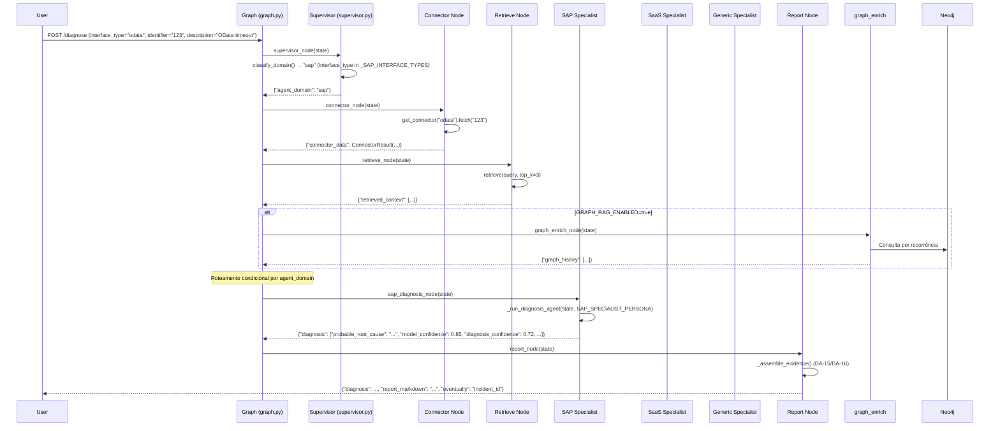

# DA_AULA_9_LANGGRAPH.md — LangGraph, State, Supervisor e Roteamento Multi-Agente

## Objetivo da Aula

Após completar esta aula, o aluno será capaz de:

- Entender o papel do **LangGraph** como máquina de estados para orquestração do diagnóstico
- Explicar o modelo de **state management** via `CopilotState` (TypedDict) e `DiagnosisModel` (Pydantic)
- Descrever o **roteamento determinístico** de domínio (`SAP/SAAS/Generic`) pelo supervisor (DA-22)
- Aplicar as **regras do Rule Engine** antes do LLM (DA-33) e os **sinais de escalonamento** (DA-44)
- Localizar e modificar os **8 nodes principais** do grafo (`connector`, `retrieve`, `diagnose`, `report`, etc.)

---

## Conceitos-Chave

### 1. LangGraph: Máquina de Estados (DA-22/55/59)

O **grafo LangGraph** é o orquestrador principal do Copilot: define o **ciclo completo** do diagnóstico, de entrada a relatório final.

| Componente | Função | Invariante |
|---|---|---|
| `CopilotState` | TypedDict com todos os dados transitórios do pipeline | Validado por Pydantic, persistence via `app/admin/correlation.py` |
| `graph.py::run_diagnosis()` | Entrada do grafo:建入 request → invoke `supervisor` → `report` | Timeout (`30s`), langfuse tracing, incident idempotência |
| `record_incident()` | Grava diagnóstico no DB e notifica event mesh (se `breaking` drift) | `llm_prompt_digest` não NULL quando LLM rodou (DA-53) |

**Ciclo padrão do grafo:**
```
supervisor → connector → retrieve → graph_enrich →
{sap|saas|generic}_diagnosis → graph_write → report
```

**DA-55: Idempotência por Incident ID**
- O grafo aceita um `incident_id` opcional na requisição
- Se presente, usa o mesmo ID em todos os estados seguintes
- Se ausente, gera `uuid4()` no início (`graph.py::run_diagnosis()`)
- Re-usar ID ⇒ resposta idêntica (cache no DB, não no grafo)

**DA-59: 8+ Nodes do Grafo**
| Node | Função | Quando roda |
|---|---|---|
| `supervisor_node` | Classifica domínio (`SAP/SAAS/Generic`) | Primeiro |
| `connector_node` | Chama connector (OData/RFC/ServiceNow/...) | Se `interface_type` presente |
| `retrieve_node` | RAG (Qdrant) por incidentes históricos | Sempre |
| `graph_enrich_node` | Neo4j por recorrência no grafo | Se `GRAPH_RAG_ENABLED=true` |
| `{sap|saas|generic}_diagnosis_node` | Sub-agente com persona especializada | Roteado pelo supervisor |
| `web_search_node` | DuckDuckGo se RAG insuficiente | Se `evidence_strength < threshold` |
| `graph_write_node` | Persiste novo incidente no Neo4j | Se `GRAPH_RAG_ENABLED=true` |
| `report_node` | Formata relatório final com evidence bundle | Último |

### 2. `CopilotState` e `DiagnosisModel` (DA-22/53/55)

**`app/agent/state.py` é a fonte única de verdade para o estado do pipeline.**

**CopilotState (TypedDict):**
```python
class CopilotState(TypedDict, total=False):
    incident_id: str  # DA-55: idempotência
    interface_type: InterfaceType  # Literal fechado (odata, rfc, servicenow, ...)
    identifier: str | None  # ID do conector (RFC: IDoc, OData: entity)
    description: str  # Texto livre do incidente
    agent_domain: AgentDomain  # "sap" | "saas" | "generic" (DA-22)
    connector_data: ConnectorResult  # Resultado do connector_node
    retrieved_context: list  # RAG hits (Qdrant)
    graph_history: list  # Neo4j recorrência
    diagnosis: DiagnosisModel  # Resultado do diagnose_node
    report_markdown: str  # Relatório final
```

**DA-53: `DiagnosisModel` com Proveniência**
```python
class DiagnosisModel(BaseModel):
    probable_root_cause: str
    confidence: float  # auto-relatada pelo LLM (1.0)
    matched_source: str | None  # RAG source doc
    evidence_strength: float  # calculada por _compute_evidence_strength()
    next_steps: list[str]

    # Proveniência (DA-53/DA-55)
    llm_provider_used: str  # "ollama", "openai", ...
    llm_model: str  # texto livre (.env)
    prompt_version: str | None  # NULL se rule engine encerrou
    prompt_digest: str | None  # SHA-256 se LLM rodou
```

**Invariante crítica (DA-53):**
- **`prompt_digest`/`prompt_version` são NULL quando o rule engine encerra** — diagnóstico sem LLM não foi produzido por prompt nenhum
- Default `"desconhecido"` **fabricaria** proveniência falsa

### 3. Roteamento Determinístico por Dominio (DA-22)

O **supervisor** é um node pre-LLM: **100% determinístico**, sem chamada a modelo. Classifica domínio apenas com mapeamento de `interface_type` e keywords.

**`app/agent/supervisor.py::classify_domain()`**

```python
_SAP_INTERFACE_TYPES = {"odata", "rfc", "cap", "po"}
_SAP_KEYWORDS = ("iflow", "idoc", "cpi", "rfc", "sm59", "bapi", "abap", "btp", "s/4hana", ...)
_SAP_WORD_RE = re.compile(r"\bsap\b", re.IGNORECASE)


def classify_domain(state: CopilotState) -> AgentDomain:
    interface_type = (state.get("interface_type") or "").lower()
    if interface_type in _SAP_INTERFACE_TYPES:
        return "sap"
    if interface_type in _SAAS_INTERFACE_TYPES:
        return "saas"

    description = (state.get("description") or "").lower()
    if _SAP_WORD_RE.search(description) or any(kw in description for kw in _SAP_KEYWORDS):
        return "sap"

    return "generic"
```

**DA-22: Prioridade de sinal:**
1. `interface_type` (mais confiável, vem da requisição estruturada)
2. Palavras-chave na descrição textual (fallback)
3. `"generic"` (nenhum sinal identificado)

**Por que determinístico (DA-22)?**
- Roteamento é uma **decisão estrutural**, não um julgamento
- Autoavaliação de LLM → "o que você acha do domínio?" → ruído, custo, lenteza
- Código → 100% testável, instantâneo, explicável

### 4. Rule Engine Before LLM (DA-33)

**DA-33: Rule Engine detecta 21+ pattern classes antes do LLM.**

**`app/agent/rules.py::match_known_error()`**
- 21+ regras regex (`re.IGNORECASE`) para erros conhecidos
- Cada regra: `pattern`, `summary`, `confidence=0.90`
- Se match → diagnóstico **sem LLM**, `confidence=0.90`, `llm_prompt_digest == None`

**Prioridade do ciclo (DA-33/DA-53):**
```
1. Rule Engine (regex, 0.90 confidence, no LLM)
2. LLM (prompt versionado + digest SHA-256)
```

**Invariante (DA-53):**
- **Prompt digest NULL quando o rule engine encerra** — sem prompt, sem digest. Default `"desconhecido"` cria proveniência falsa.

### 5. Escalonamento Determinístico (DA-44)

**DA-44: 3 camadas de sinais determinísticos para escalonamento.**

**`app/agent/escalation.py::determine_escalation()`**

| Camada | Sinal | Critério |
|---|---|---|
| Tier 1 (baixo) | Conector mock | `data.is_mock == True` |
| Tier 1 (baixo) | Score baixo | `evidence_strength < 0.30` |
| Tier 2 (médio) | Evidência Retrieved | `trust_level == "retrieved_document"` |
| Tier 3 (crítico) | Evidência Web | `trust_level == "web_untrusted"` |
| Tier 3 (crítico) | Falha de Conector | `data.status == "error"` |

**Invariante críticas (DA-44):**
- **NUNCA usa autoavaliação do LLM** — só fatos observáveis (`data.is_mock`, `evidence_strength`, `trust_level`)
- Escalonamento **degrade gracefully**: se faltar infra (Qdrant, Neo4j), continua com `escalation_tier` = 0 ou 1

---

## Caminho do Dado (LangGraph)

### 1. Entrada → Supervisor → Roteamento



### 2. Rule Engine Encerra Antes de LLM (DA-33)

```
state = {
    "interface_type": "rfc",
    "identifier": "IDOC_ERROR",
    "description": "IDoc truncado na transferência",
    ...
}

# 1. Rule Engine checking (app/agent/rules.py::match_known_error)
match = match_known_error(state)  # Regex "IDoc.*truncado" match!

if match:  # True
    return {
        "diagnosis": {
            "probable_root_cause": "IDoc truncado: verificar tamanho do segmento",
            "confidence": 0.90,  # DA-33: fixed threshold
            "matched_source": None,  # Rule Engine, não RAG
            "llm_provider_used": None,
            "prompt_version": None,  # DA-53: NULL rule engine
            "prompt_digest": None,   # DA-53: NULL rule engine
        },
        "eventually": "incident_id",  # grava no DB mesmo sem LLM
    }

# 2. LLM NÃO roda — Rule Engine já deu diagnóstico
```

### 3. Escalonamento por Sinais Observáveis (DA-44)

```
state = {
    "connector_data": ConnectorResult(..., is_mock=False, is_fallback=False),
    "retrieved_context": [
        {"source": "Qdrant", "trust_level": "retrieved_document"},  # Tier 2
        ...
    ]
    "diagnosis": {"evidence_strength": 0.25},  # Tier 1 (evidence baixo)
}

# Escalation tier determinado por sinais observáveis
tier = determine_escalation(state)  # Tier 2 (retrieved_document)

# Incidente com tier ≥ 2 dispara webhook (DA-44)
if tier >= 2:
    webhook_send({"incident_id": state["incident_id"], "tier": tier})
```

---

## Arquivos-Chave

| Arquivo | Função | DAs relacionadas |
|---|---|---|
| `app/agent/graph.py` | Definição do grafo LangGraph, `run_diagnosis()`, timeout, langfuse | DA-22/55/59 |
| `app/agent/state.py` | `CopilotState` (TypedDict), `DiagnosisModel` (Pydantic) | DA-22/53/55 |
| `app/agent/supervisor.py` | Roteamento determinístico por domínio (SAP/SAAS/Generic) | DA-22 |
| `app/agent/nodes.py` | Implementação dos 8+ nodes do grafo | DA-22/33/44/55/59 |
| `app/agent/rules.py` | 21+ regras regex antes de LLM | DA-33 |
| `app/agent/escalation.py` | 3 camadas de sinais de escalonamento | DA-44 |
| `app/agent/prompts.py` | Prompt versionado com digest SHA-256 | DA-53 |

---

## Exercícios Práticos

### 1. Invocar o Grafo com Interface SAP (OData)

```python
from app.agent.graph import run_diagnosis
from app.config import settings

settings.langfuse_configured = False  # Desliga obs para teste

state = {
    "interface_type": "odata",
    "identifier": "/POHeaderHeader",
    "description": "OData endpoint `/POHeaderHeader` returning empty response",
}

result = run_diagnosis(state, settings)

print(result["agent_domain"])  # "sap" (idata ∈ _SAP_INTERFACE_TYPES)
print(result["report_markdown"])  # Relatório completo
```

### 2. Simular Rule Engine Match

```python
from app.agent.rules import match_known_error

state = {
    "interface_type": "rfc",
    "description": "IDoc truncado após 2000 caracteres",
}

match = match_known_error(state)  # Regex r"IDoc.*truncado" match!
assert match is not None
assert match["confidence"] == 0.90
```

### 3. Verificar Escalation Tier (DA-44)

```python
from app.agent.escalation import determine_escalation

# Tier 1: conector mock
state_mock = {
    "connector_data": ConnectorResult(..., is_mock=True),
    "retrieved_context": [],
    "diagnosis": {"evidence_strength": 0.85},
}
assert determine_escalation(state_mock) == 1  # Tier 1 (baixo)

# Tier 2: retrieved_document
state_rag = {
    "connector_data": ConnectorResult(..., is_mock=False),
    "retrieved_context": [{"trust_level": "retrieved_document"}],
    "diagnosis": {"evidence_strength": 0.85},
}
assert determine_escalation(state_rag) == 2  # Tier 2 (médio)

# Tier 3: web untrusted
state_web = {
    "connector_data": ConnectorResult(..., is_mock=False),
    "retrieved_context": [{"trust_level": "web_untrusted"}],
    "diagnosis": {"evidence_strength": 0.85},
}
assert determine_escalation(state_web) == 3  # Tier 3 (crítico)
```

### 4. Verificar Roteamento por Keywork (DA-22)

```python
from app.agent.supervisor import classify_domain

# Nenhum interface_type, mas "iflow" no texto
state = {"description": "Fluxo-iflow parou no SAP CPI"}
assert classify_domain(state) == "sap"  # Keyword match

# Palavra "sapato" NÃO dispara (word boundary)
state = {"description": "O sapato do usuário foi perdido na rede"}
assert classify_domain(state) == "generic"
```

### 5. Inspecionar `DiagnosisModel` Proveniência (DA-53)

```python
from app.agent.state import DiagnosisModel

# LLM rodou → proveniência completa
diagnosis_llm = DiagnosisModel(
    probable_root_cause="Timeout no endpoint",
    confidence=0.85,
    llm_provider_used="ollama",
    llm_model="qwen3-coder-next:latest",
    prompt_version="2026-10-02-draft",
    prompt_digest="a3f8b2c1...",  # SHA-256 do prompt.template
)

assert diagnosis_llm.prompt_digest is not None
assert diagnosis_llm.prompt_version == "2026-10-02-draft"

# Rule Engine rodou → proveniência NULL
diagnosis_rule = DiagnosisModel(
    probable_root_cause="IDoc truncado",
    confidence=0.90,
    llm_provider_used=None,  # Rule Engine, não LLM
    prompt_version=None,  # DA-53: nenhuma prompt usada
    prompt_digest=None,  # DA-53: nenhuma digest gerada
)

assert diagnosis_rule.prompt_digest is None
assert diagnosis_rule.prompt_version is None
```

---

## Invariantes Críticas

| Invariante | DA | Consequência | Exercício de verificação |
|---|---|---|---|
| Supervisor roteamento é **100% determinístico** (DA-22) | DA-22 | Sem chamada a LLM; custo zero, 100% testável | `supervisor.py::classify_domain()` sem mocking |
| `prompt_digest`/`prompt_version` **NULL** quando rule engine encerra (DA-53) | DA-53 | Diagnóstico sem LLM não tem prompt; default `"desconhecido"` cria proveniência falsa | SQL `incidents.llm_prompt_digest IS NULL` para rule engine matches |
| Escalonamento por sinais **observáveis**, não autoavaliação (DA-44) | DA-44 | Tier 3 não dispara por "baixa confiança do LLM", mas por `web_untrusted` | `_assemble_evidence()` usa `trust_level`, não `confidence` |
| Rule Engine antes de LLM (DA-33/DA-53) | DA-33/DA-53 | Rule match → diagnóstico instantâneo (`0.90` confidence), LLM nem roda | `match_known_error()` → `llm_prompt_digest == None` |
| Timeout do grafo = `30s` (DA-22) | DA-22 | Timeout fixo em `graph.py::run_diagnosis()` | `timeout=30` em `LangGraph.compile()` |

---

## Referências Rápidas às DAs

| DA | Título | Tópico principal | Arquivo relate |
|---|---|---|---|
| DA-22 | **Multi-agent: supervisor → sap/saas/generic (sem LLM)** | Roteamento determinístico | `supervisor.py::classify_domain()` |
| DA-33 | **Rule Engine determinístico (pré-filtro LLM, 21 regras SAP)** | Regex antes de LLM | `rules.py::match_known_error()` |
| DA-44 | **Sinal determinístico de escalonamento em 3 tiers** | Escalonamento por sinais observáveis | `escalation.py::determine_escalation()` |
| DA-53 | **Prompt de diagnóstico como artefato versionado (digest SHA-256)** | Proveniência via digest | `prompts.py::PROMPT_DIGEST` |
| DA-55 | **Login de sessão para UI web** | Incident ID idempotência | `graph.py::run_diagnosis()` |
| DA-59 | **Conectores multi-vendor: fluxo completo, 8 superfícies** | Nodes do grafo | `nodes.py::connector_node()` |

---

## Próximos Passos

Antes de passar para a Aula 10 (Nodes, Rules, Escalation), domine:

1. **LangGraph state** (DA-22/DA-55): invocar `run_diagnosis()` e inspecionar `CopilotState`
2. **Supervisor roteamento** (DA-22): testar `classify_domain()` com `interface_type` e keywords
3. **Rule Engine antes de LLM** (DA-33/DA-53): verifier que rule match gera `prompt_digest == None`

** checklist de verificação:**
- [ ] `run_diagnosis({interface_type="odata", ...})` devolve `agent_domain="sap"`
- [ ] `run_diagnosis({interface_type="servicenow", ...})` devolve `agent_domain="saas"`
- [ ] `run_diagnosis({description="iflow parou", ...})` devolve `agent_domain="sap"` (keyword match)
- [ ] Rule match (`IDoc truncado`) gera `prompt_digest == None`
- [ ] `escalation_tier == 1` para conector mock, `== 3` para web untrusted

**Próxima aula (DA_AULA_10_NODES.md):**
- Nodes (`connector`, `retrieve`, `{sap|saas|generic}_diagnosis`, `report`)
- Rule Engine (21 regras regex com confidence=0.90)
- Escalation (3 tiers, sinais observáveis)
- Evidence Assembly (DA-15/DA-16: primary vs. supporting)
