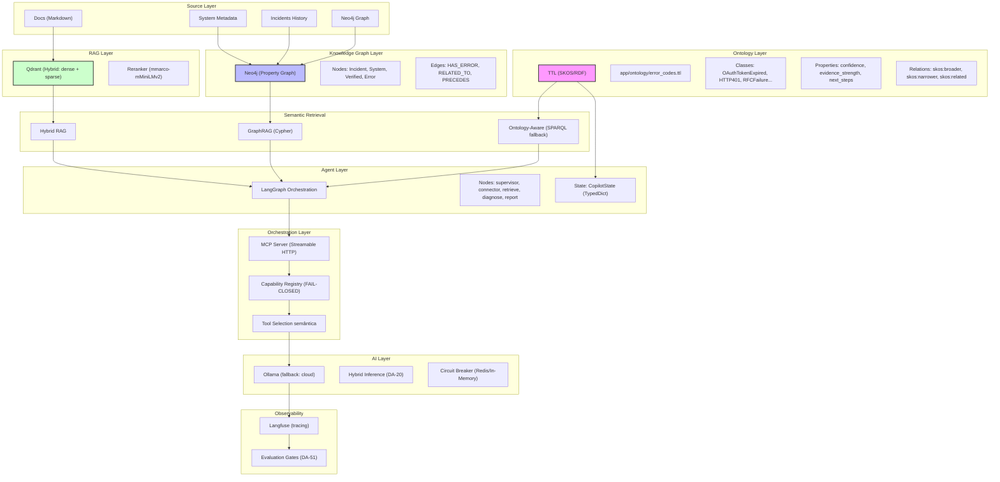

# Roadmap Semantic AI — Integration Incident Copilot

> **Visão**: Transformar o Integration Incident Copilot de **RAG Application** → **Semantic Agentic AI Platform**

---

## Visão Central

> **RAG responde "o que encontrei nos documentos?"**
> **Knowledge Graph responde "quais entidades e relações existem?"**
> **Ontology responde "o que essas entidades significam, quais relações são válidas e quais inferências/consistências podemos estabelecer?"**

Para o Integration Incident Copilot, a ontology não é um "repositório de regras fixas" — é o **vocabulário canônico que dá significado aos erros de integração SAP e não-SAP**, permitindo inferência, consistência e raciocínio semântico.

---

## Arquitetura-Alvo (Mermaid)



---

## O que a Ontology realmente acrescenta

### Diferencial versus camadas anteriores

| Camada | Pergunta que responde | Limitação | O que ontology resolve? |
|---|---|---|---|
| **RAG (Qdrant)** | "Qual documento matching melhor?" | Palavra-chave, não semântica | ontology: `HTTP401` ⊑ `AuthenticationError` → inferência |
| **KG (Neo4j)** | "Quais entidades e relações existem?" | Estrutura, não significado | ontology: `RFCCommunicationFailure` → `ConnectionRefused` (causa-raiz) |
| **GraphRAG** | "Como são as relações em profundidade?" | Caminhos, não regras semânticas | ontology: restrições (ex: `HTTPError` → `http_code ∈ [4xx, 5xx]`) |

### Exemplo prático: Incidente HTTP 401

1. **RAG**: Retorna documento de autenticação com matching > 0.8
2. **KG**: Encontra `Incident → HAS_ERROR → OAuthTokenExpired`
3. **Ontology**:
   - `OAuthTokenExpired` ⊑ `AuthenticationError`
   - `AuthenticationError` → `next_steps = ["Refresh token", "Reauth"]`
   - `OAuthTokenRefreshFailed` ⊑ `AuthenticationError` (sibling)
   - Inferência: "Este erro pode ser resolvido por refresh ou reauth"

**Valor adicional**: Não só "o que foi visto", mas "o que isso significa e como resolver".

---

## Integration Operations Ontology v1 (Especificação)

### Classes (SKOS Concept Scheme)

```turtle
# app/ontology/error_codes.ttl
@prefix ex: <urn:error:>.
@prefix skos: <http://www.w3.org/2004/02/skos/core#>.

ex:AuthenticationError a skos:Collection ;
  skos:prefLabel "Authentication Error"@en, "Erro de Autenticação"@pt ;
  skos:scopeNote "Falhas relacionadas à autenticação OAuth2, basic auth, tokens." .

ex:OAuthTokenExpired a skos:Concept ;
  skos:inScheme ex:AuthenticationError ;
  skos:prefLabel "OAuth Token Expired"@en, "Token OAuth Expirado"@pt ;
  skos:definition "OAuth2 token já expirado e não pode ser renovado." .

ex:OAuthTokenRefreshFailed a skos:Concept ;
  skos:inScheme ex:AuthenticationError ;
  skos:prefLabel "OAuth Token Refresh Failed"@en, "Falha ao Renovar Token OAuth"@pt ;
  skos:definition "Tentativa de refresh de token OAuth falhou." .

ex:HTTP401Unauthorized a skos:Concept ;
  skos:related ex:OAuthTokenExpired ;
  skos:related ex:OAuthTokenRefreshFailed .

ex:HTTP403Forbidden a skos:Concept ;
  skos:inScheme ex:AuthenticationError ;
  skos:prefLabel "HTTP 403 Forbidden"@en, "HTTP 403 Proibido"@pt .

ex:ConnectionRefused a skos:Concept ;
  skos:prefLabel "Connection Refused"@en, "Conexão Recusada"@pt .

ex:RFCCommunicationFailure a skos:Concept ;
  skos:broader ex:ConnectionRefused ;
  skos:prefLabel "RFC Communication Failure"@en, "Falha de Comunicação RFC"@pt .

ex:HTTPTimeout a skos:Concept ;
  skos:prefLabel "HTTP Timeout"@en, "Tempo Limite HTTP"@pt .

ex:HTTP5xx a skos:Concept ;
  skos:prefLabel "HTTP 5xx Server Error"@en, "Erro de Servidor HTTP 5xx"@pt .

ex:MDIValidationFailed a skos:Concept ;
  skos:prefLabel "MDI Validation Failed"@en, "Falha de Validação MDI"@pt .

ex:HTTP429TooManyRequests a skos:Concept ;
  skos:prefLabel "HTTP 429 Too Many Requests"@en, "HTTP 429 Muitas Requisições"@pt .

ex:JSONParsingError a skos:Concept ;
  skos:prefLabel "JSON Parsing Error"@en, "Erro de Análise JSON"@pt .

ex:XMLParsingError a skos:Concept ;
  skos:prefLabel "XML Parsing Error"@en, "Erro de Análise XML"@pt .
```

### Propriedades (SKOS + Externas)

```turtle
ex:confidence a rdfs:Property ;
  rdfs:domain skos:Concept ;
  rdfs:range xsd:float ;
  rdfs:comment "Confidence score for rule matching (0.0-1.0)" .

ex:evidence_strength a rdfs:Property ;
  rdfs:domain skos:Concept ;
  rdfs:range xsd:float ;
  rdfs:comment "Evidence strength from connector/data source (0.0-1.0)" .

ex:next_steps a rdfs:Property ;
  rdfs:domain skos:Concept ;
  rdfs:range xsd:string ;
  rdfs:comment "Recommended next steps after error detection" .
```

### Restrições (SHACL - Fase 3, opcional)

```turtle
# app/ontology/error_codes.shacl
@prefix sh: <http://www.w3.org/ns/shacl#>.
@prefix ex: <urn:error:>.
@prefix xsd: <http://www.w3.org/2001/XMLSchema#>.

ex:AuthenticationErrorShape a sh:NodeShape ;
  sh:targetClass skos:Concept ;
  sh:property [
    sh:path ex:confidence ;
    sh:datatype xsd:float ;
    sh:minInclusive 0.0 ;
    sh:maxInclusive 1.0 ;
  ] ;
  sh:property [
    sh:path skos:inScheme ;
    sh:node ex:AuthenticationError ;
  ] .
```

---

## Mapeamento: O que fica no Neo4j vs. TTL

| Entidade | Neo4j (Property Graph) | TTL (Ontology/SKOS) | Motivo |
|---|---|---|---|
| **Incident** | `:Incident {id, timestamp, description, diagnosis, confidence}` | ❌ Não | dado de execução |
| **System** | `:System {key, type, url, last_seen}` | ❌ Não | dado de execução |
| **Verified** | `:Verified {id, correct?}` | ❌ Não | dado de execução |
| **Error Concept** | `:ErrorCategory {category, confidence, next_steps}` | ✅ SI | semântica canônica |
| **Relationship: HAS_ERROR** | `(:Incident)-[:HAS_ERROR]->(:ErrorCategory)` | ❌ Não | instância |
| **Relationship: SUB_CATEGORY_OF** | ❌ Não | ✅ SI | `skos:broader` (ontológica) |
| **Inference: `a ⊑ b`** | ❌ Não | ✅ SI | OWL (Fase 3) |

**Regra de ouro**:
- **Neo4j**: dados de execução (incidentes, sistemas, relações instanciadas)
- **TTL**: semântica (classes, relações ontológicas, restrições)
- **RAG**: documentos (know-how operacional, procedimentos)

---

## Estrutura de código no repositório

### Nova estrutura (current + proposed)

```
app/
  agent/
    graph.py           # Orquestração LangGraph
    prompts.py         # Prompt specifications
    nodes.py           # Nodes (supervisor, connector, retrieve, diagnose, report)
    rules.py           # Rule Engine (hardcoded fallback)
    ontology_loader.py # TTL loader (DA-61)
  ontology/            # ✨ NOVA: Semantic layer
    error_codes.ttl    # SKOS taxonomy (DA-61, Phase 1)
    error_codes.shacl  # SHACL constraints (Phase 3, optional)
    README.md          # Semantic layer design
  rag/
    retriever.py       # Hybrid RAG (Qdrant + reranker)
    graph_store.py     # GraphRAG (Neo4j, DA-21)
  admin/
    crypto.py          # Fernet encryption (DA-60)
    metering.py        # Token usage tracking
    correlation.py     # Incident-system correlation
  mcp/
    server.py          # MCP server (DA-19)
    policy.py          # Capability registry (DA-27)
  a2a/               # Agent2Agent (DA-14)
  events/
    consumer.py        # CloudEvents webhook (DA-23)
  connectors/          # 10 connectors (OData, RFC, ServiceNow, etc.)
  config.py          # Pydantic settings
  main.py            # FastAPI app
```

**Expansão Sugerida** (Fase 2):

```python
# app/ontology/enrichment.py (NOVO)
def enrich_incident_with_concepts(incident_id: str) -> None:
    """Link incident to ontology concepts and infer upper categories."""
    # Implementation: Cypher → SPARQL fallback if not found in Neo4j
    pass


# app/rag/ontology_aware_retriever.py (NOVO)
def retrieve_with_ontology_aware_rag(query: str) -> list[Document]:
    """Hybrid RAG + ontology inference (SPARQL fallback)."""
    pass


# app/agent/ontology_agent.py (NOVO)
def diagnose_with_ontology_agent(state: CopilotState) -> CopilotState:
    """LangGraph node: diagnosis + ontology reasoning."""
    pass
```

---

## Cypher + RDF/OWL + SHACL: Combinação

### Exemplo: Link incident to error concept

```python
# Neo4j (Property Graph)
def link_incident_to_error_concept(incident_id: str, error_category: str) -> None:
    query = """
    MATCH (i:Incident {id: $incident_id})
    MATCH (e:ErrorCategory {category: $category})
    CREATE (i)-[:HAS_ERROR]->(e)
    WITH e
    MATCH (e)<-[:SKOS_BROADER*]-(upper:ErrorCategory)
    CREATE (i)-[:HAS_UPPER_LEVEL_ERROR]->(upper)
    """
    driver.execute(query, {"incident_id": incident_id, "category": error_category})
```

### Exemplo: Inferência com OwlRL (Fase 3)

```python
# app/ontology/inference.py
from owlrl import DeductiveClosure, RDFS_Semantics


def infer_subcategory(error_category: str) -> list[str]:
    """Infer upper categories via OwlRL."""
    graph = Graph().parse("app/ontology/error_codes.ttl", format="turtle")
    DeductiveClosure(RDFS_Semantics).closure(graph)

    query = """
    SELECT ?upper WHERE {
      <urn:error:''' + error_category + '''> rdfs:subClassOf* ?upper .
      FILTER (?upper != <urn:error:''' + error_category + '''>)
    }
    """
    return [row["upper"] for row in graph.query(query)]
```

### Exemplo: SHACL Validation (Fase 3)

```python
# app/ontology/validation.py
from pyshacl import validate


def validate_error_ttl() -> tuple[bool, str]:
    """Validate `error_codes.ttl` with `error_codes.shacl`."""
    data_graph = Graph().parse("app/ontology/error_codes.ttl", format="turtle")
    shacl_graph = Graph().parse("app/ontology/error_codes.shacl", format="turtle")

    conforms, results_graph, _ = validate(data_graph, shacl_graph=shacl_graph)
    return conforms, results_graph.serialize(format="turtle")
```

---

## Roadmap Incremental (Fase 2/3/ beyond)

| Fase | Objetivo | Entregáveis | Critérios de sucesso |
|---|---|---|---|
| **Phase 1** | Taxonomia SKOS estática (TTL + loader) | ✅ Concluída (DA-61) | 11 erros, fallback hardcoded |
| **Phase 2** | Neo4j + Propriedade Graph | Enrich incident graph, correlação temporal | Grafos enriquecidos, queries Cypher |
| **Phase 3** | RDF/OWL + SHACL | Inferência de categoria, consistência | OWLReasoner, SHACL validation |
| **Phase 4** | Ontology-aware RAG | SPARQL fallback + hybrid retrieval | Retriever com semantic entailment |
| **Phase 5** | Ontology-aware Agent + LangGraph | Nodes com reasoning (MCP + seleção semântica) | Agent toma decisões baseadas em ontologia |
| **Phase 6** | HITL + policy/risk layer | Autorização de ações, risk scoring | HITL gates, policy enforcements |

### Critérios de sucesso por fase

| Fase | Métrica | Target |
|---|---|---|
| **Phase 2** | % incidentes enriquecidos | > 80% (com `HAS_ERROR`) |
| **Phase 3** | Inferências corretas | > 90% (vs. manual) |
| **Phase 4** | Hit@1 retrieval | > 95% (ontology-aware vs. RAG-only) |
| **Phase 5** | Agente accuracy | > 90% (vs. LLM-only) |
| **Phase 6** | HITL accuracy | > 95% (human-in-the-loop) |

---

## Build vs. Don't Build

### Build (investir)

| Componente | Justificativa | Effort | Impact |
|---|---|---|---|
| **Neo4j + SKOS integration** | Valor imediato, zero breaking changes | Low | High |
| **Ontology-aware retrieval** | Diferencial semântico (não só RAG) | Medium | High |
| **Agent LangGraph + ontology** | Decision-making (não só recuperação) | Medium | High |
| **MCP + semantic tool selection** | Standardization (multi-agent future) | Low | Medium |

### Don't Build (delegar/avoid)

| Componente | Justificativa | Substituto |
|---|---|---|
| **OWL/SHACL na Fase 2** | Prematuro, complexidade alta | Fase 3 (postergar) |
| **SPARQLEndpoint independente** | Neo4j + TTL fallback basta | Cypher + `rdflib.Graph` |
| **Reasoner pesado (HermiT, Pellet)** | Overkill para use case atual | OwlRL (lightweight) |
| **Plataforma dedicated ontology management** | Git + TTL + loader basta | `git commit error_codes.ttl` |

### Build/Don't Build Matrix

| Component | Build | Why |
|---|---|---|
| **`app/ontology/enrichment.py`** | ✅ Build | Cypher + TTL fallback, valor imediato |
| **`app/rag/ontology_aware_retriever.py`** | ✅ Build | Semantic entailment, diferencial |
| **`app/agent/ontology_agent.py`** | ✅ Build | Ontology-aware decisions |
| **OWL/SHACL validator** | ❌ Don't Build (Fase 2) | Postergar para Fase 3 |
| **Dedicated SPARQL endpoint** | ❌ Don't Build | Neo4j + `rdflib` basta |

---

## Minha recomendação arquitetural objetiva

### Prioridade 1: Neo4j + SKOS Integration (Fase 2, Low effort, High impact)

- **Link incident → error concept** (Cypher)
- **Inferir upper categories** (SPARQL fallback)
- **Relacionar incidentes**: `HAS_ERROR → PRECEDES → HAS_ERROR`

**Por que primeiro?**
- Valor visual imediato (grafos enriquecidos)
- Zero breaking changes (neo4j opt-in, TTL já implementado)
- Prepara terra para Phase 3 (OWL/SHACL)

### Prioridade 2: Ontology-aware RAG (Fase 4, Medium effort, High impact)

- **Hybrid retrieve**: Qdrant + Neo4j + TTL
- **Rerank with semantic entailment**
- **Fallback SPARQL** se Qdrant/Neo4j não encontrarem

**Por que depois?**
- Requer Neo4j + SKOS integration (Phase 2)
- Diferencial competitivo (não só RAG)

### Prioridade 3: Ontology-aware Agent (Fase 5, Medium effort, High impact)

- **LangGraph node**: diagnosis + ontology reasoning
- **MCP**: semantic tool selection (not just keywords)
- **Multi-agent**: ontology-aware coordinator

**Por que depois?**
- Requer ontology-aware retrieval (Phase 4)
- Decision-making (não só recuperação)

### Prioridade 4: HITL + policy/risk (Fase 6, Medium effort, Medium impact)

- **HITL gates**: human approval before critical actions
- **Risk scoring**: confidence + ontology context
- **Policy enforcement**: forbidden actions

**Por que depois?**
- Requer agent mature (Phase 5)
- Security/governance (não funcional)

---

## Próximos passos concretos (sem esperar)

### 1. Criar `app/ontology/enrichment.py` (Fase 2, Low effort)

```python
# app/ontology/enrichment.py
from app.config import settings
from rdflib import Graph, URIRef
from neo4j import Driver


def enrich_incident_with_ontology(incident_id: str, neo4j_driver: Driver) -> None:
    """Link incident to ontology concepts and infer upper categories."""
    query = """
    MATCH (i:Incident {id: $incident_id})
    WITH i, i.diagnosis->>'rule_engine_category' AS category
    WHERE category IS NOT NULL
    MATCH (e:ErrorCategory {category: category})
    CREATE (i)-[:HAS_ERROR]->(e)
    WITH e
    CALL apoc.cypher.doIt("
        MATCH (e)<-[:SKOS_BROADER*]-(upper:ErrorCategory)
        RETURN collect(upper.category) AS upper_categories
    ", {e: e}) YIELD value
    WITH e, value.upper_categories AS upper_categories
    UNWIND upper_categories AS upper
    MATCH (upper_node:ErrorCategory {category: upper})
    CREATE (i)-[:HAS_UPPER_LEVEL_ERROR]->(upper_node)
    """
    neo4j_driver.execute(query, {"incident_id": incident_id})
```

### 2. Criar `app/rag/ontology_aware_retriever.py` (Fase 4, Medium effort)

```python
# app/rag/ontology_aware_retriever.py
from langchain_core.documents import Document
from app.rag.retriever import hybrid_retrieve
from app.ontology.enrichment import get_upper_categories


def ontology_aware_retrieve(query: str, top_k: int = 5) -> list[Document]:
    """Hybrid RAG + ontology inference (SPARQL fallback)."""
    documents = hybrid_retrieve(query, top_k * 2)  # Retrieve more, then filter
    upper_categories = get_upper_categories_from_query(query)

    filtered = []
    for doc in documents:
        if doc.metadata.get("category") in upper_categories:
            filtered.append(doc)

    return filtered[:top_k]
```

### 3. Criar `app/agent/ontology_agent.py` (Fase 5, Medium effort)

```python
# app/agent/ontology_agent.py
from langgraph.graph import StateGraph, END
from app.state import CopilotState
from app.ontology.enrichment import enrich_incident_with_ontology


def ontology_reasoning_node(state: CopilotState) -> CopilotState:
    """LangGraph node: diagnosis + ontology reasoning."""
    enriched = enrich_incident_with_ontology(state.incident_id, state.neo4j_driver)
    state.enrichment = enriched
    return state


builder = StateGraph(CopilotState)
builder.add_node("ontology_reasoning", ontology_reasoning_node)
builder.add_edge("diagnose", "ontology_reasoning")
builder.add_edge("ontology_reasoning", END)
```

---

**Próximo**: Começar com `app/ontology/enrichment.py` — implementar link incident → error concept com Cypher + SPARQL fallback.

Quer que eu implemente o código proposto agora?
