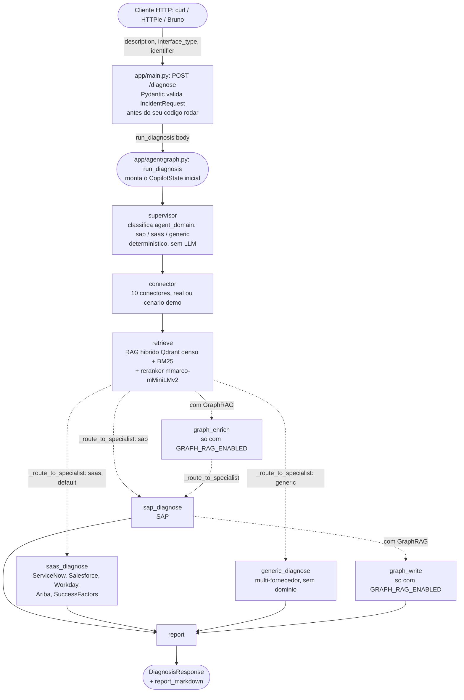

# Tutorial: SAP Integration Copilot — Da Requisição ao Relatório

> Público-alvo: quem já domina arquitetura SAP e conceitos de
> integração, mas está consolidando Python/FastAPI/LangGraph. Use as
> analogias com ABAP como ponte, não como substituto de entender o
> código Python real.
>
> Pré-requisito: stack local no ar (via `docker compose up -d` na raiz
do projeto, Ollama ativo) e o projeto aberto no VS Code com o
`.vscode/launch.json` já configurado (ver Fase 4 do
o processo de desenvolvimento, documento interno fora do repositório).

> **Nota de atualização (revisado em 2026-10-07):** este tutorial nasceu
> quando o projeto tinha 2 conectores mock e 4 nodes. Hoje são 10
> conectores (4 validados contra sistema real; ver a matriz em
> `docs/ARCHITECTURE.md`) e o grafo tem até 9 nodes. Os breakpoints abaixo
> foram reconferidos contra o código e citam **símbolos**
> (`app/agent/nodes.py::_run_diagnosis_agent`) em vez de números de linha,
> que mudam a cada commit. O caso guiado da Seção 5 mostra os dois caminhos
> de diagnóstico: o **rule engine** (DA-33, ligado por default) e o **LLM**.
>
> **Debug full stack (UI + backend):** a UI React roda via `npm run dev`
> (porta 5173) com proxy `/diagnose` → FastAPI (porta 8000). Use
> "Debug: Frontend (React) + Backend" no `.vscode/launch.json` para
> iniciar o Vite e abrir o navegador automaticamente. Breakpoints em
> componentes React (Chrome DevTools) + backend (VS Code debugpy) rodam
> simultaneamente.

---

## 1. Mapa Geral da Solução

### Fluxo ponta a ponta

Da requisição HTTP ao relatório, com o grafo montado por
`app/agent/graph.py::build_graph` (mesmo desenho do bloco gerado em
`docs/ARCHITECTURE.md`):



> **Leitura do diagrama:** sem GraphRAG (default), a aresta condicional
> `_route_to_specialist` sai de `retrieve`. Com `GRAPH_RAG_ENABLED=true`,
> `retrieve` vai para `graph_enrich` e a aresta condicional sai de
> `graph_enrich` para os três especialistas (desenhada só para `sap_diagnose`
> para não poluir); todos os especialistas passam por `graph_write` antes do
> `report`. Desenho completo dos dois modos: `docs/ARCHITECTURE.md`.

> **O fork é o ponto central do diagrama.** A DA-22 trocou o antigo
> `diagnose_node` por três especialistas, e quem decide entre eles **não é o
> supervisor**: o supervisor roda primeiro e *classifica* o domínio, gravando
> `agent_domain` no estado. O roteamento acontece depois de `retrieve`, na
> aresta condicional `app/agent/graph.py::_route_to_specialist`, que lê esse
> campo. Depurar com breakpoint só em `supervisor_node` não mostra a escolha
> acontecendo — ela acontece na aresta, não no node. Para vê-la, coloque o
> breakpoint dentro de `_route_to_specialist`.

Cada node e o arquivo que o implementa:

| Node do grafo | Função | Arquivo |
|---|---|---|
| `supervisor` | `supervisor_node` | `app/agent/supervisor.py` |
| `connector` | `connector_node` | `app/agent/nodes.py` |
| `retrieve` | `retrieve_node` | `app/agent/nodes.py` |
| `sap_diagnose` | `sap_diagnosis_node` | `app/agent/nodes.py` |
| `saas_diagnose` | `saas_diagnosis_node` | `app/agent/nodes.py` |
| `generic_diagnose` | `generic_diagnosis_node` | `app/agent/nodes.py` |
| `graph_enrich`, `graph_write` | `graph_enrich_node`, `graph_write_node` | `app/agent/nodes.py` (só com GraphRAG) |
| `report` | `report_node` | `app/agent/nodes.py` |

Os três especialistas chamam o mesmo corpo de diagnóstico,
`app/agent/nodes.py::_run_diagnosis_agent`, que tem dois caminhos:

1. **Rule engine primeiro (DA-33).** Com `RULE_ENGINE_ENABLED=true` (default),
   a descrição + a mensagem do conector são testadas contra as regras de
   `app/agent/rules.py::KNOWN_ERROR_RULES` via
   `app/agent/rules.py::match_known_error`. Se uma regra casa, o node devolve
   o diagnóstico **sem chamar o LLM** (`llm_provider_used = "rule_engine"`,
   `prompt_version` nulo).
2. **Só sem regra, o LLM.** O prompt é montado e o agente ReAct
   (`create_react_agent(llm, tools, response_format=DiagnosisModel)`) é
   executado através do AI Gateway, `app/llm/gateway.py::invoke_via_gateway`
   (DA-26: policy, circuit breaker, budget, fallback híbrido). O gateway obtém
   o modelo de `app/llm/factory.py::get_chat_model` — com o provider default,
   um `ChatOllama` apontando para o Ollama local (`qwen3-coder-next:latest`).
   O `structured_response` volta validado pelo Pydantic.

Nos dois casos o resultado passa pelos guardrails
(`app/agent/nodes.py::_apply_confidence_guardrails`) e a resposta HTTP sai
como `DiagnosisResponse` + `report_markdown`.

### Onde cada etapa vive (arquivo real)

| Etapa | Arquivo | O que faz |
|---|---|---|
| Entrada HTTP + validação | `app/main.py` | Define `POST /diagnose`, delega pro grafo |
| Contratos de dados | `app/models.py` | `IncidentRequest` (entrada), `DiagnosisResponse` (saída) |
| Configuração central | `app/config.py` | Única fonte de verdade — URLs, modelo, credenciais, lida do `.env` |
| Orquestração (o "workflow") | `app/agent/graph.py` | Define os 9 nodes e as arestas entre eles |
| Busca de dados no sistema SAP + multi-vendor | `app/connectors/` | `base.py` (contrato comum), 10 conectores (OData, RFC, ServiceNow, Salesforce, Workday, Ariba, SuccessFactors, CAP, APIManagement, PO/PI) - modo real quando configurado; validação por conector em `docs/ARCHITECTURE.md` |
| Busca de conhecimento (RAG) | `app/rag/ingest.py`, `app/rag/retriever.py` | Indexação e consulta no Qdrant |
| Testes | `tests/` | Regressão automatizada de tudo acima |

**Sobre `app/services/`:** não está vazia, e é mais central do que parece. `incident_repository.py` faz a persistência PostgreSQL das tabelas `incidents` e `verifications`; `incident_recorder.py` grava **cada** diagnóstico concluído em `incidents` e é chamado por `run_diagnosis()` — o ponto comum a todos os caminhos de entrada (`/diagnose`, worker RQ, webhook/AMQP, A2A e MCP). Se você depurar por que um relatório aparece no Grafana e não na tabela, esse é o arquivo.

### Analogia ABAP

Pense no `StateGraph` como um **workflow** (tipo BRF+ ou uma cadeia de BAdIs em sequência): cada `node` é um step que recebe uma "área de trabalho" (o `CopilotState`, um `TypedDict`), pode ler e escrever nela, e passa adiante. Não tem `PERFORM`/`CALL FUNCTION` direto de um node pro outro — o LangGraph decide a ordem baseado nas arestas (`add_edge`) que você declarou, parecido com a definição de fluxo de um workflow, não com chamada de sub-rotina imperativa.

---

## 2. Catálogo de Frameworks e Bibliotecas

Só o que o projeto **realmente usa** — não a API inteira de cada lib.

| Biblioteca | O que é | Por que foi escolhida aqui | O que o código chama de fato |
|---|---|---|---|
| **FastAPI** | Framework web assíncrono para APIs | Validação automática via Pydantic, geração de OpenAPI/Swagger de graça, é o padrão de mercado para APIs Python hoje | `FastAPI()`, decorators `@app.get`/`@app.post`, `response_model=` |
| **Pydantic** | Validação de dados via type hints | Já vem embutido no FastAPI; garante que `IncidentRequest` malformado nunca chega no seu código | `BaseModel`, campos com `str \| None`, `Literal[...]` com os 10 tipos de conector em `IncidentRequest.interface_type` (`odata`, `rfc`, `servicenow`, `salesforce`, `workday`, `ariba`, `successfactors`, `po`, `cap`, `apim`), `Field(ge=0, le=1)` (validação de confidence), `Field(max_length=...)` (limite de entrada), `DiagnosisModel` como `response_format` do agente (saída do LLM validada) |
| **pydantic-settings** | Extensão do Pydantic para configuração via `.env`/env vars | Elimina configuração hardcoded (gap real que encontramos e corrigimos) | `BaseSettings`, `SettingsConfigDict(env_file=".env")` |
| **LangGraph** | Orquestração de agentes como máquina de estados (grafo) | Modela o fluxo (`supervisor→connector→retrieve→<domínio>_diagnose→report`) de forma explícita e visualizável, em vez de um script sequencial disfarçado de "agente" | `StateGraph`, `add_node`, `add_edge`, `add_conditional_edges`, `set_entry_point`, `compile()`, `.invoke()`; `create_react_agent(..., response_format=DiagnosisModel)` (`langgraph.prebuilt`) no diagnóstico |
| **langchain-ollama** | Integração LangChain ↔ Ollama | Dá interface padronizada (`ChatOllama`, `OllamaEmbeddings`) em vez de chamar a API REST do Ollama na mão | `ChatOllama(model=..., temperature=0.0, seed=42, ...)` construído em `app/llm/factory.py::get_chat_model` e passado ao `create_react_agent`, `OllamaEmbeddings(model=...).embed_documents()/.embed_query()` |
| **langchain-text-splitters** | Divisão de texto em chunks | `MarkdownTextSplitter` respeita a estrutura Markdown dos documentos de incidente ao invés de cortar no meio de uma frase | `MarkdownTextSplitter(chunk_size=..., chunk_overlap=...).split_text()` |
| **pymupdf4llm** | Extração de PDF com preservação de estrutura Markdown | Substitui PyPDFLoader na ingestão — preserva tabelas, headers, blocos de código dos PDFs técnicos SAP | `pymupdf4llm.to_markdown(path, page_chunks=True)` |
| **qdrant-client** | Cliente Python do Qdrant (vector DB) | Busca por similaridade vetorial — é o "motor de busca" do RAG | `QdrantClient(url=...)`, `.create_collection()`, `.upsert()`, `.query_points()` |
| **Ollama** (runtime) | Servidor de inferência local de LLMs | Roda modelo local (`qwen3-coder-next:latest`) sem depender de API paga/nuvem — decisão alinhada ao seu hardware (APU com ROCm) | Não é chamado diretamente pelo código do Copilot — o `langchain-ollama` fala com ele via HTTP em `settings.ollama_host`, sempre através do AI Gateway |
| **LLM Gateway** (`app/llm/factory.py`) | Abstracao interna, nao uma lib externa | Permite trocar Ollama por OpenAI/Azure OpenAI via `Settings.llm_provider`, sem tocar no grafo | `get_chat_model()` retorna um `BaseChatModel` do LangChain, seja qual for o provedor escolhido; o grafo só o usa via `app/llm/gateway.py::invoke_via_gateway` (DA-26) |
| **Langfuse** | Observabilidade de agentes/LLM | Visibilidade de tempo/tokens/payload de cada etapa, sem isso o sistema era uma caixa-preta | `@observe` (decorator), `CallbackHandler` (LangChain), `get_client().flush()` |
| **pytest** | Framework de testes | Padrão de mercado Python; `conftest.py` implementa skip automático de testes de integração se a stack estiver fora do ar | `@pytest.mark.parametrize`, `@pytest.mark.integration`, fixtures |
| **promptfoo** | Comparação/regressão de prompt e modelo | Usado *fora* do código de produção — ferramenta de decisão, não dependência do Copilot em si | `providers` (exec customizado chamando `run_diagnosis` de verdade), `tests`/`assert` |
| **pyRFC** | Binding Python pro SAP NetWeaver RFC SDK | O `RFCConnector` ja tem `use_real=True` implementado e pronto, mas **`pyrfc` foi arquivado pela propria SAP** (mai/2026) - bloqueio persiste, agora por falta de binding mantido, alem do SDK licenciado (que e gratuito pra cliente real com S-user, so nao pra este portfolio) | Ver `app/connectors/rfc_connector.py`, docstring atualizada |

### Analogia ABAP

- `BaseModel` do Pydantic ≈ uma estrutura DDIC com checagem de domínio automática na entrada — só que validado em runtime pelo framework, não numa `CALL FUNCTION` de validação manual.
- `QdrantClient` ≈ um sistema de busca por similaridade — não existe equivalente direto em ABAP clássico; o mais próximo conceitualmente é uma busca fuzzy (`FUZZY SEARCH` no HANA), mas aqui a busca é por **significado semântico** via vetor, não por texto.

---

## 3. Roteiro de Debug no VS Code

Use a configuração **"Debug: graph.py (caso IDoc travado)"** do `.vscode/launch.json` — ela já roda com `--debug`, então você vê o prompt exato e a resposta bruta do LLM no console, além dos breakpoints.

Pra ir direto num símbolo, use `Ctrl+Shift+O` (Windows/Linux) com o arquivo aberto — digite o nome da função e pula direto pra ela, sem precisar rolar.

### BP1 — Entrada da requisição (validação Pydantic)

**Símbolo:** `app/main.py::diagnose` — assinatura atual
`diagnose(request: Request, body: IncidentRequest)`. O `request` é o objeto
HTTP do Starlette (usado pelo rate limit); o incidente validado é o `body`.

**Coloque o breakpoint na linha `return run_diagnosis(body)`.**

**O que observar:** no painel de variáveis, expanda `body` — já é um objeto `IncidentRequest` totalmente validado. Se você chamar a API com `interface_type: "sap"` (valor inválido: o `Literal` aceita só os 10 tipos de conector, `odata`, `rfc`, `servicenow`, `salesforce`, `workday`, `ariba`, `successfactors`, `po`, `cap` e `apim`), **o breakpoint nunca vai disparar** — o FastAPI já teria rejeitado com HTTP 422 antes de chegar aqui. Sem autenticação (`X-API-Key` ou cookie de sessão) ele também não dispara: a dependência `verify_session_or_api_key` responde antes.

**Pergunta que este ponto responde:** "onde exatamente a validação de contrato acontece, e o que já está garantido quando meu código de negócio começa a rodar?"

> Nota: para debugar via HTTP de verdade (não só CLI), use a config **"Debug: FastAPI (uvicorn)"** do launch.json, suba o servidor com F5, e dispare a requisição de outro terminal com `curl`/HTTPie.

### BP2 — Montagem do estado inicial

**Símbolo:** `app/agent/graph.py::run_diagnosis`, logo após a criação de `initial_state`

**O que observar:** o dicionário `initial_state` — repare que `retrieved_context`, `diagnosis` e `report_markdown` **ainda não existem** nele. O `CopilotState` é um `TypedDict` com `total=False`, ou seja, cada node preenche só o que é responsabilidade dele.

**Pergunta:** "o que exatamente entra no grafo antes de qualquer processamento, e o que fica pra cada node produzir?"

### BP3 — Node do conector

**Símbolo:** `app/agent/nodes.py::connector_node`

Coloque o breakpoint na linha `result = connector.fetch(...)`.

**Passos:**
1. Antes da chamada: inspecione `state.get("interface_type")` e `state.get("identifier")` — vieram da requisição original
2. **Step Into** (F11) dentro de `connector.fetch()` — você cai em `app/connectors/rfc_connector.py` (ou `odata_connector.py`), dentro de `RFCConnector.fetch()`
3. Observe o dicionário `_MOCK_SCENARIOS` no escopo do módulo — é aqui que o "sistema SAP simulado" realmente vive
4. Depois do `return`, volte pro `connector_node` (F5 ou Step Out) e veja `result` — um `ConnectorResult` com `source_system`, `status`, `error_code`, `message`, `raw`, `is_mock`, `is_fallback`

**Pergunta:** "como o conector decide o que retornar, e o que acontece quando o identificador não é reconhecido?" (tente rodar com um `--id` que não existe em `_MOCK_SCENARIOS` pra ver o fallback sendo escolhido no `.get(identifier, _DEFAULT)`)

### BP4 — Node de retrieval (Qdrant + reranker)

`retrieve_node` chama `app/rag/retriever.py::retrieve`, que para o target
`incidents` despacha para `app/rag/retriever.py::_retrieve_unified`. Este,
por sua vez, chama `app/rag/retriever.py::_retrieve_hybrid` (busca híbrida
na collection de incidentes), funde com o fallback da `sap_reference_library`
quando não há match forte e passa tudo pelo reranker. Dois breakpoints:

**4a.** Em `app/rag/retriever.py::_retrieve_hybrid`, na linha
`fused = client.query_points(...)`.

1. Antes: inspecione `dense_query` — uma lista de ~768 floats (a dimensão do `nomic-embed-text`). É a "tradução" da sua pergunta em texto pra um ponto no espaço vetorial. A mesma chamada leva o vetor esparso BM25 num segundo `Prefetch`; o Qdrant funde os dois por RRF
2. Step Over (F10) na chamada — é aqui que a rede vai até o Qdrant (`http://127.0.0.1:6333`)
3. Depois: os hits saem com `source`, `text` e `score` (cosseno denso). Esse `score` **não** é o que decide a admissão hoje

**4b.** Em `app/rag/retriever.py::_retrieve_unified`, na linha
`admitted = [c for c in candidates if _evidence_admission_score(c) >= score_threshold]`.

- Expanda `candidates` (já reordenados por `app/rag/retriever.py::rerank`): cada um ganhou `rerank_score` (logit cru do cross-encoder) e **`rerank_score_calibrated`** (sigmoid, DA-42). **É este o número mais importante aqui** — `app/rag/retriever.py::_evidence_admission_score` usa o calibrado para decidir quem entra, e `_compute_evidence_strength` usa o do primeiro hit como `evidence_strength`
- Compare o primeiro e o segundo candidato: a folga entre eles é o que diz se a correspondência é forte ou empatada

**Pergunta:** "o retriever está de fato retornando o documento certo, com margem de confiança suficiente, ou está empatado com outro candidato?" — isso foi exatamente o que caçamos manualmente quando descobrimos o bug de mistura de contexto (ver o processo de desenvolvimento (documento interno), Fase 3).

### BP5 — Node de diagnóstico (rule engine ou LLM)

**Símbolos:** `diagnose_node` **não existe mais**: a DA-22 (roteamento por
domínio) o substituiu por três funções, `app/agent/nodes.py::sap_diagnosis_node`,
`app/agent/nodes.py::saas_diagnosis_node` e
`app/agent/nodes.py::generic_diagnosis_node` — o *node* do grafo se chama
`saas_diagnose`, a *função* é `saas_diagnosis_node`. O supervisor só
classifica `agent_domain`; quem escolhe qual especialista roda é a aresta
condicional `_route_to_specialist`. As três chamam o mesmo corpo,
`app/agent/nodes.py::_run_diagnosis_agent`.

> **Atualizado após code review:** o código não usa `llm.invoke(prompt)`
> direto nem `with_structured_output(..., include_raw=True)`. O caminho
> primário é `create_react_agent(llm, tools=react_tools, response_format=DiagnosisModel)`,
> que roda o loop ReAct e depois faz uma **chamada adicional** ao LLM com
> structured output de verdade (tool-calling nativo do provider),
> devolvendo o resultado já validado em `react_result["structured_response"]`.
> `structured_llm` também não existe — é nome de uma versão anterior.

Três breakpoints, todos dentro de `_run_diagnosis_agent`:

**5r (rule engine).** Na linha `if _rule_match:` — **o primeiro ponto que
dispara no caso guiado**.
- Inspecione `_rule_text` (descrição + `" " + connector_data.message`) e `_has_connector` (`False` com conector mock ou fallback)
- Se `_rule_match` vier preenchido, o node passa pelos guardrails e retorna **ali mesmo**: o prompt nunca é montado, o LLM nunca é chamado e os breakpoints 5a/5b não disparam. O dict tem `matched_source = "rule_engine:<categoria>"`, `llm_provider_used = "rule_engine"`, `confidence` da regra (0.90 por padrão) e `evidence_strength` 0.95 (conector real) ou 0.70 (só texto ou conector mock)
- Para forçar o caminho LLM, rode com `RULE_ENGINE_ENABLED=false` (campo `Settings.rule_engine_enabled`; ver Seção 5)

**5a (antes do LLM).** Na linha `return react_agent.invoke(messages, config=config)`
(dentro da função interna `_build_and_invoke`) — **antes** de executar.
- Inspecione o `prompt` montado (string completa) e o `json_instruction` anexado
- Inspecione `react_tools` — é uma lista, e fica **vazia** quando
  `WEB_SEARCH_ENABLED=false`. Esse é o enforcement de DA-29: a tool some do
  agente, não só de uma instrução de prompt
- Inspecione `llm` — confirme `model`, `temperature=0.0`, `seed=42` (DA-2)
- Repare na pilha de chamadas: `_build_and_invoke` é chamada por
  `invoke_via_gateway` (AI Gateway, DA-26), não diretamente pelo node

**5b (depois do LLM).** Na linha `structured = react_result.get("structured_response")`.
- Se `structured` vier preenchido, o `DiagnosisModel` já vem validado pelo Pydantic
- **Regressão real observada em 26/09/2026:** com `qwen3-coder-next` via Ollama,
  o texto final do agente trazia `matched_source` preenchido, mas a chamada
  adicional devolvia o campo nulo (4 de 13 casos do promptfoo, todos com
  diagnóstico correto). O código trata isso logo abaixo: quando
  `matched_source` vem nulo, chama
  `app/agent/nodes.py::_recover_matched_source_from_raw` sobre o texto cru —
  que não é porta para alucinação porque `_apply_confidence_guardrails` (BP6)
  ainda valida o nome contra as fontes realmente recuperadas
- Se `structured` vier `None`, o texto final (`raw`) vai **direto** para o
  parsing por regex (JSON solto, depois bloco de código, depois
  `_fallback_diagnosis`) — é a última camada, não a primeira
- O agente só é refeito **sem** `response_format` quando a chamada
  estruturada **levanta exceção** (o `except Exception` dentro de
  `_build_and_invoke`, que cria `react_agent_plain`); falha de transporte
  (provider inalcançável) sobe para o gateway decidir o fallback

**Pergunta:** "o diagnóstico saiu do rule engine ou do LLM? E, se do LLM, o
modelo recebeu exatamente o contexto que eu esperava e a validação
estruturada teve sucesso, ou caiu no fallback?"

### BP6 — Guardrails determinísticos

**Símbolo:** `app/agent/nodes.py::_apply_confidence_guardrails` (chamado nos
dois caminhos: logo depois do rule engine e logo depois do LLM)

> O campo `diagnosis["confidence"]` **não sobrevive** a esta função. A revisão
> P1.5 (23/09/2026) separou o número em dois: a primeira linha faz
> `diagnosis.pop("confidence", ...)` e o valor vira `model_confidence`, que é
> o que o LLM (ou a regra) **auto-relata** e o que estes guardrails ajustam;
> `diagnosis_confidence = evidence_strength * model_confidence` é calculado
> deterministicamente no fim.

**Cinco** verificações em sequência, todas de código, nenhuma delas depende
do LLM se autoavaliar corretamente:

1. **Clamp de range:** `model_confidence = max(0.0, min(1.0, raw_model_confidence))` — defesa em profundidade mesmo com `Field(ge=0.0, le=1.0)` já validando na origem via Pydantic
2. **Teto de evidência (DA-25):** `evidence_ceiling = min(1.0, evidence_strength + EVIDENCE_CONFIDENCE_MARGIN)` e `model_confidence = min(model_confidence, evidence_ceiling)`, com a margem `app/agent/nodes.py::EVIDENCE_CONFIDENCE_MARGIN` = `0.25`. `evidence_strength` vem de `app/agent/nodes.py::_compute_evidence_strength` (`rerank_score_calibrated` do primeiro hit; piso 0.75 com conector real) e, quando o diagnóstico é do rule engine, é o maior entre esse valor e o `evidence_strength` da regra. Confiança não pode exceder o quanto a evidência sustenta — é o guardrail que mais aparece na prática
3. **Fallback do conector:** identificador não reconhecido (`is_fallback`) → teto de 0.4 e prefixo `[confianca limitada - identificador nao reconhecido pelo sistema]`
4. **Contexto vazio:** nenhum documento do retriever **e** nenhum dado de conector (e não é rule engine) → teto de 0.3, `matched_source` forçado pra `None`
5. **Fonte inexistente:** `matched_source` citado que **não** está entre as fontes de `retrieved_context` (e não é rule engine) → `matched_source = None` e teto de 0.3. Vale também quando não há documento recuperado nenhum (correção M-04)

**O que observar:** rode uma vez com um caso conhecido (nenhum guardrail deveria disparar), uma vez com identificador desconhecido (guardrail 3), e uma vez com uma descrição totalmente fora do domínio sem `--interface` (guardrail 4). Para ver o 2 disparando sozinho, use um caso com documento fraco: observe `evidence_strength` e compare com `model_confidence` antes e depois da linha do teto. Para o 5, com o rule engine desligado, edite `diagnosis["matched_source"]` no painel de variáveis para um nome inventado antes de entrar na função.

**Pergunta:** "quantas camadas independentes de proteção existem entre uma resposta ruim do LLM e o que chega no usuário final — e cada uma delas dispara quando deveria?"


### BP7 — Node de relatório

**Símbolo:** `app/agent/nodes.py::report_node`, na linha `return {"report_markdown": report}`

**O que observar:** a f-string `report` montada — compare com o `DiagnosisResponse.report_markdown` que sai na resposta HTTP final. Esse é o último ponto onde você vê tudo junto: causa raiz, as três métricas (`diagnosis_confidence`, `model_confidence`, `evidence_strength`), provider/agente/modelo/versão do prompt, documento usado como base, próximos passos e o Evidence Bundle em duas seções — **Primary Evidence** (`system_observed`: conector real ou rule engine) e **Supporting Facts** (RAG, web, conector simulado, relato do usuário), montadas por `app/agent/nodes.py::_assemble_evidence`.

**Pergunta:** "o relatório final reflete fielmente tudo que os nodes anteriores descobriram, ou perdeu informação no caminho?"

---

## 4. Arquivos de Configuração

### `pyproject.toml`

| Seção | O que configura | Efeito observável no debug |
|---|---|---|
| `[project.dependencies]` | Bibliotecas de produção | Se faltar uma aqui, `uv sync` não instala e o `import` falha antes de qualquer breakpoint disparar |
| `[dependency-groups]` `dev` | `pytest`, `pytest-asyncio`, `ruff`, `httpx`, `debugpy`, `pre-commit`... | Só existem no seu ambiente (`uv sync` instala o grupo `dev` por default), nunca seriam instaladas numa imagem de produção enxuta |
| `[project.optional-dependencies]` | extras `openai`, `reports`, `prometheus` | Opt-in: `langchain-openai` só para `LLM_PROVIDER` de nuvem, relatórios Excel/Markdown e métricas Prometheus |
| `[tool.hatch.build.targets.wheel]` `packages = ["app"]` | Diz ao build backend onde está o código-fonte | Sem isso, `uv sync` falhava (bug real que resolvemos no início do projeto) |
| `[tool.pytest.ini_options]` `markers` | Declara o marker `integration` | É o que permite `pytest -m integration` filtrar só os testes que precisam da stack |
| `[tool.ruff]` `line-length` | Regra de lint/format | Reflete diretamente no que `ruff-format` reescreve no seu código |

### `.env` (na raiz de `~/MyProjects/GitHub/integration-incident-copilot`)

Cada variável mapeia 1:1 pra um campo de `app/config.py::Settings`:

| Variável no `.env` | Campo em `Settings` | O que muda no comportamento |
|---|---|---|
| (não setado, usa default) | `llm_model` | Qual modelo os nodes de diagnóstico (`sap_`/`saas_`/`generic_diagnosis_node`) chamam quando o rule engine não resolve — foi editando isso indiretamente (via `sed` no código, antes do `app/config.py` existir) que trocamos de `qwen3:30b-a3b` pra `qwen3-coder-next:latest` |
| `RULE_ENGINE_ENABLED` (default `true`) | `rule_engine_enabled` | Com `false`, `_run_diagnosis_agent` pula o rule engine e todo diagnóstico vai ao LLM — use só para depurar o caminho LLM (Seção 5) |
| `NEO4J_PASSWORD` | `neo4j_password` | Usado pelo GraphRAG (`app/rag/graph_store.py`) quando `GRAPH_RAG_ENABLED=true` — desligado por default, mas implementado e testado (nao mais so provisionado) |
| `LANGFUSE_PUBLIC_KEY` / `LANGFUSE_SECRET_KEY` / `LANGFUSE_HOST` | `langfuse_*` | Sem essas três, o `CallbackHandler()` do Langfuse falha silenciosamente em autenticar — os traces simplesmente não aparecem em `localhost:3000` |

**Para ver a configuração efetiva sem ler código:** `uv run python -m app.config`

### Qdrant

Duas collections, criadas dinamicamente por `app/rag/ingest.py::ensure_collection()`:

- `sap_incident_docs` — a que o pipeline de fato consulta (via `retrieve_node`, antes dos nodes de diagnóstico)
- `sap_reference_library` — PDFs técnicos SAP (2.000+ documentos), **consultada pelo grafo desde a v2.0** via retrieval unificado (`_retrieve_unified`) com reranker semântico

O tamanho do vetor (`vector_size`) não é hardcoded — é medido do próprio modelo de embedding por `app/rag/ingest.py::probe_vector_size` (embeda a string `"probe"` e conta as dimensões), então se você trocar `EMBEDDING_MODEL` no `.env`, a próxima ingestão cria a collection com a dimensão certa automaticamente (mas atenção: **misturar embeddings de dimensões diferentes na mesma collection quebra a busca** — trocar de modelo de embedding exige reindexar do zero).

### Ollama

Dois modelos com papéis diferentes, nenhum overlap:
- `qwen3-coder-next:latest` — geração de texto/JSON (nodes `sap_diagnose`/`saas_diagnose`/`generic_diagnose`, quando nenhuma regra casa)
- `nomic-embed-text` — embeddings (ingestão e consulta no RAG)

---

## 5. Estudo de Caso Guiado

### Mapeando cenários de negócio SAP nos mocks técnicos existentes

Os conectores mock de hoje são genéricos (não específicos de SuccessFactors/Ariba/Concur), mas os *tipos de falha* que simulam mapeiam de forma honesta nos cenários reais do seu ecossistema:

| Cenário de negócio | Falha técnica equivalente já implementada | Mock a usar |
|---|---|---|
| S/4HANA MM ↔ e-procurement terceiro (timeout no pedido de compra) | Timeout OData sem paginação | `odata_timeout_cpi.md` (via texto, sem conector ainda) |
| SuccessFactors EC ↔ S/4HANA HCM (erro de IDoc em dados mestre) | IDoc status 51, dado mestre ausente | `RFC-IDOC-51-DEMO` |
| SuccessFactors ECP ↔ terceiro de folha/banco (falha de conexão) | RFC connection refused | `RFC-CONN-REFUSED-DEMO` |
| **Ariba ↔ S/4HANA MM/SD (IDoc 51 em pedido/fatura)** | **IDoc status 51, dado mestre ausente** | **`RFC-IDOC-51-DEMO`** ← caso guiado abaixo |
| Concur ↔ S/4HANA FI/HCM (erro 401 em despesas de viagem) | HTTP 401, credencial/token OAuth2 | `CPI-401-DEMO` |

Escolhi o cenário **Ariba ↔ S/4HANA (IDoc 51)** pra debugar do início ao fim porque ele mostra os **dois** caminhos de diagnóstico com o mesmo incidente: primeiro o rule engine (DA-33), que resolve o caso sem LLM, e depois — com o rule engine desligado — o caminho LLM completo. Os valores determinísticos abaixo (conector, regra, guardrails) são o que você vai ver; os do LLM e do reranker dependem do modelo e do índice e servem de ordem de grandeza.

### Narrativa de negócio

Ariba envia um pedido de compra pro S/4HANA via integração de dados mestre. O IDoc gerado trava com status 51 — o documento de aplicação (o pedido, nesse caso) não é criado porque o **material 4711 não está cadastrado no centro 1000** de destino. Isso é uma falha clássica de dado mestre não sincronizado entre os dois sistemas, não um problema de conectividade.

### Passo a passo com debugger — rodada 1: rule engine (default)

1. Abra `.vscode/launch.json`, escolha **"Debug: graph.py (caso IDoc travado)"** (já vem com `"IDoc travado" --interface rfc --id RFC-IDOC-51-DEMO --debug`)
2. Coloque os breakpoints da Seção 3 (BP1 só dispara via FastAPI; pela CLI o primeiro é o BP2)
3. Aperte F5

**No BP3 (connector_node):** `identifier = "RFC-IDOC-51-DEMO"`. Step Into em `RFCConnector.fetch()` — você vê o dicionário retornando:
```
ConnectorResult(
    source_system="RFC", status="error", error_code="51",
    message="IDoc com status 51 - Application Document Not Posted",
    raw="IDOC: 0000000001234567\nSTATUS: 51\nMESSAGE: Erro ao criar
         documento de aplicacao - material 4711 nao cadastrado no
         centro 1000",
    is_mock=True, is_fallback=False
)
```
Isso é o "payload simulando o que Ariba/S4 reportariam" — em produção, seria aqui que entraria a chamada real (BAPI de status de IDoc, ou API OData equivalente).

**No BP4 (retrieval):** a query efetiva combina a descrição (`"IDoc travado"`) com `data.message` — o retriever busca por *"IDoc travado\nIDoc com status 51 - Application Document Not Posted"*. Em 4b, o esperado é `idoc_status_51.md` no topo de `candidates`; olhe o `rerank_score_calibrated` dele e a folga para o segundo colocado. (Versões antigas deste tutorial citavam "score 0.904": era o cosseno da busca densa pura, antes do híbrido e do reranker, e não é mais o número que decide.)

**No BP5r (`if _rule_match:`):** `_rule_text` é `"IDoc travado IDoc com status 51 - Application Document Not Posted"`. O padrão `IDoc.*status.*51` da regra `sap_idoc_status_51` (`app/agent/rules.py::KNOWN_ERROR_RULES`) casa — repare que quem fez casar foi a **mensagem do conector**, não a descrição vaga. `_has_connector` é `False` (o conector é mock), então a regra devolve `evidence_strength = 0.70`. Aperte F10: o node retorna aqui. **BP5a e BP5b não disparam** — nenhum prompt é montado, nenhum token é gasto.

**No BP6 (guardrail, chamado de dentro do rule engine):** `diagnosis.pop("confidence")` tira o `0.90` da regra, que vira `model_confidence`. `is_rule_engine` é `True` (o `matched_source` é `rule_engine:sap_idoc_status_51` e bate com `rule_engine_category`). `evidence_strength = max(pipeline, 0.70)`, onde "pipeline" é o `rerank_score_calibrated` do primeiro hit (o conector mock não dá piso). O teto `evidence_strength + 0.25` é ≥ 0.95, então `model_confidence` **permanece 0.90**; `is_fallback` é `False` (guardrail 3 não dispara) e os guardrails 4 e 5 não se aplicam ao rule engine. `diagnosis_confidence = evidence_strength * 0.90`.

**No BP7 (report_node):** o `report_markdown` traz `diagnosis_confidence`, `model_confidence` (90%) e `evidence_strength`; a linha de proveniência mostra `Provider: rule_engine | Agente: sap | ... | Prompt: nenhum`; **Documento usado como base** é `rule_engine:sap_idoc_status_51`; os próximos passos são os da regra (WE02/WE05, EDID4, BD87/WE19). Em **Primary Evidence** aparece `rule_engine` (`system_observed`); em **Supporting Facts**, o conector RFC (`simulated`, porque é mock), os documentos RAG e a descrição (`user_reported`).

Na resposta JSON (via FastAPI) você confere o mesmo: `matched_source = "rule_engine:sap_idoc_status_51"`, `llm_provider_used = "rule_engine"`, `prompt_version = null` (invariante 21: diagnóstico sem LLM não foi produzido por prompt nenhum).

> Note que a causa raiz da regra é **genérica** ("IDoc com status 51 ... falhou na posting"). O material 4711 e o centro 1000 estão no `raw` do conector, mas o rule engine olha só a `message`. Chegar na causa específica é trabalho do LLM — daí a rodada 2.

### Passo a passo com debugger — rodada 2: caminho LLM

O `raw`/`message` do conector contém "IDoc com status 51", e o rule engine testa descrição **+** mensagem do conector — então, com este identificador, **qualquer** descrição casa a regra. Para ver o LLM, desligue o rule engine:

- adicione `RULE_ENGINE_ENABLED=false` ao `.env` (mapeia para `Settings.rule_engine_enabled`; o `Settings` é lido na importação, então reinicie a sessão de debug), **ou**
- acrescente `"env": {"RULE_ENGINE_ENABLED": "false"}` a uma cópia da configuração "Debug: graph.py (caso IDoc travado)" no `launch.json`.

Lembre de voltar para `true` depois: o default ligado é invariante do projeto. (A alternativa — uma descrição que não case nenhuma regra — só funciona **sem** este conector, por exemplo com "Debug: graph.py (texto livre)" e um texto fora das 22 regras.)

Aperte F5 de novo. BP2–BP4 se repetem iguais. Agora:

**No BP5r:** não para — o bloco inteiro do rule engine é pulado (`settings.rule_engine_enabled` é `False`).

**No BP5a (antes do invoke):** o `prompt` inclui o bloco do conector com o `raw` completo do IDoc — o modelo recebe o número do material (4711) e do centro (1000) **verbatim**, não uma paráfrase. Com `--debug`, o mesmo prompt aparece no console.

**No BP5b (depois do invoke):** `structured` deve ser um `DiagnosisModel` equivalente a:
```json
{"matched_source": "idoc_status_51.md", "probable_root_cause":
"O material 4711 não está cadastrado no centro 1000, impedindo a
criação do documento de aplicação.", "confidence": 0.9,
"next_steps": [...]}
```
(o texto exato e o `confidence` variam com o modelo; se `matched_source` vier nulo, veja `_recover_matched_source_from_raw` agindo logo abaixo).

**No BP6 (guardrail):** `confidence` é retirado do dict e vira `model_confidence`. `idoc_status_51.md` está em `retrieved_context`, então o guardrail 5 não dispara; `is_fallback` é `False`, então o 3 também não. O que pode mexer no número é o **teto**: `model_confidence` fica em 0.9 só se `evidence_strength + 0.25 ≥ 0.9`, isto é, se o `rerank_score_calibrated` do topo for ≥ 0.65 (sem rule engine, o conector mock não dá piso a `evidence_strength`).

**No BP7 (report_node):** agora a proveniência mostra o provider real (ex.: `ollama`), o modelo e a versão do prompt; **Documento usado como base** é `idoc_status_51.md`; **Primary Evidence** fica vazio ("nenhuma evidencia direta do sistema"), porque o conector é mock; **Supporting Facts** lista o conector (`simulated`), os documentos RAG com o `rerank` de cada um — se `cpi_http_401.md` aparecer ali, é o candidato que competiu e perdeu — e a descrição.

### O que esse caso guiado prova sobre a arquitetura

O dado que "resolveu" o diagnóstico não veio do texto livre do usuário (`"IDoc travado"` sozinho é vago demais) — veio do **conector**, que é o equivalente do sistema SAP real reportando o erro estruturado. Isso é a demonstração viva de por que o `connector_node` roda **antes** do `retrieve_node`: dado de sistema estruturado é mais confiável que descrição textual humana, e o pipeline foi desenhado deliberadamente pra refletir essa prioridade — não por acaso.
